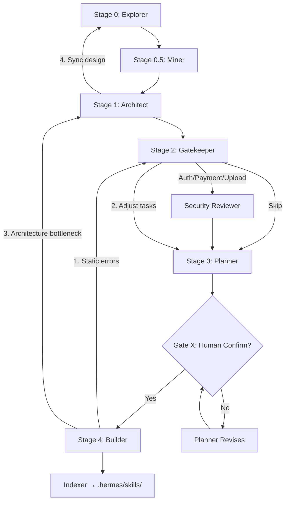

# MASTER FRAMEWORK — Shared Knowledge Base

> **Purpose**: Single source of truth for all 3 meta-skills
> **Location**: `_shared/knowledge/framework.md` (portable, resolved relative to skills-root)
> **Path from SKILL.md**: `../_shared/knowledge/framework.md` (1 level up)
> **Path from knowledge/*.md**: `../../_shared/knowledge/framework.md` (2 levels up)
> **Usage**: Read this FIRST when working with skill-architect, skill-planner, or skill-builder

---

## 1. SEVEN ZONES STRUCTURE

Every skill package MUST follow this directory structure:

| Zone | Folder | Purpose | Required |
|------|--------|---------|----------|
| **Core** | `SKILL.md` | Orchestration, persona, workflow, guardrails | ✅ Always |
| **Knowledge** | `knowledge/` | References, standards, guidelines | ✅ Usually |
| **Scripts** | `scripts/` | Executable automation (Python, Bash) | As needed |
| **Templates** | `templates/` | Output format templates | As needed |
| **Data** | `data/` | Config, static data, schemas | As needed |
| **Loop** | `loop/` | Checklists, logs, test cases | ✅ Usually |
| **Assets** | `assets/` | Images, icons, static files | Rarely |

---

## 2. PIPELINE FLOW

```
skill-explorer           skill-architect          skill-planner           skill-builder
     │                        │                        │                        │
     ▼                        ▼                        ▼                        ▼
exploration.md §6   →    design.md §3       →    todo.md tasks      →   <skills-root>/{name}/
(Arch Recommendations)  (Zone Mapping)         (phase breakdown)          (skill package)
     │                        │                        │
     ▼                        ▼                        ▼
exploration.md §3   →    design.md §7       →    Pre-req table
(7 Golden Standards)    (PD Plan)               (resources audit)
```

### Handoff Contracts

**Explorer → Architect** (exploration.md sections):
- §3 Seven Golden Standards Assessment → Architect designs Capability Map (§2) and Risks (§8)
- §4 AI Instruction Standards & Rules → Architect guides loop checklists (§3.loop)
- §6 Architectural Recommendations → Architect defines Zone Mapping (§3) and Progressive Disclosure Plan (§7)

**Architect → Planner** (design.md sections):
- §3 Zone Mapping → Planner creates task breakdown
- §7 Progressive Disclosure → Planner audit resources
- §8 Risks → Planner creates mitigation tasks

**Planner → Builder** (todo.md):
- Phase tasks with priorities
- Pre-requisites table
- Resource readiness status

---

## 3. ZONE MAPPING CONTRACT

When reading `design.md §3`, all skills must follow this format:

| Zone | Files cần tạo | Nội dung | Bắt buộc? |
|------|--------------|----------|-----------|
| Core | `SKILL.md` | Persona, phases, guardrails | ✅ |
| Knowledge | `knowledge/xxx.md` | Domain, standards | ✅/❌ |
| Scripts | `scripts/xxx.py` | Automation tools | ✅/❌ |
| Templates | `templates/xxx.template` | Output formats | ✅/❌ |
| Data | `data/xxx.yaml` | Config, schema | ✅/❌ |
| Loop | `loop/xxx.md` | Checklists, verify rules | ✅/❌ |
| Assets | N/A | Not needed | ❌ |

**Rules**:
- "Files cần tạo" column → direct input for task creation
- "Không cần" → skip that zone
- Builder MUST NOT add files not in §3 (except with documented rationale)

---

## 4. PROGRESSIVE DISCLOSURE (PD)

Three-tier loading system:

| Tier | Name | When to Load | Examples |
|------|------|--------------|----------|
| **Tier 1** | Mandatory | Always, at boot | `SKILL.md`, core knowledge |
| **Tier 2** | Conditional | When context requires | Domain docs, templates |
| **Tier 3** | Optional | On-demand | Assets, edge-case references |

**PD in SKILL.md**:
- Boot Sequence → Tier 1 files only
- Each Phase → Reference Tier 2 files as needed

---

## 5. PIPELINE STAGE DEFINITIONS (HYBRID ARCHITECTURE)

Hệ thống Suite **ver-3 hybrid** bao gồm **5 stages + Security + Human Gate**:

| Stage | Skill | Input | Output | Key Sections |
|-------|-------|-------|--------|--------------|
| **0** | `skill-explorer` | Ý tưởng + Tài nguyên thô | `exploration.md` | SCS score, 7 chuẩn vàng |
| **0.5** | `skill-knowledge-miner` | `exploration.md` + Tài liệu | `knowledge/domain-handbook.md` | Khai thác tri thức, triệt tiêu ảo tưởng |
| **1** | `skill-architect` | `exploration.md` + Handbook | `design.md` | Zone Mapping, Mermaid diagrams |
| **2** | `skill-gatekeeper` + `skill-security-reviewer` | `design.md` + Quality config | `data/quality-matrix.yaml` + security report | 20-point gates + OWASP |
| **3** | `skill-planner` | `design.md` + Quality matrix | `todo.md` | Phase breakdown, trace tags |
| **4** | `skill-builder` | `todo.md` + Design | `.hermes/skills/{name}/` | Implementation + tests |
| **X** | **Human Confirmation** | `design.md` + `todo.md` | Confirmed/Rejected | **MANDATORY GATE** |

### Security Review Trigger

| Trigger | Action |
|---------|--------|
| Skill has auth/payment/upload | Auto-invoke `skill-security-reviewer` |
| Documentation-only skill | Skip security review |
| User explicitly requests | Invoke regardless |

### Gate X: Mandatory Human Confirmation

**Điều kiện vào**: Planner hoàn thành `todo.md`

**Điều kiện qua**:
```
✓ User đã đọc design.md §1-10
✓ User đã đọc todo.md phase breakdown
✓ User hiểu scope (không thêm scope mới sau confirm)
✓ User xác nhận: "proceed to build"
```

**Behavior nếu FAIL**:
- Skill tạm dừng
- User nhận notification với danh sách cần điều chỉnh
- Planner sẵn sàng revise sau khi user feedback

### Sơ đồ Pipeline Mới (Hybrid)



### Rule Hierarchy

| Priority | Location | Description |
|----------|----------|-------------|
| **1** | `_shared/rules/*.mdc` | Suite-wide rules (highest) |
| **2** | `{skill}/SKILL.md` | Skill-specific overrides |
| **3** | `_shared/knowledge/*.md` | Domain knowledge (lowest) |

**Reference**: `_shared/rules/suite-rules.mdc` for conflict resolution.

---

## 6. NAMING CONVENTIONS

### Skill Names
- **Pattern**: `kebab-case` (lowercase, hyphen-separated)
- ✅ `skill-planner`, `api-integrator`, `flow-design-analyst`
- ❌ `SkillPlanner`, `skill_planner`, `skill planner`

### File Names in Zones
| Zone | Pattern | Example |
|------|---------|---------|
| knowledge/ | `domain-topic.md` | `uml-rules.md`, `api-standards.md` |
| scripts/ | `action-target.py` | `init-context.py`, `validate-skill.py` |
| templates/ | `output-format.template` | `design-md.template` |
| loop/ | `purpose-checklist.md` | `design-checklist.md`, `plan-checklist.md` |
| data/ | `config-name.yaml` | `skill-config.yaml` |

---

## 7. ANTI-HALLUCINATION RULES

| Rule | Description | Violation |
|------|-------------|-----------|
| **AH1** | Every task MUST trace to source | Task without `[TỪ DESIGN §N]` |
| **AH2** | Only decompose, don't add requirements | New requirement not in design.md |
| **AH3** | Don't guess domain knowledge | Writing domain content without resources |
| **AH4** | Always label sources | No `[TỪ DESIGN]` / `[GỢI Ý]` distinction |
| **AH5** | Verify resources before completion | Planning complete with missing critical resources |

### Trace Tags Standard

```
[TỪ DESIGN §N]      — Derived directly from design.md section N (regex: ^\[TỪ DESIGN §[0-9]+(\.[0-9]+)?\]$)
[GỢI Ý BỔ SUNG]     — Suggested by skill, not in design.md
[TỪ AUDIT TÀI NGUYÊN] — Generated because resource was missing
[CẦN LÀM RÕ]        — Needs user clarification
```

---

## 8. VERSION MANAGEMENT

All skills use Semantic Versioning:

```
MAJOR.MINOR.PATCH
- MAJOR: Breaking changes (output format, workflow)
- MINOR: Backward-compatible (new features)
- PATCH: Bug fixes, documentation
```

**Version update rules**:
- New section (§11, §12) → MINOR
- Zone Mapping format change → MAJOR
- Typo fix, add example → PATCH

---

## 9. CONTEXT DIRECTORY STRUCTURE

```
.skill-context/{skill-name}/
├── design.md        # Architect's output (INPUT)
├── todo.md          # Planner's output (INPUT)
├── build-log.md     # Builder's output (EVIDENCE)
├── resources/       # User-provided domain docs (INPUT)
├── data/            # Rule configs, scoring matrix (INPUT)
└── loop/            # Prior checks, phase logs (SUPPORTIVE)
```

### Resource Priority Classification

| Priority | Contents | Must Appear In |
|----------|----------|----------------|
| **Critical** | design.md, todo.md, resources/*, data/* | Resource Usage Matrix |
| **Supportive** | loop/*, proof/snapshots | Optional |

---

## 10. 20-POINT QUALITY GATES (HYBRID ARCHITECTURE)

**Tham khảo đầy đủ**: `_shared/rules/quality-gates.mdc`

### Tóm tắt 20 Tiêu chí (4 per Stage)

| Stage | Criteria | Mô tả |
|-------|----------|--------|
| **0: Explorer** | EXP-01 → EXP-04 | Business Intent, Golden Standards, SCS Score, Schema Pass |
| **1: Architect** | ARC-01 → ARC-04 | Problem Statement, Zone Mapping, Mermaid, Schema Pass |
| **2: Gatekeeper** | GAT-01 → GAT-04 + SEC-01 → SEC-04 | Quality Matrix, Security Review, No Ambiguities, Handoff |
| **3: Planner** | PLN-01 → PLN-04 | Trace Tags, DAG, Resource Audit, Human Gate Ready |
| **4: Builder** | BLD-01 → BLD-04 | Zone Contract, Token Budget, Placeholder, Human Confirmed |

### Ambiguity BLOCKED Gate

Nếu có OPEN `[CẦN LÀM RÕ]` tags → Pipeline BLOCKED cho đến khi resolved.

**Resolution options**:
- User cung cấp thêm context
- Architect đưa ra fallback assumption (với warning)
- PM Agent quyết định nếu là ambiguity về nghiệp vụ
*   **[INT-08] Quality Gatekeeper Integration**: Sử dụng chính Kỹ năng `production-quality-gatekeeper` để quét và chấm điểm chéo các Kỹ năng mới tạo đạt tối thiểu 90% điểm số chất lượng.
*   **[INT-09] Build Log Completeness**: File `build-log.md` ghi nhận đầy đủ, trung thực từng bước quyết định kỹ thuật và bằng chứng chạy test thành công.
*   **[INT-10] Sync & Deployment Verification**: Xác minh sự hoạt động ổn định của Kỹ năng sau khi đồng bộ lên không gian làm việc chính thức.

---

> **Last Updated**: 2026-05-03
> **Maintained By**: Meta-Skill Suite
