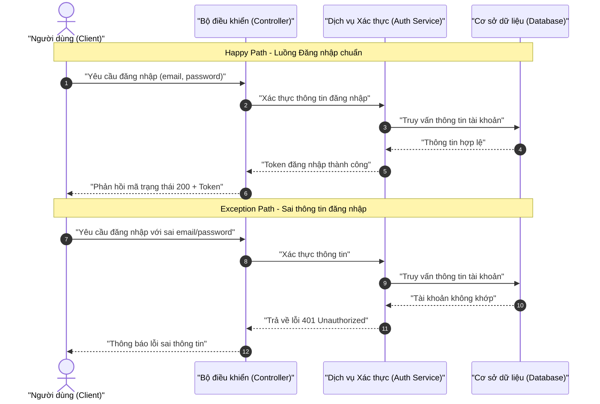
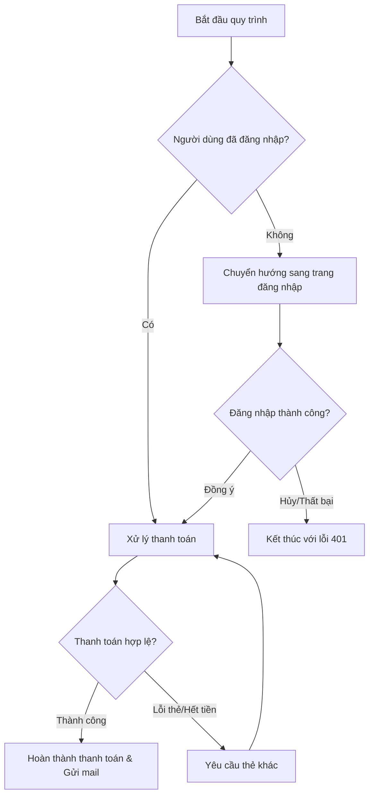
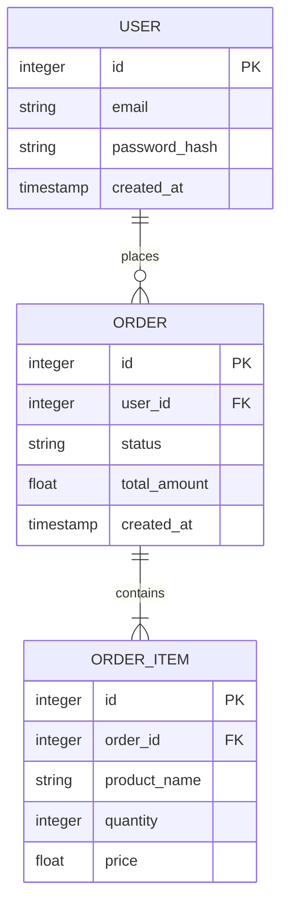

# 📊 Quy Chuẩn Cú Pháp Vẽ Sơ Đồ Mermaid.js

Tài liệu này hướng dẫn chi tiết cách vẽ sơ đồ Sequence, Flowchart, ERD, và Use Case bằng Mermaid.js. Nhằm tránh các lỗi dựng hình (rendering errors) phổ biến của LLMs khi vẽ sơ đồ.

<context>
Mermaid.js là một công cụ mạnh mẽ để dựng sơ đồ từ văn bản. Tuy nhiên, parser của Mermaid rất nhạy cảm với các ký tự đặc biệt, dấu ngoặc lồng nhau và các từ khóa đặc biệt. Việc tuân thủ nghiêm ngặt quy tắc viết nhãn (labels) là bắt buộc.
</context>

## 1. Nguyên Tắc An Toàn Mermaid (Mermaid Safety Rules)

```yaml
safety_rules:
  label_quoting:
    rule: "BẮT BUỘC bọc tất cả các nhãn (labels), tên tác nhân (actors) hiển thị hoặc điều kiện trong dấu ngoặc kép đôi."
    bad_syntax: "A[Người dùng] --> B{Có lỗi?}"
    good_syntax: 'A["Người dùng"] --> B{"Có lỗi?"}'
  character_restrictions:
    rule: "Không sử dụng ký tự đặc biệt (như parentheses, brackets, braces, slash, commas) bên ngoài dấu ngoặc kép."
  zero_placeholder:
    rule: "Tuyệt đối KHÔNG sử dụng TODO, TBD, mock-up hoặc dấu ba chấm (...) bên trong các sơ đồ. Mọi thành phần phải được đặt tên đầy đủ, rõ nghĩa."
```

## 2. Sequence Diagram (Sơ Đồ Tuần Tự)

```yaml
sequence_rules:
  actors_minimum: "Phải có ít nhất 3 actors/participants tham gia vào sơ đồ."
  flows_required: "Phải thể hiện đầy đủ 3 luồng: Happy Path (chuẩn), Alternative Path (thay thế), Exception Path (lỗi)."
```

### Template Sequence Diagram Chuẩn:


## 3. Flowchart / Activity Diagram (Sơ Đồ Luồng Hoạt Động)

```yaml
flowchart_rules:
  direction: "Sử dụng hướng dọc (TD) hoặc ngang (LR)."
  branching: "Các điểm rẽ nhánh điều kiện phải ghi rõ điều kiện trong hình thoi `{}` và các đường đi ra phải được đặt tên."
```

### Template Flowchart Chuẩn:


## 4. Entity Relationship Diagram - ERD (Sơ Đồ Thực Thể)

```yaml
erd_rules:
  relationship_markers:
    one_to_many: "||--o{"
    one_to_one: "||--||"
    many_to_many: "}o--o{"
  data_types: "BẮT BUỘC khai báo kiểu dữ liệu cho từng cột (string, integer, boolean, timestamp, v.v.)."
  key_constraints: "BẮT BUỘC đánh dấu khóa chính (PK) và khóa ngoại (FK) rõ ràng."
```

### Template ERD Chuẩn:


## 5. Use Case Diagram (Sơ Đồ Ca Sử Dụng)

<instructions>
Use Case diagram giúp biểu diễn trực quan các chức năng hệ thống cung cấp cho các Actor khác nhau. Nhãn của Use Case phải nằm trong dấu ngoặc tròn `()`.
</instructions>

### Template Use Case Chuẩn:
```mermaid
usecaseDiagram
    actor Admin as "Quản trị viên"
    actor Customer as "Khách hàng"

    rectangle "Hệ thống E-Commerce" {
        usecase UC1 as "Xem sản phẩm"
        usecase UC2 as "Đặt hàng"
        usecase UC3 as "Quản lý kho hàng"
        usecase UC4 as "Xử lý đơn hàng"
    }

    Customer --> UC1
    Customer --> UC2
    Admin --> UC3
    Admin --> UC4
```
