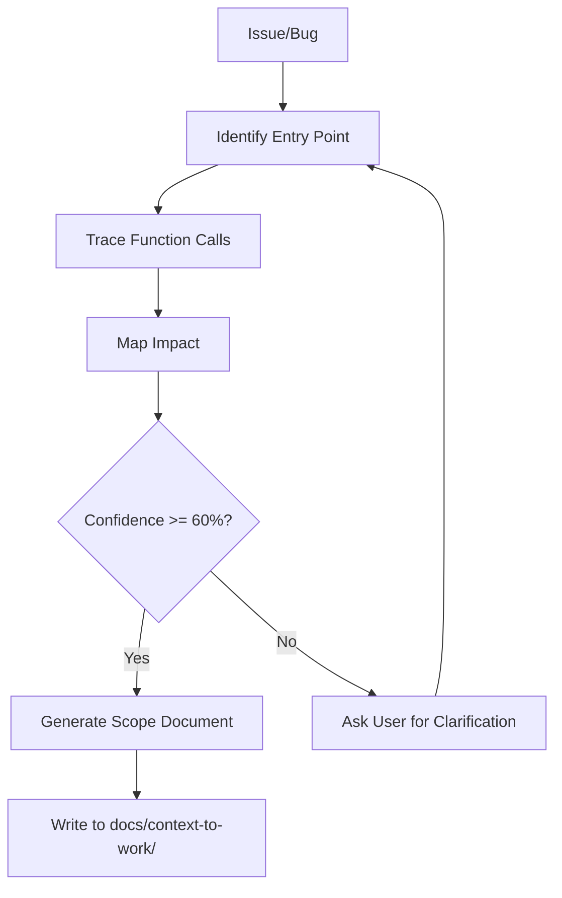

# Scoping Patterns — Cách Trace Relationships

> **Purpose**: Hướng dẫn cách trace relationships và map impact trong codebase
> **Language**: Tiếng Việt
> **Based on**: LLM reasoning + standard file tools

---

## 1. Pattern: Tìm Entry Point

### Khi nào
Khi nhận issue/bug/fix mới → xác định ĐÂU là nơi bắt đầu của vấn đề.

### Cách làm

```yaml
step_1_identify_entry_point:
  ask: "Vấn đề nằm ở đâu trong codebase?"
  actions:
    - grep keywords từ issue description
    - tìm file/component liên quan
    - xác định feature area
  
  example:
    issue: "Checkout bị lỗi khi apply coupon"
    entry_point: "src/services/coupon.service.ts"
```

### Entry Point Types

| Type | Description | Example |
|------|-------------|---------|
| Function | Bug trong 1 function cụ thể | `validateCoupon()` |
| Component | Bug trong UI component | `CheckoutForm.tsx` |
| API | Bug ở endpoint | `/api/orders/checkout` |
| Data | Bug ở data model | `Order` schema |

---

## 2. Pattern: Trace Function Calls

### Khi nào
Sau khi có entry point → trace xem function đó được gọi từ đâu và gọi những gì.

### Cách làm

```yaml
step_2_trace_calls:
  forward_search:
    description: "Tìm function đó gọi những gì"
    action: "grep function_name( — tìm implementations/dependencies"
  
  backward_search:
    description: "Tìm function đó được gọi từ đâu"
    action: "grep function_name — tìm usages/callers"
  
  import_search:
    description: "Tìm imports/requires"
    action: "grep 'from|import|require' trong file"
```

### Example

```
Entry: validateCoupon()

Search: validateCoupon(
  → được gọi từ: applyCoupon(), CheckoutForm.tsx, OrderService
  → gọi: getCouponByCode(), checkCouponExpiry(), calculateDiscount()

Search: getCouponByCode(
  → được gọi từ: validateCoupon(), CouponRepository
  → gọi: DB query, cache lookup
```

---

## 3. Pattern: Map Impact

### Khi nào
Sau khi trace được call chain → xác định ẢNH HƯỞNG đến những gì.

### Impact Categories

```yaml
impact_categories:
  direct_impact:
    description: "File/code trực tiếp liên quan"
    examples:
      - function đang có bug
      - file đang được modify
      
  indirect_impact:
    description: "File/code bị ảnh hưởng gián tiếp"
    examples:
      - caller của function có bug
      - function được gọi bởi function có bug
      - shared dependencies
  
  potential_impact:
    description: "Có thể bị ảnh hưởng"
    examples:
      - cùng module
      - cùng data flow
      - shared utilities
```

### Questions để hỏi

1. **Ai gọi function này?** (upstream callers)
2. **Function này gọi ai?** (downstream dependencies)
3. **Shared data nào được dùng chung?**
4. **API contracts nào có thể bị break?**
5. **Config nào ảnh hưởng?**

---

## 4. Pattern: Verify Findings

### Khi nào
Sau khi có impact map → verify để đảm bảo không miss anything.

### Verification Steps

```yaml
step_4_verify:
  must_do:
    - read_file actual files để confirm findings
    - grep để find all occurrences
    - check shared utilities/helpers
    
  must_not:
    - không đoán
    - không assume
    - không skip verification step
  
  confidence_check:
    high: "Đã verify bằng read_file + grep"
    medium: "Đã grep nhưng chưa read_file chi tiết"
    low: "Chỉ suy đoán từ issue description"
```

---

## 5. Large Codebase Fallback

### Khi nào
Khi codebase quá lớn → grep/search timeout hoặc quá nhiều results.

### Fallback Strategy

```yaml
large_codebase_strategy:
  step_1_limit_scope:
    ask_user: "Hãy narrow down scope? vd: module nào? feature nào?"
    action: "Tập trung vào area được chỉ định"
  
  step_2_use_entry_point:
    action: "Chỉ trace từ entry point, không full codebase scan"
  
  step_3_bounded_search:
    max_files: 20
    max_depth: 3
    action: "Giới hạn search trong 20 files, 3 levels deep"
```

---

## 6. Workflow Summary



---

## 7. Tools Mapping

| Step | Tool | Usage |
|------|------|-------|
| Identify entry point | `search_files` | grep keywords |
| Trace calls | `search_files` | grep function_name pattern |
| Read files | `read_file` | inspect actual content |
| Map impact | LLM reasoning | analyze relationships |
| Verify | `search_files` + `read_file` | confirm findings |

---

> **File**: `skills/rebuild/context-before-fix/knowledge/scoping-patterns.md`
> **Version**: 1.0.0
> **Date**: 2025-01-20
