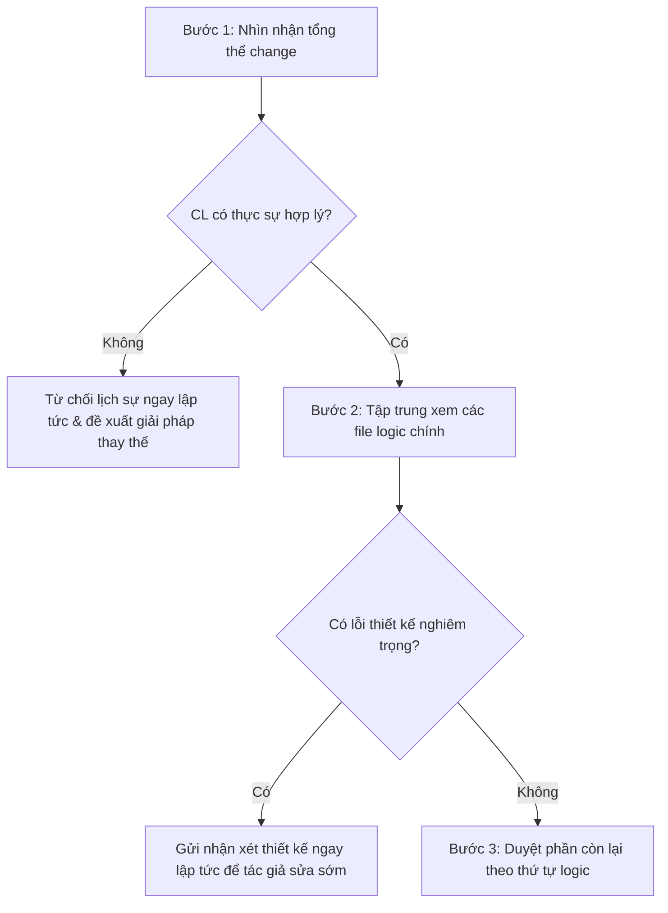

# Tiêu chuẩn Code Review của Google (Google Code Review Standards)

Tài liệu này là bản tổng hợp toàn diện, có độ chính xác cao về toàn bộ các quy trình, triết lý và tiêu chuẩn duyệt code (code review) chính thức của Google. Bản dịch và tổng hợp này được cấu trúc hóa nhằm đóng vai trò là cẩm nang hướng dẫn thực tế cho cả người duyệt code (reviewer) và người viết code (author/developer).

---

## Mục lục
1. [Giới thiệu & Triết lý cốt lõi](#1-giới-thiệu--triết-lý-cốt-lõi)
2. [Tiêu chuẩn duyệt Code (The Standard of Code Review)](#2-tiêu-chuẩn-duyệt-code-the-standard-of-code-review)
3. [Những điểm cần tìm khi Code Review (What to Look For)](#3-những-điểm-cần-tìm-khi-code-review-what-to-look-for)
4. [Quy trình định hướng và duyệt một CL (Navigating a CL in Review)](#4-quy-trình-định-hướng-và-duyệt-một-cl-navigating-a-cl-in-review)
5. [Tốc độ của Code Review (Speed of Code Reviews)](#5-tốc-độ-của-code-review-speed-of-code-reviews)
6. [Cách viết Nhận xét Code Review (How to Write Comments)](#6-cách-viết-nhận-xét-code-review-how-to-write-comments)
7. [Cách xử lý Phản hồi và Phản bác (Handling Pushback)](#7-cách-xử-lý-phản-hồi-và-phản-bác-handling-pushback)
8. [Hướng dẫn viết Mô tả Thay đổi (Writing Good CL Descriptions)](#8-hướng-dẫn-viết-mô-tả-thay-đổi-writing-good-cl-descriptions)
9. [Hướng dẫn phân tách thành CL nhỏ (Small CLs)](#9-hướng-dẫn-phân-tách-thành-cl-nhỏ-small-cls)
10. [Quy trình xử lý Trường hợp khẩn cấp (Emergencies)](#10-quy-trình-xử-lý-trường-hợp-khẩn-cấp-emergencies)

---

## 1. Giới thiệu & Triết lý cốt lõi

*   **Định nghĩa Code Review**: Là quy trình mà trong đó một hoặc nhiều người khác ngoài tác giả của mã nguồn tiến hành kiểm tra, phân tích và đánh giá mã nguồn đó trước khi nó được tích hợp vào codebase chung.
*   **Mục tiêu tối thượng**: Đảm bảo chất lượng mã nguồn tổng thể (overall code health) của Google liên tục được cải thiện theo thời gian. Mọi công cụ, chính sách và quy trình duyệt code đều được thiết kế để phục vụ mục tiêu tối cao này.
*   **Triết lý đồng hành**: Code review không đơn thuần là việc tìm lỗi kỹ thuật, mà còn là một cơ hội học hỏi, chia sẻ kiến thức, gắn kết văn hóa kỹ thuật và đóng vai trò cố vấn (mentoring) giữa các kỹ sư.

---

## 2. Tiêu chuẩn duyệt Code (The Standard of Code Review)

Duyệt code là nghệ thuật cân bằng giữa hai yếu tố đối lập trong quá trình phát triển sản phẩm:

1.  **Tiến độ của Nhà phát triển (Forward Progress)**: Các lập trình viên phải có khả năng đưa các thay đổi vào hệ thống một cách trơn tru. Nếu không có thay đổi nào được chấp nhận, hệ thống sẽ không có cải tiến mới. Nếu reviewer tạo ra quá nhiều rào cản phức tạp, lập trình viên sẽ bị nản lòng và giảm động lực đóng góp trong tương lai.
2.  **Sức khỏe Codebase (Codebase Health)**: Reviewer có trách nhiệm bảo vệ tính nhất quán, tính dễ bảo trì và hiệu năng của hệ thống. Chất lượng codebase thường không xuống cấp đột ngột mà suy giảm dần qua nhiều lỗi nhỏ tích lũy (technical debt), đặc biệt là khi đội ngũ chịu áp lực lớn về mặt thời gian.

### Nguyên tắc Vàng (The Gold Standard of Code Review)
> **Nhìn chung, Reviewer nên phê duyệt (approve) một CL ngay khi nó ở trạng thái chắc chắn giúp cải thiện chất lượng tổng thể của hệ thống đang được phát triển, ngay cả khi CL đó chưa thực sự hoàn hảo.**

*   Không tồn tại khái niệm code "hoàn hảo" – chỉ có code "tốt hơn". Đừng bắt tác giả phải trau chuốt từng lỗi nhỏ nhặt không quan trọng trước khi đồng ý.
*   Mục tiêu cần tìm kiếm là **Cải tiến liên tục** (Continuous Improvement). Một CL cải thiện được tính bảo trì, tính dễ đọc và tính dễ hiểu của hệ thống không nên bị trì hoãn hàng ngày hoặc hàng tuần chỉ vì những chi tiết chưa hoàn hảo không thiết yếu.
*   **Giới hạn**: Nguyên tắc này không biện hộ cho việc đưa vào những CL làm *xấu đi* chất lượng hệ thống, ngoại trừ trường hợp khẩn cấp được quy định cụ thể.

### Nguyên tắc Quyết định (Core Principles)
*   **Kỹ thuật và dữ liệu là tối cao**: Các sự thật kỹ thuật (technical facts) và số liệu thực tế luôn có giá trị quyết định cao hơn ý kiến cá nhân hay sở thích thiết kế của reviewer.
*   **Quy chuẩn về Phong cách (Style Guide)**: Tài liệu Style Guide chính thức của ngôn ngữ là cơ quan có thẩm quyền tuyệt đối. Nếu một điểm phong cách nào đó (ví dụ: khoảng trắng, cách đặt tên) không được quy định trong Style Guide, đó là sở thích cá nhân. Reviewer nên chấp nhận style của tác giả miễn là nó nhất quán với codebase hiện tại.
*   **Thiết kế phần mềm không phải sở thích**: Các quyết định thiết kế kiến trúc phần mềm phải dựa trên các nguyên tắc công nghệ vững chắc (như tính đóng gói, tính đơn nhiệm, decoupling). Nếu tác giả chứng minh được có nhiều phương án thiết kế tốt tương đương nhau, reviewer phải tôn trọng sự lựa chọn của tác giả.
*   **Sự nhất quán (Consistency)**: Nếu không có quy tắc nào áp dụng, reviewer có thể yêu cầu tác giả viết code nhất quán với phần code xung quanh, với điều kiện nó không làm suy giảm chất lượng chung của hệ thống.

### Giải quyết Xung đột (Conflict Resolution)
1.  **Thảo luận đồng thuận**: Hai bên cùng đối thoại dựa trên dữ liệu kỹ thuật và các quy tắc chuẩn mực.
2.  **Chuyển đổi phương thức giao tiếp**: Nếu bình luận qua lại trên công cụ review không hiệu quả hoặc gây hiểu lầm, hãy tổ chức họp trực tiếp hoặc gọi video. Sau đó, **bắt buộc** phải ghi lại tóm tắt kết quả đồng thuận lên CL dưới dạng bình luận để lưu lịch sử.
3.  **Leo thang (Escalation)**: Nếu bế tắc kéo dài, hãy nhanh chóng đưa vấn đề ra thảo luận nhóm rộng hơn, nhờ Tech Lead hoặc Maintainer của khu vực code đó đưa ra quyết định, hoặc nhờ Engineering Manager hỗ trợ điều phối. Tuyệt đối không để một CL bị ngâm vô thời hạn chỉ vì bất đồng ý kiến.

---

## 3. Những điểm cần tìm khi Code Review (What to Look For)

Reviewer cần kiểm tra toàn diện các khía cạnh dưới đây khi duyệt một CL:

### A. Thiết kế (Design)
*   Là yếu tố quan trọng nhất. Các phần tương tác giữa các module mới và cũ có hợp lý không?
*   Đoạn code mới này có đặt đúng chỗ không (ví dụ: có nên đưa vào một thư viện chung thay vì viết trực tiếp trong module này)?
*   Tính năng này có tích hợp hài hòa với tổng thể hệ thống hiện tại không?
*   Có thực sự cần thiết phải thêm chức năng này vào thời điểm hiện tại không?

### B. Chức năng (Functionality)
*   Code có chạy đúng với mục đích thiết kế của tác giả không?
*   Hành vi của đoạn code mới có thực sự mang lại lợi ích cho người dùng cuối (end-users) cũng như các lập trình viên sử dụng lại đoạn code này trong tương lai?
*   **Kiểm tra các vấn đề Concurrency**: Đặc biệt chú ý khi code có lập trình song song, đa luồng. Cần phân tích kỹ để tránh race conditions, deadlocks. Concurrency lỗi rất khó phát hiện thông qua việc chạy thử thông thường, bắt buộc phải dùng tư duy logic để rà soát.
*   **Thay đổi UI**: Reviewer nên kiểm tra kỹ giao diện trực quan. Nếu khó chạy thử, hãy yêu cầu tác giả demo trước.

### C. Độ phức tạp (Complexity)
*   Kiểm tra ở mọi cấp độ (từng dòng code, từng hàm, từng class). Code có phức tạp hơn mức cần thiết không?
*   **Tiêu chuẩn đánh giá**: Một đoạn code được coi là quá phức tạp nếu *người đọc code khác không thể hiểu nhanh được*, hoặc *các lập trình viên tương lai dễ viết sai/gây bug khi gọi hoặc chỉnh sửa nó*.
*   **Cảnh giác cao độ với Over-engineering (Thiết kế quá mức)**: Nhiều nhà phát triển có xu hướng viết code quá tổng quát cho những tình huống giả định trong tương lai (speculative programming). Hãy yêu cầu họ chỉ giải quyết bài toán hiện tại. Bài toán tương lai hãy để tương lai giải quyết khi yêu cầu thực tế xuất hiện rõ ràng.

### D. Kiểm thử (Tests)
*   Mọi thay đổi chức năng đều phải đi kèm unit test, integration test hoặc end-to-end test tương ứng trong cùng một CL (trừ tình huống khẩn cấp).
*   Đảm bảo test được thiết kế đúng và có ý nghĩa: Test có thực sự thất bại khi code logic bị hỏng không? Test có dễ bị false positive (báo động giả) khi cấu trúc code thay đổi nhỏ không?
*   Test cũng là code cần bảo trì. Không chấp nhận những đoạn code test quá rườm rà, phức tạp.

### E. Đặt tên (Naming)
*   Tên biến, hàm, class, file... có truyền tải rõ ràng mục đích sử dụng không?
*   Độ dài tên vừa đủ để truyền tải ngữ nghĩa, không quá ngắn gây mơ hồ và không quá dài gây khó đọc.

### F. Nhận xét (Comments)
*   Comments phải viết bằng ngôn ngữ rõ ràng, dễ hiểu.
*   Chỉ viết comment để giải thích **TẠI SAO (WHY)** đoạn code này tồn tại (ví dụ: bối cảnh quyết định, giải thích quyết định thiết kế đặc biệt), không viết comment để giải thích **CÁI GÌ (WHAT)** code đang làm (code phải tự giải thích chính nó thông qua cách đặt tên và cấu trúc mạch lạc).
*   Ngoại lệ: Các thuật toán toán học phức tạp hoặc các biểu thức chính quy (regular expressions) rất cần comment giải thích hành vi cụ thể của chúng.

### G. Phong cách (Style)
*   Đảm bảo code tuân thủ đầy đủ Style Guide chính thức.
*   Nếu muốn đóng góp ý kiến mang tính cá nhân, hãy gắn nhãn `Nit:` (nhặt sạn).
*   **Nghiêm cấm gộp chung**: Tác giả không được phép gộp các đợt reformat/style cleanups lớn chung với các CL thay đổi chức năng. Hãy yêu cầu họ gửi CL dọn dẹp style riêng, sau đó mới gửi CL chức năng để tránh gây rối mắt cho reviewer.

### H. Tài liệu (Documentation)
*   Nếu CL thay đổi cách build, cấu hình, tương tác hoặc release của hệ thống, tác giả phải cập nhật các tài liệu đi kèm (README, tài liệu nội bộ g3doc, API reference).

### I. Duyệt từng dòng (Every Line)
*   Reviewer phải đọc và hiểu **từng dòng code** được giao duyệt. Không được quét qua loa và mặc định code viết ổn.
*   Nếu code quá khó đọc hoặc quá rối rắm làm chậm quá trình duyệt, reviewer có quyền yêu cầu tác giả tái cấu trúc cho dễ hiểu trước khi tiếp tục review. Nếu reviewer – một kỹ sư giỏi – không hiểu đoạn code đó, các kỹ sư khác đọc nó trong tương lai chắc chắn cũng sẽ gặp khó khăn.
*   **Ngoại lệ**: Nếu bạn chỉ chịu trách nhiệm duyệt một số file cụ thể hoặc chỉ duyệt khía cạnh bảo mật/thiết kế trong một CL lớn có nhiều reviewer khác, hãy viết rõ trong bình luận phần bạn đã duyệt để thiết lập kỳ vọng đúng đắn.

### J. Khen ngợi điểm tốt (Encouragement)
*   Đừng chỉ chăm chăm tìm lỗi sai. Nếu thấy tác giả viết một giải pháp thông minh, dọn dẹp một đoạn code rác rất sạch sẽ, hoặc viết tài liệu test chuẩn mực, hãy để lại lời khen ngợi. Điều này thúc đẩy văn hóa tích cực và là phương pháp hướng dẫn kỹ sư cực kỳ hiệu quả.

---

## 4. Quy trình định hướng và duyệt một CL (Navigating a CL in Review)

Để tối ưu hóa thời gian và năng suất duyệt các CL lớn trải dài trên nhiều file, hãy áp dụng quy trình 3 bước:



### Bước 1: Nhìn nhận tổng thể thay đổi (Take a broad view)
*   Đọc kỹ **CL Description** để nắm bắt bối cảnh. CL này có thực sự nên tồn tại không?
*   Nếu CL này giải quyết một vấn đề không cần thiết (ví dụ: đang sửa một tính năng sắp bị khai tử), hãy từ chối một cách lịch sự ngay lập tức. Đưa ra giải thích rõ ràng và gợi ý hướng đi đúng đắn cho tác giả để họ không lãng phí công sức làm việc vô ích.

### Bước 2: Tập trung xem các file logic chính (Examine the main parts)
*   Tìm file hoặc nhóm file trung tâm chứa phần cốt lõi của sự thay đổi (các file thay đổi kiến trúc hoặc logic nghiệp vụ chính).
*   Nếu phát hiện lỗi thiết kế lớn ở phần này, **hãy gửi bình luận phản hồi ngay lập tức**. Đừng mất thời gian đọc nốt các file cấu hình hay test xung quanh vì nếu thiết kế chính bị bác bỏ, toàn bộ code phụ trợ đó cũng sẽ bị xóa bỏ hoặc phải viết lại hoàn toàn.
*   Việc gửi phản hồi thiết kế sớm giúp tác giả tránh việc code tiếp tục phát triển đè lên một thiết kế sai lầm.

### Bước 3: Xem xét phần còn lại theo thứ tự logic (Look through the rest in sequence)
*   Duyệt qua các file còn lại theo trình tự hợp lý. Bạn có thể chọn đọc file test trước để hiểu rõ kỳ vọng đầu ra của module logic, sau đó mới duyệt qua mã nguồn thực thi.

---

## 5. Tốc độ của Code Review (Speed of Code Reviews)

Tại Google, tốc độ code review được tối ưu hóa cho **vận tốc phát triển của cả đội ngũ (team velocity)** chứ không tối ưu riêng lẻ cho cá nhân reviewer. Sự chậm trễ của code review là tác nhân gây hại cực kỳ lớn cho tiến độ chung.

### Hậu quả của Code Review chậm
*   **Vận tốc của toàn đội giảm mạnh**: CL bị treo khiến các tính năng khác bị tắc nghẽn, merge conflict tăng lên.
*   **Nhà phát triển ức chế**: Lập trình viên thường phàn nàn reviewer quá "khắt khe" khi reviewer phản hồi rất chậm (mỗi 2-3 ngày mới rep một lần) nhưng lại yêu cầu sửa đổi lớn. Nếu reviewer phản hồi cực nhanh, lập trình viên sẽ vui vẻ sửa đổi kể cả khi yêu cầu đó rất nghiêm ngặt.
*   **Ảnh hưởng xấu tới Code Health**: Áp lực thời gian phát hành sản phẩm tăng lên sẽ buộc reviewer phải tặc lưỡi bỏ qua các tiêu chuẩn để kịp tiến độ, tạo ra nợ kỹ thuật lớn.

### Tiêu chuẩn về Tốc độ
*   **Tối đa 1 ngày làm việc (One Business Day)** để phản hồi lần đầu tiên cho một yêu cầu code review (i.e. muộn nhất là sáng ngày hôm sau).
*   Nếu không bận tác vụ lập trình cần sự tập trung cao độ, hãy ưu tiên review ngay khi có yêu cầu.

### Cân bằng Tốc độ vs Sự ngắt quãng (Speed vs Interruption)
*   **Không tự ngắt quãng công việc**: Khi bạn đang trong trạng thái tập trung sâu (flow) để viết code hoặc giải quyết vấn đề phức tạp, tuyệt đối **không** ngắt quãng bản thân để đi review code. Việc quay lại luồng tập trung cũ rất tốn thời gian.
*   **Duyệt tại các điểm dừng (Break Points)**: Hãy thực hiện review code tại các điểm chuyển đổi tự nhiên trong ngày làm việc:
    *   Sau khi hoàn thành một task lập trình nhỏ.
    *   Sau bữa trưa hoặc sau khi đi uống nước.
    *   Sau khi kết thúc một cuộc họp.
    *   Đầu ngày hoặc cuối ngày làm việc.

### Phản hồi nhanh (Fast Responses)
*   Tốc độ phản hồi của từng lượt bình luận quan trọng hơn tốc độ của toàn bộ quá trình từ lúc tạo CL đến khi submit.
*   Nếu quá bận, hãy gửi một tin nhắn ngắn thông báo khi nào bạn sẽ rảnh để review, hoặc đề xuất một reviewer khác có chuyên môn phù hợp để unblock cho tác giả.

### Chấp thuận kèm điều kiện (LGTM With Comments)
Reviewer nên phê duyệt (LGTM/Approval) luôn cho CL dù vẫn còn một số bình luận chưa giải quyết nếu:
*   Bạn hoàn toàn tin tưởng tác giả sẽ tự giác sửa đúng các lỗi đó.
*   Các bình luận đó chỉ mang tính đề xuất, khuyến nghị không bắt buộc.
*   Các lỗi rất nhỏ (như sửa lỗi chính tả, reformat code, sắp xếp lại import).
*   *Cách này đặc biệt hữu ích khi hai bên làm việc lệch múi giờ.*

---

## 6. Cách viết Nhận xét Code Review (How to Write Comments)

Cách viết nhận xét của reviewer quyết định tính hiệu quả của buổi review và giữ vững sự hòa nhã trong đội ngũ.

### A. Lịch sự và Tôn trọng (Courtesy)
*   Luôn nhận xét trực tiếp vào **đoạn code**, tuyệt đối không nhận xét hay phán xét **con người** tác giả.
*   *Tồi*: "Tại sao **bạn** lại dùng thread ở đây khi rõ ràng concurrency chẳng mang lại lợi ích gì?"
*   *Tốt*: "Mô hình concurrency ở đây đang làm tăng độ phức tạp của hệ thống mà tôi chưa thấy lợi ích hiệu năng cụ thể nào. Vì không có lợi ích hiệu năng rõ rệt, tốt nhất đoạn code này nên được thiết kế chạy đơn luồng."

### B. Giải thích rõ nguyên nhân (Explain Why)
*   Hãy đưa ra bối cảnh, tài liệu kỹ thuật hoặc nguyên tắc thiết kế đằng sau nhận xét của bạn để tác giả hiểu rõ lý do tại sao họ cần sửa đổi.

### C. Định hướng thay vì làm hộ (Giving Guidance)
*   **Sửa CL là nhiệm vụ của tác giả, không phải của reviewer**. Reviewer không có nghĩa vụ phải thiết kế hộ hay viết lại code hoàn chỉnh cho tác giả.
*   Hãy cân bằng giữa việc chỉ ra lỗi và việc đưa ra hướng đi cụ thể. Việc chỉ ra lỗi để tác giả tự suy nghĩ phương án sửa chữa giúp họ học hỏi nhanh hơn và đôi khi đưa ra những giải pháp tốt hơn mong đợi.

### D. Gán nhãn mức độ quan trọng (Severity Labels)
Sử dụng các nhãn tiền tố trong comment để phân định rõ mức độ bắt buộc của yêu cầu:
*   `Nit:` (Nhặt sạn): Yêu cầu nhỏ nhặt, mang tính thẩm mỹ cao hơn. Tác giả nên làm nhưng không bắt buộc, có thể bỏ qua nếu muốn submit nhanh.
*   `Optional` hoặc `Consider:` (Tùy chọn/Cân nhắc): Một gợi ý mở rộng, hướng đi khác có thể tốt hơn nhưng tác giả có quyền tự quyết định.
*   `FYI:` (Để biết thêm): Đoạn thông tin chia sẻ kiến thức, bài viết hữu ích cho tương lai, không yêu cầu bất kỳ hành động nào trong CL này.

### E. Chấp nhận giải thích đúng nơi
*   Nếu tác giả giải thích một đoạn code khó hiểu, lời giải thích đó **bắt buộc phải được đưa vào mã nguồn** (dưới dạng viết lại code rõ hơn hoặc viết thêm comment giải thích trực tiếp trong code).
*   **Không chấp nhận việc chỉ giải thích trên công cụ review code**. Lời giải thích trên tool sẽ bị trôi mất và không giúp gì cho các kỹ sư đọc code sau này.

---

## 7. Cách xử lý Phản hồi và Phản bác (Handling Pushback)

Quy trình xử lý bất đồng quan điểm giữa tác giả và reviewer:

### Quy trình giải quyết phản bác dành cho Reviewer
1.  **Nghiêm túc xem xét ý kiến của tác giả**: Tác giả là người trực tiếp viết code nên họ có thể nắm được những chi tiết thực tế mà bạn bỏ sót. Nếu họ đúng, hãy cởi mở thừa nhận và đồng ý với họ.
2.  **Giải thích sâu sắc hơn**: Nếu bạn chắc chắn đề xuất của mình giúp cải thiện code health, hãy kiên trì bảo vệ ý kiến đó. Hãy đưa ra lập luận chặt chẽ, dữ liệu kỹ thuật rõ ràng để chứng minh bạn đã lắng nghe ý kiến của họ nhưng vẫn bảo lưu quan điểm kỹ thuật.
3.  **Kiên trì lịch sự (Polite Persistence)**: Giữ thái độ hòa nhã, lịch sự. Thể hiện rõ thông điệp: "Tôi hiểu góc nhìn của bạn, nhưng tôi không đồng ý vì những lý do kỹ thuật sau...".

### Nguyên tắc "Không để dọn dẹp sau" (No Cleanup Later)
*   Một cái bẫy phổ biến: Tác giả muốn submit CL nhanh nên hứa hẹn: *"Hãy duyệt cho tôi đi, tôi sẽ dọn dẹp đoạn code này ở một CL khác ngay sau đây"*.
*   **Kinh nghiệm thực tế**: Nếu không dọn dẹp ngay bây giờ, **nó sẽ không bao giờ được dọn dẹp**. Khi CL được submit, tác giả sẽ bị cuốn đi bởi các công việc khẩn cấp khác và lời hứa dọn dẹp sẽ bị lãng quên hoàn toàn.
*   **Yêu cầu**: Hãy kiên quyết bắt buộc tác giả phải dọn dẹp và làm sạch code ngay trong CL này trước khi submit.
*   **Ngoại lệ**:
    *   Trường hợp khẩn cấp thực sự (Emergency).
    *   Nếu đoạn code đó phát hiện ra những vấn đề tồn tại xung quanh quá lớn không thể sửa ngay trong phạm vi CL này: Tác giả **bắt buộc phải tạo một Bug ticket** (issue), gán ticket đó cho chính mình và viết một dòng comment `TODO` kèm theo mã ticket trong code.

---

## 8. Hướng dẫn viết Mô tả Thay đổi (Writing Good CL Descriptions)

Mô tả CL (CL Description) là tài liệu lịch sử công khai vĩnh viễn, giúp các kỹ sư tương lai tìm kiếm và hiểu được bối cảnh thay đổi của hệ thống.

### Cấu trúc bắt buộc của một CL Description

```
Dòng đầu tiên: Mô tả ngắn gọn bằng câu MỆNH LỆNH (Imperative).
<dòng trống bắt buộc>
Phần thân (Body): Giải thích chi tiết bối cảnh TẠI SAO (WHY) và CÁI GÌ (WHAT).
Thông tin bổ sung: Bug number, benchmark, link thiết kế...
```

### Chi tiết các phần:
1.  **Dòng đầu tiên (First Line)**:
    *   Tóm tắt cực kỳ ngắn gọn và cụ thể hành vi chính của CL.
    *   Viết dưới dạng **câu mệnh lệnh** (Imperative Sentence).
    *   *Ví dụ tốt*: "Delete the FizzBuzz RPC and replace it with the new system."
    *   *Ví dụ xấu*: "Deleting the FizzBuzz RPC..." hoặc "Deleted the..." hoặc "Fix bug".
    *   Theo sau dòng đầu tiên phải là **một dòng trống**.
2.  **Phần thân (Body)**:
    *   Cung cấp đầy đủ thông tin chi tiết để người đọc hiểu được bối cảnh:
        *   Vấn đề cần giải quyết là gì?
        *   Tại sao giải pháp này lại là tối ưu nhất?
        *   Có điểm hạn chế nào của giải pháp này không?
    *   Đính kèm số hiệu Bug, kết quả đo hiệu năng (benchmark), link tới design doc.
3.  **Cập nhật trước khi submit**:
    *   Nếu trong quá trình review code, cấu trúc và logic của CL thay đổi lớn so với thiết kế ban đầu, tác giả **phải cập nhật lại mô tả CL** trước khi bấm submit để đảm bảo tính đồng nhất lịch sử.

---

## 9. Hướng dẫn phân tách thành CL nhỏ (Small CLs)

Viết CL nhỏ là một trong những thói quen tốt nhất của một kỹ sư phần mềm chuyên nghiệp.

### Tại sao nên viết CL nhỏ?
*   **Duyệt nhanh hơn**: Reviewer dễ dàng tranh thủ 5 phút rảnh rỗi để duyệt một CL nhỏ hơn là dành ra 1 tiếng tập trung cho một CL khổng lồ.
*   **Duyệt kỹ hơn**: CL lớn dễ khiến cả hai bên mệt mỏi, dẫn đến việc bỏ sót các lỗi logic quan trọng.
*   **Ít bug hơn**: Phạm vi thay đổi nhỏ giúp kiểm soát các tác động biên dễ dàng hơn.
*   **Tránh lãng phí công sức**: Nếu toàn bộ hướng đi của bạn bị reviewer bác bỏ, bạn chỉ mất một lượng công sức rất nhỏ.
*   **Dễ merge và rollback**: Hạn chế conflict tối đa và cực kỳ dễ thu hồi khi xảy ra sự cố production.
*   *Lưu ý: Reviewer có toàn quyền bác bỏ thẳng thừng một CL chỉ vì nó quá lớn.*

### Thế nào là một CL nhỏ?
*   Giải quyết **ĐÚNG MỘT VIỆC** khép kín (one self-contained change).
*   Chứa đầy đủ các mã nguồn test liên quan đi kèm.
*   Hệ thống vẫn biên dịch thành công và hoạt động trơn tru sau khi submit CL này.
*   Không quá nhỏ đến mức mất bối cảnh (ví dụ: nếu bạn viết một API mới, bắt buộc phải kèm theo ít nhất một nơi gọi sử dụng API đó để reviewer hiểu cấu trúc vận hành của API).
*   **Định lượng thông thường**: Khoảng 100 dòng code là lý tưởng. Trên 1000 dòng thường bị coi là quá lớn. Một thay đổi 200 dòng trong 1 file thì chấp nhận được, nhưng rải rác trên 50 file thì chắc chắn là quá lớn.

### Các chiến lược chia nhỏ CL hiệu quả
1.  **Xếp chồng CL (Stacking)**: Viết CL 1, gửi review. Không dừng lại đợi, viết tiếp CL 2 phân nhánh trực tiếp từ CL 1. Hầu hết các hệ quản trị phiên bản (Git/Piper) đều hỗ trợ cách làm này.
2.  **Tách theo File/Tầng nghiệp vụ**: Gửi riêng CL định nghĩa cấu trúc dữ liệu (Protobuf) và CL sử dụng cấu trúc dữ liệu đó. Cả hai có thể được review song song bởi các nhóm chuyên biệt.
3.  **Tách biệt Refactoring**:
    *   **Luôn luôn tách biệt các hoạt động Refactoring (tái cấu trúc, đổi tên class, di chuyển file) ra khỏi CL thay đổi chức năng chính**.
    *   Việc trộn lẫn Refactoring và logic mới là thảm họa cho reviewer vì họ không thể phân biệt nổi đâu là code cũ được dọn dẹp và đâu là code logic mới.

---

## 10. Quy trình xử lý Trường hợp khẩn cấp (Emergencies)

Trong một số tình huống đặc biệt, quy trình code review có thể được điều chỉnh để giải quyết nhanh chóng sự cố.

### Thế nào là trường hợp Khẩn cấp (Emergency)?
Là một thay đổi **nhỏ** nhằm:
*   Vá một lỗ hổng bảo mật nghiêm trọng vừa phát hiện.
*   Giải quyết sự cố nghiêm trọng đang ảnh hưởng trực tiếp đến người dùng trên Production.
*   Xử lý vấn đề pháp lý khẩn cấp (ví dụ: vi phạm bản quyền dữ liệu).
*   Giúp một đợt phát hành lớn (major launch) được tiếp tục thay vì phải rollback toàn bộ.

### Những trường hợp KHÔNG PHẢI khẩn cấp:
*   Muốn launch tính năng trong tuần này thay vì tuần sau chỉ vì sở thích cá nhân.
*   Tác giả đã làm việc rất lâu trên CL này và rất nôn nóng muốn submit.
*   Cuối ngày thứ Sáu và muốn check-in trước khi nghỉ cuối tuần.
*   Manager yêu cầu hoàn thành ngay hôm nay vì một hạn chót mềm (soft deadline).
*   Rollback một CL thông thường gây lỗi test/build (rollback thông thường không phải là emergency trừ khi nó làm sập hệ thống sản xuất).

### Hạn chót cứng (Hard Deadline) vs Hạn chót mềm (Soft Deadline)
*   **Hạn chót cứng**: Nếu lỡ, hậu quả sẽ cực kỳ thảm khốc (ví dụ: vi phạm nghĩa vụ hợp đồng pháp lý, sản phẩm mất hoàn toàn cơ hội cạnh tranh trên thị trường, lỡ chu kỳ nạp firmware của đối tác sản xuất phần cứng hàng năm).
*   **Hạn chót mềm**: Thể hiện mong muốn một tính năng được hoàn thành vào thời điểm X. **Tuyệt đối không được hy sinh chất lượng mã nguồn (code health) để chạy theo các hạn chót mềm.**

### Quy trình duyệt khẩn cấp
1.  **Ưu tiên tối đa**: CL khẩn cấp được đẩy lên vị trí ưu tiên số một của reviewer.
2.  **Nới lỏng tiêu chuẩn**: Reviewer chỉ tập trung cao độ vào 2 yếu tố: **Tốc độ duyệt** và **Tính đúng đắn của giải pháp** (liệu nó có thực sự dập tắt được đám cháy khẩn cấp không?). Chấp nhận bỏ qua các lỗi style, cấu trúc chưa sạch sẽ.
3.  **Bắt buộc hậu kiểm (Post-review)**: Sau khi sự cố khẩn cấp được giải quyết thành công, reviewer **bắt buộc phải quay lại** tiến hành review toàn diện và chuẩn chỉ đối với CL khẩn cấp đó. Yêu cầu tác giả gửi thêm các CL bổ sung để dọn dẹp nợ kỹ thuật hoặc viết bù test thiếu sót.
