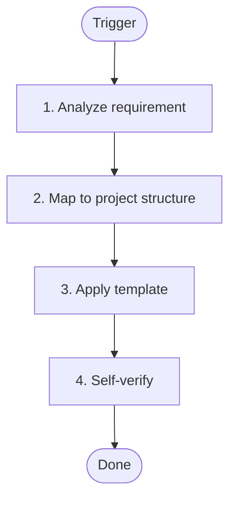
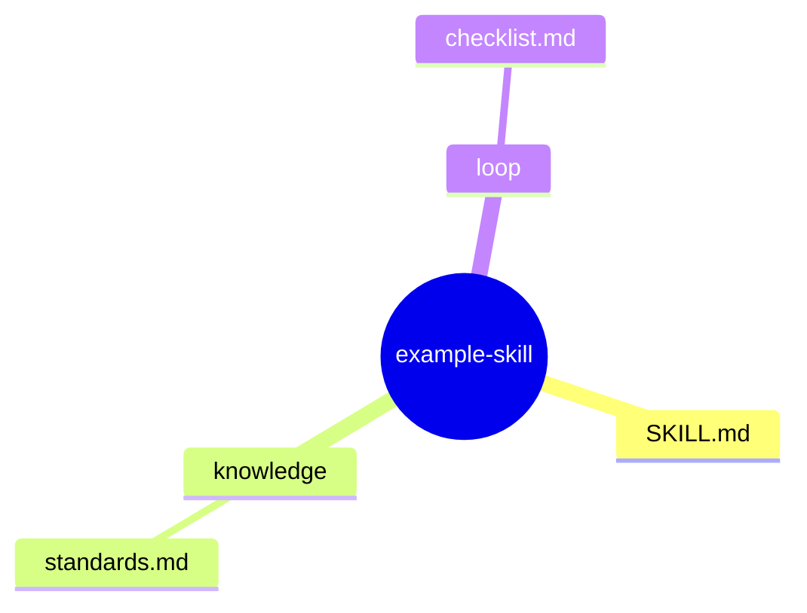
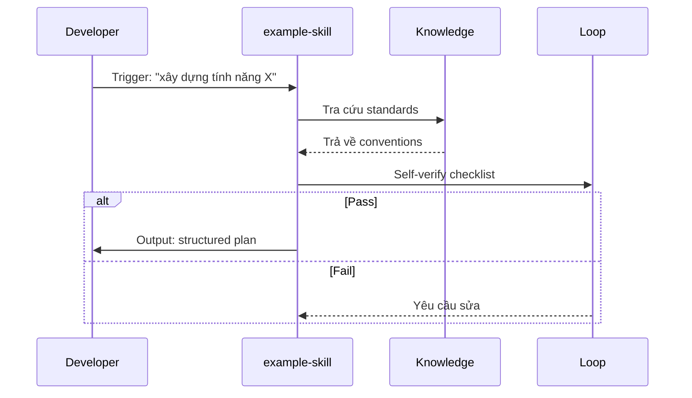

# Design Exemplars — skill-architect

## Nguồn gốc

File này bổ sung cho `format-standards.md` — cung cấp **content specification** và **exemplars** để LLM biết VIẾT GÌ và SAI GÌ.

---

## 1. Section Content Specification

Mỗi section cần có những phần tử cụ thể sau:

### §1 Problem Statement — BẮT BUỘC

```yaml
must_have:
  - pain_point: "Vấn đề cụ thể AI agent gặp phải"
  - user: "Ai sử dụng skill này (thường là AI Agent hoặc developer)"
  - expected_output: "Kết quả mong muốn sau khi dùng skill"
  - trigger_keywords: "Từ khóa kích hoạt skill"

bad_example: |
  ## 1. Problem Statement
  Cần xây dựng một skill để quản lý lỗi.

good_example_trace: |
  ## 1. Problem Statement
  
  [TỪ USER INPUT]
  **Pain Point**: Khi AI agent xây dựng tính năng mới liên quan đến API,
  agent phải tự đoán error codes — dẫn đến sai error codes, sai response type.
  
  [TỪ USER INPUT]
  **User**: AI Agent (Claude Code) khi được giao task xây dựng tính năng mới.
  
  [TỪ USER INPUT]
  **Expected Output**: Cung cấp error codes registry, response type schemas,
  và handling patterns chuẩn.
  
  [GỢI Ý BỔ SUNG]
  **Trigger Keywords**: "xây dựng tính năng", "API", "error handling",
  "service", "hook" — skill sẽ được kích hoạt khi prompt chứa các từ này.
```

### §2 Capability Map — BẮT BUỘC

```yaml
must_have:
  pillar_1_knowledge:
    - knowledge_name: "Tên kiến thức"
      source: "Đường dẫn file cụ thể"
      format: "JSON/TypeScript/Markdown"
  pillar_2_process:
    - step_name: "Tên bước"
      description: "Mô tả ngắn"
      trigger: "Khi nào thực hiện"
  pillar_3_guardrails:
    - rule_id: "G1"
      must: "Hành vi bắt buộc"
      violation: "Vi phạm xảy ra khi nào"

trace_requirement: "Mọi item phải gắn [TỪ USER INPUT] hoặc [TỪ NGUỒN EXTERNAL]"
```

### §3 Zone Mapping — CĂN BẢN NHẤT

```yaml
contract: "§3 là contract giữa Architect → Planner. Planner đọc §3 để tạo tasks."

must_have:
  - zone: "Tên zone (Core/Knowledge/Scripts/etc)"
    files: "DANH SÁCH FILE CỤ THỂ, không dùng xxx.md"
    content: "MÔ TẢ NGẮN nội dung file"
    required: "✅ hoặc ❌"

bad_zone_mapping: |
  | Zone | Files cần tạo |
  |------|--------------|
  | Knowledge | knowledge/xxx.md |

good_zone_mapping_trace: |
  | Zone | Files cần tạo | Nội dung | Bắt buộc? |
  |-------|--------------|----------|-----------|
  | Core | SKILL.md | Persona, workflow, guardrails | ✅ |
  | Knowledge | knowledge/error-codes.md | Bảng error codes theo category | ✅ |
  | Knowledge | knowledge/response-types.md | TypeScript interfaces | ✅ |
  | Loop | loop/checklist.md | Pre/Post implement checklist | ✅ |

  [TỪ §2 Pillar 3 G1] — Error code validation phải có checklist để agent tự verify
  [TỪ §2 Pillar 2] — Process cần knowledge files để tra cứu
```

### §4 Folder Structure — PHẢI KHỚP §3

```yaml
rule: "Mọi file trong §4 phải có trong §3 và ngược lại."

must_have:
  - root_node: "skill-name (kebab-case)"
  - core_files: "SKILL.md + các file Core"
  - knowledge_files: "Tất cả knowledge/* files từ §3"
  - loop_files: "Tất cả loop/* files từ §3"

bad_mindmap: |
  ```mermaid
  mindmap
    root((skill))
      knowledge
        error-codes
        response-types
  ```

good_mindmap_trace: |
  ```mermaid
  mindmap
    root((error-response-system))
      SKILL.md
        Persona
        Workflow
        Guardrails
      knowledge
        error-codes.md
        response-types.md
        usage-patterns.md
      loop
        checklist.md
  
  [TỪ §3 Zone Mapping] — Tất cả files trong §3 đều có mặt ở đây
  ```

### §5 Execution Flow — RUNTIME PERSPECTIVE

```yaml
must_have:
  - participants: "AI Agent, Skill, Knowledge Zone, Data Zone, Loop Zone"
  - sequence_steps: "Tra cứu → Áp dụng → Verify → Output"
  - decision_points: "Khi nào agent hỏi user, khi nào tự động"
  - error_handling: "Khi skill không tìm thấy thông tin"

diagram_type: "sequenceDiagram (không phải flowchart)"
```

### §6 Interaction Points — STOP CONDITIONS

```yaml
must_have:
  - interaction_table:
      - when: "Thời điểm dừng"
        reason: "Lý do dừng"
        action: "AI làm gì"
  - minimum_1_interaction: "Phải có ít nhất 1 điểm dừng hỏi user"
```

### §7 Progressive Disclosure — TIER MANDATORY VS CONDITIONAL

```yaml
tier_definitions:
  tier1_mandatory:
    - "Files agent LUÔN đọc khi skill active"
    - "Thường: SKILL.md + 1-2 core knowledge files"
  tier2_conditional:
    - "Files chỉ đọc KHI CẦN"
    - "Thường: examples, reference docs"

rule: "Tier 1 phải ≤ 4 files, không quá tải agent khi boot"
```

### §8 Risks — ≥3 RISKS + MITIGATION

```yaml
must_have:
  - risk_count: "Ít nhất 3 risks"
  - risk_structure:
      - risk_id: "R1, R2, R3..."
        severity: "P0/P1/P2"
        mitigation: "Cụ thể, có action"
  - trace: "Mỗi risk phải gắn nguồn từ §2 hoặc suy luận"

bad_risk: |
  ## 8. Risks
  - R1: Có thể có lỗi

good_risk_trace: |
  ## 8. Risks & Blind Spots

  | # | Risk | Severity | Mitigation | Trace |
  |---|------|----------|------------|-------|
  | R1 | Agent tự tạo error code không có trong registry | P0 | SKILL.md liệt kê "Không tự tạo code mới" + G1 guardrail | [TỪ §2 Pillar 3 G1] |
  | R2 | Agent dùng `any` thay vì generic type | P1 | knowledge/response-types.md cung cấp đầy đủ interfaces | [TỪ §2 Pillar 3 G2] |
  | R3 | Registry không sync với backend | P2 | data/error-codes.json sync từ backend mỗi sprint | [GỢI Ý BỔ SUNG] |
```

### §9 Open Questions — STATUS TRACKING

```yaml
must_have:
  - question_table:
      - question: "Câu hỏi"
        source: "Từ đâu sinh ra"
        status: "✅ Đã giải quyết / ❓ Mở / [CẦN LÀM RÕ]"
  - no_empty_questions: "Không để trống — nếu không có thì ghi 'Không có'"
```

### §10 Metadata — CONTRACT

```yaml
must_have:
  - skill_name: "kebab-case"
  - created_date: "YYYY-MM-DD"
  - author: "skill-architect"
  - framework: "architect.md vX.Y + know.md standards"
  - status: "🔵 IN PROGRESS / 🟢 COMPLETE"
  - handoff_checklist: "Checkbox cho Planner"
```

---

## 2. Good Design.md Exemplar (Annotated)

```markdown
---
skill_schema_version: "3.0.0"
artifact_type: "design"
skill_name: "example-skill"
generated_by: "skill-architect"
generated_at: "2026-05-19"
stage: "architect"
status: "in_progress"
---

# example-skill — Architecture Design

> Generated by skill-architect | 2026-05-19
> Status: 🔵 IN PROGRESS

---

## 1. Problem Statement

[TỪ USER INPUT]
**Pain Point**: Khi developer cần xây dựng tính năng mới, họ không biết
bắt đầu từ đâu — thiếu structure dẫn đến code lộn xộn.

[TỪ USER INPUT]
**User**: Junior Developer (hoặc AI Agent assisting developer)

[TỪ USER INPUT]
**Expected Output**: Skill cung cấp step-by-step workflow để transform
requirement thành implementation plan.

---

## 2. Capability Map

### 2.1 Tri thức (Knowledge — Pillar 1)

[TỪ USER INPUT] + [TỪ NGUỒN EXTERNAL: codebase analysis]
| # | Knowledge | Source | Format |
|---|-----------|--------|--------|
| K1 | Project structure conventions | `.claude/rules/` | Markdown |
| K2 | Coding standards | `docs/standards.md` | Markdown |

### 2.2 Quy trình (Process — Pillar 2)

[TỪ HEAVY THINKING K=8]


### 2.3 Kiểm soát (Guardrails — Pillar 3)

[TỪ §2 Pillar 3]
```yaml
guardrails:
  G1:
    must: "Verify against project conventions before output"
  G2:
    must_not: "Skip validation step"
```

---

## 3. Zone Mapping

[TỪ §2 + §4]
> ⚠️ Contract Section — Planner đọc §3 để decompose thành Tasks.

| Zone | Files cần tạo | Nội dung | Bắt buộc? |
|------|--------------|----------|-----------|
| Core | SKILL.md | Persona, workflow, guardrails | ✅ |
| Knowledge | knowledge/standards.md | Coding standards | ✅ |
| Loop | loop/checklist.md | Pre/Post checklist | ✅ |

---

## 4. Folder Structure

[TỪ §3 Zone Mapping]


---

## 5. Execution Flow

[TỪ §2 Process]


---

## 6. Interaction Points

| # | Thời điểm | Lý do dừng | Hành động của AI |
|---|-----------|-----------|-----------------|
| 1 | Khi requirement không rõ ràng | Ambiguous input | Hỏi user để clarify |
| 2 | Khi standard không tìm thấy | Missing knowledge | Báo user + suggest thêm |

---

## 7. Progressive Disclosure

```yaml
tier1_mandatory:
  - SKILL.md
  - knowledge/standards.md
  - loop/checklist.md

tier2_conditional:
  - Không có (skill đơn giản)
```

---

## 8. Risks & Blind Spots

| # | Risk | Severity | Mitigation | Trace |
|---|------|----------|------------|-------|
| R1 | Developer hiểu sai requirement | P1 | Checklist verify clarity | [TỪ §2 Pillar 3 G1] |
| R2 | Output không match standards | P2 | Loop verify trước deliver | [TỪ §2 Pillar 3 G2] |

---

## 9. Open Questions

| # | Câu hỏi | Nguồn | Trạng thái |
|---|---------|-------|-----------|
| 1 | Cần support multiple languages? | User request | ❓ Mở |

---

## 10. Metadata

```yaml
skill_name: example-skill
created: 2026-05-19
author: skill-architect
framework: architect.md v2.0 + know.md standards
status: 🔵 IN PROGRESS
handoff_checklist:
  - [ ] §3 Zone Mapping complete
  - [ ] Sẵn sàng cho skill-planner
```
```

---

## 3. Bad Design.md Anti-Patterns

### ❌ Anti-pattern 1: Không có Trace Tags

```markdown
## 1. Problem Statement
Cần xây dựng skill để quản lý lỗi.

## 8. Risks
- R1: Có thể có lỗi
```

**Vấn đề**: Không phân biệt được đâu là từ user, đâu là AI suy luận.
**Fix**: Thêm [TỪ USER INPUT], [GỢI Ý BỔ SUNG] trước mỗi assertion.

### ❌ Anti-pattern 2: Zone Mapping có placeholders

```markdown
| Zone | Files cần tạo |
|------|--------------|
| Knowledge | knowledge/xxx.md |
| Loop | loop/xxx.md |
```

**Vấn đề**: Planner không biết tạo file gì.
**Fix**: Thay xxx.md bằng tên file cụ thể: `error-codes.md`, `checklist.md`.

### ❌ Anti-pattern 3: §4 không khớp §3

```markdown
## §3 Zone Mapping
| Zone | Files |
|------|-------|
| Knowledge | knowledge/error-codes.md |

## §4 Folder Structure
mindmap
  root((skill))
    knowledge
      patterns.md  ← KHÔNG CÓ TRONG §3!
```

**Vấn đề**: Handoff contract bị vi phạm.
**Fix**: §4 phải liệt kê chính xác files từ §3.

### ❌ Anti-pattern 4: §8 Risks không có mitigation cụ thể

```markdown
## 8. Risks
- R1: Có thể có lỗi
- R2: Không chắc sẽ work
```

**Vấn đề**: Risks không có action, không useful cho Builder.
**Fix**: Mỗi risk phải có severity + mitigation cụ thể.

### ❌ Anti-pattern 5: Section ngoài spec (§11, §12, §13)

```markdown
## 11. Version Management  ← KHÔNG ĐÚNG SPEC!
## 12. Naming Conventions  ← KHÔNG ĐÚNG SPEC!
## 13. Rollback Procedures  ← KHÔNG ĐÚNG SPEC!
```

**Vấn đề**: Output spec chỉ có §1-§10.
**Fix**: Chỉ viết §1-§10. Nếu cần bổ sung, gộp vào §10 Metadata.

---

## 4. Zone Decision Tree

```mermaid
flowchart TD
    Start([New Skill]) --> CoreQ{Core Zone?}
    CoreQ -->|Yes| Core_Req[SKILL.md bắt buộc]
    CoreQ -->|No| Error_Missing[❌ Error: Core là bắt buộc]
    
    Start --> KnowledgeQ{Knowledge cần thiết?}
    KnowledgeQ -->|Yes| Knowledge_Add[knowledge/*.md]
    KnowledgeQ -->|No| Knowledge_Skip[Không cần knowledge zone]
    
    Start --> ScriptQ{Cần automation?}
    ScriptQ -->|Yes| Scripts_Add[scripts/*.py hoặc .sh]
    ScriptQ -->|No| Scripts_Skip[Không cần scripts zone]
    
    Start --> LoopQ{Cần verification?}
    LoopQ -->|Yes| Loop_Add[loop/checklist.md]
    LoopQ -->|No| Loop_Skip[Không cần loop zone]
    
    Start --> DataQ{Cần config/data?}
    DataQ -->|Yes| Data_Add[data/*.yaml hoặc .json]
    DataQ -->|No| Data_Skip[Không cần data zone]
    
    Core_Req --> Result[Zone Mapping Complete]
    Knowledge_Add --> Result
    Scripts_Add --> Result
    Loop_Add --> Result
    Data_Add --> Result
    
    Error_Missing -->|[fix]| Core_Req
```

**Zone Requirements Summary**:

| Zone | Required If | Common Files |
|------|-------------|--------------|
| Core | **Luôn** | SKILL.md |
| Knowledge | Skill cần domain knowledge | knowledge/*.md |
| Scripts | Cần automation (init, validate) | scripts/*.py |
| Templates | Cần output format chuẩn | templates/*.template |
| Data | Cần config hoặc static data | data/*.yaml, *.json |
| Loop | Cần self-verification | loop/checklist.md |
| Assets | Hiếm khi cần | assets/* |

---

## 5. Quick Reference — Section Checklist

| § | Must Have | Must NOT Have |
|---|-----------|---------------|
| §1 | pain_point + user + expected_output | Fluff, không có trace |
| §2 | 3 Pillars, mỗi pillar có items với source | Generic statements không source |
| §3 | Table với FILENAME CỤ THỂ, không placeholders | `xxx.md`, `*.md` |
| §4 | Mindmap khớp §3 files | Files không có trong §3 |
| §5 | sequenceDiagram với participants đủ | flowchart nếu cần runtime flow |
| §6 | ≥1 interaction point với stop condition | Empty table |
| §7 | Tier 1 (≤4 files) vs Tier 2 phân biệt rõ | Không phân biệt tier |
| §8 | ≥3 risks với severity + mitigation | Generic risks không action |
| §9 | Questions có status (✅/❓/[CẦN LÀM RÕ]) | Empty section |
| §10 | skill_name, date, status, handoff checklist | Sections khác |

---

## 6. Token Budget cho design.md

```yaml
design_md_budget:
  excellent: "1500-2500 tokens"
  acceptable: "2500-4000 tokens"
  warning: "4000-6000 tokens"
  overloaded: ">6000 tokens"

section_budget:
  §1_problem: "150-300 tokens"
  §2_capability: "400-700 tokens"
  §3_zone: "200-400 tokens"
  §4_folder: "150-300 tokens"
  §5_flow: "200-400 tokens"
  §6_interaction: "150-300 tokens"
  §7_disclosure: "100-200 tokens"
  §8_risks: "200-400 tokens"
  §9_questions: "100-200 tokens"
  §10_metadata: "50-100 tokens"
```

**If overloaded**: 
- §2 có thể rút gọn — chỉ list items, không expand
- §8 giữ 3 risks đủ, không thêm cho đủ
- §9 nếu không có questions, ghi "Không có" thay vì expand

---

> **Last Updated**: 2026-05-19
> **Purpose**: Bổ sung content specification cho format-standards.md
> **Companion**: format-standards.md (format rules), framework.md (7 Zones)
