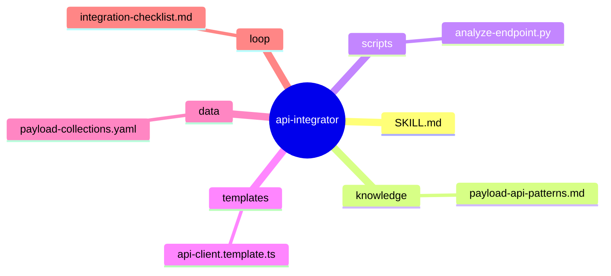
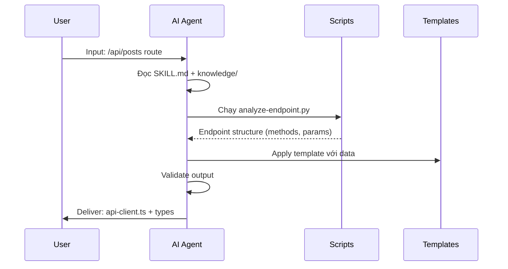

# Sample Design: api-integrator

> Đây là ví dụ hoàn chỉnh của design.md cho một skill đơn giản.
> Dùng để tham khảo khi tạo skill mới.

---

## 1. Problem Statement  [TỪ USER INPUT]

**Vấn đề**: Khi cần tích hợp API backend vào frontend, developer phải:  [TỪ NGUỒN EXTERNAL: frontend-dev-pain-points]
- Tìm hiểu cấu trúc API endpoint thủ công
- Viết code request/response lặp đi lặp lại
- Đồng bộ types giữa backend và frontend

**Người dùng**: Frontend developer sử dụng Next.js + PayloadCMS  [TỪ USER INPUT]

**Lý do cần skill**: Tự động hóa quá trình nghiên cứu API, tạo typed client, và sync data structure.  [GỢI Ý BỔ SUNG]

---

## 2. Capability Map  [TỪ DESIGN §1]

### 2.1 Tri thức (Knowledge — Pillar 1)  [TỪ NGUỒN EXTERNAL: payloadcms-docs]
- Cấu trúc PayloadCMS API endpoints
- TypeScript typing patterns cho API responses
- Next.js API routes conventions

### 2.2 Quy trình (Process — Pillar 2)  [TỪ DESIGN §1]
1. Nhận input: đường dẫn file API hoặc collection name
2. Phân tích endpoint structure (GET/POST/PUT/DELETE)
3. Tạo typed API client với fetch wrapper
4. Sync DTO types vào frontend

### 2.3 Kiểm soát (Guardrails — Pillar 3)  [GỢI Ý BỔ SUNG]
- Validate input path tồn tại
- Không expose sensitive fields (password, token)
- Warn khi API có breaking changes

---

## 3. Zone Mapping  [TỪ DESIGN §2]

| Zone | Files cần tạo | Nội dung | Bắt buộc? |
|------|--------------|----------|-----------|
| Core (SKILL.md) | `SKILL.md` | Persona, phases, guardrails | ✅ |
| Knowledge | `references/payload-api-patterns.md` | Cách Payload API hoạt động | ✅ |
| Scripts | `scripts/analyze-endpoint.py` | Parse API route files | ✅ |
| Templates | `templates/api-client.template.ts` | TypeScript client template | ✅ |
| Data | `data/payload-collections.yaml` | Collection metadata | ❌ |
| Loop | `loop/integration-checklist.md` | Verify steps | ✅ |
| Assets | Không cần | N/A | ❌ |

---

## 4. Folder Structure

---

## 5. Execution Flow

---

## 6. Interaction Points

| # | Thời điểm | Lý do dừng | Hành động của AI |
|---|-----------|-----------|-----------------|
| 1 | Sau khi phân tích endpoint | Cần user xác nhận fields cần expose | Show list fields + ask confirm |

---

## 7. Progressive Disclosure Plan

### Tier 1: Bắt buộc đọc (Mandatory)
- `SKILL.md`
- `knowledge/payload-api-patterns.md`

### Tier 2: Đọc khi cần (Conditional)
- `scripts/analyze-endpoint.py` — khi cần parse API route
- `templates/api-client.template.ts` — khi generate client

---

## 8. Risks & Blind Spots

| # | Risk | Severity | Mitigation |
|---|------|----------|-----------|
| 1 | AI bỏ sót field quan trọng | P0 | Liệt kê tất cả fields từ schema, user confirm |
| 2 | Hardcode URL thay vì dùng env | P1 | Check có dùng process.env.URL |
| 3 | Không handle error response | P2 | Validate error type trong template |

---

## 9. Open Questions

| # | Câu hỏi | Nguồn (Phase) | Trạng thái |
|---|---------|--------------|-----------|
| 1 | Có cần support GraphQL không? | User | ❓ Chưa rõ |

---

## 10. Metadata

- **Skill Name**: api-integrator
- **Created**: 2024-01-15
- **Author**: Steve Void
- **Framework**: architect.md v2.0
- **Status**: ✅ COMPLETED
