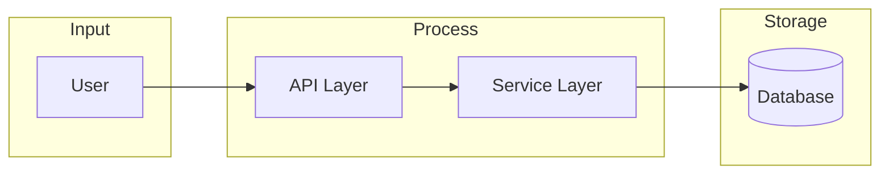
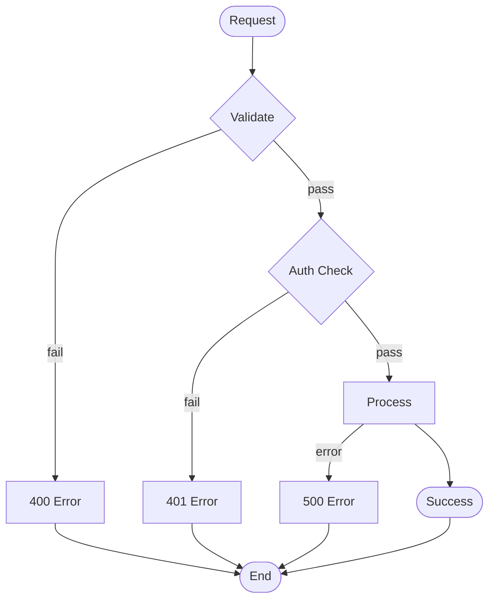

# Spec Structure — Complete Artifact Anatomy

> Complete structure for all 5 spec artifacts (4 output + 1 metadata)

---

## api.json Structure

```yaml
{
  "spec_version": "2.0.0",           # Schema version
  "feature": "<feature-name>",       # Feature identifier
  "engine": "payloadcms|express|TBD", # Backend engine
  "entities": [                        # Data entities
    {
      "name": "<EntityName>",         # PascalCase singular
      "collection": "<collection-slug>", # DB collection slug
      "fields": [                      # PayloadCMS field definitions
        {
          "name": "<fieldName>",       # camelCase
          "type": "<field-type>",       # text|number|relationship|etc
          "required": true|false,
          "options": {}                # Type-specific options
        }
      ],
      "indexes": ["<index-name>"],
      "hooks": {
        "beforeChange": [],
        "afterChange": []
      }
    }
  ],
  "endpoints": [                      # API endpoints
    {
      "method": "GET|POST|PUT|DELETE",
      "path": "/api/<resource>",
      "auth": "public|authenticated|admin",
      "access": {
        "read": "<access-control>",
        "create": "<access-control>"
      },
      "request": {
        "body": {},                    # Expected body fields
        "query": {}                    # Query parameters
      },
      "response": {
        "200": {},
        "400": {},
        "401": {},
        "403": {}
      },
      "validation": "<zod-schema-ref>",
      "trace": "P1-api"               # Phase 1 artifact trace
    }
  ],
  "auth": {
    "provider": "jwt|firebase|session",
    "tokens": {},
    "refresh": true|false
  },
  "webhooks": []                      # Optional event webhooks
}
```

**Required fields**: `spec_version`, `feature`, `entities`, `endpoints`, `engine`

---

## business.md Structure

```markdown
# <Feature Name> — Business Rules

## 1. Overview
- **Feature**: <name>
- **Complexity**: LOW|MEDIUM|HIGH
- **Engine**: <backend engine>
- **Last Updated**: <date>

## 2. Actors

| Actor | Role | Permissions |
|-------|------|-------------|
| <ActorName> | <role-description> | <permission-set> |

## 3. Entity Definitions

### <EntityName>
- **Collection**: `<collection-slug>`
- **Fields**:
  - `<fieldName>`: <type>, <required>, <description>
  - ...
- **Lifecycle**:
  - Created when: <trigger>
  - Updated when: <trigger>
  - Deleted when: <trigger>

## 4. Status Workflow

| Status | From | To | Trigger |
|--------|------|-----|---------|
| <status-a> | - | <status-b> | <action> |

## 5. Business Rules

### Rule BR-001
- **Condition**: <precondition>
- **Action**: <action taken>
- **Actor**: <who performs>
- **Trace**: <api.json|flow.md section ref>

### Rule BR-N
...

## 6. Constraints

| Constraint | Type | Description |
|------------|------|-------------|
| <id> | <type> | <description> |

## 7. Edge Cases

| Case | Handling |
|------|----------|
| <case-1> | <resolution> |
| <case-N> | <resolution> |

## 8. Permissions Matrix

| Action | Actor | Permission |
|--------|-------|------------|
| <action> | <actor> | <permission> |

## 9. Cross-References
- api.json: `<section>`
- flow.md: `<diagram section>`
- tasks.md: `<phase>`
```

**Required sections**: Overview, Actors, Entity Definitions, Business Rules, Permissions Matrix

---

## flow.md Structure

```markdown
# <Feature Name> — Flow Diagrams

## 1. Sequence Diagrams

### <Diagram Name>
```mermaid
sequenceDiagram
    participant <Actor> as <Description>
    participant <System> as <Description>
    participant <External> as <Description>

    <Actor>->>+<System>: <action>
    <System>-->>-<Actor>: <response>
    <System>->>+<External>: <call>
    <External>-->>-<System>: <response>
```

## 2. Activity Diagrams

### <Activity Name>
```mermaid
flowchart TD
    START([<start>]) --> <condition>
    <condition> -->|yes| <action-yes>
    <condition> -->|no| <action-no>
    <action-yes> --> END([<end>])
    <action-no> --> END
```

## 3. State Diagrams

### <Entity> State Machine
```mermaid
stateDiagram-v2
    [*] --> [initial-state]
    [initial-state] --> [state-a]: trigger
    [state-a] --> [state-b]: trigger
    [state-b] --> [*]
```

## 4. Data Flow



## 5. Error Handling Flows


```

**Required**: At least 1 sequence diagram, consistent naming with business.md

---

## tasks.md Structure

```yaml
spec_version: "2.0.0"
feature: "<feature-name>"
complexity: LOW|MEDIUM|HIGH

phases:
  phase_1:
    name: "Phase 1: Backend Setup"
    complexity_adapter: LOW|MEDIUM|HIGH
    tasks:
      - id: "T1-001"
        title: "<task title>"
        description: "<detailed description>"
        artifact: api.json|business.md|flow.md
        artifact_section: "<section ref>"
        trace: "P1|T1-001"          # Phase:TaskID
        dependencies: []              # Task IDs
        estimated_hours: <number>
        acceptance_criteria:
          - "<criterion 1>"
          - "<criterion 2>"
        backend_only: true|false
        engine: payloadcms|express|TBD

      - id: "T1-002"
        # ...

  phase_2:
    name: "Phase 2: Business Logic"
    tasks:
      - id: "T2-001"
        # ...

  phase_3:
    name: "Phase 3: Integration"
    skip_if: LOW_COMPLEXITY
    tasks:
      - id: "T3-001"
        # ...

  phase_4:
    name: "Phase 4: Testing & Polish"
    tasks:
      - id: "T4-001"
        # ...

implementation_notes:
  - "<note 1>"
  - "<note 2>"

trace_coverage: <percentage>  # Must be 100%
```

**Required fields**: `spec_version`, `feature`, `phases`, every task must have `trace`

---

## spec-meta.yaml Structure

```yaml
spec_schema_version: "2.0.0"
spec_generator_version: "2.0.0"
feature: "<feature-name>"
generated_at: "<ISO-8601 timestamp>"
complexity: LOW|MEDIUM|HIGH
engine: "<backend engine>"

artifacts:
  - name: "api.json"
    path: "spec-<feature>/api.json"
    schema_validated: true
    trace_coverage: "100%"
  - name: "business.md"
    path: "spec-<feature>/business.md"
    cross_ref_passed: true
  - name: "flow.md"
    path: "spec-<feature>/flow.md"
    consistency_passed: true
  - name: "tasks.md"
    path: "spec-<feature>/tasks.md"
    trace_coverage: "100%"

validation_gates:
  phase_0_ambiguity: PASS|FAIL
  phase_1_schema: PASS|FAIL
  phase_2_cross_ref: PASS|FAIL
  phase_3_consistency: PASS|FAIL
  phase_4_trace: PASS|FAIL
  phase_5_completeness: PASS|FAIL

complexity_rationale: "<explanation of complexity choice>"
handoff_signal: handoff.ready
```

---

## Artifact Cross-Reference Map

| Artifact | Validates Against | Check |
|----------|-------------------|-------|
| api.json | `templates/api-json.schema.yaml` | JSON Schema |
| business.md | api.json | Collection names, endpoint permissions |
| flow.md | business.md | Actor names, status transitions |
| tasks.md | all 3 prior | Trace field coverage, phase completeness |
| spec-meta.yaml | all 4 prior | Completeness gate |
