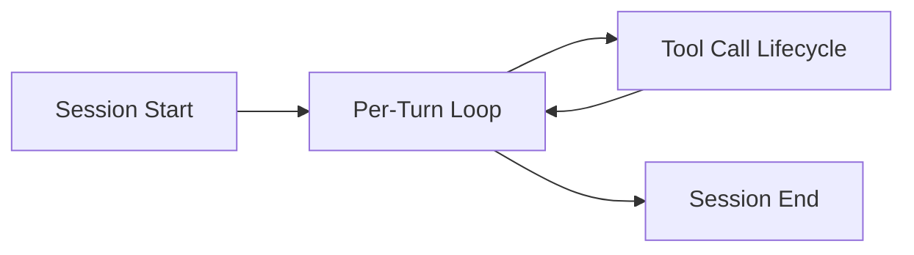

<instructions priority="critical">
This is the HUB file for WASHVN's hook protocol and event system. It is ALWAYS loaded into context. It contains the core mental model, the 4 essential events, and a compact quick-reference section. When you need detail beyond what is here, use the Navigation Manifest below to open the correct spoke file.
</instructions>

---

## Navigation Manifest

| Nếu bạn cần... | Mở file này | Khi nào |
|---|---|---|
| Lifecycle, 4 core events, quick reference (matcher, exit code, handler fields) | **(đang đọc — hooks-and-events.md)** | ★ Luôn có sẵn trong context |
| Event table đầy đủ (27 events), matcher syntax (exact/OR/regex), configuration schema, if-condition, placeholder substitution | `hooks-reference.md` | Tra cứu khi cần event lạ, syntax chi tiết |
| Dual-format blocking protocol, ví dụ script (bash), prompt/agent hooks, error handling policy | `hooks-implementation.md` | Khi code hook handler, debug |

---

## 1. Hook Lifecycle



| Phase | Events fired | Description |
|-------|-------------|-------------|
| **Session Start** | `SessionStart` → `Setup` → `InstructionsLoaded` | Init context, validate env, assert capabilities. Once per session. |
| **Per-Turn** | `UserPromptSubmit` → [`UserPromptExpansion`] → [`Elicitation` ↔ `ElicitationResult`] | Each user message cycles through submission, optional expansion, optional clarification. |
| **Tool Call Lifecycle** | `PreToolUse` → [`PermissionRequest` → `PermissionDenied`] → `PostToolUse` / `PostToolUseFailure` → `PostToolBatch` | For each tool invocation. `PreToolUse` is the primary blocking point. |
| **Session End** | `PreCompact` → `PostCompact` → (`Stop` / `StopFailure`) → `SessionEnd` | Cleanup, flush logs, release resources. |

> **Key rule:** `PreToolUse` is the ONLY event that can block a tool call. `PostToolUse` handlers cannot roll back — they only log.

---

## 2. Core Hook Events

These four events form the essential protocol. Every hook implementation MUST handle them correctly.

| Event | Timing | Matcher | Input (stdin JSON) | Purpose |
|-------|--------|---------|--------------------|---------|
| **SessionStart** | Before first turn | None (global) | `{ sessionId, projectDir }` | Init context, validate env, assert capabilities |
| **PreToolUse** | Before tool execution | Yes (tool name) | `{ tool, params }` | Permission gate, input validation, request modification |
| **PostToolUse** | After successful execution | Yes (tool name) | `{ tool, params, result }` | Audit logging, result transformation, side effects |
| **Stop** | On interrupt or abort | None (global) | `{ reason, sessionId }` | Cleanup, state persistence, rollback (max 5s) |

**PreToolUse exit behavior:**
- `exit 0` + no `permissionDecision` → **allow**
- `exit 0` + stdout `{"permissionDecision": "deny"}` → **block** (Format A)
- `exit 2` + stderr message → **block** (Format B)
- any other non-zero → **block**, logged as hook error

---

## 3. Quick Reference

### 3.1 Hook Locations (priority — last writer wins by merge)

| Priority | Location | Scope |
|----------|----------|-------|
| 1 (low) | `~/.claude/settings.json` | Global user defaults |
| 2 | `.claude/settings.json` | Project-wide |
| 3 | `.claude/settings.local.json` | Local overrides (gitignored) |
| 4 | Plugin-declared hooks | Plugin manifest |
| 5 (high) | Skill / Agent YAML frontmatter | Per-skill or per-agent |

### 3.2 Matcher Decision Tree

| Matcher character set | Mode | Example |
|---|---|---|
| Only `[a-zA-Z0-9 \-,\|]` | Exact / OR split | `"bash"`, `"Read, Write, Edit"`, `"PreToolUse\|Stop"` |
| Contains any other char (`.`, `*`, `+`, `?`, `^`, `$`, `(`, etc.) | Regex (case-insensitive) | `"^git"`, `"\.(env\|secret)$"` |

### 3.3 Handler Fields (compact schema)

| Field | Required | Type | Description |
|-------|----------|------|-------------|
| `event` | Yes | string | Event type this handler subscribes to |
| `type` | No | `command` / `prompt` / `agent` | Defaults to `command` if `script` provided |
| `script` | For command | string | Path to handler script (absolute or relative to project) |
| `prompt` | For prompt/agent | string | LLM instruction, supports `$ARGUMENTS` placeholder |
| `model` | For prompt | string | LLM model (e.g. `claude-3-5-haiku`) |
| `timeout` | No | integer | Seconds (30 default for command/prompt, 60 for agent) |
| `continueOnBlock` | No | boolean | Feed block reason back to agent for auto-repair |
| `if` | No | string | Condition expression gating execution |
| `description` | No | string | Human-readable purpose |
| `matcher` | No | string | Inherits from parent if omitted |

### 3.4 All Events at a Glance (30 events)

| Group | Events |
|-------|--------|
| **Session start** | SessionStart, Setup, InstructionsLoaded |
| **Per-turn** | UserPromptSubmit, UserPromptExpansion, Elicitation, ElicitationResult |
| **Tool lifecycle** | PreToolUse, PermissionRequest, PermissionDenied, PostToolUse, PostToolUseFailure, PostToolBatch |
| **Orchestration** | SubagentStart, SubagentStop, TaskCreated, TaskCompleted, TeammateIdle |
| **Runtime** | Notification, MessageDisplay, ConfigChange, CwdChanged, FileChanged, WorktreeCreate, WorktreeRemove |
| **Session end** | PreCompact, PostCompact, Stop, StopFailure, SessionEnd |

> For input schema of each event, see `hooks-reference.md §1 — Complete Event Reference`.

### 3.5 Settings JSON (compact example)

```json
{
  "hooks": {
    "PreToolUse": [
      {
        "matcher": "bash",
        "hooks": [
          { "type": "command", "command": "scripts/hooks/pre-bash.sh",
            "description": "Block destructive bash commands" }
        ]
      },
      {
        "matcher": "Read|Write|Edit",
        "hooks": [
          { "type": "command", "if": "tool.params.filePath =~ \\.env$",
            "command": "scripts/hooks/block-env-files.sh",
            "description": "Block .env file access" }
        ]
      }
    ],
    "PostToolUse": [
      {
        "matcher": "bash",
        "hooks": [
          { "type": "command", "command": "scripts/hooks/log-bash.sh",
            "description": "Log bash commands to audit trail" }
        ]
      }
    ]
  }
}
```

---

## 4. Cross-References

- [Chi tiết event table + schema + matcher → hooks-reference.md](hooks-reference.md)
- [Dual-format blocking + ví dụ + error handling → hooks-implementation.md](hooks-implementation.md)
- [Agent Configuration Standards](../agents/configuration.md)
- [Agent Capability Controls](../agents/capability_controls.md)
- [Agent Hook Protocol](../agents/agent_hooks.md)
