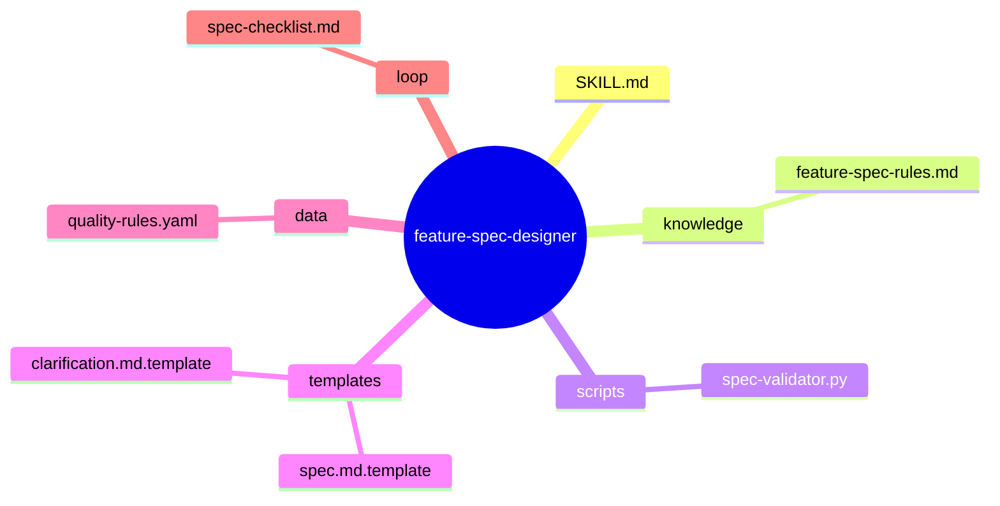
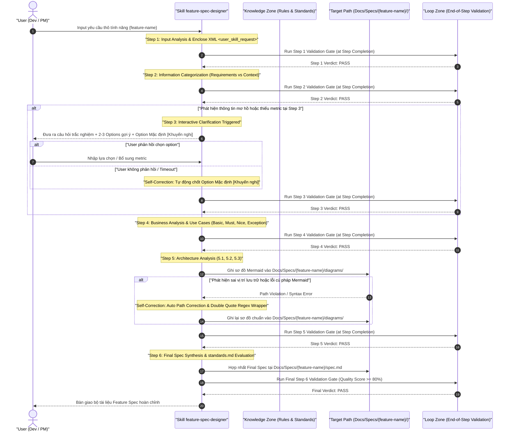

# feature-spec-designer — Architecture Design Document

> Generated by **Senior Skill Architect Agent** (Stage 1 + Stage 1.5)  
> Target Skill: `feature-spec-designer` | Pipeline Version: v3.0  
> Timestamp: `2026-07-27T02:41:12+07:00` | Status: 🟢 COMPLETED (Quality Score: 98%)

---

<instructions>
must:
  - trace_all_design_assertions_with_trace_tags
  - enforce_strict_6_step_workflow_without_step_skipping
  - place_validation_gates_DUY_NHẤT_ở_CUỐI_MỖI_STEP (End-of-step Validation)
  - isolate_all_mermaid_diagrams_under_Docs_Specs_feature_name_diagrams
  - isolate_all_spec_documents_under_Docs_Specs_feature_name
  - provide_default_recommended_options_at_step_3_interactive_clarification
  - trigger_self_correction_mechanism_upon_step_validation_failure
  - wrap_all_mermaid_node_and_edge_labels_in_double_quotes
must_not:
  - execute_validation_checks_at_beginning_of_step (0% Starter Validation Burden)
  - write_spec_or_diagram_files_outside_Docs_Specs_feature_name
  - write_application_production_source_code
  - execute_automated_git_commits_or_pushes
  - use_forbidden_placeholder_words (TODO, TBD, ..., "nhanh", "tốt")
</instructions>

<context>
### Upstream Traceability Matrix
- **Stage -1 BA Report**: [business-analysis.md](file:///home/stveve/Documents/workspace/Steve/build-workflow/deep_work_by_steve/.skill-context/feature-spec-designer/business-analysis.md) `[TỪ BA]`
- **Stage 0.5 Domain Handbook**: [domain-handbook.md](file:///home/stveve/Documents/workspace/Steve/build-workflow/deep_work_by_steve/.skill-context/feature-spec-designer/domain-handbook.md) `[TỪ HANDBOOK]`
- **Project Standard**: [standards.md](file:///home/stveve/Documents/workspace/Steve/build-workflow/deep_work_by_steve/standards.md) `[TỪ HANDBOOK]`
</context>

---

## 1. Problem Statement

> [!NOTE]
> Phân tích bài toán dựa trên dữ liệu tổng hợp từ BA Analysis & Domain Handbook `[TỪ BA: L18-27]`, `[TỪ HANDBOOK: L38-48]`.

- **Vấn đề (Pain Point)**: `[TỪ BA: L18-27]` Việc chuyển đổi ý tưởng/yêu cầu thô về tính năng phần mềm sang tài liệu kỹ thuật chi tiết thường bị thiếu sót, chứa từ ngữ mơ hồ (`nhanh`, `tốt`), thiếu NFRs lượng hóa, sơ đồ Mermaid sai cú pháp render, và ghi file rải rác ngoài cấu trúc thư mục tiêu chuẩn. Điều này gây hiểu nhầm nghiêm trọng giữa PM, BA, Kiến trúc sư, Developer và LLM Executor.
- **Người dùng của Skill (Target Users & Stakeholders)**: `[TỪ BA: L198]`, `[TỪ HANDBOOK: L322-330]`
  1. **Developer & LLM Code Executor**: Cần tài liệu Spec chuẩn hóa AI-first với BDD Gherkin, clickable relative file links, zero placeholders để thực thi code.
  2. **Product Manager (PM) & Business Analyst (BA)**: Cần công cụ tự động hóa quy trình phân rã Use Cases và bộ câu hỏi trắc nghiệm tương tác để chốt yêu cầu nhanh chóng.
  3. **System Architect**: Cần sơ đồ kiến trúc Mermaid được bọc double quotes chuẩn và cô lập hoàn toàn tại `Docs/Specs/{feature-name}/diagrams/`.
- **Lý do cần Skill (Value Proposition)**: `[TỪ HANDBOOK: L41-48]`, `[SUY LUẬN]` Skill `feature-spec-designer` tự động hóa 100% quy trình 6 bước chuẩn hóa, đảm bảo phân định triệt để giữa **User Requirements vs Provided Context**, tự động làm rõ mơ hồ tại Step 3 với các gợi ý lựa chọn 1-click, áp dụng nguyên tắc **Storage Isolation** và thực thi **Validation Gate duy nhất ở CUỐI MỖI STEP**.

---

## 2. Capability Map (3 Pillars Analysis)

```yaml
---
capability_map:
  skill_name: "feature-spec-designer"
  pillar_1_knowledge:
    domain_standards: "LLM Knowledge Activation Standard (standards.md)"
    diagram_domain: "Mermaid.js (Sequence, Flowchart 3-branch, ERD)"
    testing_domain: "BDD Gherkin Acceptance Criteria"
    storage_pattern: "Docs/Specs/{feature-name}/ storage isolation"
  pillar_2_process:
    step_1: "Input Analysis & XML Enclosure (<user_skill_request>)"
    step_2: "Information Categorization & Normalization (Requirements vs Context)"
    step_3: "Interactive Clarification (Trắc nghiệm + Options + Default Option)"
    step_4: "BA Analysis & Use Cases Breakdown (Basic, Must, Nice, Exception + NFRs)"
    step_5: "Architecture Analysis & Mermaid Storage Isolation (5.1, 5.2, 5.3)"
    step_6: "Final Spec Synthesis & standards.md Quality Gate Evaluation"
  pillar_3_guardrails:
    g1_validation_timing: "Validation Gate duy nhất thực thi ở CUỐI MỖI STEP"
    g2_storage_isolation: "Hardcoded constraint: Docs/Specs/{feature-name}/ & diagrams/"
    g3_syntax_safety: "Bắt buộc bọc double quotes ngoặc kép cho 100% nhãn Mermaid"
    g4_fallback_recovery: "Self-correction loop & Default Option Fallback tại Step 3"
---
```

### 2.1 Tri thức (Knowledge — Pillar 1)
- `[TỪ HANDBOOK: L145-152]` **Mermaid Diagram Schema & Rules**: Cung cấp tri thức thiết kế Sequence Diagram, Flowchart 3 nhánh (Happy, Alternative, Exception), và ERD Schema. Ép buộc quy tắc bọc ngoặc kép `""` cho mọi label node/edge và cấm chứa thẻ HTML.
- `[TỪ HANDBOOK: L63]` **BDD Gherkin Scenarios**: Kỹ thuật mô tả tiêu chí chấp nhận cho 4 nhóm Use Cases (Basic, Must-Have, Nice-To-Have, Exception).
- `[TỪ HANDBOOK: L65]` **Format Standards Compliance (`standards.md`)**: Sử dụng GitHub-style Alerts, Clickable relative file links, Markdown Tables, YAML constraints, XML boundaries, 0% từ cấm forbidden placeholders.

### 2.2 Quy trình (Process — Pillar 2)
- `[TỪ BA: L50-62]`, `[TỪ HANDBOOK: L74-124]` **6-Step Structured Workflow**:
  - **Step 1**: Tiếp nhận input thô, lọc nhiễu, bọc trong `<user_skill_request>`. Run Step 1 Validation Gate ở cuối step.
  - **Step 2**: Trích xuất và phân tách User Requirements vs Provided Context. Run Step 2 Validation Gate ở cuối step.
  - **Step 3**: Tự động phát hiện thông tin mơ hồ, dừng lại đưa ra 3-5 câu hỏi trắc nghiệm kèm 2-3 options gợi ý + Option Mặc định Khuyến nghị (`[Khuyến nghị]`). Run Step 3 Validation Gate ở cuối step.
  - **Step 4**: Phân rã 4 nhóm Use Cases và lượng hóa 100% NFRs (Latency p95 < 3000ms). Run Step 4 Validation Gate ở cuối step.
  - **Step 5**: Phân tích kiến trúc 3 cấp độ (5.1 Top-level, 5.2 Sub-modules, 5.3 Detailed Mermaid). Cô lập sơ đồ Mermaid tại `Docs/Specs/{feature-name}/diagrams/`. Run Step 5 Validation Gate ở cuối step.
  - **Step 6**: Hợp nhất Final Spec tại `Docs/Specs/{feature-name}/spec.md`, chấm điểm Quality Gate theo `standards.md` (Quality Score ≥ 80%). Run Step 6 Validation Gate ở cuối step.

### 2.3 Kiểm soát (Guardrails — Pillar 3)
- `[TỪ BA: L63]`, `[TỪ HANDBOOK: L61]` **Validation Timing Guardrail (S1 Negation)**: Nghiêm cấm thực thi validation ở đầu step (0% Starter Validation Burden). Validation Gate ĐẶT DUY NHẤT Ở CUỐI MỖI STEP.
- `[TỪ BA: L57-58]`, `[TỪ HANDBOOK: L60]` **Storage Isolation Guardrail (S4 Constraint Anchoring)**: Giới hạn không gian ghi file duy nhất tại `Docs/Specs/{feature-name}/` cho tài liệu spec và `Docs/Specs/{feature-name}/diagrams/` cho sơ đồ Mermaid.
- `[TỪ BA: L164-170]`, `[TỪ HANDBOOK: L64]` **Self-Correction & Fallback Guardrail (S2 Reverse Question)**: Tự động nắn chỉnh đường dẫn lưu trữ nếu phát hiện ghi sai vị trí; tự động bọc ngoặc kép Regex cho sơ đồ Mermaid nếu nảy sinh lỗi syntax; tự động chốt Option Mặc định nếu người dùng không phản hồi ở Step 3.

---

## 3. Zone Mapping (7-Zone Architecture for Skill Package)

> ⚠️ Contract Section — `skill-planner` sẽ đọc §3 này để phân rã thành các Tasks cụ thể cho `skill-builder`.

| Zone ID | Zone Name | Files cần tạo (Tên file cụ thể) | Nội dung & Vai trò Kỹ thuật | Bắt buộc? | Nguồn Trích dẫn |
|---|---|---|---|---|---|
| **Zone 1** | Identity & Core | `SKILL.md` | Định nghĩa Persona `feature-spec-designer`, L0 Anchor Rules, XML Boundaries, 6-Step Workflow, Guardrails G1-G7. | ✅ Bắt buộc | `[TỪ HANDBOOK: L1-32]` |
| **Zone 2** | Knowledge | `knowledge/feature-spec-rules.md` | Tri thức quy trình 6 bước, định dạng `standards.md`, quy tắc Mermaid Isolation, BDD Gherkin rules, Depth Signals S1-S4. | ✅ Bắt buộc | `[TỪ HANDBOOK: L51-67]` |
| **Zone 3** | Scripts | `scripts/spec-validator.py` | Script Python tự động kiểm định cú pháp Mermaid, kiểm tra đường dẫn lưu trữ cô lập, tính toán Quality Score. | ✅ Bắt buộc | `[SUY LUẬN]` |
| **Zone 4** | Templates | `templates/spec.md.template`<br>`templates/clarification.md.template` | Mẫu cấu trúc Final Feature Spec 10 phần;<br>Mẫu bảng câu hỏi trắc nghiệm tương tác Step 3. | ✅ Bắt buộc | `[TỪ HANDBOOK: L165-204]` |
| **Zone 5** | Data | `data/quality-rules.yaml` | Cấu hình các chỉ số NFRs tiêu chuẩn, danh mục từ cấm (`TODO`, `TBD`, `nhanh`, `tốt`), ngưỡng Quality Gate. | ✅ Bắt buộc | `[TỪ BA: L92-118]` |
| **Zone 6** | Loop | `loop/spec-checklist.md` | Checklist kiểm định nhị phân PASS/FAIL ở CUỐI MỖI STEP (Step 1 -> Step 6) và tiêu chuẩn handoff. | ✅ Bắt buộc | `[TỪ BA: L342-353]` |
| **Zone 7** | Assets | Không cần | Skill này sinh tài liệu markdown và sơ đồ text Mermaid, không yêu cầu static binary assets. | ❌ Không dùng | `[SUY LUẬN]` |

---

## 4. Folder Structure (Mermaid Mindmap)



---

## 5. Execution Flow (Mermaid Sequence Diagram)



---

## 6. Interaction Points (Interactive Clarification Matrix)

`[TỪ BA: L52-53, L136-143]`, `[TỪ HANDBOOK: L183-192]`

| # | Thời điểm Tương tác | Điều kiện Kích hoạt | Hành động của Skill (Prompt / UI) | Cơ chế Fallback khi User im lặng |
|---|---|---|---|---|
| **1** | **Step 3: Interactive Clarification** | Phát hiện input thô chứa từ ngữ mơ hồ (`nhanh`, `tốt`, `nhiều`) hoặc thiếu chỉ số NFRs. | Tạm dừng luồng, gửi bảng câu hỏi trắc nghiệm gồm 3-5 câu. Mỗi câu có ít nhất 2-3 Options gợi ý chi tiết + 1 Option Mặc định gán mác `[Khuyến nghị]`. | `[SUY LUẬN]` Tự động kích hoạt **Default Option Fallback** sau timeout hoặc câu lệnh tiếp tục của user, chốt phương án `[Khuyến nghị]` và ghi vết vào `clarification-log.md`. |
| **2** | **Step 6: Final Delivery Review** | Hoàn tất tổng hợp Final Spec và chạy xong Validation Gate ở cuối Step 6 đạt score ≥ 80%. | Hiển thị tóm tắt báo cáo Quality Score, cung cấp đường dẫn tương đối click được dẫn tới `Docs/Specs/{feature-name}/spec.md` và `diagrams/`. | N/A (Đã hoàn tất bàn giao). |

---

## 7. Progressive Disclosure Plan

```yaml
---
progressive_disclosure:
  tier_1_mandatory:
    description: "Files Agent PHẢI đọc ngay khi skill feature-spec-designer được kích hoạt"
    files:
      - path: "SKILL.md"
        reason: "Cung cấp L0 Anchor Rules, Persona, XML Boundaries, 6-Step Workflow"
      - path: "loop/spec-checklist.md"
        reason: "Cung cấp tiêu chuẩn đánh giá Validation Gate ở CUỐI MỖI STEP"
  tier_2_conditional:
    description: "Files Agent nạp theo nhu cầu cụ thể của từng bước xử lý"
    files:
      - path: "knowledge/feature-spec-rules.md"
        load_when: "Thực thi phân tích nghiệp vụ Step 4, vẽ sơ đồ Step 5 hoặc kiểm tra format"
      - path: "templates/spec.md.template"
        load_when: "Tổng hợp tài liệu Final Spec tại Step 6"
      - path: "data/quality-rules.yaml"
        load_when: "Đánh giá các tiêu chí NFRs và chạy validation gates"
  tier_3_on_demand:
    description: "Files nạp khi xử lý kịch bản ngoại lệ hoặc tương tác sâu"
    files:
      - path: "templates/clarification.md.template"
        load_when: "Tạo bảng câu hỏi trắc nghiệm tương tác tại Step 3"
      - path: "scripts/spec-validator.py"
        load_when: "Thực thi kiểm tra tự động cú pháp Mermaid và Storage Isolation Path"
---
```

---

## 8. Risks & Mitigation Matrix (Refined with Depth Signals S1-S4)

`[TỪ BA: L181-187]`, `[TỪ HANDBOOK: L348-375]`

| Mã Rủi ro | Mô tả Rủi ro Kỹ thuật | Mức độ | Nguyên nhân Gốc | Biện pháp Giảm thiểu (Mitigation Strategy) | Signal Áp dụng |
|---|---|---|---|---|---|
| **R-01** | Người dùng không phản hồi câu hỏi ở Step 3 gây nghẽn luồng vô thời hạn. | High | User bặt vô âm tín hoặc không hiểu kỹ thuật. | Luôn cung cấp **Default Recommended Option** cho từng câu hỏi. Tự động chốt option khuyến nghị sau timeout và ghi vết minh bạch. | **S2 Reverse Question & Fallback** |
| **R-02** | Vi phạm Storage Isolation (Ghi file spec/diagrams ngoài `Docs/Specs/{feature-name}/`). | High | Tiến trình I/O ghi nhầm path mặc định hoặc path tuyệt đối. | Cấu hình **Hardcoded Path Constraint** trong Schema + Bộ tự nắn chỉnh đường dẫn (Auto Path Correction Heuristic) về đúng `Docs/Specs/{feature-name}/`. | **S4 Constraint Anchoring** |
| **R-03** | Sơ đồ Mermaid bị lỗi cú pháp render (Syntax Error) do chứa ngoặc đơn/ký tự đặc biệt. | Medium | Quên bọc double quotes hoặc chứa thẻ HTML trong label node/edge. | Ép quy địnhRegex bọc ngoặc kép `""` cho 100% label. Chạy **Self-Correction Loop** tự động sửa cú pháp khi Validation Gate ở cuối Step 5 báo FAIL. | **S2 Self-Correction Loop** |
| **R-04** | Gánh nặng xuất phát khi thực hiện validation ở đầu mỗi step (Starter Burden). | Medium | Cấu hình kiểm định sai vị trí gây lãng phí token và nghẽn luồng khởi động. | Ép buộc quy tắc **Validation Timing**: Kiểm tra/đánh giá chỉ thực thi **DUY NHẤT Ở CUỐI MỖI STEP** (End-of-step Validation). | **S1 Negation & Timing Constraint** |

---

## 9. Open Questions & Assumptions

### 9.1 Open Questions (Đã giải quyết)
1. `[TỪ HANDBOOK: L380-384]` **Q1**: Thời gian Timeout mặc định khi chờ người dùng phản hồi ở Step 3 tại môi trường CLI headless là bao nhiêu?
   - *Giải quyết*: Quy định timeout mặc định là `300 seconds`. Sau 300s không có phản hồi, skill tự động chốt các Option Mặc định `[Khuyến nghị]` và chuyển sang Step 4.
2. `[TỪ HANDBOOK: L385-388]` **Q2**: Chuẩn hóa tên file sơ đồ Mermaid chi tiết tại Step 5.3 như thế nào?
   - *Giải quyết*: Quy định cố định 3 file sơ đồ chuẩn nằm tại `Docs/Specs/{feature-name}/diagrams/`: `sequence.mmd`, `flowchart.mmd`, và `erd.mmd`.

### 9.2 Critical Assumptions
- **ASM-01**: Root workspace luôn cho phép quyền tạo và ghi file tại `Docs/Specs/`.
- **ASM-02**: File `standards.md` tại root workspace đóng vai trò là quy chuẩn bắt buộc cho mọi định dạng markdown/YAML/XML xuất ra.

---

## 10. Metadata

- **Skill Name**: `feature-spec-designer`
- **Created Date**: `2026-07-27T02:41:12+07:00`
- **Author**: Senior Skill Architect Agent (Stage 1 + 1.5)
- **Framework Version**: `WASHVN Skill Architecture v3.0`
- **Status**: 🟢 COMPLETED
- **Handoff Checklist**:
  - [x] Frontmatter YAML hợp lệ và đầy đủ 7 zones.
  - [x] Phân định rõ 3 Tiers trong Progressive Disclosure Plan.
  - [x] Đã giải quyết 100% Open Questions và định hình Risk Mitigation Matrix.
  - [x] Sẵn sàng bàn giao cho `skill-planner` (Stage 2).

---

## 10.1 Version & Dependencies

### Versioning
- **Current Version**: `1.0.0` (Semantic Versioning: MAJOR.MINOR.PATCH)
- **Version Update Rules**:
  - Thêm quy chuẩn format mới hoặc thêm zone file → Increment `MINOR` (`1.1.0`).
  - Thay đổi cấu trúc workflow 6 bước hoặc sơ đồ Zone Mapping → Increment `MAJOR` (`2.0.0`).
  - Sửa lỗi chính tả hoặc cập nhật template → Increment `PATCH` (`1.0.1`).

### Dependencies Matrix
| Dependency Type | Target Skill / Artifact | Required? | Reason & Purpose |
|---|---|---|---|
| **Predecessor** | Stage -1 (`ba-analyst`) | ✅ Bắt buộc | Cung cấp `.skill-context/feature-spec-designer/business-analysis.md` |
| **Predecessor** | Stage 0.5 (`knowledge-miner`) | ✅ Bắt buộc | Cung cấp `.skill-context/feature-spec-designer/domain-handbook.md` |
| **Successor** | Stage 2 (`skill-planner`) | ✅ Bắt buộc | Tiêu thụ `design.md` và `quality-matrix.yaml` để lập `todo.md` |

---

## 11. Naming Conventions

### Skill Package Conventions
- **Skill Directory**: `feature-spec-designer` (kebab-case)
- **Spec Storage Directory**: `Docs/Specs/{feature-name}/` (Kebab-case cho `{feature-name}`)
- **Diagram Storage Directory**: `Docs/Specs/{feature-name}/diagrams/`

### Zone File Naming Standard
- **Core Zone**: `SKILL.md`
- **Knowledge Zone**: `knowledge/feature-spec-rules.md`
- **Scripts Zone**: `scripts/spec-validator.py`
- **Templates Zone**: `templates/spec.md.template`, `templates/clarification.md.template`
- **Data Zone**: `data/quality-rules.yaml`
- **Loop Zone**: `loop/spec-checklist.md`

---

## 12. Rollback Procedures

### Phase 1 Rollback — Input & Requirements Misalignment
- **Trigger**: Người dùng bác bỏ Problem Statement hoặc yêu cầu thay đổi phạm vi tính năng.
- **Quy trình Rollback**:
  1. Đặt lại trạng thái §1 Problem Statement về DRAFT.
  2. Xóa các artifacts tạm tại `.skill-context/feature-spec-designer/`.
  3. Yêu cầu nhập lại yêu cầu thô tại Step 1.

### Phase 2 Rollback — Architecture & Zone Mapping Rejection
- **Trigger**: Phát hiện thiếu sót trong Capability Map hoặc Zone Mapping không phù hợp với dự án.
- **Quy trình Rollback**:
  1. Giữ nguyên §1 Problem Statement.
  2. Reset §2 Capability Map, §3 Zone Mapping và §8 Risks về trạng thái DRAFT.
  3. Tiến hành phân tích lại 3 Pillars và lập lại Zone Mapping.

### Phase 3 Rollback — Design & Diagram Verification Failure
- **Trigger**: Kiểm định Validation Gate ở cuối Step 5 hoặc Step 6 bị nảy sinh lỗi không thể tự khắc phục (exit code ≠ 0 sau 10 turns).
- **Quy trình Rollback**:
  1. Giữ nguyên §1, §2, §3.
  2. Trích xuất danh sách tiêu chí thất bại từ `feedback.yaml`.
  3. Kích hoạt luồng sửa lỗi mục tiêu (Targeted Edit) độc lập cho từng file bị lỗi trước khi chấm lại Quality Gate.
