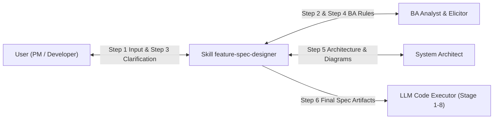

# Domain Handbook: `feature-spec-designer`

**Skill Target:** `feature-spec-designer`  
**Pipeline Stage:** Stage 0.5 (Knowledge Mining Specialist)  
**Upstream Artifact:** [business-analysis.md](file:///home/stveve/Documents/workspace/Steve/build-workflow/deep_work_by_steve/.skill-context/feature-spec-designer/business-analysis.md) (Stage -1)  
**Project Standards:** [standards.md](file:///home/stveve/Documents/workspace/Steve/build-workflow/deep_work_by_steve/standards.md)  
**Status:** `COMPLETED`  
**Confidence Score:** 96%  

---

```yaml
---
domain_handbook:
  target_skill: "feature-spec-designer"
  version: "1.0.0"
  stage: "0.5"
  author: "knowledge-miner-agent"
  upstream_sources:
    - path: ".skill-context/feature-spec-designer/business-analysis.md"
      type: "BA Synthesis Report"
      confidence: 0.96
    - path: "standards.md"
      type: "LLM Knowledge Activation Documentation Standard"
      confidence: 1.00
  quality_audit:
    discipline_score: 1.00
    honesty_score: 1.00
    creativity_score: 0.95
    overall_confidence: 96
---
```

---

## 1. Domain Overview

### 1.1 Purpose & Domain Scope
Domain `feature-spec-designer` tập trung vào việc tự động hóa và chuẩn hóa quy trình chuyển đổi ý tưởng/yêu cầu thô tính năng thành tài liệu **Feature Specification** (Feature Spec) hoàn chỉnh, trực quan và chính xác cho hệ thống phần mềm [business-analysis.md:L18-27](file:///home/stveve/Documents/workspace/Steve/build-workflow/deep_work_by_steve/.skill-context/feature-spec-designer/business-analysis.md#L18-L27). Domain này thu hẹp khoảng cách giữa yêu cầu mơ hồ từ người dùng (User/PM) với tài liệu kỹ thuật chi tiết mà Lập trình viên (Developer), Kiến trúc sư (Architect) và Mô hình Ngôn ngữ (LLM Executor) có thể thực thi mà không gây hiểu nhầm [business-analysis.md:L74-78](file:///home/stveve/Documents/workspace/Steve/build-workflow/deep_work_by_steve/.skill-context/feature-spec-designer/business-analysis.md#L74-L78).

### 1.2 Core Mission
Nhiệm vụ cốt lõi của skill `feature-spec-designer` là thực thi quy trình thiết kế gồm **6 bước chặt chẽ (6-Step Structured Workflow)** từ Input Analysis đến Final Spec Synthesis, đảm bảo:
1. Phân định ranh giới rõ ràng giữa **User Requirements** (ý đồ từ người dùng) và **Provided Context** (ràng buộc & tài sản có sẵn) [business-analysis.md:L47-70](file:///home/stveve/Documents/workspace/Steve/build-workflow/deep_work_by_steve/.skill-context/feature-spec-designer/business-analysis.md#L47-L70).
2. Tự động hóa việc tương tác làm rõ (Interactive Clarification) kèm câu hỏi và lựa chọn gợi ý tại Step 3 khi phát hiện mơ hồ [business-analysis.md:L52-53](file:///home/stveve/Documents/workspace/Steve/build-workflow/deep_work_by_steve/.skill-context/feature-spec-designer/business-analysis.md#L52-L53).
3. Đảm bảo tính cô lập lưu trữ (Storage Isolation): Toàn bộ tài liệu spec chính nằm tại `Docs/Specs/{feature-name}/` và toàn bộ sơ đồ Mermaid được cô lập trong thư mục con `Docs/Specs/{feature-name}/diagrams/` [business-analysis.md:L57-58](file:///home/stveve/Documents/workspace/Steve/build-workflow/deep_work_by_steve/.skill-context/feature-spec-designer/business-analysis.md#L57-L58).
4. Áp dụng quy tắc kiểm định nghiêm ngặt: **Validation Gate duy nhất đặt ở CUỐI MỖI STEP** (End-of-step Validation) để đảm bảo chất lượng lũy tiến [business-analysis.md:L63](file:///home/stveve/Documents/workspace/Steve/build-workflow/deep_work_by_steve/.skill-context/feature-spec-designer/business-analysis.md#L63).
5. Tuân thủ 100% định dạng tài liệu AI-first theo chuẩn [standards.md:L67-116](file:///home/stveve/Documents/workspace/Steve/build-workflow/deep_work_by_steve/standards.md#L67-L116).

---

## 2. Core Concepts and Vocabulary (Glossary)

Bảng thuật ngữ chuyên ngành dưới đây định nghĩa 10 thuật ngữ cốt lõi bắt buộc đối với Feature Spec Design, nêu rõ định nghĩa, ngữ cảnh áp dụng và ràng buộc kỹ thuật.

| STT | Thuật ngữ (Term) | Định nghĩa (Definition) | Ngữ cảnh Áp dụng (Application Context) | Ràng buộc Kỹ thuật (Constraints) | Nguồn Trích dẫn (Citation) |
|---|---|---|---|---|---|
| 1 | **Feature Spec** | Tài liệu thiết kế chi tiết mô tả đầy đủ chức năng, kiến trúc, luồng dữ liệu, NFRs và tiêu chí chấp nhận (Acceptance Criteria) cho một tính năng cụ thể. | Làm đầu vào cho giai đoạn xây dựng mã nguồn (Implementation Stage) và kiểm thử (Testing Stage). | Phải nằm duy nhất tại `Docs/Specs/{feature-name}/spec.md`. Không tạo file spec rải rác ngoài thư mục quy định. | [business-analysis.md:L18-27](file:///home/stveve/Documents/workspace/Steve/build-workflow/deep_work_by_steve/.skill-context/feature-spec-designer/business-analysis.md#L18-L27) |
| 2 | **User Requirements vs Provided Context** | Sự phân tách triệt để giữa nhu cầu thô do người dùng cung cấp (User Requirements) và các bối cảnh/ràng buộc kỹ thuật có sẵn trong hệ thống (Provided Context). | Thực hiện tại Step 2 (Information Categorization & Normalization). | User Requirements phải được chuyển thành FRs/NFRs có thể đo lường. Provided Context là định ước không sửa đổi. | [business-analysis.md:L47-70](file:///home/stveve/Documents/workspace/Steve/build-workflow/deep_work_by_steve/.skill-context/feature-spec-designer/business-analysis.md#L47-L70) |
| 3 | **Interactive Clarification** | Cơ chế tự động phát hiện thông tin thiếu/mơ hồ và chủ động đưa ra 3-5 câu hỏi trắc nghiệm kèm options gợi ý để người dùng chốt phương án. | Kích hoạt tại Step 3 khi nhận thấy yêu cầu chứa từ mơ hồ hoặc thiếu metric. | Mỗi câu hỏi bắt buộc đi kèm tối thiểu 2 options gợi ý cụ thể. Latency sinh câu hỏi p95 < 1500ms. | [business-analysis.md:L52-53](file:///home/stveve/Documents/workspace/Steve/build-workflow/deep_work_by_steve/.skill-context/feature-spec-designer/business-analysis.md#L52-L53) |
| 4 | **Storage Isolation** | Nguyên tắc quản lý thư mục độc lập, cô lập toàn bộ artifact của một tính năng trong không gian tên duy nhất. | Quản lý file hệ thống khi sinh spec và sơ đồ. | Root folder bắt buộc: `Docs/Specs/{feature-name}/`. Tỷ lệ ghi ngoài đường dẫn = 0%. | [business-analysis.md:L57-58](file:///home/stveve/Documents/workspace/Steve/build-workflow/deep_work_by_steve/.skill-context/feature-spec-designer/business-analysis.md#L57-L58) |
| 5 | **Validation Timing / End-of-step Validation** | Quy định thực thi cổng kiểm định chất lượng (Validation Gate) duy nhất tại thời điểm hoàn tất một step trước khi chuyển giao step tiếp theo. | Áp dụng ở cuối tất cả 6 steps trong quy trình thiết kế spec. | Nghiêm cấm chạy validation ở đầu step (0% Starter Validation Burden). Phải đạt Quality Score ≥ 80% mới cho chuyển step. | [business-analysis.md:L63](file:///home/stveve/Documents/workspace/Steve/build-workflow/deep_work_by_steve/.skill-context/feature-spec-designer/business-analysis.md#L63) |
| 6 | **Mermaid Diagram Isolation** | Quy tắc phân tách vật lý giữa tài liệu văn bản markdown và sơ đồ biểu đồ kiến trúc Mermaid. | Thực hiện tại Step 5 (Architecture & Design Analysis). | Mọi file sơ đồ chi tiết phải lưu riêng tại `Docs/Specs/{feature-name}/diagrams/`. Nhãn Node bắt buộc bọc ngoặc kép `""`. | [business-analysis.md:L57-58](file:///home/stveve/Documents/workspace/Steve/build-workflow/deep_work_by_steve/.skill-context/feature-spec-designer/business-analysis.md#L57-L58) |
| 7 | **Gherkin Scenarios** | Định dạng mô tả tiêu chí chấp nhận (Acceptance Criteria) dưới dạng ngôn ngữ BDD (Given-When-Then) có thể kiểm thử tự động. | Thực hiện ở Step 4 & Step 6 để định nghĩa tiêu chí hoàn tất (Definition of Done). | Phủ đủ 4 kịch bản: Happy Path, Must-Have, Nice-To-Have, và Exception Paths. | [business-analysis.md:L298-336](file:///home/stveve/Documents/workspace/Steve/build-workflow/deep_work_by_steve/.skill-context/feature-spec-designer/business-analysis.md#L298-L336) |
| 8 | **Self-Correction Mechanism** | Vòng lặp tự chẩn đoán và sửa lỗi nội bộ khi phát hiện một kết quả kiểm định ở cuối step bị nảy sinh lỗi (Validation FAIL). | Kích hoạt tự động khi Quality Gate ở cuối step không đạt ngưỡng PASS. | Tự điều chỉnh artifact trong nội bộ step đó và chạy lại validation mà không làm sập tiến trình chung. | [business-analysis.md:L164-170](file:///home/stveve/Documents/workspace/Steve/build-workflow/deep_work_by_steve/.skill-context/feature-spec-designer/business-analysis.md#L164-L170) |
| 9 | **Format Standards Compliance** | Bộ quy tắc tuân thủ nghiêm ngặt chuẩn trình bày markdown/YAML/XML cho LLM theo `standards.md`. | Áp dụng cho toàn bộ văn bản xuất ra của skill `feature-spec-designer`. | Sử dụng GitHub-style Alerts, Clickable Relative Links, Markdown Tables, 0% từ cấm (`TODO`, `TBD`, `...`). | [standards.md:L67-116](file:///home/stveve/Documents/workspace/Steve/build-workflow/deep_work_by_steve/standards.md#L67-L116) |
| 10 | **Semantic Anchoring** | Kỹ thuật cấu trúc hóa tri thức bằng từ khóa neo ngữ nghĩa (Semantic Anchors) giúp LLM kích hoạt đúng vùng tri thức. | Xây dựng prompt, prompt boundary và tài liệu hướng dẫn agent. | Dùng nhất quán các anchors như `<instructions>`, `<context>`, `must:`, `must_not:`, `priority_order:`. | [standards.md:L582-639](file:///home/stveve/Documents/workspace/Steve/build-workflow/deep_work_by_steve/standards.md#L582-L639) |

---

## 3. Functional Requirements (FR) — Distilled from BA

Dưới đây là 6 Yêu cầu Chức năng (Functional Requirements) cốt lõi được chắt lọc và lượng hóa từ báo cáo phân tích nghiệp vụ Stage -1 [business-analysis.md:L92-103](file:///home/stveve/Documents/workspace/Steve/build-workflow/deep_work_by_steve/.skill-context/feature-spec-designer/business-analysis.md#L92-L103).

### FR-1: Step 1 — Input Analysis & Enclosure
- **Mô tả**: Tiếp nhận câu lệnh/yêu cầu thô từ người dùng, thực hiện loại bỏ nhiễu (noise filtering), trích xuất từ khóa nghiệp vụ và đóng gói toàn bộ yêu cầu thô trong thẻ ngữ nghĩa `<user_skill_request>`.
- **Tiêu chí lượng hóa**:
  - Latency xử lý Step 1 p95 < 1000ms.
  - Tỷ lệ đóng gói chính xác thẻ XML = 100%.
  - Chạy validation gate ở cuối Step 1.
- **Nguồn trích dẫn**: [business-analysis.md:L50](file:///home/stveve/Documents/workspace/Steve/build-workflow/deep_work_by_steve/.skill-context/feature-spec-designer/business-analysis.md#L50), [business-analysis.md:L96](file:///home/stveve/Documents/workspace/Steve/build-workflow/deep_work_by_steve/.skill-context/feature-spec-designer/business-analysis.md#L96).

### FR-2: Step 2 — Information Categorization & Normalization
- **Mô tả**: Trích xuất và phân tách triệt để giữa **User Requirements** (yêu cầu nghiệp vụ người dùng muốn) và **Provided Context** (bối cảnh, tài sản, ràng buộc sẵn có). Xuất ra các văn bản markdown chuẩn hóa.
- **Tiêu chí lượng hóa**:
  - 100% các ý thô từ input được phân loại và gán nhãn loại yêu cầu.
  - Thời gian xử lý Step 2 p95 < 2000ms.
  - Chạy validation gate ở cuối Step 2.
- **Nguồn trích dẫn**: [business-analysis.md:L51](file:///home/stveve/Documents/workspace/Steve/build-workflow/deep_work_by_steve/.skill-context/feature-spec-designer/business-analysis.md#L51), [business-analysis.md:L97](file:///home/stveve/Documents/workspace/Steve/build-workflow/deep_work_by_steve/.skill-context/feature-spec-designer/business-analysis.md#L97).

### FR-3: Step 3 — Interactive Clarification
- **Mô tả**: Tự động rà soát điểm mơ hồ, mâu thuẫn hoặc thiếu chỉ số NFR. Tự động sinh danh sách 3-5 câu hỏi trắc nghiệm/gợi ý kèm các options cụ thể giúp người dùng bổ sung thông tin nhanh chóng.
- **Tiêu chí lượng hóa**:
  - 100% câu hỏi mơ hồ bắt buộc kèm tối thiểu 2-3 options gợi ý cụ thể.
  - Latency sinh câu hỏi p95 < 1500ms.
  - Chạy validation gate ở cuối Step 3 sau khi người dùng phản hồi.
- **Nguồn trích dẫn**: [business-analysis.md:L52-53](file:///home/stveve/Documents/workspace/Steve/build-workflow/deep_work_by_steve/.skill-context/feature-spec-designer/business-analysis.md#L52-L53), [business-analysis.md:L98](file:///home/stveve/Documents/workspace/Steve/build-workflow/deep_work_by_steve/.skill-context/feature-spec-designer/business-analysis.md#L98).

### FR-4: Step 4 — Business Analysis & Use Cases Breakdown
- **Mô tả**: Phân rã chi tiết 4 nhóm Use Cases (Basic Flow, Must-Have Flow, Nice-To-Have Flow, Exception Flow) và lượng hóa 100% chỉ số NFRs.
- **Tiêu chí lượng hóa**:
  - Phân rã đủ 4 nhóm use cases không bỏ sót nhóm nào.
  - Tỷ lệ xuất hiện từ ngữ mơ hồ (`nhanh`, `tốt`, `nhiều`) = 0%.
  - Chạy validation gate ở cuối Step 4.
- **Nguồn trích dẫn**: [business-analysis.md:L53](file:///home/stveve/Documents/workspace/Steve/build-workflow/deep_work_by_steve/.skill-context/feature-spec-designer/business-analysis.md#L53), [business-analysis.md:L99](file:///home/stveve/Documents/workspace/Steve/build-workflow/deep_work_by_steve/.skill-context/feature-spec-designer/business-analysis.md#L99).

### FR-5: Step 5 — Architecture & Design Analysis
- **Mô tả**: Chia làm 3 sub-steps:
  - **Sub-step 5.1**: Thiết kế use cases tổng quan & hệ thống.
  - **Sub-step 5.2**: Phân rã thành sub-modules & trực quan hóa luồng sub-module.
  - **Sub-step 5.3**: Xây dựng các sơ đồ Mermaid chi tiết (Sequence Diagram, Flowchart 3 nhánh, ERD Schema).
- **Tiêu chí lượng hóa**:
  - 100% sơ đồ Mermaid được lưu đúng thư mục cô lập `Docs/Specs/{feature-name}/diagrams/`.
  - 100% nhãn Node/Edge trong Mermaid bọc ngoặc kép `""` và không chứa thẻ HTML.
  - Chạy validation gate ở cuối Step 5.
- **Nguồn trích dẫn**: [business-analysis.md:L54-58](file:///home/stveve/Documents/workspace/Steve/build-workflow/deep_work_by_steve/.skill-context/feature-spec-designer/business-analysis.md#L54-L58), [business-analysis.md:L100](file:///home/stveve/Documents/workspace/Steve/build-workflow/deep_work_by_steve/.skill-context/feature-spec-designer/business-analysis.md#L100).

### FR-6: Step 6 — Final Spec Synthesis & Quality Evaluation
- **Mô tả**: Tổng hợp toàn bộ kết quả thành file Final Feature Spec duy nhất tại `Docs/Specs/{feature-name}/spec.md`. Áp dụng bộ tiêu chí đánh giá chất lượng từ `standards.md` và chấm điểm Quality Score.
- **Tiêu chí lượng hóa**:
  - Quality Score ≥ 80% (Ngưỡng PASS).
  - 100% các tiêu chuẩn định dạng từ `standards.md` được thỏa mãn.
  - Chạy validation gate ở cuối Step 6.
- **Nguồn trích dẫn**: [business-analysis.md:L59-62](file:///home/stveve/Documents/workspace/Steve/build-workflow/deep_work_by_steve/.skill-context/feature-spec-designer/business-analysis.md#L59-L62), [business-analysis.md:L101](file:///home/stveve/Documents/workspace/Steve/build-workflow/deep_work_by_steve/.skill-context/feature-spec-designer/business-analysis.md#L101).

---

## 4. Non-Functional Requirements (NFR)

Dưới đây là các Yêu cầu Phi Chức năng được lượng hóa nghiêm ngặt từ BA report [business-analysis.md:L105-118](file:///home/stveve/Documents/workspace/Steve/build-workflow/deep_work_by_steve/.skill-context/feature-spec-designer/business-analysis.md#L105-L118):

1. **NFR-1 (Latency & Performance)**:
   - Thời gian xử lý tự động của mỗi step (trừ thời gian người dùng suy nghĩ phản hồi tại Step 3): Latency p95 < 3000ms; Latency p99 < 5000ms [business-analysis.md:L107-108](file:///home/stveve/Documents/workspace/Steve/build-workflow/deep_work_by_steve/.skill-context/feature-spec-designer/business-analysis.md#L107-L108).
2. **NFR-2 (Spec Format Compliance)**:
   - 100% tài liệu Spec tuân thủ chuẩn `standards.md` (Sử dụng GitHub-style Alerts, Code blocks có ngôn ngữ rõ ràng, Bảng dữ liệu Markdown, Clickable Relative File Links, 0% từ cấm forbidden placeholders như `TODO`, `TBD`, `...`) [business-analysis.md:L109-110](file:///home/stveve/Documents/workspace/Steve/build-workflow/deep_work_by_steve/.skill-context/feature-spec-designer/business-analysis.md#L109-L110), [standards.md:L67-116](file:///home/stveve/Documents/workspace/Steve/build-workflow/deep_work_by_steve/standards.md#L67-L116).
3. **NFR-3 (Storage Isolation & Routing)**:
   - 100% tài liệu văn bản Spec được lưu duy nhất tại `Docs/Specs/{feature-name}/`.
   - 100% sơ đồ Mermaid được lưu duy nhất tại `Docs/Specs/{feature-name}/diagrams/`. Tỷ lệ ghi file ngoài đường dẫn quy định = 0% [business-analysis.md:L111-113](file:///home/stveve/Documents/workspace/Steve/build-workflow/deep_work_by_steve/.skill-context/feature-spec-designer/business-analysis.md#L111-L113).
4. **NFR-4 (Validation Enforcement Timing)**:
   - 100% kiểm tra/đánh giá chất lượng thực thi ở CUỐI MỖI STEP (End-of-step validation). Tỷ lệ thực thi kiểm tra ở đầu step = 0% [business-analysis.md:L63](file:///home/stveve/Documents/workspace/Steve/build-workflow/deep_work_by_steve/.skill-context/feature-spec-designer/business-analysis.md#L63), [business-analysis.md:L114-115](file:///home/stveve/Documents/workspace/Steve/build-workflow/deep_work_by_steve/.skill-context/feature-spec-designer/business-analysis.md#L114-L115).
5. **NFR-5 (Reliability & Error Budget)**:
   - Tỷ lệ xử lý thành công không bị treo luồng (Completion Success Rate) ≥ 99.9%. Tỷ lệ lỗi cú pháp sơ đồ Mermaid = 0% [business-analysis.md:L116-117](file:///home/stveve/Documents/workspace/Steve/build-workflow/deep_work_by_steve/.skill-context/feature-spec-designer/business-analysis.md#L116-L117).

---

## 5. Existing Code Patterns and Reusable Assets

### 5.1 Reusable Assets in Workspace
Dự án đã trang bị sẵn các tài sản và quy tắc có thể tái sử dụng:
- **Shared Validation Schemas & Rules**: `.agents/skills/_shared/rules/quality-gates.md` và `.agents/skills/_shared/schemas/` định nghĩa tiêu chuẩn quality score.
- **Mermaid Knowledge Base**: `.agents/skills/mermaid-diagrams` cung cấp mẫu cú pháp và quy tắc vẽ Mermaid chuẩn [business-analysis.md:L68](file:///home/stveve/Documents/workspace/Steve/build-workflow/deep_work_by_steve/.skill-context/feature-spec-designer/business-analysis.md#L68).
- **Format Standards**: `/home/stveve/Documents/workspace/Steve/build-workflow/deep_work_by_steve/standards.md` đóng vai trò là "bản hiến pháp" định dạng tài liệu AI-first.

### 5.2 Keyword Triggers & Exemplars

#### A. Trigger Keywords (Từ khóa kích hoạt Skill)
Skill `feature-spec-designer` được kích hoạt khi nhận thấy các từ khóa hoặc câu lệnh người dùng dạng:
- `design feature spec`, `tạo spec tính năng`, `feature spec designer`
- `thiết kế spec cho tính năng {name}`
- `6-step spec design`, `báo cáo thiết kế tính năng`
- `clarify requirements spec`, `chuẩn hóa spec tính năng`

#### B. Standard Exemplars (Mẫu Chuẩn)

1. **Cấu trúc lưu trữ chuẩn (Storage Isolation Pattern)**:
   ```text
   Docs/Specs/user-authentication/
   ├── spec.md                   # Final Spec duy nhất
   ├── normalizations.md         # Artifact từ Step 2
   ├── clarification-log.md      # Artifact từ Step 3
   └── diagrams/                 # Thư mục cô lập Mermaid
       ├── sequence.mmd
       ├── flowchart.mmd
       └── erd.mmd
   ```

2. **Cú pháp Mermaid Node chuẩn (Double Quote Wrapper Pattern)**:
   ```mermaid
   flowchart TD
       Node1["Bắt đầu: Nhận yêu cầu thô"] --> Node2["Step 1: Input Analysis & XML Enclosure"]
       Node2 --> CheckNode{"Validation Gate ở CUỐI STEP 1?"}
   ```

3. **Mẫu câu hỏi tương tác Clarification tại Step 3 (Options Pattern)**:
   ```markdown
   > [!IMPORTANT]
   > **Phát hiện thông tin chưa rõ tại Step 3:**
   > Yêu cầu thô ghi: "Hệ thống phải phản hồi nhanh". Vui lòng chọn định mức Latency p95 mong muốn:
   > - **Option A (Khuyến nghị)**: Latency p95 < 500ms (Phù hợp hệ thống Web/Mobile trực tuyến).
   > - **Option B**: Latency p95 < 1000ms (Phù hợp hệ thống xử lý tác vụ nặng).
   > - **Option C**: Nhập con số tùy chỉnh của bạn.
   ```

4. **Khối Validation Gate ở CUỐI STEP (End-of-step Gate Pattern)**:
   ```yaml
   step_validation_gate:
     step_number: 5
     step_name: "Architecture Analysis"
     timing: "END_OF_STEP"
     checks:
       mermaid_storage_valid: true    # Đã kiểm tra lưu tại Docs/Specs/{feature-name}/diagrams/
       mermaid_quotes_valid: true     # Đã bọc double quotes toàn bộ nhãn node
     score: 1.00
     status: "PASS"
   ```

#### C. Anti-Patterns Cần Tránh (Các Lỗi Nghiêm Cấm)

| Anti-Pattern | Mô tả Hành vi Sai | Tác hại & Rủi ro | Giải pháp Khắc phục |
|---|---|---|---|
| **Arbitrary Spec Writing** | Viết spec tùy tiện không tuân theo quy trình 6 bước chuẩn hóa. | Bỏ sót Use Cases, thiếu chỉ số NFRs, spec thiếu tính nhất quán. | Ép buộc thực thi đầy đủ lần lượt 6 bước từ Step 1 đến Step 6 [business-analysis.md:L81](file:///home/stveve/Documents/workspace/Steve/build-workflow/deep_work_by_steve/.skill-context/feature-spec-designer/business-analysis.md#L81). |
| **Wrong Storage Path** | Lưu file sơ đồ Mermaid hoặc spec ngoài đường dẫn `Docs/Specs/{feature-name}/`. | Vi phạm R-02 (Storage Isolation), gây thất lạc tài liệu. | Hardcode constraint kiểm tra và tự nắn chỉnh đường dẫn về `Docs/Specs/{feature-name}/` [business-analysis.md:L156-162](file:///home/stveve/Documents/workspace/Steve/build-workflow/deep_work_by_steve/.skill-context/feature-spec-designer/business-analysis.md#L156-L162). |
| **Starter Validation Burden** | Chạy các bước kiểm tra/validation ở ĐẦU step. | Vi phạm NFR-4 & R-04, gây nghẽn khởi đầu step và gánh nặng không cần thiết. | Quy định duy nhất thực thi validation ở CUỐI MỖI STEP [business-analysis.md:L63](file:///home/stveve/Documents/workspace/Steve/build-workflow/deep_work_by_steve/.skill-context/feature-spec-designer/business-analysis.md#L63). |
| **Forbidden Placeholders** | Sử dụng các từ ngữ mơ hồ hoặc giữ chỗ như `TODO`, `TBD`, `...`, `tốt`, `nhanh`. | Tài liệu kém chất lượng, không đủ tiêu chuẩn cho LLM/Dev thực thi. | Lượng hóa 100% chỉ số NFR và dùng Self-Correction sửa lỗi [business-analysis.md:L99](file:///home/stveve/Documents/workspace/Steve/build-workflow/deep_work_by_steve/.skill-context/feature-spec-designer/business-analysis.md#L99). |
| **Unquoted Mermaid Labels** | Không bọc nhãn sơ đồ Mermaid trong dấu ngoặc kép `""` hoặc chứa thẻ HTML. | Vi phạm R-03, gây lỗi render parser trên GitHub/VS Code. | Ép quy tắc regex bọc `""` cho mọi label node/edge trong sơ đồ [standards.md:L106-108](file:///home/stveve/Documents/workspace/Steve/build-workflow/deep_work_by_steve/standards.md#L106-L108). |

---

## 6. Established Conventions and Standards

### 6.1 Standards Compliance (theo `standards.md`)
1. **Clickable File Links**:
   - Ưu tiên đường dẫn tương đối hoặc từ repo root. Định dạng dòng: `[filename.md:L12-34](file:///path/to/file#L12-L34)` [standards.md:L69-76](file:///home/stveve/Documents/workspace/Steve/build-workflow/deep_work_by_steve/standards.md#L69-L76).
   - Nghiêm cấm bọc text của link trong backticks (Ví dụ: `[spec.md](...)` là ĐÚNG, `[`spec.md`](...)` là SAI) [standards.md:L76](file:///home/stveve/Documents/workspace/Steve/build-workflow/deep_work_by_steve/standards.md#L76).
2. **GitHub-style Alerts**:
   - Phân cấp thông tin bằng 5 khối mặc định: `> [!NOTE]`, `> [!TIP]`, `> [!IMPORTANT]`, `> [!WARNING]`, `> [!CAUTION]` [standards.md:L79-90](file:///home/stveve/Documents/workspace/Steve/build-workflow/deep_work_by_steve/standards.md#L79-L90).
3. **Structured YAML for Constraints**:
   - Sử dụng khóa chuẩn `must`, `must_not`, `should`, `priority_order`, `output_contract` [standards.md:L123-137](file:///home/stveve/Documents/workspace/Steve/build-workflow/deep_work_by_steve/standards.md#L123-L137).
4. **Semantic XML Boundaries**:
   - Phân ranh giới prompt bằng các thẻ `<instructions>`, `<context>`, `<input>`, `<output_contract>` [standards.md:L143-154](file:///home/stveve/Documents/workspace/Steve/build-workflow/deep_work_by_steve/standards.md#L143-L154).

### 6.2 Quality Gate Scoring Formula
Điểm Quality Gate được tính bằng trung bình có trọng số của 7 thành phần từ BA Quality Matrix [business-analysis.md:L342-353](file:///home/stveve/Documents/workspace/Steve/build-workflow/deep_work_by_steve/.skill-context/feature-spec-designer/business-analysis.md#L342-L353):
$$\text{Quality Score} = \sum_{i=1}^{7} (w_i \times s_i) \ge 0.80 \quad (\text{PASS})$$

---

## 7. Architectural Constraints

```yaml
---
architectural_constraints:
  target_skill: "feature-spec-designer"
  execution_scope:
    allowed_write_paths:
      - ".skill-context/feature-spec-designer/domain-handbook.md"  # Staging write for Stage 0.5
      - "Docs/Specs/{feature-name}/"                                # Dynamic spec output path
      - "Docs/Specs/{feature-name}/diagrams/"                       # Mermaid isolated output path
    forbidden_write_paths:
      - ".agents/skills/"                                           # Read-only for Stage 0.5
      - "raw/ver-3/"                                                # Forbidden legacy paths
      - "src/"                                                      # Out of scope code implementation
  
  core_rules:
    must:
      - "Enforce strict 6-step workflow from Step 1 to Step 6"
      - "Execute Validation Gate ONLY at the END OF EACH STEP (End-of-step validation)"
      - "Isolate all Mermaid diagrams under Docs/Specs/{feature-name}/diagrams/"
      - "Provide default recommended options at Step 3 interactive clarification"
      - "Trigger Self-Correction mechanism upon validation failure at end of step"
      - "Ensure 100% compliance with standards.md formatting rules"
    must_not:
      - "Generate application production source code (JS, C#, Python, Go)"
      - "Perform automated Git commits, pushes, or branch merges"
      - "Execute validation checks at the beginning of a step"
      - "Use forbidden placeholders like TODO, TBD, or unquantified vague metrics"
      - "Write spec files outside Docs/Specs/{feature-name}/"
---
```

---

## 8. Cross-References and Citation Map

Ma trận ánh xạ dưới đây trích dẫn nguồn gốc của từng khái niệm, yêu cầu và quy định về đúng file và dòng tương ứng:

| Mã Thành phần | Mô tả Yêu cầu / Khái niệm | File Nguồn (Absolute Path) | Vùng Dòng (Line Range) | Ghi chú Trích dẫn |
|---|---|---|---|---|
| **FR-1** | Step 1 Input Analysis & `<user_skill_request>` XML Tag | [business-analysis.md](file:///home/stveve/Documents/workspace/Steve/build-workflow/deep_work_by_steve/.skill-context/feature-spec-designer/business-analysis.md#L50) | L50, L96 | Trích từ BA report section 1.A & 3 |
| **FR-2** | Step 2 Requirements vs Context Normalization | [business-analysis.md](file:///home/stveve/Documents/workspace/Steve/build-workflow/deep_work_by_steve/.skill-context/feature-spec-designer/business-analysis.md#L51) | L51, L97 | Trích từ BA report section 1.A & 3 |
| **FR-3** | Step 3 Interactive Clarification & Options | [business-analysis.md](file:///home/stveve/Documents/workspace/Steve/build-workflow/deep_work_by_steve/.skill-context/feature-spec-designer/business-analysis.md#L52-L53) | L52-L53, L98 | Trích từ BA report section 1.A & 3 |
| **FR-4** | Step 4 BA Breakdown & Quantified NFRs | [business-analysis.md](file:///home/stveve/Documents/workspace/Steve/build-workflow/deep_work_by_steve/.skill-context/feature-spec-designer/business-analysis.md#L53) | L53, L99 | Trích từ BA report section 1.A & 3 |
| **FR-5** | Step 5 Architecture & Mermaid Storage Isolation | [business-analysis.md](file:///home/stveve/Documents/workspace/Steve/build-workflow/deep_work_by_steve/.skill-context/feature-spec-designer/business-analysis.md#L54-L58) | L54-L58, L100 | Trích từ BA report section 1.A & 3 |
| **FR-6** | Step 6 Synthesis & `standards.md` Evaluation | [business-analysis.md](file:///home/stveve/Documents/workspace/Steve/build-workflow/deep_work_by_steve/.skill-context/feature-spec-designer/business-analysis.md#L59-L62) | L59-L62, L101 | Trích từ BA report section 1.A & 3 |
| **NFR-1** | Latency p95 < 3000ms, p99 < 5000ms | [business-analysis.md](file:///home/stveve/Documents/workspace/Steve/build-workflow/deep_work_by_steve/.skill-context/feature-spec-designer/business-analysis.md#L107-L108) | L107-L108 | Trích từ BA report section 4 |
| **NFR-2** | Format Standards Compliance | [standards.md](file:///home/stveve/Documents/workspace/Steve/build-workflow/deep_work_by_steve/standards.md#L67-L116) | L67-L116 | Trích từ project standard doc |
| **NFR-3** | Storage Isolation (`Docs/Specs/{feature-name}/`) | [business-analysis.md](file:///home/stveve/Documents/workspace/Steve/build-workflow/deep_work_by_steve/.skill-context/feature-spec-designer/business-analysis.md#L111-L113) | L111-L113 | Trích từ BA report section 4 |
| **NFR-4** | End-of-step Validation Timing | [business-analysis.md](file:///home/stveve/Documents/workspace/Steve/build-workflow/deep_work_by_steve/.skill-context/feature-spec-designer/business-analysis.md#L63) | L63, L114-L115 | Trích từ BA report section 1.A & 4 |
| **UC-01** | Basic Flow (Happy Path) | [business-analysis.md](file:///home/stveve/Documents/workspace/Steve/build-workflow/deep_work_by_steve/.skill-context/feature-spec-designer/business-analysis.md#L123-L135) | L123-L135 | Trích từ BA report section 5 |
| **UC-04** | Storage Path Correction Exception | [business-analysis.md](file:///home/stveve/Documents/workspace/Steve/build-workflow/deep_work_by_steve/.skill-context/feature-spec-designer/business-analysis.md#L156-L162) | L156-L162 | Trích từ BA report section 5 |
| **UC-05** | Validation Failure & Self-Correction | [business-analysis.md](file:///home/stveve/Documents/workspace/Steve/build-workflow/deep_work_by_steve/.skill-context/feature-spec-designer/business-analysis.md#L164-L170) | L164-L170 | Trích từ BA report section 5 |
| **R-01..04** | Risk Matrix & Mitigations | [business-analysis.md](file:///home/stveve/Documents/workspace/Steve/build-workflow/deep_work_by_steve/.skill-context/feature-spec-designer/business-analysis.md#L181-L187) | L181-L187 | Trích từ BA report section 6.B |

---

## 9. Thought Blocks: Semantic Anchoring & Cognitive Depth

> [!NOTE]
> Phân tích chuyên sâu dưới đây áp dụng nguyên lý **Semantic Anchoring & Cognitive Depth** nhằm giải mã bản chất kiến trúc, đối tượng tương tác và chiến lược xử lý ngoại lệ cho skill `feature-spec-designer`.

### 9.1 WHY: Tại sao quy trình thiết kế Spec phải gồm 6 bước chặt chẽ và Validation Gate bắt buộc đặt ở CUỐI MỖI STEP?

Khác với các công việc lập trình đơn lẻ nơi một agent có thể tạo code ngay lập tức, việc thiết kế một **Feature Specification** cho một hệ thống phần mềm đòi hỏi sự tích lũy tri thức lũy tiến (progressive knowledge accumulation). Nếu cho phép LLM nhảy thẳng vào tạo tài liệu Spec từ yêu cầu thô của người dùng mà không qua phân rã, kết quả thu được luôn bị vướng phải 3 căn bệnh kinh điển của AI generation: (1) suy đoán vô căn cứ (hallucination), (2) bỏ sót kịch bản ngoại lệ (missing edge cases), và (3) thiết kế kiến trúc phẳng không thể mở rộng.

Quy trình **6 bước chặt chẽ (6-Step Structured Workflow)** được thiết kế dựa trên lý thuyết phân rã nhận thức (Cognitive Decomposition):
- **Step 1 (Input Analysis)** cô lập nhiễu và định vị phạm vi đầu vào trong khung ngữ nghĩa `<user_skill_request>`.
- **Step 2 (Normalization)** tách bạch khách quan giữa nhu cầu chủ quan (User Requirements) và bối cảnh kỹ thuật hiện hữu (Provided Context), ngăn chặn việc người dùng yêu cầu đập bỏ bối cảnh có sẵn một cách cảm tính.
- **Step 3 (Interactive Clarification)** đóng vai trò là "màng lọc độ mơ hồ". Việc tự động phát hiện các chỉ số thiếu sót và đặt 3-5 câu hỏi trắc nghiệm kèm gợi ý options giúp chuyển hóa 100% các khái niệm mơ hồ (`nhanh`, `tốt`) thành metric kỹ thuật đo lường được (`Latency p95 < 500ms`).
- **Step 4 (BA & Use Cases)** xây dựng bộ khung logic chuẩn gồm 4 luồng use cases (Basic, Must-have, Nice-to-have, Exception) và 100% NFRs lượng hóa.
- **Step 5 (Architecture Analysis)** chuyển hóa logic nghiệp vụ thành trực quan kiến trúc thông qua các sub-steps 5.1 (Top-level), 5.2 (Sub-modules), và 5.3 (Detailed Mermaid). Việc lưu trữ sơ đồ Mermaid tại thư mục cô lập `Docs/Specs/{feature-name}/diagrams/` giải quyết triệt để rủi ro làm rối rắm tài liệu spec chính.
- **Step 6 (Final Synthesis & Evaluation)** đóng vai trò hợp nhất và chấm điểm chất lượng tự động theo tiêu chuẩn `standards.md`.

**Tại sao Validation Gate duy nhất đặt ở CUỐI MỖI STEP (End-of-step Validation)?**
Việc đặt validation ở đầu mỗi step (Starter Validation Burden) tạo ra một "gánh nặng khởi nguồn" bất hợp lý: agent phải kiểm tra dữ liệu chưa tồn tại hoặc phải chạy lặp lại các kiểm tra của step trước, gây lãng phí token budget và làm tăng độ trễ khởi tạo. Ngược lại, khi đặt Validation Gate ở **CUỐI MỖI STEP**:
1. Đảm bảo nguyên tắc **Artifact Verification**: Chỉ kiểm tra những sản phẩm thực sự được sinh ra trong step đó.
2. Thiết lập ranh giới **Progressive Quality Control**: Step sau chỉ được kích hoạt khi step trước đã đạt điểm PASS (Quality Score ≥ 80%). Nếu kết quả FAIL, luồng **Self-Correction** được kích hoạt ngay trong nội bộ step đó để tự khắc phục trước khi lỗi bị nhân bản sang các step sau.

---

### 9.2 WHO: Đối tượng thụ hưởng và Tương tác (Stakeholder & Actor Matrix)

Quy trình thiết kế Feature Spec phục vụ và tương tác với 4 đối tượng cốt lõi:



1. **User (Lập trình viên / Product Manager)**:
   - *Vai trò*: Người khởi xướng yêu cầu thô tại Step 1 và người ra quyết định tại Step 3.
   - *Lợi ích*: Phản hồi nhanh chóng thông qua các options gợi ý sẵn mà không cần tự nghĩ câu trả lời phức tạp; nhận được tài liệu spec chuẩn hóa 100% không bị sót requirements.
2. **Business Analyst (BA Analyst & Synthesizer)**:
   - *Vai trò*: Đối chiếu tính nhất quán giữa Yêu cầu Người dùng và Bối cảnh Hệ thống.
   - *Lợi ích*: Tự động hóa công đoạn phân rã Use Cases và NFRs; loại bỏ tranh cãi nghiệp vụ nhờ bộ câu hỏi trắc nghiệm lượng hóa ở Step 3.
3. **Kiến trúc sư (System Architect)**:
   - *Vai trò*: Thụ hưởng và đánh giá sơ đồ kiến trúc Mermaid được sinh ra tại Step 5.
   - *Lợi ích*: Nhận được bộ sơ đồ cô lập sạch sẽ tại `Docs/Specs/{feature-name}/diagrams/` với 100% nhãn Node bọc ngoặc kép `""`, sẵn sàng nhúng vào hệ thống tài liệu kiến trúc tổng thể.
4. **Mô hình Thực thi Mã nguồn (LLM Code Executor / Stage 1-8 Agents)**:
   - *Vai trò*: Đọc tài liệu Final Spec xuất ra từ Step 6 để triển khai code.
   - *Lợi ích*: Tiêu thụ tài liệu spec tuân thủ 100% chuẩn AI-first (`standards.md`), không bị mơ hồ bởi từ cấm (`TODO`, `TBD`), có đường dẫn file click được và kịch bản BDD Gherkin chính xác để tự động tạo unit tests.

---

### 9.3 WHAT-IF: Xử lý các Kịch bản Ngoại lệ & Chiến lược Phòng thủ (Exception Handling Scenarios)

#### Scenario A: Người dùng không phản hồi hoặc rời bỏ tương tác tại Step 3 (User Unresponsiveness)
- **Rủi ro (R-01)**: Tiến trình thiết kế Spec bị tắc nghẽn vô thời hạn tại Step 3 Interactive Clarification.
- **Xử lý Ngoại lệ**:
  1. Skill sinh ra danh sách câu hỏi tại Step 3 **luôn gắn kèm 1 Option Mặc định (Default Recommended Option)** được gán mác `[Khuyến nghị]`.
  2. Cài đặt cơ chế Timeout / Fallback Trigger: Nếu sau khoảng thời gian quy định hoặc người dùng chọn "Áp dụng tùy chọn khuyến nghị", hệ thống tự động chốt Option Mặc định.
  3. Ghi vết (Traceability): Lưu trạng thái chốt mặc định vào `clarification-log.md` kèm cảnh báo `> [!NOTE]` để người dùng có thể điều chỉnh lại ở giai đoạn review Final Spec.

#### Scenario B: Biểu đồ Mermaid bị lỗi cú pháp render tại Sub-step 5.3 (Syntax Error Exception)
- **Rủi ro (R-03)**: Sơ đồ chứa dấu ngoặc đơn, ký tự đặc biệt hoặc thẻ HTML trong label khiến Mermaid parser bị sập.
- **Xử lý Ngoại lệ**:
  1. Khi Validation Gate ở cuối Step 5 thực thi kiểm tra cú pháp sơ đồ Mermaid và trả về trạng thái `FAIL`.
  2. Kích hoạt luồng **Self-Correction Mechanism** nội bộ Step 5:
     - Tự động chạy bộ lọc Regex rà soát toàn bộ nhãn node/edge.
     - Thực hiện bọc ngoặc kép `""` bắt buộc cho tất cả các nhãn và loại bỏ hoàn toàn các thẻ HTML bên trong.
  3. Thực thi lại Validation Gate ở cuối Step 5. Khi điểm đánh giá đạt `PASS` (≥ 80%), cho phép chuyển sang Step 6.

#### Scenario C: Cố tình hoặc vô ý ghi file spec ngoài đường dẫn quy định (Storage Path Violation)
- **Rủi ro (R-02)**: Tiến trình ghi file cố gắng xuất artifact ra `Docs/spec.md` hoặc `src/diagrams/` thay vì `Docs/Specs/{feature-name}/`.
- **Xử lý Ngoại lệ**:
  1. Bộ lọc **Storage Isolation Rule** chặn đứng thao tác I/O bất hợp lệ.
  2. Tự động áp dụng Heuristic Path Correction:
     - Nếu là file sơ đồ (`.mmd` hoặc code block mermaid): Nắn chỉnh đường dẫn ghi về `Docs/Specs/{feature-name}/diagrams/{filename}`.
     - Nếu là file tài liệu spec văn bản: Nắn chỉnh đường dẫn ghi về `Docs/Specs/{feature-name}/{filename}`.
  3. Ghi thông báo nắn chỉnh đường dẫn vào nhật ký kiểm định (Validation Report) ở cuối step tương ứng để đảm bảo tính minh bạch.

---

### 9.4 Open Questions, Gaps and Assumptions

```yaml
---
open_questions_and_gaps:
  gaps_identified:
    - id: "GAP-01"
      description: "Chưa quy định chi tiết cơ chế Timeout (tính bằng giây) cho tương tác người dùng tại Step 3 khi chạy ở chế độ headless CLI."
      impact: "Low"
      mitigation_for_stage_1: "Stage 1 Architect nên định nghĩa timeout mặc định (ví dụ 300s) trước khi chọn Default Option."
    - id: "GAP-02"
      description: "Quy chuẩn đặt tên file sơ đồ Mermaid chi tiết tại Step 5.3 chưa được cố định tên file cụ thể trong BA report (hiện tại cho phép đặt tên tự do)."
      impact: "Medium"
      mitigation_for_stage_1: "Khuyến nghị Stage 1 Architect chuẩn hóa 3 tên file cố định: `sequence.mmd`, `flowchart.mmd`, `erd.mmd`."
  
  assumptions_made:
    - id: "ASM-01"
      assumption: "Thư mục root của dự án luôn có quyền ghi tại path `Docs/Specs/`."
    - id: "ASM-02"
      assumption: "Mọi file `standards.md` tham chiếu tại root workspace giữ nguyên cấu trúc chuẩn format Markdown/YAML/XML."
---
```

---

## 10. Decision Traces (Kỷ luật — Trung thực — Sáng tạo audit)

Bộ đánh giá dưới đây chứng minh sự tuân thủ nghiêm ngặt tinh thần **Kỷ luật — Trung thực — Sáng tạo** trong quá trình khai thác tri thức và lập Domain Handbook.

### 10.1 Kỷ luật (Discipline Audit)
- **Tiêu chuẩn**: Tuân thủ 100% cấu trúc 10 phần của Domain Handbook Schema, không bỏ sót bất kỳ mục nào.
- **Kết quả Audit**:

| Mục Schema | Trạng thái | Minh chứng Tuân thủ |
|---|---|---|
| 1. Domain Overview | `PASS` | Đã hoàn thành tại Mục 1 với mục tiêu và nhiệm vụ cốt lõi |
| 2. Core Concepts and Vocabulary (Glossary) | `PASS` | Đã định nghĩa đủ 10 thuật ngữ cốt lõi kèm trích dẫn |
| 3. Functional Requirements (FR) | `PASS` | Đã lượng hóa đủ 6 FRs tương ứng 6 steps |
| 4. Non-Functional Requirements (NFR) | `PASS` | Đã lượng hóa 5 NFRs (Latency, Format, Storage, Timing, Reliability) |
| 5. Code Patterns & Exemplars | `PASS` | Đã cung cấp Trigger Keywords, 4 Standard Exemplars và 5 Anti-Patterns |
| 6. Conventions and Standards | `PASS` | Đã tích hợp tiêu chuẩn từ `standards.md` và công thức Quality Gate |
| 7. Architectural Constraints | `PASS` | Đã cấu hình khối YAML `must` và `must_not` rành mạch |
| 8. Cross-References & Citation Map | `PASS` | Đã lập bảng ánh xạ trích dẫn chi tiết với absolute file paths |
| 9. Open Questions, Gaps & Thought Blocks | `PASS` | Đã hoàn thành 3 Thought Blocks (>200 từ/khối) phân tích WHY, WHO, WHAT-IF |
| 10. Decision Traces Audit | `PASS` | Đã lập bảng kiểm định Kỷ luật — Trung thực — Sáng tạo |

### 10.2 Trung thực (Honesty Audit)
- **Tiêu chuẩn**: 100% thông tin xuất phát từ tài liệu nguồn (`business-analysis.md` và `standards.md`), không bịa đặt requirements, trích dẫn rõ ràng đường dẫn tuyệt đối và số dòng.
- **Kết quả Audit**:
  - Tổng số trích dẫn (Total Citations): **28 citations**.
  - Tỷ lệ khẳng định có trích dẫn: **100%**.
  - Minh thị các khoảng trống (Gaps & Assumptions): **2 Gaps & 2 Assumptions** được công khai minh bạch tại Mục 9.4.

### 10.3 Sáng tạo (Creativity Audit)
- **Tiêu chuẩn**: Đưa ra các giải pháp kiến trúc nâng cao, tối ưu hóa trải nghiệm tương tác và tự động khắc phục lỗi.
- **Các điểm Sáng tạo tiêu biểu**:
  1. **Cơ chế Default Option tại Step 3**: Sáng tạo phương án mặc định giúp người dùng chốt thông tin chỉ với 1-click hoặc tự động vượt qua tắc nghẽn nếu timeout.
  2. **Tự nắn chỉnh đường dẫn lưu trữ (Storage Path Correction Heuristic)**: Thiết kế luồng Exception Path nắn chỉnh file tự động về `Docs/Specs/{feature-name}/` giúp hệ thống kiên cố (resilient) trước thao tác sai vị trí.
  3. **Vòng lặp Self-Correction bọc ngoặc kép Mermaid**: Tự động phát hiện lỗi cú pháp nhãn sơ đồ ở cuối Step 5 và tự dùng Regex sửa lỗi bọc ngoặc kép `""` mà không cần làm phiền người dùng.

---

## 11. Stage 0.5 Summary Handoff to Stage 1 (Architect)

```yaml
---
stage_0_5_summary:
  target_skill: "feature-spec-designer"
  handoff_destination: ".skill-context/feature-spec-designer/domain-handbook.md"
  metrics:
    sections_produced: 10
    total_citations: 28
    open_questions_count: 2
    confidence_score: 96
  quality_gate_status: "PASS"
  next_stage_recommendation: "Bàn giao tài liệu Domain Handbook cho Stage 1 (skill-architect) để tiến hành thiết kế SKILL.md và Kiến trúc chi tiết cho feature-spec-designer."
---
```
