# Micro Skill Suite Architecture Summary: Feature Spec Designer Suite

**Suite Name:** `feature-spec-designer-suite`  
**Architecture Pattern:** Canonical Micro Skill Suite (3 Modular Micro Skills)  
**Target Path:** `.agents/skills/`  
**Date:** 2026-07-27  

---

## 1. Modular Division of Responsibilities

```mermaid
flowchart LR
    subgraph MicroSkill1 ["spec-elicitor-clarifier"]
        direction TB
        S1["Step 1: Input Analysis & XML"]
        S2["Step 2: Requirements vs Context"]
        S3["Step 3: Interactive Clarification"]
    end

    subgraph MicroSkill2 ["spec-architect-designer"]
        direction TB
        S4["Step 4: BA Breakdown & Use Cases"]
        S5["Step 5: Sub-modules & Diagrams Isolation"]
    end

    subgraph MicroSkill3 ["spec-synthesizer-evaluator"]
        direction TB
        S6["Step 6: Final Spec & standards.md Eval"]
    end

    MicroSkill1 -->|"normalizations.md & clarification-log.md"| MicroSkill2
    MicroSkill2 -->|"ba-usecases.md & diagrams/*.mmd"| MicroSkill3
    MicroSkill3 -->|"spec.md & quality-report.md"| FinalSpec["Docs/Specs/{feature-name}/spec.md"]
```

---

## 2. Micro Skills Registration & Locations

1. **Micro Skill 1 (`spec-elicitor-clarifier`)**:
   - Location: [.agents/skills/spec-elicitor-clarifier/SKILL.md](file:///home/stveve/Documents/workspace/Steve/build-workflow/deep_work_by_steve/.agents/skills/spec-elicitor-clarifier/SKILL.md)
   - Scope: Step 1 -> Step 3 (Interactive Clarification with 3-5 options + 300s timeout fallback).
2. **Micro Skill 2 (`spec-architect-designer`)**:
   - Location: [.agents/skills/spec-architect-designer/SKILL.md](file:///home/stveve/Documents/workspace/Steve/build-workflow/deep_work_by_steve/.agents/skills/spec-architect-designer/SKILL.md)
   - Scope: Step 4 -> Step 5 (Use Cases, Quantified NFRs, BDD Gherkin, Sub-module architecture, Mermaid isolation under `Docs/Specs/{feature-name}/diagrams/`).
3. **Micro Skill 3 (`spec-synthesizer-evaluator`)**:
   - Location: [.agents/skills/spec-synthesizer-evaluator/SKILL.md](file:///home/stveve/Documents/workspace/Steve/build-workflow/deep_work_by_steve/.agents/skills/spec-synthesizer-evaluator/SKILL.md)
   - Scope: Step 6 (Final Spec Synthesis, `standards.md` compliance, automated python validator execution).

---

## 3. Storage & Quality Isolation Rules
- **All Micro Skills** execute Validation Gates **DUY NHẤT at the END of their assigned steps** (0% Starter Validation Burden).
- **All Output files** are strictly saved inside `Docs/Specs/{feature-name}/` and `Docs/Specs/{feature-name}/diagrams/`.
