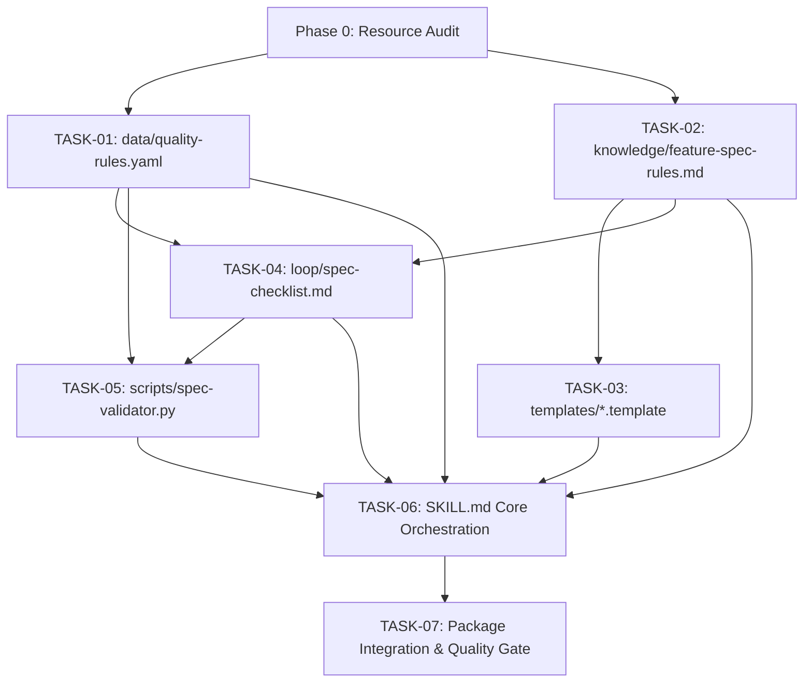

# feature-spec-designer — Implementation Task Plan

> Implementation Plan generated by **Stage 2 (skill-planner-agent)**  
> Target Skill: `feature-spec-designer` | Schema Version: v3.0 | Status: 🟢 READY FOR BUILD

---

## 1. Context & Architectural Contract

- **Core Persona**: Senior Feature Specification Designer `[TỪ DESIGN §1]`
- **Architectural Rules**:
  1. **6-Step Workflow**: Strictly linear (Step 1 -> Step 6), zero step skipping `[TỪ DESIGN §2.2]`.
  2. **Validation Timing (G1)**: Validation Gate runs DUY NHẤT at the END of each step (0% Starter Validation Burden) `[TỪ DESIGN §2.3]`.
  3. **Storage Isolation (G2)**: All output specs under `Docs/Specs/{feature-name}/` and diagrams under `Docs/Specs/{feature-name}/diagrams/` `[TỪ DESIGN §2.3]`.
  4. **Mermaid Safety (G3)**: 100% node/edge labels wrapped in double quotes `""`, zero HTML tags `[TỪ DESIGN §2.3]`.
  5. **Interactive Fallback (G4)**: 300s timeout triggers Default Option Fallback at Step 3 `[TỪ DESIGN §9.1]`.

---

## 2. Dependency Graph (DAG Blockers)

---

## 3. Execution Phases & Task Breakdown

### Phase 0: Resource Audit & Domain Preps
- [x] `TASK-00`: Audit domain standards (`standards.md`) and upstream design specifications `[TỪ AUDIT TÀI NGUYÊN]`.

### Phase 1: Data Configuration & Knowledge Rules (Zone 5 & Zone 2)
- [ ] `TASK-01`: Build `data/quality-rules.yaml` (Zone 5) `[TỪ DESIGN §3]`
  - **Inputs**: `design.md §3, §8`, `quality-matrix.yaml`
  - **Outputs**: `.agents/skills/feature-spec-designer/data/quality-rules.yaml`
  - **Data Contract**: YAML defining NFR metrics (Latency p95 < 3000ms), forbidden words list (`TODO`, `TBD`, `nhanh`, `tốt`), and Quality Gate threshold (`0.80`).
  - **Trace Tag**: `[TỪ DESIGN §3]`, `[TỪ BA: L92-118]`
  - **Blockers**: None

- [ ] `TASK-02`: Build `knowledge/feature-spec-rules.md` (Zone 2) `[TỪ DESIGN §3]`
  - **Inputs**: `design.md §2.1, §3`, `standards.md`
  - **Outputs**: `.agents/skills/feature-spec-designer/knowledge/feature-spec-rules.md`
  - **Data Contract**: Detailed domain rules for BDD Gherkin scenarios (4 flows), Mermaid sequence/flowchart/ERD syntax rules (double quotes, no HTML), `standards.md` compliance, and Depth Signals S1-S4.
  - **Trace Tag**: `[TỪ DESIGN §3]`, `[TỪ HANDBOOK: L51-67]`
  - **Blockers**: `TASK-01`

### Phase 2: Spec Templates & Quality Checklist (Zone 4 & Zone 6)
- [ ] `TASK-03`: Build `templates/spec.md.template` & `templates/clarification.md.template` (Zone 4) `[TỪ DESIGN §3]`
  - **Inputs**: `design.md §3, §6`, `TASK-02`
  - **Outputs**: `.agents/skills/feature-spec-designer/templates/spec.md.template`, `.agents/skills/feature-spec-designer/templates/clarification.md.template`
  - **Data Contract**: 
    - `spec.md.template`: 10-section structure for final feature spec.
    - `clarification.md.template`: Multiple-choice Q&A template (3-5 questions, 2-3 options each + 1 `[Khuyến nghị]` default option).
  - **Trace Tag**: `[TỪ DESIGN §3]`, `[TỪ HANDBOOK: L165-204]`
  - **Blockers**: `TASK-02`

- [ ] `TASK-04`: Build `loop/spec-checklist.md` (Zone 6) `[TỪ DESIGN §3]`
  - **Inputs**: `quality-matrix.yaml`, `design.md §3, §5`
  - **Outputs**: `.agents/skills/feature-spec-designer/loop/spec-checklist.md`
  - **Data Contract**: Binary PASS/FAIL checklist matrix for end-of-step validation gates (Step 1 through Step 6).
  - **Trace Tag**: `[TỪ DESIGN §3]`, `[TỪ BA: L342-353]`
  - **Blockers**: `TASK-01`, `TASK-02`

### Phase 3: Automation Script & Core Persona (Zone 3 & Zone 1)
- [ ] `TASK-05`: Build `scripts/spec-validator.py` (Zone 3) `[TỪ DESIGN §3]`
  - **Inputs**: `data/quality-rules.yaml`, `loop/spec-checklist.md`
  - **Outputs**: `.agents/skills/feature-spec-designer/scripts/spec-validator.py`
  - **Data Contract**: Python CLI tool validating: (1) Storage Isolation paths `Docs/Specs/{feature-name}/`, (2) Mermaid double quote regex, (3) Forbidden words scanner, (4) JSON quality report generation.
  - **Trace Tag**: `[TỪ DESIGN §3]`, `[SUY LUẬN]`
  - **Blockers**: `TASK-01`, `TASK-04`

- [ ] `TASK-06`: Build `SKILL.md` (Zone 1) `[TỪ DESIGN §3]`
  - **Inputs**: `design.md §1-§8`, `TASK-01` through `TASK-05`
  - **Outputs**: `.agents/skills/feature-spec-designer/SKILL.md`
  - **Data Contract**: Master Skill specification containing Persona, L0 Anchor Rules, XML enclosure boundaries `<user_skill_request>`, 6-step workflow execution logic, Progressive Disclosure Tiers (1 to 3), and Fallback Handling (300s timeout).
  - **Trace Tag**: `[TỪ DESIGN §3]`, `[TỪ HANDBOOK: L1-32]`
  - **Blockers**: `TASK-01`, `TASK-02`, `TASK-03`, `TASK-04`, `TASK-05`

### Phase 4: Integration Verification & Delivery
- [ ] `TASK-07`: Skill Package Verification & Quality Matrix Compliance `[GỢI Ý BỔ SUNG]`
  - **Inputs**: Complete package `.agents/skills/feature-spec-designer/`
  - **Outputs**: Verification logs & PASS status report
  - **Data Contract**: Validate file presence (7 Zones), dry-run `spec-validator.py`, ensure all 22 criteria from `quality-matrix.yaml` are executable.
  - **Trace Tag**: `[GỢI Ý BỔ SUNG]`
  - **Blockers**: `TASK-06`

---

## 4. Data Contracts & Integration Interfaces

| Task ID | Target File | Input Interface | Output Artifact | Interface Type |
|---|---|---|---|---|
| `TASK-01` | `data/quality-rules.yaml` | `design.md §3` | YAML config | File |
| `TASK-02` | `knowledge/feature-spec-rules.md` | `standards.md` | Markdown rules | Knowledge |
| `TASK-03` | `templates/*.template` | `design.md §6` | Template files | Text Template |
| `TASK-04` | `loop/spec-checklist.md` | `quality-matrix.yaml` | Markdown checklist | Quality Gate |
| `TASK-05` | `scripts/spec-validator.py` | CLI args / Spec paths | JSON Verdict Report | Python Script |
| `TASK-06` | `SKILL.md` | User Prompt XML | Agent Instructions | System Persona |

---

## 5. Notes, Traceability & Open Questions

- **Open Questions Migration**:
  1. **Q1 (Step 3 Timeout)**: Default timeout fixed at `300 seconds`. Automatic fallback to `[Khuyến nghị]` default option upon timeout `[CẦN LÀM RÕ]` -> *Integrated in SKILL.md & clarification template*.
  2. **Q2 (Diagram Naming)**: Fixed paths `sequence.mmd`, `flowchart.mmd`, `erd.mmd` under `Docs/Specs/{feature-name}/diagrams/` `[CẦN LÀM RÕ]` -> *Integrated in TASK-02 & TASK-05*.

- **Traceability Tag Legend**:
  - `[TỪ DESIGN §N]`: Derived directly from Section N of `design.md`.
  - `[TỪ HANDBOOK: Lxx]`: Traced to line range in `domain-handbook.md`.
  - `[TỪ BA: Lxx]`: Traced to line range in `business-analysis.md`.
  - `[GỢI Ý BỔ SUNG]`: Engineering recommendation for pipeline quality.
  - `[CẦN LÀM RÕ]`: Clarified item from open questions.

---

## 6. Verification & Handoff Criteria

1. **Artifact Completeness**: All 7 Zone files mapped into discrete actionable tasks.
2. **Path Compliance**: Skill package targeted at `.agents/skills/feature-spec-designer/`.
3. **Stage 3 Handoff Readiness**: Ready for Stage 3 (`skill-builder-agent`) execution with 100% trace tags, explicit data contracts, and DAG order.
