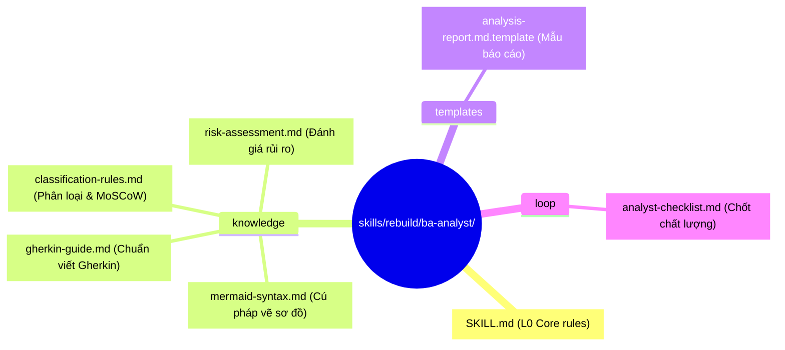
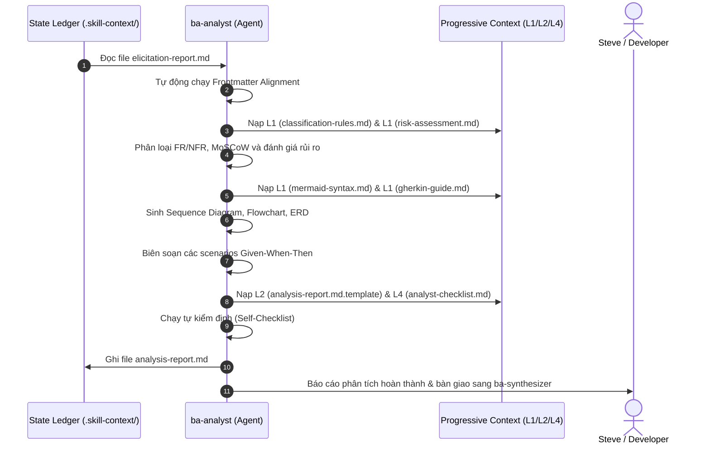

# 🏛️ Bản Thiết Kế Kiến Trúc: ba-analyst (Micro-Skill Analyst)

> **Mục tiêu**: Định hình kiến trúc 7 Zones cho micro-skill `ba-analyst` (MS-2) hoạt động tại Stage -1 của pipeline.
> **Tài liệu thượng nguồn**: [exploration.md](file:///home/steve/Work-space/deep_work_by_steve/.skill-context/ba-analyst/exploration.md)
> **Traceability**: [TỪ DESIGN §1-10] kế thừa đầy đủ từ khảo sát và quy tắc phân tích.

---

## §1. Problem Statement

### A. Vấn đề thực tế (Pain Points)
- **Lệch pha Handoff (Inter-agent Mismatch)**: Elicitor và Analyst có sự sai lệch về mặt tên trường và enum trạng thái (`analyzed_at` vs `elicited_at`, status: `elicitation-completed` vs `completed`).
- **Lỗi cú pháp vẽ sơ đồ (Mermaid Rendering Failures)**: Agent dễ sinh các ký tự đặc biệt, dấu ngoặc không hợp lệ trong sơ đồ Mermaid dẫn tới lỗi dựng hình.
- **Thiếu phân loại yêu cầu & MoSCoW**: Không phân loại rõ ràng các yêu cầu chức năng (FR) và phi chức năng (NFR), dẫn tới việc lập kế hoạch kiểm thử không có tính định lượng.
- **Mất liên kết nguồn (Traceability Loss)**: Rất khó truy xuất nguồn gốc của các thực thể trong Schema dữ liệu hoặc các Scenarios kiểm thử về lại yêu cầu gốc của khách hàng.

### B. Giải pháp kiến trúc
Xây dựng **ba-analyst** (MS-2) đóng vai trò là lõi chuyển đổi nghiệp vụ thành đặc tả kỹ thuật:
1. Tích hợp pha tự căn chỉnh (Frontmatter Alignment) ở đầu vào để giải quyết lệch pha dữ liệu.
2. Áp dụng quy chuẩn cú pháp vẽ Mermaid.js nghiêm ngặt được nạp động từ tri thức.
3. Cấu trúc hóa việc phân loại yêu cầu FR/NFR, MoSCoW, ERD, và kịch bản Gherkin.
4. Gắn nhãn trace tags nấc thang (`[TỪ ELICITOR]`, `[SUY LUẬN]`, `[CẦN LÀM RÕ]`) cho từng dòng thông tin.

---

## §2. Capability Map

```yaml
capabilities:
  - id: CAP-1
    name: "Frontmatter Alignment"
    description: "Nhận diện và sửa đổi tự động các lệch pha dữ liệu giữa Elicitor và Analyst trước khi tiến hành phân tích chính."
    trace: "[TỪ EXPLORATION §4 VÀ §6]"

  - id: CAP-2
    name: "Functional & Non-Functional Classification"
    description: "Phân tách yêu cầu nghiệp vụ thành FR và NFR định lượng, gán mức ưu tiên MoSCoW kèm lý do kỹ thuật."
    trace: "[TỪ EXPLORATION §2.B.2 VÀ §4.A]"

  - id: CAP-3
    name: "System Modeling (Mermaid.js)"
    description: "Sinh 3 sơ đồ hệ thống hợp lệ: Sequence Diagram (≥3 actors), Flowchart (Happy/Alt/Exception paths), và ERD (PK/FK, data types)."
    trace: "[TỪ EXPLORATION §2.B.3 VÀ §4.A]"

  - id: CAP-4
    name: "Gherkin Acceptance Criteria"
    description: "Biên soạn các kịch bản kiểm thử Given-When-Then chuẩn cho Happy, Alternative và Exception paths."
    trace: "[TỪ EXPLORATION §2.B.5 VÀ §4.A]"

  - id: CAP-5
    name: "Risk & Impact Analysis"
    description: "Lập ma trận rủi ro (Xác suất x Tác động) và đề xuất các giải pháp giảm thiểu tương ứng với MoSCoW priority."
    trace: "[TỪ EXPLORATION §2.B.6 VÀ §4.A]"
```

---

## 3. Zone Mapping

Quy hoạch 7 Zones cho micro-skill ba-analyst sau khi build vào thư mục cài đặt gốc skills/rebuild/ba-analyst/.

| Zone | File Path | Mục đích & Nội dung kỹ thuật | Trace |
|:---|:---|:---|:---|
| **L0: Core** | `SKILL.md` | Persona Analyst, quy trình 7 pha xử lý, chỉ đạo must/must_not, limitations, when not to use. | [EXPLORATION §6] |
| **L1: Knowledge** | `knowledge/classification-rules.md` | Logic phân loại FR/NFR, ma trận MoSCoW, lý do kỹ thuật mẫu. | [EXPLORATION §2 VÀ §4.A] |
| **L1: Knowledge** | `knowledge/mermaid-syntax.md` | Cú pháp mẫu và hướng dẫn vẽ Sequence, Flowchart, ERD bằng Mermaid.js. | [EXPLORATION §2 VÀ §4.A] |
| **L1: Knowledge** | `knowledge/gherkin-guide.md` | Chuẩn viết Acceptance Criteria bằng Gherkin cho 3 paths. | [EXPLORATION §2 VÀ §4.A] |
| **L1: Knowledge** | `knowledge/risk-assessment.md` | Khung đánh giá rủi ro, ma trận tác động và quy tắc tích hợp với MoSCoW. | [EXPLORATION §2 VÀ §4.A] |
| **L2: Templates** | `templates/analysis-report.md.template` | Mẫu cấu trúc Markdown chuẩn cho đầu ra analysis-report.md. | [EXPLORATION §5] |
| **L4: Loop** | `loop/analyst-checklist.md` | Checklist tự kiểm định 7 deliverables trước khi ghi file. | [EXPLORATION §6] |

---

## §4. Folder Structure

Sơ đồ cấu trúc thư mục vật lý của `ba-analyst` khi đóng gói:



---

## §5. Execution Flow

Luồng thực thi tuần tự của `ba-analyst`:



---

## §6. Interaction Points

Các điểm kết nối nghiệp vụ của `ba-analyst`:

| Interface / Event | Source / Target | Format | Ràng buộc / Nội dung trao đổi | Trace |
|:---|:---|:---|:---|:---|
| **Read Input** | `ba-elicitor` ──► Agent | File system | Đọc file `elicitation-report.md` tại thư mục bối cảnh chung. | [EXPLORATION §4.A] |
| **Data Alignment** | Agent (nội bộ) | Object mapping | Chuyển đổi: `analyzed_at` → `elicited_at`, normalize status. | [EXPLORATION §6] |
| **Write Output** | Agent ──► State Ledger | File system (`.skill-context/ba-analyst/`) | Ghi file `analysis-report.md` chứa đủ 7 deliverables. | [EXPLORATION §5] |
| **Handoff Event** | `ba-analyst` ──► `ba-synthesizer` | File trigger | Bàn giao file `analysis-report.md` làm đầu vào cho MS-3. | [EXPLORATION §5.B] |

---

## §7. Progressive Disclosure

Phân chia nạp ngữ cảnh động cho `ba-analyst` để tiết kiệm token budget:

```yaml
progressive_disclosure:
  tier_1_boot:
    files:
      - "skills/rebuild/ba-analyst/SKILL.md"
    purpose: "Nạp định hướng nhân vật, quy trình 7 pha phân tích."
    max_tokens: 600

  tier_2_conditional:
    files:
      - "skills/rebuild/ba-analyst/knowledge/classification-rules.md"
      - "skills/rebuild/ba-analyst/knowledge/risk-assessment.md"
    purpose: "Nạp trong pha phân loại MoSCoW và phân tích rủi ro hệ thống."
    trigger: "Sau khi hoàn thành Frontmatter Alignment."
    max_tokens: 1000

  tier_3_modeling:
    files:
      - "skills/rebuild/ba-analyst/knowledge/mermaid-syntax.md"
      - "skills/rebuild/ba-analyst/knowledge/gherkin-guide.md"
    purpose: "Nạp trong pha vẽ sơ đồ Mermaid và sinh kịch bản Gherkin."
    trigger: "Sau khi phân loại xong FR/NFR."
    max_tokens: 1500

  tier_4_output:
    files:
      - "skills/rebuild/ba-analyst/templates/analysis-report.md.template"
      - "skills/rebuild/ba-analyst/loop/analyst-checklist.md"
    purpose: "Nạp trong pha tổng hợp báo cáo và tự kiểm định chất lượng."
    trigger: "Sau khi sinh xong Gherkin scenarios."
    max_tokens: 600
```

---

## §8. Risks & Mitigations

Các rủi ro kỹ thuật và phương án giảm thiểu tại thời điểm thiết kế:

| # | Rủi ro tiềm ẩn (Risks) | Mức độ | Phương án giảm thiểu (Mitigations) | Trace |
|:---|:---|:---|:---|:---|
| 1 | Mermaid diagram bị lỗi cú pháp không render được | **Cao** | Thiết lập các quy tắc vẽ nghiêm ngặt: bọc nhãn bằng dấu ngoặc kép, không dùng ký tự đặc biệt ngoài nhãn; cung cấp ví dụ cú pháp đúng trong knowledge file. | [EXPLORATION §7.A.2] |
| 2 | Mất mát thông tin (Information loss) từ Elicitor | **Trung bình** | Phải có phần "Frontmatter Alignment" và ánh xạ toàn bộ 5W1H thành Actors & Systems trước khi phân loại. | [EXPLORATION §6] |
| 3 | Scenarios kiểm thử quá chung chung, không chạy được thực tế | **Trung bình** | Áp dụng Given-When-Then lượng hóa. Cấm các từ cảm tính trong scenarios; bắt buộc viết ít nhất 1 Happy, 1 Alternative, và 1 Exception path. | [EXPLORATION §3.G VÀ §8] |

---

## §9. Open Questions

Bảng các câu hỏi mở cần làm rõ trong các pha nghiệm thu tiếp theo:

| # | Câu hỏi mở | Trạng thái hiện tại | Giải pháp đề xuất |
|:---|:---|:---|:---|
| 1 | Làm sao để validate cú pháp Mermaid tự động tại runtime? | Đang nghiên cứu | Sẽ tích hợp thư viện parser Mermaid.js trong một script kiểm tra ở Stage 4 (Tester) nếu có. |
| 2 | Nên định nghĩa Data Schema dưới dạng JSON Schema hay Markdown Table? | Đã chọn | Sử dụng Markdown Table làm trực quan chính, đính kèm JSON Schema block để máy đọc được. |

---

## §10. Metadata

```yaml
metadata:
  skill_name: "ba-analyst"
  type: "micro-skill"
  version: "1.0.0"
  stage: "design"
  parent_suite: "skill-business-analyst"
  pipeline_stage: "Stage -1 (MS-2)"
  state_ledger_path: ".skill-context/ba-analyst/"
  design_confidence: "90%"
  verified_by: "skill-architect"
```
