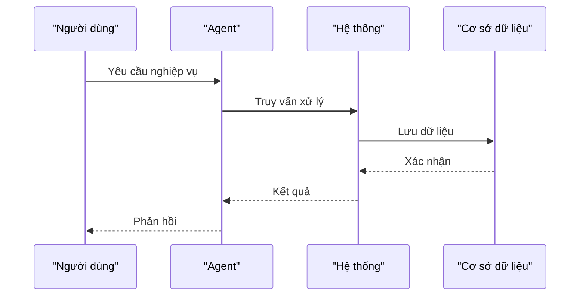

# Mermaid.js Syntax Reference — BA Analyst

> Nguồn: [`thong-tin-mau.md` — Skills Layer: System Modeling](file:///home/steve/Work-space/deep_work_by_steve/.skill-context/skill-business-analyst/resources/thong-tin-mau.md) + [`raw2.md` — LĨNH VỰC 3](file:///home/steve/Work-space/deep_work_by_steve/.skill-context/skill-business-analyst/resources/raw2.md)

---

## 1. Sequence Diagram

Yêu cầu từ Master Prompt (thong-tin-mau.md):

```yaml
actors_minimum: "≥3 actors/participants"
path_types:
  - "Happy Path — luồng chuẩn"
  - "Alternative Path — luồng thay thế"
  - "Exception Path — luồng lỗi/ngoại lệ"
source: "thong-tin-mau.md — Skills Layer: Sequence Diagram + raw2.md: LĨNH VỰC 3"
```

Syntax:


## 2. Flowchart / Activity Diagram

```yaml
direction: "TD (dọc) hoặc LR (ngang)"
node_format: 'A["Label trong ngoặc kép"] --> B{"Điều kiện?"}'
path_requirement: "Happy + Alternative + Exception đều phải có"
source: "thong-tin-mau.md — System Modeling + raw2.md skills layer"
```

## 3. Entity Relationship Diagram (ERD)

```yaml
relationship_markers:
  one_to_many: "||--o{"
  one_to_one: "||--||"
data_types:
  - "string"
  - "integer"
  - "boolean"
  - "timestamp"
key_constraints:
  - "PK — Primary Key (khóa chính)"
  - "FK — Foreign Key (khóa ngoại)"
source: "thong-tin-mau.md — Skills Layer: Data Schema Design + ERD"
```

## 4. Yêu Cầu Chung

```yaml
zero_placeholder: "Không TODO, TBD, mock trong sơ đồ"
mermaid_source: "Tri thức cú pháp Mermaid.js được nạp sẵn vào vector DB để Agent tham chiếu"
diagram_types_required:
  - "Sequence Diagram"
  - "Activity Diagram"
  - "Use Case Diagram"
  - "ERD"
source: "thong-tin-mau.md — System Modeling đoạn: 'Tri thức về cú pháp vẽ sơ đồ được nạp sẵn vào cơ sở dữ liệu vector'"
```
