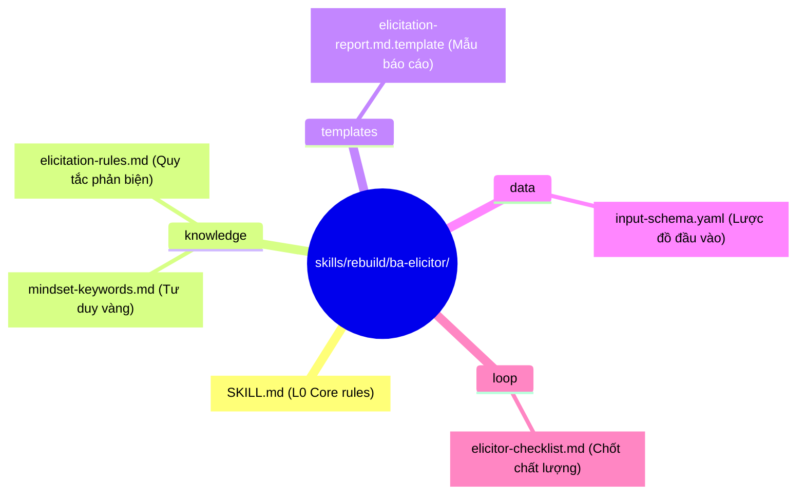
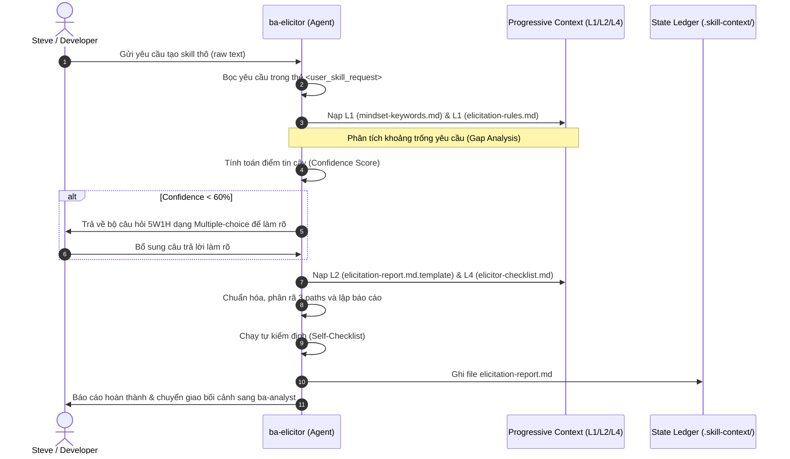

# 🏛️ Bản Thiết Kế Kiến Trúc: ba-elicitor (Micro-Skill Elicitor)

> **Mục tiêu**: Định hình kiến trúc 7 Zones cho micro-skill `ba-elicitor` (MS-1) hoạt động tại Stage -1 của pipeline.
> **Tài liệu thượng nguồn**: [exploration.md](file:///home/steve/Work-space/deep_work_by_steve/.skill-context/ba-elicitor/exploration.md)
> **Traceability**: [TỪ DESIGN §1-10] kế thừa đầy đủ từ khảo sát và quy tắc nhận thức.

---

## §1. Problem Statement

### A. Vấn đề thực tế (Pain Points)
- **Yêu cầu không cấu trúc và mơ hồ**: Mô tả ban đầu về kỹ năng cần phát triển thường quá sơ sài hoặc mang tính cảm tính từ người dùng (ví dụ: "chạy nhanh", "an toàn", "dễ dùng").
- **Mất định hướng NFR (Non-functional Requirements)**: Thiếu các chỉ số kỹ thuật định lượng (throughput, latency, response time) ở khâu thiết kế (Architect) và lập kế hoạch (Planner) dẫn tới việc thiết kế và lập trình không đúng yêu cầu thực tế.
- **Hallucination của Agent**: Khi thiếu thông tin nghiệp vụ nghiêm trọng, các Agent ở hạ nguồn tự suy đoán hoặc bỏ qua các luồng xử lý ngoại lệ (Exception Path).

### B. Giải pháp kiến trúc
Xây dựng **ba-elicitor** đóng vai trò là chốt chặn đầu tiên (Stage -1) trong chuỗi cung ứng kỹ năng. Nó sẽ:
1. Normalize mọi đầu vào tự do thông qua các thẻ bọc XML an toàn chống Prompt Injection.
2. Áp dụng 6 từ khóa tư duy cốt lõi (Systems Thinking, Root Cause, MECE, First Principles, Impact Analysis, Structural Decomposition) để tìm ra khoảng trống nghiệp vụ.
3. Sinh ra bộ câu hỏi phản biện định lượng 5W1H và ép buộc phân tách 3 luồng hoạt động (Happy, Alternative, Exception paths).
4. Xuất ra tài liệu `elicitation-report.md` thống nhất làm bối cảnh sạch cho các bước tiếp theo.

---

## §2. Capability Map

```yaml
capabilities:
  - id: CAP-1
    name: "XML Input Sanitization"
    description: "Nhận dạng và bọc đầu vào tự do của người dùng trong thẻ XML <user_skill_request> để cô lập chống prompt injection và làm sạch nhiễu bối cảnh."
    trace: "[TỪ EXPLORATION §4]"

  - id: CAP-2
    name: "Critical Gap Analysis"
    description: "Áp dụng 6 Mindset Keywords kèm vector anchors để phát hiện tối thiểu 3 khoảng trống nghiệp vụ hoặc các yêu cầu định tính cảm tính."
    trace: "[TỪ EXPLORATION §2.B.1 VÀ §3.G]"

  - id: CAP-3
    name: "Proactive Elicitation (5W1H)"
    description: "Tự động tạo bộ câu hỏi 5W1H chuẩn hóa kèm theo các gợi ý lựa chọn (multiple-choice/bullet points) để lượng hóa NFR."
    trace: "[TỪ EXPLORATION §3.G VÀ §4.A]"

  - id: CAP-4
    name: "3-Path Structural Decomposition"
    description: "Phân rã yêu cầu nghiệp vụ thành 3 luồng xử lý độc lập: Happy Path, Alternative Path và Exception Path."
    trace: "[TỪ EXPLORATION §3.3.B.1]"

  - id: CAP-5
    name: "Structured Report Generation"
    description: "Sinh báo cáo elicitation-report.md đầy đủ YAML frontmatter và gắn trace tags [TỪ INPUT], [SUY LUẬN], [CẦN LÀM RÕ] cho từng dòng thông tin."
    trace: "[TỪ EXPLORATION §8]"
```

---

## §3. Zone Mapping

Bản đồ quy hoạch 7 Zones cho micro-skill `ba-elicitor` sau khi build vào thư mục cài đặt gốc `skills/rebuild/ba-elicitor/`. Tuyệt đối không sử dụng tên file placeholder.

| Zone | File Path | Mục đích & Nội dung kỹ thuật | Trace |
|:---|:---|:---|:---|
| **L0: Core** | `skills/rebuild/ba-elicitor/SKILL.md` | L0 Anchor: Chứa Persona Elicitor, quy trình 4 pha chi tiết, các chỉ đạo bắt buộc (must/must_not), các giới hạn vận hành (Limitations) và tình huống không nên dùng (When not to use). | [EXPLORATION §6.1] |
| **L1: Knowledge** | `skills/rebuild/ba-elicitor/knowledge/mindset-keywords.md` | Định nghĩa 6 từ khóa tư duy cốt lõi (Systems Thinking, Root Cause, MECE, First Principles, Impact Analysis, Structural Decomposition) cùng các vector anchors tương ứng để Agent kích hoạt tư duy phản biện. | [EXPLORATION §2 VÀ §4.A] |
| **L1: Knowledge** | `skills/rebuild/ba-elicitor/knowledge/elicitation-rules.md` | Chứa các quy tắc chuẩn hóa thông tin thô, logic bóc tách NFR định lượng, và bộ câu hỏi 5W1H mẫu cho từng loại hình tác vụ. | [EXPLORATION §4.A] |
| **L2: Templates** | `skills/rebuild/ba-elicitor/templates/elicitation-report.md.template` | Mẫu cấu trúc Markdown chuẩn cho đầu ra `elicitation-report.md`, định nghĩa các section bắt buộc phải có để Agent điền dữ liệu. | [EXPLORATION §6.1] |
| **L3: Data** | `skills/rebuild/ba-elicitor/data/input-schema.yaml` | Lược đồ dữ liệu YAML để cấu trúc hóa đầu vào trong trường hợp người dùng cung cấp thông tin dạng terrminal JSON/YAML thay vì free-text. | [EXPLORATION §6.1] |
| **L4: Loop** | `skills/rebuild/ba-elicitor/loop/elicitor-checklist.md` | Danh sách kiểm định chất lượng tự động trước khi xuất xưởng báo cáo. Agent phải tự chấm điểm đạt 100% checklist mới được ghi file kết quả. | [EXPLORATION §6.1] |

---

## §4. Folder Structure

Sơ đồ cấu trúc thư mục vật lý của `ba-elicitor` khi được đóng gói hoàn chỉnh:



---

## §5. Execution Flow

Sơ đồ tuần tự thể hiện cách thức vận hành và ghi nhận trạng thái của `ba-elicitor`:



---

## §6. Interaction Points

Các điểm kết nối đầu vào/đầu ra và các ràng buộc truyền tin của `ba-elicitor`:

| Interface / Event | Source / Target | Format | Ràng buộc / Nội dung trao đổi | Trace |
|:---|:---|:---|:---|:---|
| **Receive Input** | User (Steve / Agent) | Free-text / YAML | Phải được bọc trong thẻ XML `<user_skill_request>` để chống Prompt Injection. | [EXPLORATION §4.A] |
| **HITL Clarification** | User ↔ Agent | Chat interface | Bộ câu hỏi 5W1H dạng multiple-choice / bullet points. Chỉ kích hoạt khi confidence < 60%. | [EXPLORATION §7.A.1] |
| **Write State** | Agent ──► State Ledger | File system (`.skill-context/ba-elicitor/`) | Ghi duy nhất file `elicitation-report.md` chứa YAML frontmatter + Markdown và các trace tags. | [EXPLORATION §6.1] |
| **Handoff Event** | `ba-elicitor` ──► `ba-analyst` | File trigger | Chuyển tiếp file `elicitation-report.md` sang làm đầu vào của MS-2. | [EXPLORATION §5.B] |

---

## §7. Progressive Disclosure

Để tối ưu hóa hiệu suất ngữ cảnh (Token Economics) và tránh làm tràn bộ nhớ của Agent, bối cảnh tri thức được phân chia thành các tầng nạp động:

```yaml
progressive_disclosure:
  tier_1_boot:
    files:
      - "skills/rebuild/ba-elicitor/SKILL.md"
    purpose: "Nạp luật định hướng ban đầu, cấu hình persona và luồng xử lý chính."
    max_tokens: 500

  tier_2_conditional:
    files:
      - "skills/rebuild/ba-elicitor/knowledge/mindset-keywords.md"
      - "skills/rebuild/ba-elicitor/knowledge/elicitation-rules.md"
    purpose: "Nạp trong pha phân tích khoảng trống và phản biện lượng hóa."
    trigger: "Sau khi bọc xong input thô."
    max_tokens: 1200

  tier_3_output:
    files:
      - "skills/rebuild/ba-elicitor/templates/elicitation-report.md.template"
      - "skills/rebuild/ba-elicitor/loop/elicitor-checklist.md"
    purpose: "Nạp khi chuẩn bị đóng gói, kiểm định và ghi file báo cáo ra đĩa."
    trigger: "Sau khi hoàn thành việc phản biện và phân rã path."
    max_tokens: 600
```

---

## §8. Risks & Mitigations

Các rủi ro vận hành kỹ thuật và phương án giảm thiểu tại thời điểm thiết kế:

| # | Rủi ro tiềm ẩn (Risks) | Mức độ | Phương án giảm thiểu (Mitigations) | Trace |
|:---|:---|:---|:---|:---|
| 1 | Prompt Injection qua input tự do phá vỡ cấu trúc Agent | **Cao** | Bắt buộc bọc input trong XML boundaries; sử dụng JSON/YAML parser an toàn nếu nhận cấu trúc; cấm eval mã lệnh. | [EXPLORATION §7.A.2] |
| 2 | Người dùng không tương tác trong chế độ HITL | **Trung bình** | Sử dụng chế độ "One-shot fallback": Nếu chạy trong môi trường tự động không tương tác (non-interactive), Agent tự động sinh câu hỏi dưới dạng các checklist mở và gắn tag `[CẦN LÀM RÕ]` vào báo cáo để các stage sau tiếp tục xử lý với giả định an toàn tối đa. | [EXPLORATION §7.B.1] |
| 3 | Hallucination tự điền các yêu cầu kỹ thuật không có thực | **Trung bình** | Bắt buộc gắn trace tags `[TỪ INPUT]` và `[SUY LUẬN]` một cách tách biệt. Mọi suy luận không có nguồn gốc từ input phải được đánh dấu rõ ràng và không được coi là sự thật nghiệp vụ. | [EXPLORATION §8.Q3] |
| 4 | Tràn ngữ cảnh (Context Overflow) | **Thấp** | Áp dụng Progressive Disclosure chi tiết tại §7. Không nạp cùng lúc tất cả files. | [EXPLORATION §7.A.4] |

---

## §9. Open Questions

Bảng các câu hỏi mở cần làm rõ trong các pha nghiệm thu tiếp theo:

| # | Câu hỏi mở | Trạng thái hiện tại | Giải pháp đề xuất |
|:---|:---|:---|:---|
| 1 | Có nên tích hợp sẵn một script python để validate tính MECE của input-schema không? | Đang thảo luận | Trong phase này chỉ phân tích văn bản thô, tạm thời để file `data/input-schema.yaml` ở dạng sơ khởi. |
| 2 | Làm sao để tự động trigger `ba-analyst` sau khi `ba-elicitor` ghi file xong? | Đang thảo luận | Sẽ do Master Orchestrator (`skill-business-analyst`) điều phối hoặc chạy scripts thủ công qua terminal ở Stage -1. |

---

## §10. Metadata

```yaml
metadata:
  skill_name: "ba-elicitor"
  type: "micro-skill"
  version: "1.0.0"
  stage: "design"
  parent_suite: "skill-business-analyst"
  pipeline_stage: "Stage -1 (MS-1)"
  state_ledger_path: ".skill-context/ba-elicitor/"
  design_confidence: "95%"
  verified_by: "skill-architect"
```
