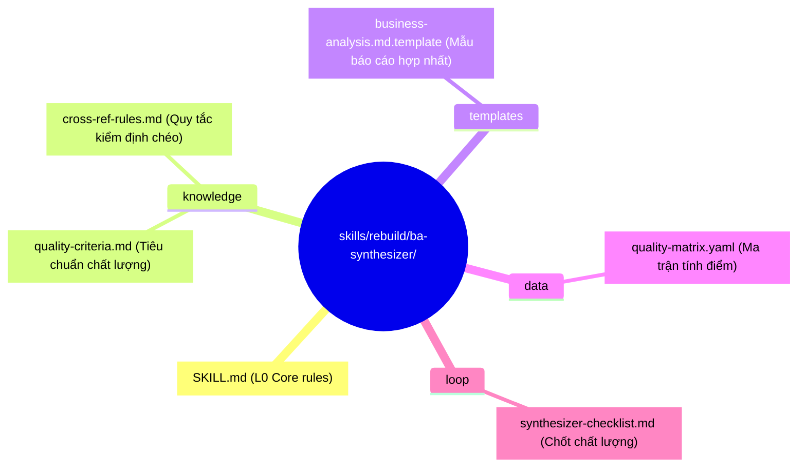
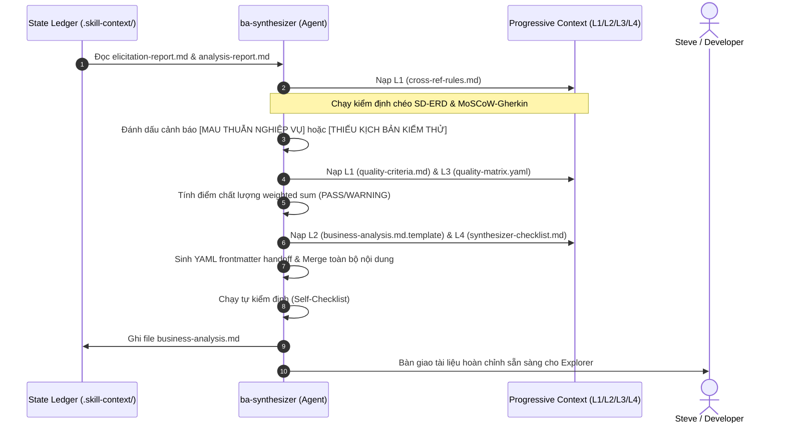

# 🏛️ Bản Thiết Kế Kiến Trúc: ba-synthesizer (Micro-Skill Synthesizer)

> **Mục tiêu**: Định hình kiến trúc 7 Zones cho micro-skill `ba-synthesizer` (MS-3) hoạt động tại Stage -1 của pipeline.
> **Tài liệu thượng nguồn**: [exploration.md](file:///home/steve/Work-space/deep_work_by_steve/.skill-context/ba-synthesizer/exploration.md)
> **Traceability**: [TỪ DESIGN §1-10] kế thừa đầy đủ từ khảo sát và quy tắc tổng hợp.

---

## §1. Problem Statement

### A. Vấn đề thực tế (Pain Points)
- **Mâu thuẫn logic chéo (Cross-logic Inconsistencies)**: Thiết kế tương tác trong Sequence Diagram (SD) và cấu trúc dữ liệu trong ERD dễ bị lệch nhau (ví dụ: SD gọi hàm lưu Transaction nhưng ERD thiếu thực thể Transaction) mà không có cảnh báo.
- **Mất kiểm soát chất lượng (Quality Gate Slop)**: Tài liệu đặc tả kỹ thuật nghiệp vụ của skill được chuyển giao sang Stage 0 (Explorer) mà không có sự đánh giá định lượng về mức độ hoàn thiện.
- **Phân mảnh tài liệu (Document Fragmentation)**: Người dùng phải tự đọc và khớp các tài liệu từ các phase khơi gợi (Elicitation) và phân tích (Analysis), làm chậm tốc độ pipeline.

### B. Giải pháp kiến trúc
Xây dựng **ba-synthesizer** (MS-3) đóng vai trò là chốt chặn tự động hóa và hợp nhất:
1. Thực hiện quy tắc kiểm định nhất quán chéo SD-ERD và MoSCoW-Gherkin.
2. Tự động chấm điểm chất lượng (Quality Score) theo ma trận trọng số.
3. Hợp nhất hai báo cáo thô thành tài liệu bàn giao duy nhất `business-analysis.md`.
4. Sinh YAML frontmatter handoff metadata chuẩn để Explorer tự động nạp.

---

## §2. Capability Map

```yaml
capabilities:
  - id: CAP-1
    name: "Actor-Entity Cross-Validation"
    description: "Quét Sequence Diagram và ERD bằng regex để đối chiếu và cảnh báo [MAU THUẪN NGHIỆP VỤ] nếu SD gọi thực thể không có trong ERD."
    trace: "[TỪ EXPLORATION §2 VÀ §4.A]"

  - id: CAP-2
    name: "MoSCoW-Gherkin Cross-Validation"
    description: "Quét bảng MoSCoW và Acceptance Criteria để cảnh báo [THIẾU KỊCH BẢN KIỂM THỬ] nếu tính năng Must-Have thiếu scenario Gherkin."
    trace: "[TỪ EXPLORATION §2 VÀ §4.A]"

  - id: CAP-3
    name: "Weighted Quality Scoring"
    description: "Tính toán điểm chất lượng tổng hợp của 7 deliverables bằng công thức weighted sum (Σ(weight × score)), xác định chất lượng PASS/WARNING."
    trace: "[TỪ EXPLORATION §2.B.3 VÀ §4.A]"

  - id: CAP-4
    name: "Handoff Metadata Compilation"
    description: "Tạo YAML frontmatter bàn giao chứa thông tin SCS, decomposition recommendation, scope, risks và quality score."
    trace: "[TỪ EXPLORATION §2.B.4 VÀ §4.A]"

  - id: CAP-5
    name: "Document Consolidation"
    description: "Hợp nhất toàn bộ 7 deliverables thành một tài liệu business-analysis.md hoàn chỉnh, sạch và không chứa placeholder."
    trace: "[TỪ EXPLORATION §5]"
```

---

## §3. Zone Mapping

Quy hoạch 7 Zones cho micro-skill `ba-synthesizer` sau khi build vào thư mục cài đặt gốc `skills/rebuild/ba-synthesizer/`.

| Zone | File Path | Mục đích & Nội dung kỹ thuật | Trace |
|:---|:---|:---|:---|
| **L0: Core** | `skills/rebuild/ba-synthesizer/SKILL.md` | Persona Synthesizer, quy trình 4 pha xử lý, chỉ đạo must/must_not, limitations, when not to use. | [EXPLORATION §6] |
| **L1: Knowledge** | `skills/rebuild/ba-synthesizer/knowledge/quality-criteria.md` | Bộ tiêu chí chất lượng cho từng deliverable và trọng số tính điểm tương ứng. | [EXPLORATION §2 VÀ §4.A] |
| **L1: Knowledge** | `skills/rebuild/ba-synthesizer/knowledge/cross-ref-rules.md` | Các quy tắc logic kiểm định chéo và trigger cảnh báo. | [EXPLORATION §2 VÀ §4.A] |
| **L2: Templates** | `skills/rebuild/ba-synthesizer/templates/business-analysis.md.template` | Mẫu cấu trúc Markdown chuẩn hợp nhất cho `business-analysis.md`. | [EXPLORATION §5] |
| **L3: Data** | `skills/rebuild/ba-synthesizer/data/quality-matrix.yaml` | Ma trận chất lượng định lượng dùng để tính toán điểm. | [EXPLORATION §6] |
| **L4: Loop** | `skills/rebuild/ba-synthesizer/loop/synthesizer-checklist.md` | Checklist kiểm tra tính toàn vẹn của metadata và tài liệu cuối trước khi handoff. | [EXPLORATION §6] |

---

## §4. Folder Structure

Sơ đồ cấu trúc thư mục vật lý của `ba-synthesizer` khi đóng gói:



---

## §5. Execution Flow

Luồng thực thi tuần tự của `ba-synthesizer`:



---

## §6. Interaction Points

Các điểm kết nối nghiệp vụ của `ba-synthesizer`:

| Interface / Event | Source / Target | Format | Ràng buộc / Nội dung trao đổi | Trace |
|:---|:---|:---|:---|:---|
| **Read Inputs** | `ba-elicitor` VÀ `ba-analyst` ──► Agent | File system | Đọc file `elicitation-report.md` và `analysis-report.md` tại các thư mục bối cảnh tương ứng. | [EXPLORATION §4.A] |
| **Write Output** | Agent ──► State Ledger | File system (`.skill-context/ba-synthesizer/`) | Ghi file `business-analysis.md` chứa đủ YAML frontmatter handoff + Markdown. | [EXPLORATION §5] |
| **Handoff Event** | `ba-synthesizer` ──► `skill-explorer` | File trigger | Chuyển file `business-analysis.md` cho Explorer làm đầu vào bổ sung. | [EXPLORATION §5.B] |

---

## §7. Progressive Disclosure

Phân chia nạp ngữ cảnh động cho `ba-synthesizer` để tiết kiệm token budget:

```yaml
progressive_disclosure:
  tier_1_boot:
    files:
      - "skills/rebuild/ba-synthesizer/SKILL.md"
    purpose: "Nạp định hướng nhân vật, quy trình 4 pha hợp nhất."
    max_tokens: 500

  tier_2_validation:
    files:
      - "skills/rebuild/ba-synthesizer/knowledge/cross-ref-rules.md"
    purpose: "Nạp trong pha chạy kiểm định chéo logic sơ đồ và yêu cầu."
    trigger: "Sau khi nạp thành công 2 báo cáo đầu vào."
    max_tokens: 1000

  tier_3_scoring:
    files:
      - "skills/rebuild/ba-synthesizer/knowledge/quality-criteria.md"
      - "skills/rebuild/ba-synthesizer/data/quality-matrix.yaml"
    purpose: "Nạp trong pha tính toán điểm chất lượng và phân loại PASS/WARNING."
    trigger: "Sau khi có kết quả kiểm định chéo."
    max_tokens: 800

  tier_4_output:
    files:
      - "skills/rebuild/ba-synthesizer/templates/business-analysis.md.template"
      - "skills/rebuild/ba-synthesizer/loop/synthesizer-checklist.md"
    purpose: "Nạp trong pha tổng hợp báo cáo hợp nhất và tự kiểm tra checklist cuối cùng."
    trigger: "Sau khi tính xong điểm chất lượng."
    max_tokens: 600
```

---

## §8. Risks & Mitigations

Các rủi ro kỹ thuật và phương án giảm thiểu tại thời điểm thiết kế:

| # | Rủi ro tiềm ẩn (Risks) | Mức độ | Phương án giảm thiểu (Mitigations) | Trace |
|:---|:---|:---|:---|:---|
| 1 | Bỏ sót lỗi logic do regex parser mâu thuẫn chéo không bắt được hết | **Cao** | Sử dụng regex cấu trúc chuẩn; yêu cầu các sơ đồ Mermaid phải tuân thủ nghiêm ngặt chuẩn đặt tên nhãn không dùng ký tự đặc biệt. | [EXPLORATION §7.A.1] |
| 2 | Tràn context window khi nạp cả hai báo cáo lớn cùng lúc | **Trung bình** | Sử dụng Progressive Disclosure tại §7, giải phóng bối cảnh sau mỗi pha xử lý. | [EXPLORATION §7.A.3] |
| 3 | Mất mát hoặc thiếu hụt thông tin rủi ro/giả định khi gộp | **Trung bình** | Sử dụng template cứng có mục "Rủi ro hợp nhất" và bắt buộc chạy checklist kiểm tra độ hoàn thiện 7 deliverables. | [EXPLORATION §7.A.1] |

---

## §9. Open Questions

Bảng các câu hỏi mở cần làm rõ trong các pha nghiệm thu tiếp theo:

| # | Câu hỏi mở | Trạng thái hiện tại | Giải pháp đề xuất |
|:---|:---|:---|:---|
| 1 | Điểm chất lượng có nên quy đổi thành điểm SCS ở Stage 0 không? | Đang thảo luận | Điểm chất lượng phản ánh độ hoàn thiện tài liệu, còn SCS phản ánh độ phức tạp. Nên giữ tách biệt. |
| 2 | Explorer làm cách nào để nhận diện file `business-analysis.md` đã có sẵn? | Đang thảo luận | Sẽ cấu hình Explorer Phase 1 tự động kiểm tra sự tồn tại của file này trong `.skill-context/` trước khi tiến hành khảo sát. |

---

## §10. Metadata

```yaml
metadata:
  skill_name: "ba-synthesizer"
  type: "micro-skill"
  version: "1.0.0"
  stage: "design"
  parent_suite: "skill-business-analyst"
  pipeline_stage: "Stage -1 (MS-3)"
  state_ledger_path: ".skill-context/ba-synthesizer/"
  design_confidence: "95%"
  verified_by: "skill-architect"
```
