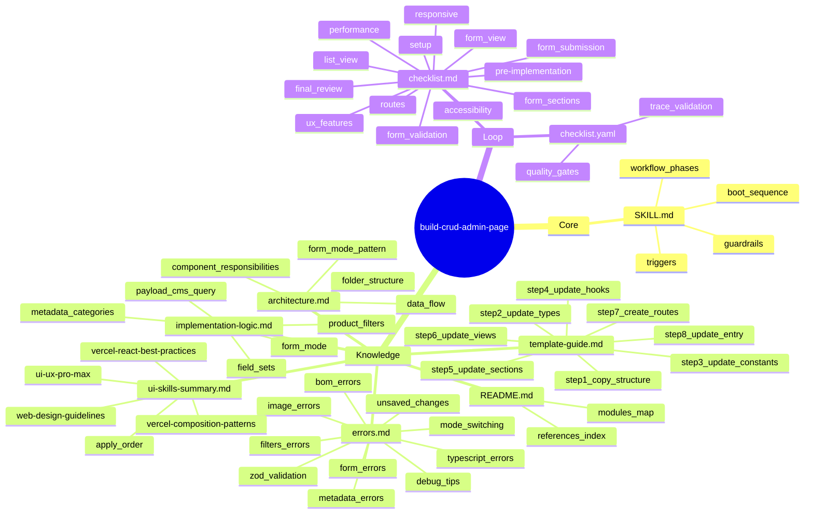
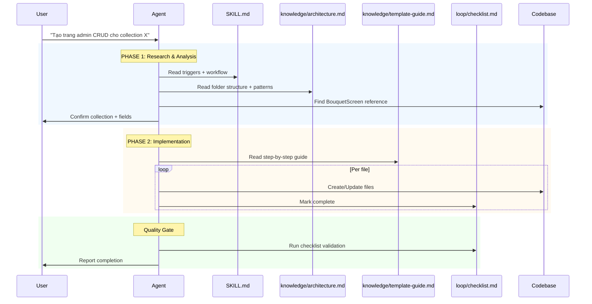

# §1 Problem Statement

## Pain Point

Skill `build-crud-admin-page` hiện tại được đóng gói dạng **flat zip** với cấu trúc:
```
build-crud-admin-page/
├── SKILL.md
└── references/
    ├── README.md
    ├── architecture.md
    ├── template-guide.md
    ├── implementation-logic.md
    ├── checklist.md
    ├── errors.md
    └── ui-skills-summary.md
```

**Vấn đề:**
1. **Không tuân thủ 7-Zone framework** — references/ nằm phẳng, không có zone phân tách rõ ràng
2. **SKILL.md quá dài (210 lines)** — chứa quá nhiều nội dung cần tách vào knowledge/
3. **Progressive Disclosure không rõ ràng** — không có Tier 1/2/3 loading strategy
4. **Không có YAML frontmatter** — thiếu metadata cần thiết cho tooling
5. **Quality gates không formal** — thiếu checklist.yaml machine-readable
6. **Không có trace tags** — không trace content về nguồn gốc
7. **Boot sequence không documented** — không biết đọc gì trước

## User & Context

- **User:** Developer/Agent cần tạo admin CRUD page cho PayloadCMS collection
- **Context:** Next.js + PayloadCMS admin screens
- **Trigger phrases:** "tạo trang admin", "build CRUD page", "tạo màn hình quản lý"

## Expected Output

Rebuild hoàn chỉnh theo **3-Tier Master Skill Suite**:
```
build-crud-admin-page/
├── SKILL.md                    # Tier 1: Core orchestration (< 150 lines)
├── knowledge/                  # Tier 2: Domain knowledge
│   ├── README.md
│   ├── architecture.md
│   ├── template-guide.md
│   ├── implementation-logic.md
│   ├── errors.md
│   └── ui-skills-summary.md
├── loop/                       # Quality gates
│   ├── checklist.md
│   └── checklist.yaml          # Machine-readable
└── .skill-context/             # Build artifacts
```

---

# §2 Capability Map

## 3 Pillars Analysis

### Pillar 1: Knowledge

**Domain Knowledge cần thiết:**
- PayloadCMS collections & REST API
- Next.js App Router structure
- react-hook-form + zod validation
- shadcn/ui components
- Form mode pattern (create/view/edit)
- Product/Collection metadata fetching

**Knowledge Files cần tạo:**
- `knowledge/README.md` — Overview & index
- `knowledge/architecture.md` — Folder structure, data flow (lấy từ references/architecture.md)
- `knowledge/template-guide.md` — Step-by-step cho collection mới
- `knowledge/implementation-logic.md` — Chi tiết logic (form mode, metadata)
- `knowledge/errors.md` — Lỗi thường gặp
- `knowledge/ui-skills-summary.md` — 4 UI/UX skills reference

### Pillar 2: Process

**Workflow 2-Phase:**

```
PHASE 1: Research & Analysis
├── Step 1: Confirm collection name & fields
├── Step 2: Read existing BouquetScreen patterns
├── Step 3: Read architecture.md & template-guide.md
└── Output: Summary + folder structure proposal

PHASE 2: Implementation
├── Step 1: Create folder structure
├── Step 2: Implement types/constants
├── Step 3: Build ListView + Filters
├── Step 4: Build FormView (3 modes)
├── Step 5: Create route files
└── Output: Complete CRUD admin page
```

**Key Patterns:**
- FormMode: 'create' | 'view' | 'edit'
- Route → Mode determination từ URL
- Category scoping cho Accessory

### Pillar 3: Guardrails

**AI thường sai ở đâu:**
1. **Không đọc references trước** — tự đoán cấu trúc thay vì follow architecture.md
2. **Bỏ qua form mode logic** — không phân biệt create/view/edit behavior
3. **Quên category scoping** — Accessory cần danh mục con của "Phụ kiện"
4. **Hardcode fields** — không đọc từ PayloadCMS schema
5. **Không apply UI skills** — skip ui-ux-pro-max, vercel-react-best-practices

---

# §3 Zone Mapping

| Zone | Files cần tạo | Nội dung | Bắt buộc? |
|------|---------------|----------|-----------|
| **Core** | `SKILL.md` | Persona, workflow, guardrails, triggers | ✅ |
| **Knowledge** | `knowledge/README.md` | Tổng quan references | ✅ |
| | `knowledge/architecture.md` | Folder structure, data flow, component responsibilities | ✅ |
| | `knowledge/template-guide.md` | Step-by-step guide cho collection mới | ✅ |
| | `knowledge/implementation-logic.md` | Form mode, metadata, categories | ✅ |
| | `knowledge/errors.md` | Common errors & solutions | ✅ |
| | `knowledge/ui-skills-summary.md` | 4 UI/UX skills tóm tắt | ✅ |
| **Scripts** | Không cần | | ❌ |
| **Templates** | Không cần | | ❌ |
| **Data** | Không cần | | ❌ |
| **Loop** | `loop/checklist.md` | Checklist implementation | ✅ |
| | `loop/checklist.yaml` | Machine-readable validation | ✅ |
| **Assets** | Không cần | | ❌ |

---

# §4 Folder Structure

## Mindmap



---

# §5 Execution Flow

## Sequence Diagram



## Boot Sequence

```
1. Read SKILL.md (this file)
2. Read knowledge/README.md (references index)
3. Proceed to Phase 1
4. Load Tier 2 files as needed per Phase
5. Before deliver: read loop/checklist.md
```

---

# §6 Interaction Points

## When Agent MUST Stop and Ask User

| # | Interaction Point | Question/Action |
|---|------------------|------------------|
| 1 | **Before Phase 1** | Confirm collection name & fields |
| 2 | **After Phase 1** | Confirm folder structure proposal |
| 3 | **After Phase 2** | Report completion + checklist results |

## When Agent Can Proceed Without Asking

| # | Situation | Action |
|---|-----------|--------|
| 1 | Missing fields | Auto-read from PayloadCMS schema |
| 2 | Existing BouquetScreen | Reference for patterns |
| 3 | Errors | Read knowledge/errors.md and self-correct |

---

# §7 Progressive Disclosure Plan

## Tier 1 (Mandatory — always load at boot)

| File | Purpose |
|------|---------|
| `SKILL.md` | Core orchestration, triggers, workflow |
| `knowledge/README.md` | References index, modules map |

## Tier 2 (Conditional — load when needed)

| File | Load When |
|------|-----------|
| `knowledge/architecture.md` | Step 1: Understand folder structure |
| `knowledge/implementation-logic.md` | Step 2: Implement form mode pattern |
| `knowledge/template-guide.md` | Step 3: Create new collection screens |
| `knowledge/errors.md` | When encountering errors |
| `knowledge/ui-skills-summary.md` | Before UI implementation |
| `loop/checklist.md` | Quality gate before delivery |

## Tier 3 (Optional — on-demand)

None required for this skill.

---

# §8 Risks & Blind Spots

## Identified Risks

| # | Risk | Likelihood | Impact | Mitigation |
|---|------|------------|--------|------------|
| 1 | Agent skip references, use wrong folder structure | High | High | Explicitly list "Read X before Y" in workflow |
| 2 | Agent confuse form mode logic (create/view/edit) | Medium | High | Include concrete code example in implementation-logic.md |
| 3 | Agent forget category scoping for Accessory | Medium | Medium | Add note in template-guide.md Step 4 |
| 4 | Agent hardcode fields instead of reading schema | Medium | Medium | Include PayloadCMS schema reading instruction |
| 5 | Agent skip UI/UX skills, poor code quality | Low | Medium | List skills in order of application |

## Anti-Patterns to Avoid

```yaml
anti_patterns:
  - "Copy-paste from BouquetScreen without understanding patterns"
  - "Use boolean props instead of mode string"
  - "Hardcode collection name in multiple files"
  - "Skip form validation"
  - "No loading/error states"
```

---

# §9 Open Questions

| # | Question | Status | Resolution |
|---|----------|--------|------------|
| 1 | Should this skill support collection types beyond Bouquet/Accessory/SingleFlower? | Open | Limit to existing patterns first |
| 2 | Should we auto-generate types from PayloadCMS schema? | Open | Manual first, auto later |
| 3 | Should route files be in app/(frontend) or app/(admin)? | Resolved | app/(frontend) for consistency |
| 4 | Should we include copy-button for UI code blocks? | Open | Low priority |

---

# §10 Metadata

```yaml
skill_name: build-crud-admin-page
version: "2.0.0"  # Rebuilt from 1.x
author: "Steve Void Team"
status: "ready_for_planner"
created: "2026-05-16"
rebuilt_from: "build-crud-admin-page.zip (original flat structure)"
architecture_version: "3.0.0"
pipeline_stage: 1
```

## Change Log

| Date | Change | Reason |
|------|--------|--------|
| 2026-05-16 | Rebuild entire skill | Flat structure → 7-Zone framework |
| | Add YAML frontmatter | Machine-readable metadata |
| | Add Progressive Disclosure | Tier 1/2 loading |
| | Add checklist.yaml | Automated validation |
| | Compact SKILL.md | < 150 lines target |
