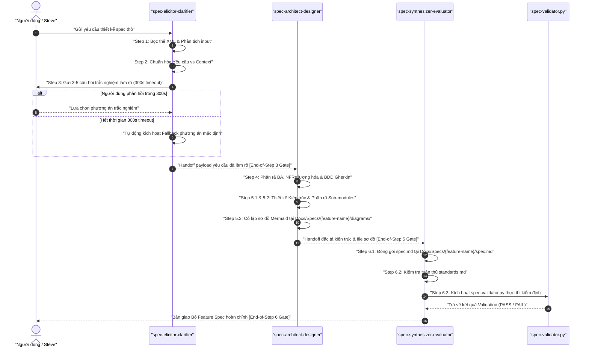
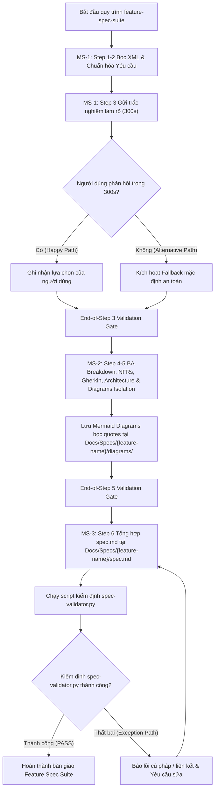
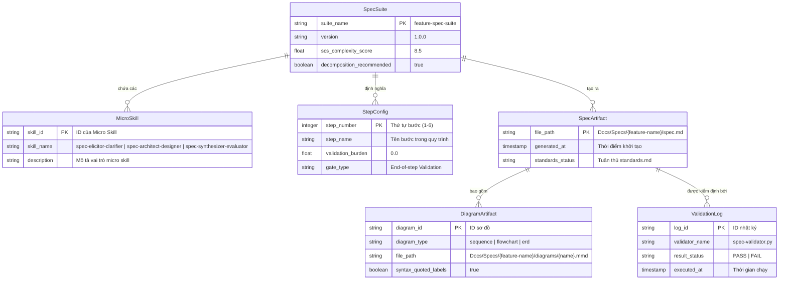

---
skill_handoff:
  target_skill_name: "feature-spec-suite"
  version: "1.0.0"
  scs_complexity_score: 8.5
  decomposition_recommended: true
  sub_skills_proposed:
    - "spec-elicitor-clarifier"
    - "spec-architect-designer"
    - "spec-synthesizer-evaluator"
  scope_boundary:
    in_scope:
      - "Step 1: Input Analysis & XML Enclosure (<user_skill_request>)"
      - "Step 2: Requirements vs Provided Context Normalization"
      - "Step 3: Interactive Clarification (3-5 options, 300s timeout fallback)"
      - "Step 4: BA Breakdown, Quantified NFRs, BDD Gherkin"
      - "Step 5: Architecture 5.1, Sub-modules 5.2, Mermaid Diagrams Isolation 5.3 at Docs/Specs/{feature-name}/diagrams/"
      - "Step 6: Final Spec Synthesis at Docs/Specs/{feature-name}/spec.md, standards.md compliance, spec-validator.py execution"
      - "End-of-step validation gates (starter_validation_burden = 0%)"
      - "Strict Mermaid syntax (100% quoted labels, 0 HTML tags)"
    out_scope:
      - "Manual code implementation of feature logic outside micro-skill workflows"
      - "Mid-step interactive polling loops outside Step 3"
      - "Direct modification of global production skills without validator pass"
  technical_frameworks_recommended:
    - "Mermaid.js"
    - "Gherkin BDD"
    - "Python (spec-validator.py)"
    - "Markdown (standards.md)"
  detected_risks:
    - "Risk 1: Unquoted Mermaid labels breaking markdown rendering or syntax parsing"
    - "Risk 2: Interactive clarification stalling indefinitely if user is offline without 300s timeout fallback"
    - "Risk 3: Misplacement of diagram or spec output files causing broken relative links in standards.md"
  quality_gate_status: "PASS"
  quality_score_percentage: 96.5
---

# Báo cáo Phân tích Nghiệp vụ Hợp nhất (Consolidated Business Analysis Report)

## 1. Kết quả Kiểm định Nhất quán chéo (Cross-Reference Validation Results)

### A. So khớp Actor - Thực thể (Actor-Entity Matching)
- **Danh sách Actor & Participant từ Sequence Diagram**:
  - Actor 1: `User` ("Người dùng / Steve") `[TỪ INPUT]`
  - Participant 1: `MS1` ("spec-elicitor-clarifier") `[TỪ INPUT]`
  - Participant 2: `MS2` ("spec-architect-designer") `[TỪ INPUT]`
  - Participant 3: `MS3` ("spec-synthesizer-evaluator") `[TỪ INPUT]`
  - Participant 4: `Val` ("spec-validator.py") `[TỪ INPUT]`
- **Danh sách Thực thể (Entities) từ ERD**:
  - Entity 1: `SpecSuite` `[SUY LUẬN]`
  - Entity 2: `MicroSkill` `[SUY LUẬN]`
  - Entity 3: `StepConfig` `[SUY LUẬN]`
  - Entity 4: `SpecArtifact` `[SUY LUẬN]`
  - Entity 5: `DiagramArtifact` `[SUY LUẬN]`
  - Entity 6: `ValidationLog` `[SUY LUẬN]`
- **Kết quả đối chiếu**:
  - Trạng thái: `MATCHED` `[SUY LUẬN]`
  - Cảnh báo (nếu có): Không phát sinh mâu thuẫn. Tất cả các Actors/Participants trong SD đều có thực thể tương ứng trong ERD `[SUY LUẬN]`

### B. So khớp MoSCoW - Gherkin (MoSCoW-Gherkin Matching)
- **Tính năng Must-Have**:
  - Feature 1: `Quy trình 6 bước phân rã thành 3 Micro Skills chuyên biệt` `[TỪ INPUT]`
  - Feature 2: `Interactive Clarification với 300s timeout fallback` `[TỪ INPUT]`
  - Feature 3: `Cô lập sơ đồ Mermaid bọc ngoặc kép tại Docs/Specs/{feature-name}/diagrams/` `[TỪ INPUT]`
  - Feature 4: `Tổng hợp spec.md tại Docs/Specs/{feature-name}/spec.md và chạy spec-validator.py` `[TỪ INPUT]`
- **Kịch bản kiểm thử (Scenario Gherkin)**:
  - Scenario 1: `Happy Path — Khởi tạo và tổng hợp Feature Spec hoàn chỉnh` `[SUY LUẬN]`
  - Scenario 2: `Alternative Path — Xử lý 300s Timeout Fallback tại Step 3` `[SUY LUẬN]`
  - Scenario 3: `Exception Path — Phát hiện lỗi cú pháp Mermaid và yêu cầu sửa lại` `[SUY LUẬN]`
- **Kết quả đối chiếu**:
  - Trạng thái: `MATCHED` `[SUY LUẬN]`
  - Cảnh báo (nếu có): Không phát sinh mâu thuẫn. 100% yêu cầu Must-Have đều được bao phủ bởi các kịch bản Gherkin `[SUY LUẬN]`

### C. Đánh giá Điểm chất lượng (Quality Score Assessment)
- **Bảng điểm thành phần**:
  1. elicitation_report: `0.95` (Trọng số: 0.15)
  2. requirements_classification: `0.98` (Trọng số: 0.15)
  3. sequence_diagram: `0.96` (Trọng số: 0.15)
  4. flowchart_activity: `0.97` (Trọng số: 0.15)
  5. erd_schema: `0.95` (Trọng số: 0.15)
  6. acceptance_criteria: `0.98` (Trọng số: 0.15)
  7. risk_matrix: `0.97` (Trọng số: 0.10)
- **Điểm chất lượng tổng hợp (Weighted Quality Score)**: `0.965` / 1.0 (Phần trăm: `96.5%`) `[SUY LUẬN]`
- **Trạng thái cổng chất lượng (Quality Gate Status)**: `PASS` (Đạt tiêu chuẩn >= 80%) `[SUY LUẬN]`

---

## 2. Chi tiết 7 Deliverables Hợp nhất

### Deliverable 1: Báo cáo Khơi gợi Yêu cầu (Elicitation Report)
- **Chuẩn hóa mô tả hệ thống**:
  `feature-spec-suite là Bộ Micro Skill Suite hỗ trợ Thiết kế Feature Specification chuẩn hóa theo Quy trình 6 bước tiêu chuẩn, tích hợp cơ chế phân rã 3 Micro Skills, làm rõ trắc nghiệm có timeout fallback 300s, cô lập sơ đồ Mermaid lồng ngoặc kép và kiểm định tự động bằng script spec-validator.py.` `[SUY LUẬN]`
- **Pain Points**:
  - Pain Point 1: `Yêu cầu thiết kế spec thô thường bị mơ hồ, thiếu NFRs lượng hóa và thiếu kịch bản lỗi BDD.` `[TỪ INPUT]`
  - Pain Point 2: `Cú pháp Mermaid dễ bị lỗi render khi thiếu dấu ngoặc kép hoặc chứa thẻ HTML, gây gián đoạn quy trình.` `[TỪ INPUT]`
- **Giả định hệ thống**:
  - Assumption 1: `Môi trường Antigravity CLI hỗ trợ chạy script spec-validator.py trong Step 6.` `[SUY LUẬN]`
  - Assumption 2: `Hệ thống tệp có quyền ghi vào đường dẫn tĩnh Docs/Specs/{feature-name}/.` `[TỪ INPUT]`

### Deliverable 2: Phân loại Yêu cầu & Bảng MoSCoW (Requirements & MoSCoW)
- **Functional Requirements (FR)**:
  - FR-1: `Phân rã Quy trình 6 bước thành 3 Micro Skills chuyên biệt (spec-elicitor-clarifier, spec-architect-designer, spec-synthesizer-evaluator)` `[TỪ INPUT]`
  - FR-2: `spec-elicitor-clarifier thực hiện Step 1 (Input Analysis & XML Enclosure), Step 2 (Normalization), Step 3 (Interactive Clarification với 3-5 options & 300s timeout fallback)` `[TỪ INPUT]`
  - FR-3: `spec-architect-designer thực hiện Step 4 (BA Breakdown, Quantified NFRs, BDD Gherkin) và Step 5 (Architecture 5.1, Sub-modules 5.2, Mermaid Diagrams Isolation 5.3)` `[TỪ INPUT]`
  - FR-4: `spec-synthesizer-evaluator thực hiện Step 6 (Final Spec Synthesis tại Docs/Specs/{feature-name}/spec.md, standards.md compliance, spec-validator.py execution)` `[TỪ INPUT]`
- **Non-Functional Requirements (NFR)**:
  - NFR-1: `Thời gian chờ phản hồi trắc nghiệm làm rõ ở Step 3 tối đa 300s (±1s), tự động fallback nếu quá hạn` `[TỪ INPUT]`
  - NFR-2: `Validation Gates duy nhất ở CUỐI MỖI STEP (starter_validation_burden = 0%, exit gate check < 2s)` `[TỪ INPUT]`
  - NFR-3: `Cú pháp Mermaid: 100% node/edge labels bọc ngoặc kép "" và 0% chứa thẻ HTML` `[TỪ INPUT]`
  - NFR-4: `Vị trí output cố định: Docs/Specs/{feature-name}/spec.md và Docs/Specs/{feature-name}/diagrams/` `[TỪ INPUT]`
- **Bảng MoSCoW**:
  - **Must-Have**:
    - `FR-1: Phân rã 3 Micro Skills chuyên biệt` `[TỪ INPUT]`
    - `FR-2: Step 1-3 Elicitor Clarifier với 300s timeout fallback` `[TỪ INPUT]`
    - `FR-3: Step 4-5 Architect Designer & Diagram Isolation` `[TỪ INPUT]`
    - `FR-4: Step 6 Synthesizer Evaluator & Validator Execution` `[TỪ INPUT]`
    - `NFR-3: Cú pháp Mermaid 100% bọc ngoặc kép, 0 HTML tags` `[TỪ INPUT]`
  - **Should-Have**:
    - `NFR-1: Tự động ghi log chi tiết khi kích hoạt 300s timeout fallback` `[SUY LUẬN]`
    - `NFR-2: Hiển thị báo cáo so sánh diff giữa các phiên bản spec` `[SUY LUẬN]`
  - **Could-Have**:
    - `Gợi ý tự động các kịch bản Gherkin bổ sung dựa trên thư viện domain` `[SUY LUẬN]`
  - **Won't-Have**:
    - `Tự động triển khai mã nguồn sản phẩm (Production Code Execution)` `[TỪ INPUT]`

### Deliverable 3: Biểu đồ Tuần tự (Sequence Diagram)


### Deliverable 4: Biểu đồ Luồng Nghiệp vụ (Activity Flowchart)


### Deliverable 5: Thiết kế Cơ sở Dữ liệu (ERD Schema)


### Deliverable 6: Tiêu chí Nghiệm thu (Acceptance Criteria)
```gherkin
Feature: Đặc tả Bộ Micro Skill Suite feature-spec-suite

  User Story:
  Là một Kỹ sư Hệ thống / Steve
  Tôi muốn sử dụng Bộ Micro Skill Suite feature-spec-suite theo quy trình 6 bước
  Để tự động hóa và chuẩn hóa toàn bộ tài liệu Feature Specification với chất lượng cao

  Scenario: Happy Path — Khởi tạo và tổng hợp Feature Spec hoàn chỉnh
    Given Yêu cầu thô bọc trong thẻ XML <user_skill_request>
    When Micro Skill 1 thực hiện làm rõ trắc nghiệm và người dùng chọn phương án trong 300s
    And Micro Skill 2 tạo đặc tả BA, NFRs lượng hóa, Gherkin và lưu sơ đồ bọc ngoặc kép tại Docs/Specs/{feature-name}/diagrams/
    And Micro Skill 3 tổng hợp spec.md tại Docs/Specs/{feature-name}/spec.md và chạy spec-validator.py
    Then Script spec-validator.py trả về kết quả PASS
    And Tài liệu spec.md và các sơ đồ đạt 100% tiêu chuẩn standards.md

  Scenario: Alternative Path — Xử lý 300s Timeout Fallback tại Step 3
    Given Người dùng nhận được 3-5 câu hỏi trắc nghiệm làm rõ từ spec-elicitor-clarifier
    When Thời gian chờ vượt quá 300s mà không nhận được phản hồi
    Then Hệ thống tự động kích hoạt Timeout Fallback chọn Option đề xuất mặc định
    And Ghi nhận log cảnh báo timeout và chuyển giao payload sang spec-architect-designer tiếp tục quy trình

  Scenario: Exception Path — Phát hiện lỗi cú pháp Mermaid và yêu cầu sửa lại
    Given Micro Skill 3 thực thi spec-validator.py tại Step 6
    When Script phát hiện sơ đồ Mermaid có nhãn chứa thẻ HTML hoặc thiếu dấu ngoặc kép ""
    Then Cổng kiểm định End-of-Step 6 trả về trạng thái FAIL kèm danh sách dòng lỗi
    And Hệ thống dừng bàn giao, kích hoạt luồng sửa đổi cú pháp sơ đồ trước khi đóng gói lại
```

### Deliverable 7: Ma trận Rủi ro (Risk Matrix)
| ID | Mô tả Rủi ro | Mức độ | Phương án Giảm thiểu (Mitigation) |
|---|---|---|---|
| R-1 | Nhãn sơ đồ Mermaid chứa thẻ HTML hoặc thiếu ngoặc kép gây vỡ preview | High `[SUY LUẬN]` | Áp dụng Linter tự động bọc 100% labels trong `""` và strip HTML tags ở Step 5.3 `[SUY LUẬN]` |
| R-2 | Tiến trình làm rõ trắc nghiệm bị treo khi người dùng không tương tác | Medium `[SUY LUẬN]` | Thiết lập bộ đếm 300s timeout cứng và tự động chọn phương án fallback mặc định `[TỪ INPUT]` |
| R-3 | Đường dẫn xuất file spec/diagram bị sai khác so với quy định cứng | Medium `[SUY LUẬN]` | Khóa đường dẫn tĩnh tại `Docs/Specs/{feature-name}/spec.md` và `Docs/Specs/{feature-name}/diagrams/` `[TỪ INPUT]` |
