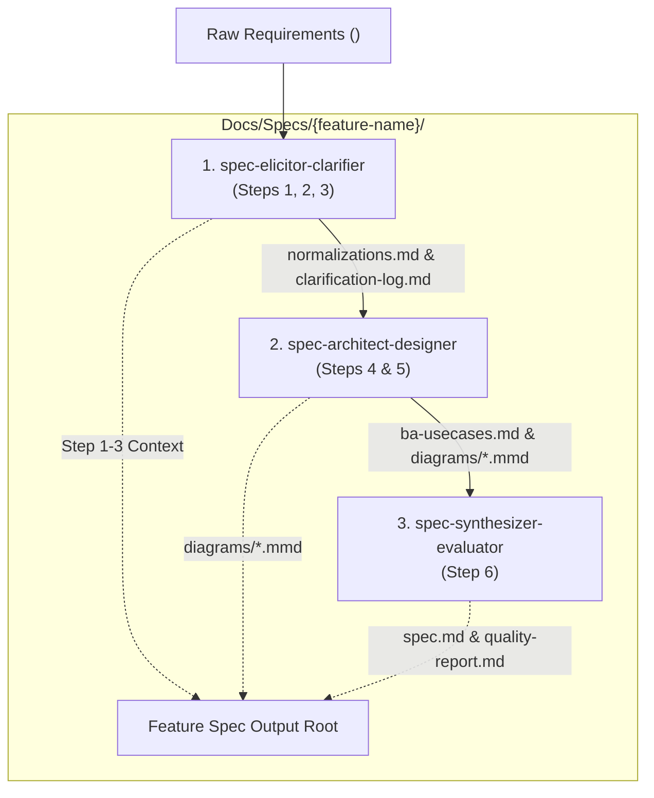

# Domain Handbook: Micro Skill Suite `feature-spec-suite`

> **Pipeline Position:** Stage 0.5 (Knowledge Mining)  
> **Target Micro Skill Suite:** `feature-spec-suite`  
> **Upstream Input:** Stage -1 Business Analysis Report  
> **Downstream Consumer:** Stage 1 Architect (`skill-architect-agent`)  
> **Standard:** Kỷ luật — Trung thực — Sáng tạo (WASHVN Master Skill Suite Architecture)

---

## 1. Domain Overview

### 1.1 System Context & Mission
The primary objective of the **`feature-spec-suite`** domain is to transform unrefined, informal, or ambiguous human requirements into production-ready, standardized software specifications. Creating high-quality software specifications is a complex multi-stage cognitive workflow requiring requirement elicitation, normalization against legacy codebase context, interactive clarification of ambiguities, business breakdown, non-functional quantification, architectural sub-module design, visual Mermaid diagram isolation, and mechanical compliance evaluation against system standards ([standards.md](file:///home/stveve/Documents/workspace/Steve/build-workflow/deep_work_by_steve/standards.md)).

### 1.2 Micro Skill Suite Decomposition Strategy
The domain is decomposed into a **3 Micro Skill Suite**:

---

## 2. Core Concepts and Vocabulary (Glossary)

| # | Term | Formal Definition | Standard & Usage Rules |
|---|---|---|---|
| 1 | **Micro Skill Suite** | Modular collection of single-responsibility AI skills co-located under `.agents/skills/{micro-skill-name}/`. | Dedicated `SKILL.md` and 7-Zone layout. |
| 2 | **Interactive Clarification Loop** | Dialogue mechanism in Step 3 presenting 3-5 options. | 300s timeout fallback. |
| 3 | **Timeout Fallback (300s)** | Rule triggering after 300s user inactivity. | Logs default choices to `clarification-log.md`. |
| 4 | **Diagram Isolation** | Extracting Mermaid diagrams as independent `.mmd` files in `diagrams/`. | Written to `Docs/Specs/{feature-name}/diagrams/*.mmd`. |
| 5 | **End-of-Step Validation Gate** | Quality control running strictly at exit of each step (`starter_validation_burden = 0%`). | Zero starter burden. |
| 6 | **Semantic Anchoring** | Vector space activation technique using glossaries (>=10 terms) and thought blocks (>200 words). | Required for LLM anchoring. |
| 7 | **Dual Context Ingestion** | Feeding Technical Scaffolding and Cognitive Depth in parallel. | Separates what vs why. |
| 8 | **Thought Latency (4 Depth Signals)** | Signals: S1 Negation, S2 Reverse, S3 Stakeholder, S4 Constraint. | PASS = S1 AND S2 AND S3 AND S4. |
| 9 | **BDD Gherkin Scenario** | Acceptance criteria format (Given-When-Then). | At least 3 scenarios per spec. |
| 10 | **Binary Mechanical Quality Gate** | Deterministic PASS/FAIL evaluation. | Scripted evaluation via `spec-validator.py`. |
| 11 | **Staleness Policy** | Artifact lifecycle rule: < 24h reuse, 24h-7d warn, > 7d restart. | Prevents stale context. |
| 12 | **Spec Output Isolation Root** | Destination at `Docs/Specs/{feature-name}/` and `Docs/Specs/{feature-name}/diagrams/`. | Hardcoded path restriction. |
