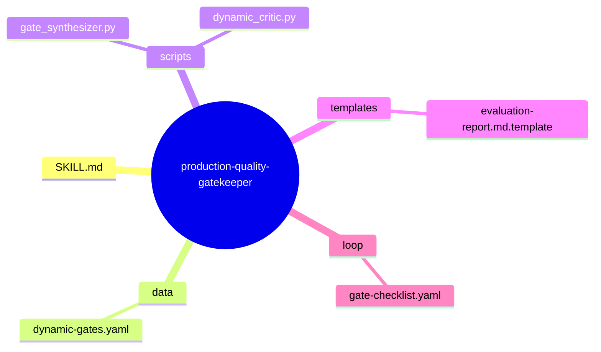
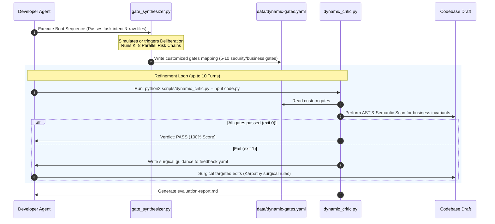

# Architectural Design: Upgraded Production Quality Gatekeeper (Ver-2)

## §1. Problem Statement & Objectives
The target is to redesign the `production-quality-gatekeeper` to transition from static, superficial formatting/PEP 8 style checks to **Dynamic Quality Gates Synthesis**.
The redesigned gatekeeper must:
1. Parse the user's task input and architecture design.
2. Run a Stage 0.5 Deliberation loop (simulated or direct LLM integration in ver-2 execution) to synthesize **5-10 hyper-targeted business/security gates**.
3. Generate a dynamic validation blueprint file `data/dynamic-gates.yaml`.
4. Dynamically generate and execute a task-specific programmatic critic `scripts/dynamic_critic.py` that checks the AST and semantic correctness against those synthesized gates.
5. Provide high-fidelity feedback and iterate in a self-refining loop.

---

## §2. Capability Map
```yaml
Capabilities:
  CAP-1: Task-Context Ingestion
    description: Scan user request, library imports, and architectural design to identify domain tags (e.g., Stripe, Financial, REST-API, Docker).
  CAP-2: Dynamic Gate Synthesis (Heavy Thinking)
    description: Formulate parallel reasoning chains (security, transactional safety, invariants) and deliberate them to create 5-10 custom business quality gates.
  CAP-3: Validation Blueprint Generation
    description: Output the synthesized gates into a structured `data/dynamic-gates.yaml` schema containing rules, expected AST structures, and error messages.
  CAP-4: Dynamic Critic Compilation
    description: Programmatically assemble or drive a flexible validator (`scripts/dynamic_critic.py`) using Python AST, semantic search, and regex checks corresponding to the active blueprint.
  CAP-5: Highly Targeted Surgical Feedback
    description: Generate Karpathy-aligned `feedback.yaml` pinpointing the exact missing invariants or security boundaries to guide the surgical edit loop.
```

---

## §3. Zone Mapping
The redesigned gatekeeper will be structured into the following file zones inside `skills/production-quality-gatekeeper/`:

| Zone | Path | Role / Responsibility |
| --- | --- | --- |
| **Zone 1: Core instructions** | `SKILL.md` | Core instructions, boot sequence, pipeline specifications. |
| **Zone 2: Dynamic Blueprint** | `data/dynamic-gates.yaml` | The synthesized 5-10 business gates for the active task. |
| **Zone 3: Programmatic Engine** | `scripts/dynamic_critic.py` | AST/semantic engine that loads `dynamic-gates.yaml` and inspects the code. |
| **Zone 4: Synthesis Generator** | `scripts/gate_synthesizer.py` | Deliberation and Parallel reasoning engine to auto-generate the matrix. |
| **Zone 5: Templates** | `templates/evaluation-report.md.template` | High-fidelity markdown template for the final 📊 Quality Evaluation Report. |
| **Zone 6: Feedback Store** | `.skill-context/production-quality-gatekeeper/feedback.yaml` | Surgical feedback output when code fails the checks. |

---

## §4. Folder Structure (Mermaid)


---

## §5. Execution Flow (Mermaid Sequence)


---

## §6. Interaction Points
| Target Component / File | Interaction Description | Contract / Mechanism |
| --- | --- | --- |
| `scripts/gate_synthesizer.py` | Executed at the very beginning to generate custom business quality gates. | Consumes `.skill-context/{skill-name}/design.md` or user request; outputs `data/dynamic-gates.yaml`. |
| `scripts/dynamic_critic.py` | Executed during each cycle of the refinement loop. | Consumes `data/dynamic-gates.yaml` and code file; outputs exit status + `feedback.yaml`. |
| `data/dynamic-gates.yaml` | Static database cache representing the synthesized gates. | Schema-compliant YAML. |
| `.skill-context/production-quality-gatekeeper/feedback.yaml` | Transports exact missing invariants to the AI Agent. | Standardized key-value list of failed criteria with fix hints. |

---

## §7. Progressive Disclosure Map
```yaml
ProgressiveDisclosure:
  Tier 1 (Boot):
    - SKILL.md (Core Anchor guidelines)
    - scripts/gate_synthesizer.py (Synthesis orchestration boot)
    - data/dynamic-gates.yaml (Active business rules)
  Tier 2 (Domain-Specific Contexts):
    - knowledge/financial-rules.md (Activated when Stripe/payment keywords found)
    - knowledge/microservices-rules.md (Activated when REST/FastAPI/gRPC found)
    - knowledge/concurrency-rules.md (Activated when threading/asyncio found)
  Tier 3 (Reporting & Handover):
    - templates/evaluation-report.md.template
    - loop/gate-checklist.yaml
```

---

## §8. Risks & Mitigations
| # | Risk | Impact | Mitigation Strategy |
| --- | --- | --- | --- |
| 1 | **AST Failures on Syntax Errors** | Critic crashes and loop breaks. | Wrap AST compilation inside a robust try-except catch. If compiler fails, report structural syntax error as a critical Gate 0 failure. |
| 2 | **False Positives/Negatives in Semantic Matches** | Code passes without correct safety mechanism or fails correct alternatives. | Provide optional `regex` and `ast_pattern` overrides in the synthesized `dynamic-gates.yaml` file to ensure verification matches actual code shapes. |
| 3 | **AI Refinement Loop Oscillation** | AI endlessly rewrites passed sections, violating context economics. | Strictly enforce the Karpathy Surgical Rule: only modify the specific block that failed; keep preceding code perfectly frozen. |

---

## §9. Metadata
```yaml
Metadata:
  Author: Closed-Loop Skill Orchestrator
  Version: 2.1.0
  Framework: ver-2 Suite
  License: MIT
```

---
*Architectural design completed by Stage 1 (Skill Architect).*
*Stored under: `/home/steve/Work-space/deep_work_by_steve/.skill-context/gatekeeper-upgrade-loop/design.md`*
