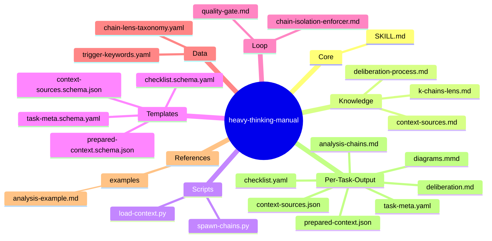
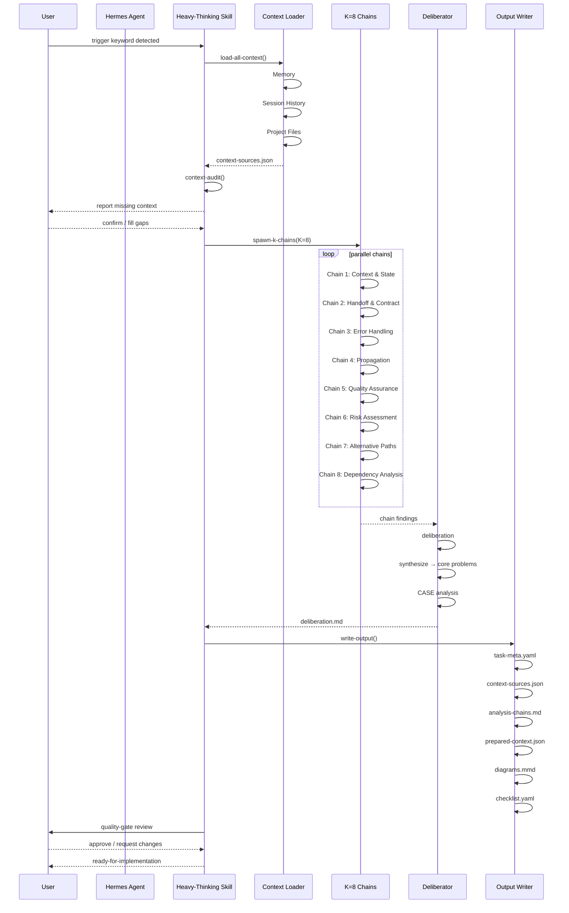

# Heavy Thinking Manual — Skill Design

## §1 Problem Statement

**Pain Point**: LLM nhảy thẳng vào implement mà không analyze kỹ → input context thiếu → output kém → vẫn bug sau triển khai.

**User & Context**: Steve (hermes user) cần systematic pre-implementation analysis trước khi code.

**Trigger Conditions** (auto):
```
fix bug | sửa lỗi | bug
xây dựng tính năng | build feature | new feature
lên ý tưởng | brainstorm | ideation
tạo spec | create spec | viết spec
```

**Auto-load Context Sources** (tất cả nếu tồn tại):
- Hermes Memory (user preferences, past sessions)
- Session hiện tại (conversation history)
- Project files (codebase context)

**Output Structure** (`.task-context/{task-id}/`):
- `task-meta.yaml` — Task metadata
- `context-sources.json` — Context audit (loaded + missing)
- `analysis-chains.md` — K=8 chain findings
- `deliberation.md` — Synthesis & core problems
- `prepared-context.json` — Enriched input cho implement
- `diagrams.mmd` — Mermaid diagrams
- `checklist.yaml` — Verification checklist

**K=8 chains** với ability spawn subagent hoặc opencode-go/deepseek-v4-flash.

---

## §2 Capability Map

### Pillar 1 — Knowledge

1. **Heavy Thinking Framework**
   - K=8 parallel chains methodology
   - Lens taxonomy (8 distinct analytical angles)
   - Deliberation & synthesis process
   - CASE System (PREVENT/DETECT/RECOVER)

2. **Context Management**
   - Memory retrieval patterns
   - Session history extraction
   - Project context loading (codebase, AGENTS.md, configs)
   - Context gap detection (what's missing)

3. **Task Classification**
   - Trigger detection (fix bug vs build feature vs ideation vs spec)
   - Task complexity assessment
   - Scope bounding

4. **Output Schemas**
   - YAML schemas cho metadata, checklists
   - JSON schemas cho structured output
   - Mermaid diagram conventions

### Pillar 2 — Process

```
[TRIGGER DETECTED]
       ↓
[LOAD CONTEXT] → Memory → Session → Project Files
       ↓
[CONTEXT AUDIT] → What found? What missing?
       ↓
[SPAWN K=8 CHAINS] → 8 parallel reasoning agents/subagents
       ↓
[DELIBERATION] → Synthesize findings
       ↓
[CASE ANALYSIS] → PREVENT / DETECT / RECOVER
       ↓
[WRITE OUTPUT] → .task-context/{task-id}/
       ↓
[VERIFICATION GATE] → Quality checklist
       ↓
[PREPARED OUTPUT] → Enriched context for implementation
```

**Branch conditions:**
- If trigger = `fix bug` → extra chain: root cause analysis
- If trigger = `build feature` → extra chain: impact analysis
- If trigger = `ideation` → extra chain: alternative exploration
- If trigger = `spec` → auto-trigger spec-generator sau

### Pillar 3 — Guardrails

1. **Premature Implementation** — AI jump thẳng vào code mà không analyze
   - Fix: Mandatory gate trước khi sang implement phase

2. **Context Assumption** — AI assume context đủ mà không verify
   - Fix: Context audit phase bắt buộc, report missing

3. **Chain Contamination** — AI để chains influence nhau
   - Fix: Independent chains, only deliberate after all complete

4. **Hallucinated Context** — AI invent context không có thật
   - Fix: All loaded context must be verifiable/traceable

5. **Incomplete Synthesis** — AI rush to conclusion without full chain review
   - Fix: Deliberation must reference ALL chains explicitly

6. **Output Format Drift** — AI deviate from schema without notice
   - Fix: Schema validation gates

---

## §3 Zone Mapping

| Zone | Files cần tạo | Nội dung | Bắt buộc? |
|------|--------------|----------|-----------|
| Core (SKILL.md) | `SKILL.md` | Heavy-thinking-manual skill definition | ✅ |
| Knowledge | `knowledge/k-chains-lens.md` | 8 lens taxonomy, definitions | ✅ |
| Knowledge | `knowledge/context-sources.md` | How to load each context source | ✅ |
| Knowledge | `knowledge/deliberation-process.md` | Synthesis methodology | ✅ |
| Scripts | `scripts/load-context.py` | Context loading automation | ✅ |
| Scripts | `scripts/spawn-chains.py` | Subagent spawning logic | ✅ |
| Templates | `templates/task-meta.schema.yaml` | Task metadata schema | ✅ |
| Templates | `templates/context-sources.schema.json` | Context sources JSON schema | ✅ |
| Templates | `templates/prepared-context.schema.json` | Enriched context schema | ✅ |
| Templates | `templates/checklist.schema.yaml` | Verification checklist schema | ✅ |
| Loop | `loop/quality-gate.md` | Pre-implementation checklist | ✅ |
| Loop | `loop/chain-isolation-enforcer.md` | Anti-contamination rules | ✅ |
| Data | `data/trigger-keywords.yaml` | Trigger keywords config | ✅ |
| Data | `data/chain-lens-taxonomy.yaml` | 8 lens definitions | ✅ |
| References | `references/examples/analysis-example.md` | Example output | ✅ |

---

## §4 Folder Structure



---

## §5 Execution Flow



---

## §6 Interaction Points

| Point | Trigger | Question | Wait for |
|-------|---------|----------|----------|
| **IP1** | Context loaded | "Found X sources. Missing: Y. Continue or provide?" | User input / confirm |
| **IP2** | Chains complete | Show deliberation summary | User confirm to proceed |
| **IP3** | Quality gate fail | "Checklist items failed: X" | User decision |
| **IP4** | Task too broad | "Task scope too large. Split into N sub-tasks?" | User confirm |
| **IP5** | Output complete | "Analysis ready. Proceed to implement?" | User directive |

---

## §7 Progressive Disclosure Plan

### Tier 1 (Mandatory — mỗi khi skill trigger)
- `SKILL.md`
- `knowledge/k-chains-lens.md`
- `data/trigger-keywords.yaml`

### Tier 2 (Conditional — dựa trên context cụ thể)
- `knowledge/context-sources.md` → khi cần load context
- `scripts/load-context.py` → khi execute
- `scripts/spawn-chains.py` → khi spawn chains
- `templates/task-meta.schema.yaml` → khi viết metadata
- `loop/chain-isolation-enforcer.md` → khi spawn chains
- `templates/checklist.schema.yaml` → khi verify output

### Tier 3 (On-demand — khi cần reference)
- `references/examples/analysis-example.md` → khi cần reference
- `templates/prepared-context.schema.json` → khi verify output

---

## §8 Risks & Blind Spots

| Risk | Description | Mitigation |
|------|-------------|------------|
| R1 | AI spawn quá nhiều subagents → cost/time explosion | Max K=8, timeout per chain (5 min max) |
| R2 | Context loading fail silently | Must report "X source unavailable" explicitly |
| R3 | Chains contaminate each other | Isolation enforcement, no cross-chain visibility |
| R4 | User không understand output → reject | Include "reader's guide" in each output |
| R5 | Task too broad → analysis paralysis | Bounding: max 3 sub-problems per chain |

---

## §9 Open Questions

1. **Task ID naming**: `{date}-{keyword}-{counter}` hay user-provided name?
2. **Max context size**: Giới hạn bao nhiêu chars per source? (recommend: 50KB per source)
3. **Chain timeout**: Max bao lâu per chain? (recommend: 5 min)
4. **Subagent vs inline**: Khi nào spawn subagent vs inline reasoning? (recommend: complex task = subagent)
5. **OpenCode integration**: Dùng opencode-go/deepseek-v4-flash cho chains nào? (recommend: all chains)

---

## §10 Metadata

```yaml
name: heavy-thinking-manual
version: 1.0.0
author: Steve
status: COMPLETE
pipeline_stage: 1
created: 2026-05-11
spec_schema_version: "1.0"
```

### Dependencies

| Type | Skill | Required | Reason |
|------|-------|----------|--------|
| Predecessor | None | - | Đây là skill đầu tiên |
| Successor | spec-generator | ❌ | Triggered after spec creation |

---

## §11 Naming Conventions

**Task Output Directory**: `.task-context/{task-id}/`

**Task ID Pattern**: `{date}-{trigger-keyword}-{uuid-short}`

**Example**: `2026-05-11-fix-bug-a1b2c3`

---

## §12 Rollback Procedures

### Phase Rollback

| Phase | Trigger | Action |
|-------|---------|--------|
| Context Load | Source unavailable | Report missing, continue with available |
| Chain Spawn | Chain timeout | Force-complete with "inconclusive" flag |
| Deliberation | Conflict unresolved | Note conflict, proceed with majority |
| Output Write | Schema validation fail | Re-generate with stricter format |

---

## §Clarifications

### Confirmed by Steve (2026-05-11)

| # | Item | Decision |
|---|------|----------|
| 1 | Task ID Pattern | `{date}-{trigger-keyword}-{uuid-short}` (vd: `2026-05-11-fix-bug-a1b2c3`) |
| 2 | Chain Execution | Primary: opencode-go/deepseek-v4-flash → Fallback: delegate_task subagent |
| 3 | Complexity Heuristic | Default: inline for simple, subagent/opencode for complex (>3 files or >100 LOC) |

---

## K=8 Chain Lenses (Taxonomy)

| Chain | Lens | Focus |
|-------|------|-------|
| 1 | Context & State | Input context sufficiency, cached vs fresh |
| 2 | Handoff & Contract | Session/agent/skill boundaries |
| 3 | Error Handling | Hallucination, silent failure modes |
| 4 | Propagation | Codebase impact analysis |
| 5 | Quality Assurance | Verification, diff, test criteria |
| 6 | Risk Assessment | What could go wrong |
| 7 | Alternative Paths | Other valid approaches |
| 8 | Dependency Analysis | External dependencies, risks |

---

## CASE System

```
PREVENT:
- Context enrichment before work
- Explicit acceptance criteria
- "Known unknowns" acknowledgment

DETECT:
- Verification gates
- Error visibility
- Objective quality metrics

RECOVER:
- Rollback procedures
- "I don't know" signaling
- Human escalation points
```
