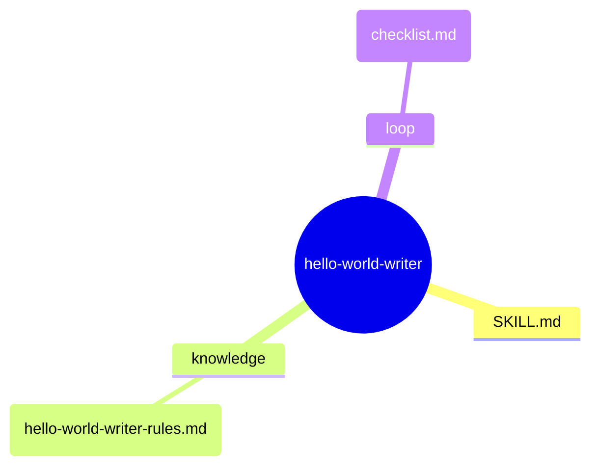
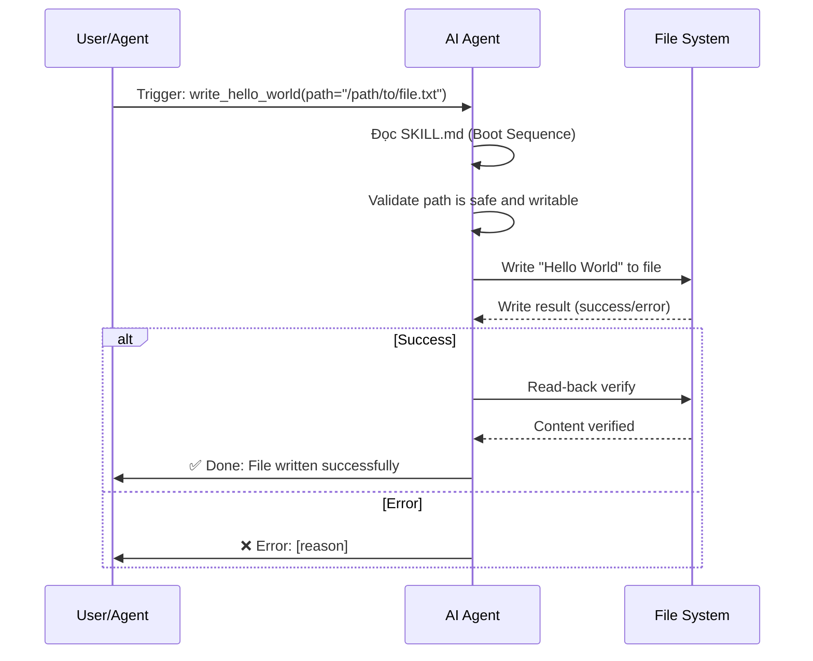

# hello-world-writer — Architecture Design

> Generated by skill-architect | 2026-05-18
> Status: ✅ COMPLETED

---

## 1. Problem Statement

**Vấn đề**: Developer hoặc AI agent cần một cách đơn giản, có kiểm soát để ghi chuỗi "Hello World" vào một file.

**Người dùng**: AI agent cần thực hiện task đơn giản "write-to-file" như một phần của workflow lớn hơn.

**Lý do cần skill**: Cung cấp một skill có cấu trúc chuẩn hóa cho thao tác ghi file đơn giản, với đầy đủ guardrails và error handling.

---

## 2. Capability Map

### 2.1 Tri thức (Knowledge — Pillar 1)
- File path validation (đường dẫn tuyệt đối và tương đối)
- File write permissions
- Overwrite vs append behavior

### 2.2 Quy trình (Process — Pillar 2)
1. Receive target file path and content ("Hello World")
2. Validate path is writable
3. Write content to file
4. Verify write success
5. Report result

### 2.3 Kiểm soát (Guardrails — Pillar 3)
- **G1**: Path must not traverse outside allowed directory
- **G2**: File must be writable (check permissions before write)
- **G3**: Must verify content was written correctly (read-back check)

---

## 3. Zone Mapping

> ⚠️ Contract Section — Planner đọc §3 để decompose thành Tasks.
> Mọi Zone PHẢI có giá trị trong cột "Files cần tạo". Zone không dùng → ghi "Không cần".

| Zone | Files cần tạo | Nội dung | Bắt buộc? |
|------|--------------|----------|-----------|
| Core (SKILL.md) | `SKILL.md` | Persona, phases, guardrails | ✅ |
| Knowledge | `knowledge/hello-world-writer-rules.md` | File write rules, path validation standards | ✅ |
| Scripts | Không cần | N/A | ❌ |
| Templates | Không cần | N/A | ❌ |
| Data | Không cần | N/A | ❌ |
| Loop | `loop/checklist.md` | Verify write success checklist | ✅ |
| Assets | Không cần | N/A | ❌ |

---

## 4. Folder Structure



---

## 5. Execution Flow



---

## 6. Interaction Points

| # | Thời điểm | Lý do dừng | Hành động của AI |
|---|-----------|-----------|-----------------|
| 1 | Trước khi ghi file | Cần xác nhận path và overwrite behavior | Trình bày: "Sẽ ghi 'Hello World' vào [path]. Overwrite?" + chờ confirm |

---

## 7. Progressive Disclosure Plan

### Tier 1: Bắt buộc đọc (Mandatory)
- `SKILL.md` — Persona, workflow, guardrails
- `loop/checklist.md` — Quality gate checklist

### Tier 2: Đọc khi cần (Conditional)
- `knowledge/hello-world-writer-rules.md` — Khi cần hiểu file write constraints và path validation

---

## 8. Risks & Blind Spots

| # | Risk | Severity | Mitigation |
|---|------|----------|-----------|
| 1 | AI ghi vào sai path (typo, relative path issues) | P0 | Bắt buộc xác nhận path với user trước khi ghi |
| 2 | AI overwrite file quan trọng | P1 | Check exist + confirm overwrite nếu file tồn tại |
| 3 | AI không verify write thành công | P2 | Bắt buộc read-back verify sau write |

---

## 9. Open Questions

| # | Câu hỏi | Nguồn (Phase) | Trạng thái |
|---|---------|--------------|-----------|
| 1 | User muốn append hay overwrite nếu file đã tồn tại? | Phase 1 | ❓ Chưa rõ |
| 2 | Có cần tạo parent directories nếu chúng không tồn tại không? | Phase 1 | ❓ Chưa rõ |

---

## 10. Metadata

- **Skill Name**: hello-world-writer
- **Created**: 2026-05-18
- **Author**: Steve Void Team
- **Framework**: architect.md v2.0
- **Status**: ✅ COMPLETED
- **Handoff Checklist**:
  - [x] design.md hoàn thiện (checklist pass)
  - [x] Sẵn sàng cho skill-planner

---

## 10.1 Version & Dependencies

### Version Management

```
MAJOR.MINOR.PATCH
- MAJOR: Breaking changes (output format, workflow)
- MINOR: Backward-compatible (new features)
- PATCH: Bug fixes, documentation
```

**Version update rules**:
- New section (§11, §12) → MINOR
- Zone Mapping format change → MAJOR
- Typo fix, add example → PATCH

### Skill Dependencies

| | Type | Skill | Required | Reason |
|---|------|-------|----------|--------|
| Predecessor | None | — | — | First in pipeline |
| Successor | skill-planner | ✅ | Needs design.md to create todo.md |
| Successor | skill-builder | ❌ | Runs after skill-planner |

---

## 11. Naming Conventions

### Skill Name Rules

**Required Pattern**: `kebab-case` (lowercase, hyphen-separated)

| ✅ Correct | ❌ Incorrect |
|-----------|-------------|
| hello-world-writer | HelloWorldWriter |
| skill-planner | skill_planner |

---

## 12. Rollback Procedures

### Phase 1 Rollback — Collect

**Trigger**: User rejects Problem Statement or wants to change skill-name.

**Rollback Steps**:
```
1. Reset §1 Problem Statement → draft state
2. Reset §10 Metadata (status: DRAFT)
3. Xóa mọi note/artifact đã tạo tạm thời
4. Quay lại Phase 1: Collect
```

### Phase 2 Rollback — Analyze

**Trigger**: User rejects Capability Map or Zone Mapping.

**Rollback Steps**:
```
1. Reset §2 Capability Map → draft state
2. Reset §3 Zone Mapping → draft state
3. Reset §8 Risks & Blind Spots → draft state
4. Quay lại Phase 2: Analyze
```

### Phase 3 Rollback — Design

**Trigger**: User rejects final design or specific parts.

**Rollback Steps**:
```
1. Reset §4-§9 → draft state
2. Keep §1, §2, §3, §8 if unchanged
3. Quay lại Phase 3: Design
```
