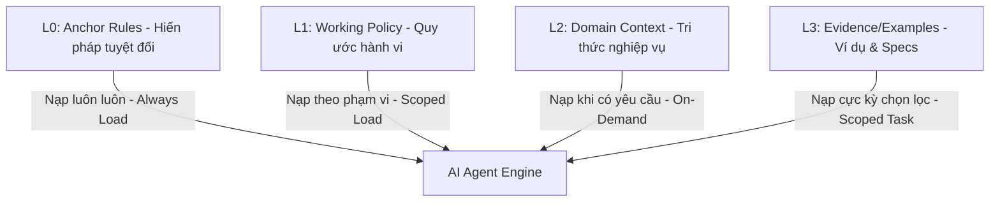

# Chắt Lọc Tri Thức: Mô Hình Phân Tầng 4 Lớp & Chiến Lược Bộc Lộ Lũy Tiến (Progressive Disclosure)

> **Mã tài nguyên**: KD-RES-02
> **Mục tiêu**: Định nghĩa cấu trúc phân tầng tri thức hiệu quả, tối ưu hóa cửa sổ ngữ cảnh (context window) của AI thông qua mô hình nạp động theo nhu cầu và tiêu chuẩn chỉ mục `llms.txt`.

---

## 1. Mô Hình Phân Tầng 4 Lớp Tri Thức (4-Layer Knowledge Model)

Khi dự án hoặc nghiệp vụ phình to, việc nhồi nhét tất cả thông tin vào một file prompt duy nhất (Monolithic Prompt) sẽ dẫn đến việc AI bị quá tải, suy giảm khả năng tập trung vào các chỉ thị cốt lõi (nhạt nhòa ngữ cảnh ở giữa - Lost in the Middle).

Giải pháp là phân tách tri thức thành 4 lớp rõ rệt:



### Chi tiết các lớp tri thức:

| Lớp Tri Thức | Tên gọi & Mục đích | Vị trí lưu trữ | Định dạng tối ưu | Token Budget Khuyến Nghị |
|:---|:---|:---|:---|:---|
| **L0** | **Anchor Rules (Luật Neo Nền Tảng)**<br>Hiến pháp, mục tiêu tối thượng, giới hạn an toàn tuyệt đối, anti-goals. | `CLAUDE.md`, `AGENT.md` hoặc System Prompt | Markdown ngắn + YAML cô đặc + XML boundary | **150 - 400 tokens**<br>(Cực kỳ cô đọng) |
| **L1** | **Working Policy (Quy ước Hành vi)**<br>Quy ước viết code, quy tắc gọi công cụ (tool rules), quy trình kiểm duyệt (review rules), hợp đồng đầu ra. | `.claude/rules/`, `policy/` | YAML chủ đạo + Markdown ngắn | **400 - 1200 tokens** |
| **L2** | **Domain Context (Tri thức Nghiệp vụ)**<br>Kiến trúc hệ thống, sơ đồ nghiệp vụ, thuật ngữ chuyên ngành (glossary), quyết định thiết kế (ADR). | `docs/domains/`, `knowledge/` | Markdown giàu chi tiết + Sơ đồ Mermaid + Bảng dữ liệu | **600 - 2500 tokens** |
| **L3** | **Evidence & Examples (Mẫu thực tế)**<br>Mã nguồn ví dụ (good/bad code), dữ liệu kiểm thử (fixtures), tài liệu RAG thô, log lỗi chi tiết. | `examples/`, `specs/`, `fixtures/` | XML wrapper bên ngoài + Code thô bên trong | **300 - 2000 tokens** (Chỉ nạp tệp liên quan trực tiếp đến task) |

---

## 2. Chiến Lược Bộc Lộ Lũy Tiến (Progressive Disclosure - PD)

Chiến lược này quy định cách nạp tri thức vào ngữ cảnh của AI theo đúng thời điểm cần thiết, tránh lãng phí token và tài nguyên hệ thống.

```yaml
progressive_disclosure_strategy:
  tiers:
    tier_1_mandatory:
      name: "Nạp Bắt Buộc (At Boot)"
      when: "Ngay khi AI Agent khởi động và nhận diện task."
      files:
        - "L0: CLAUDE.md (Hiến pháp dự án)"
        - "Cấu hình meta-rules cơ bản"
      impact: "Đảm bảo AI luôn đi đúng hướng, hiểu rõ ranh giới an toàn tối cao."

    tier_2_conditional:
      name: "Nạp Có Điều Kiện (Phase-Scoped)"
      when: "Khi AI chuyển sang các phase làm việc chuyên sâu cụ thể."
      files:
        - "L1: Các file Working Policy theo công nghệ (ví dụ: frontend.md, backend.md)"
        - "L2: Tri thức domain cụ thể của tính năng đang xử lý"
      impact: "Cung cấp đủ kiến thức nghiệp vụ sâu sắc để giải quyết vấn đề mà không bị loãng bởi các thông tin của các module khác."

    tier_3_optional:
      name: "Nạp Theo Yêu Cầu (On-Demand / Task-Specific)"
      when: "Khi AI chuẩn bị thực thi viết code hoặc ghi file kết quả."
      files:
        - "L3: Ví dụ mẫu (code exemplars), specs kỹ thuật chi tiết của ticket"
        - "Dữ liệu logs hoặc tài liệu cào quét từ bên ngoài"
      impact: "Cung cấp đối chứng thực tế để AI đối chiếu cấu trúc đầu ra chuẩn xác 100%."
```

---

## 3. Tiêu Chuẩn Chỉ Mục `llms.txt` Cho AI Agent

`llms.txt` là một chuẩn hóa mới xuất hiện nhưng cực kỳ mạnh mẽ, đóng vai trò như một **bản đồ chỉ mục tri thức (knowledge index map)** nằm ở thư mục gốc của dự án hoặc tài liệu. Khi một AI Agent tiếp cận codebase, nó sẽ tự động đọc `llms.txt` để biết chính xác những tài nguyên nào đang có sẵn và đường dẫn của chúng.

### Cấu trúc chuẩn của một tệp `llms.txt`:

```markdown
# [Tên dự án hoặc Kỹ năng] — AI Knowledge Index

> Bản đồ tri thức giúp AI Agent tự động định tuyến và nạp ngữ cảnh phù hợp.

## Core Guides (L0 & L1)
- [CLAUDE.md](file:///home/steve/Work-space/deep_work_by_steve/CLAUDE.md): Luật neo nền tảng và nguyên tắc phát triển.
- [.claude/rules/backend.md](file:///home/steve/Work-space/deep_work_by_steve/.claude/rules/backend.md): Quy ước viết mã Backend Node.js/TypeScript.
- [skills/rebuild/skill-explorer/SKILL.md](file:///home/steve/Work-space/deep_work_by_steve/skills/rebuild/skill-explorer/SKILL.md): Quy trình khảo sát nghiệp vụ chi tiết.

## Domain Knowledge (L2)
- [docs/architecture/data-flow.md](file:///home/steve/Work-space/deep_work_by_steve/docs/architecture/data-flow.md): Sơ đồ luồng dữ liệu của hệ thống.
- [docs/domains/payment-rules.md](file:///home/steve/Work-space/deep_work_by_steve/docs/domains/payment-rules.md): Nghiệp vụ xử lý thanh toán và retry.

## Examples & Checklists (L3)
- [examples/perfect-api.ts](file:///home/steve/Work-space/deep_work_by_steve/examples/perfect-api.ts): Code mẫu chuẩn thiết kế RESTful API.
- [loop/verification-checklist.md](file:///home/steve/Work-space/deep_work_by_steve/loop/verification-checklist.md): Checklist nghiệm thu trước khi hoàn thành task.
```

### Lợi ích tối thượng của `llms.txt`:
1. **Khám phá tài liệu tự động (Auto-discovery)**: AI không cần dùng `find_by_name` mò mẫm khắp nơi, tiết kiệm hàng chục tool calls và hàng ngàn tokens.
2. **Định tuyến thông minh (Smart Context Routing)**: AI tự động phân tích task hiện tại, so khớp với danh sách trong `llms.txt` và chỉ nạp đúng file cần thiết.
3. **Độ tin cậy tri thức cao**: Hạn chế tối đa việc AI tự suy đoán (hallucinate) các file tài liệu không có thực trong dự án.
