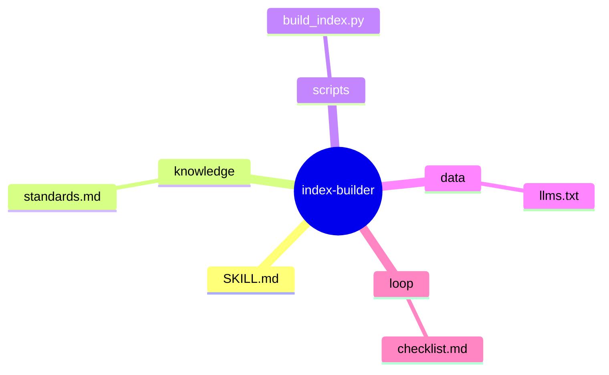
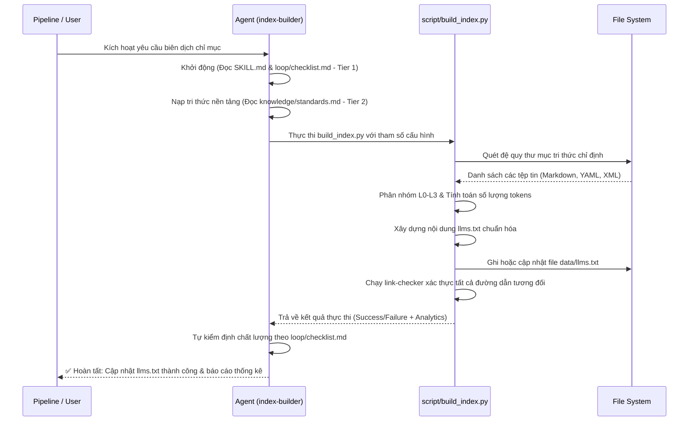

# index-builder — Phân Rã Kiến Trúc Micro-Skill

> **Khởi tạo**: 2026-05-25
> **Nguồn gốc**: Báo cáo Stage 0 của master skill 'knowledge-distiller'
> **Bản đồ chỉ dẫn cha**: [master-exploration](file:///home/steve/Work-space/deep_work_by_steve/.skill-context/knowledge-distiller/exploration.md)
> **Quy tắc đệ quy**: [CẤM PHÂN RÃ] Đây là nút lá của hệ thống.

---

## 1. Problem Statement

### A. Vấn đề thực tế (Pain Points)
Kế thừa từ Master Skill 'knowledge-distiller' để giải quyết độc lập tác vụ chuyên biệt sau:
- **Sự phân tán tri thức**: Tài liệu và tri thức nghiệp vụ của dự án sau khi qua các bước cào quét và chuyển đổi bị lưu trữ rời rạc. AI Agent rất khó tự tìm kiếm và định vị các file này nếu không có một chỉ mục rõ ràng.
- **Quá tải ngữ cảnh (Context Bloat)**: Nạp tất cả tài liệu vào ngữ cảnh cùng một lúc làm tăng chi phí token và làm AI dễ bỏ sót thông tin quan trọng.
- **Thiếu chuẩn hóa**: AI Agent cần một tệp chỉ mục tiêu chuẩn `llms.txt` để tự động hóa việc khám phá và định tuyến tài nguyên mà không cần gọi nhiều câu lệnh tìm kiếm tốn kém.

### B. Vai trò trong Orchestration Flow
`index-builder` đóng vai trò là micro-skill chặng cuối (Phase 4) của pipeline `knowledge-distiller`. Nó nhận các file tri thức đã qua kiểm định an toàn từ `sandbox-validator`, biên dịch chúng, sinh ra tệp chỉ mục điều hướng `data/llms.txt`, đồng thời đồng bộ hóa ngữ cảnh để các AI Agents hạ nguồn có thể sử dụng ngay lập tức.

---

## 2. Capability Map

### 2.1 Tri thức (Knowledge — Pillar 1)
- **Tiêu chuẩn llms.txt**: Hiểu rõ định dạng Markdown chuẩn của `llms.txt` cho AI (chia thành các mục: Core Guides, Domain Knowledge, Examples & Checklists).
- **Phân tầng tri thức**: Quản lý tri thức theo mô hình 4 lớp (L0: Anchor, L1: Policy, L2: Domain, L3: Examples) và Token Budget tương ứng.
- **Tính toán Token**: Cách ước lượng dung lượng token của các file tri thức để thống kê hiệu quả ngữ cảnh.
- **Ánh xạ đường dẫn**: Đảm bảo toàn bộ liên kết tương đối từ `llms.txt` đến các file tri thức trong dự án luôn chuẩn xác.

### 2.2 Quy trình (Process — Pillar 2)
1. **Đọc đầu vào**: Thu nhận danh sách các file tri thức an toàn từ bước trước thông qua file trung gian hoặc quét đệ quy các thư mục đích được cấu hình.
2. **Biên dịch chỉ mục**: Gọi script `scripts/build_index.py` để quét thư mục, phân loại các file tri thức thành các tầng L0-L3 tương ứng.
3. **Tính toán thống kê**: Đo kích thước file (bytes) và ước lượng số token của từng file.
4. **Sinh tệp `llms.txt`**: Biên soạn và ghi nội dung tệp `data/llms.txt` theo đúng định dạng chuẩn.
5. **Kiểm duyệt chất lượng**: Tự động chạy link-checker để đảm bảo không có liên kết đứt gãy trong `llms.txt`.
6. **Đồng bộ ngữ cảnh**: Phản hồi thông tin cập nhật cho các meta-agents hạ nguồn.

### 2.3 Kiểm soát (Guardrails — Pillar 3)
- **G1 (Pipeline Safety)**: Cấm sinh `llms.txt` nếu các bước validation trước đó trong pipeline gặp lỗi.
- **G2 (No Broken Links)**: Tuyệt đối không để xảy ra liên kết chết trong chỉ mục. Mọi link trong `llms.txt` phải trỏ tới một tệp thực tế đang tồn tại.
- **G3 (Token Control)**: Giới hạn kích thước tệp `llms.txt` không vượt quá 1000 tokens để giữ bản đồ chỉ mục luôn cô đọng và hiệu quả.

---

## 3. Zone Mapping

> ⚠️ Contract Section — Planner đọc §3 để phân rã thành các Tasks.
> Mọi Zone PHẢI có thông tin chi tiết. Zone nào không dùng ghi rõ "Không dùng".

| Zone | Files cần tạo | Nội dung | Bắt buộc? |
|------|--------------|----------|-----------|
| **Core (SKILL.md)** | `SKILL.md` | Persona chuyên gia biên dịch, định nghĩa các phase hoạt động, và chỉ thị AI tối thượng. | ✅ Bắt buộc |
| **Knowledge** | `knowledge/standards.md` | Tiêu chuẩn cấu trúc `llms.txt` chi tiết, quy trình phân tầng tri thức và quy định token budget. | ✅ Bắt buộc |
| **Scripts** | `scripts/build_index.py` | Script Python tự động quét thư mục tri thức, tính toán token, kiểm tra link và sinh tệp `llms.txt`. | ✅ Bắt buộc |
| **Templates** | Không dùng | N/A | ❌ Không |
| **Data** | `data/llms.txt` | Bản đồ chỉ mục điều hướng tri thức sau khi được biên dịch hoàn chỉnh. | ✅ Bắt buộc |
| **Loop** | `loop/checklist.md` | Checklist tự kiểm soát chất lượng QA đảm bảo tính đúng đắn của tệp chỉ mục. | ✅ Bắt buộc |
| **Assets** | Không dùng | N/A | ❌ Không |

---

## 4. Folder Structure

Cấu trúc thư mục của micro-skill `index-builder`:

---

## 5. Execution Flow

Luồng thực thi tuần tự của micro-skill `index-builder` được thiết kế như sau:

---

## 6. Interaction Points

Bảng định nghĩa các điểm dừng tương tác (Human-In-The-Loop) để đảm bảo an toàn:

| # | Thời điểm | Lý do dừng | Hành động của AI |
|---|-----------|-----------|-----------------|
| 1 | Trước khi lưu `llms.txt` | Phát hiện tệp tin `llms.txt` hiện tại có những chỉnh sửa thủ công quan trọng từ người dùng. | Trình bày bản so sánh (diff) và hỏi: "Chúng tôi phát hiện các mô tả thủ công trong llms.txt. Bạn có muốn giữ lại không?" |
| 2 | Khi phát hiện liên kết đứt gãy | Có tệp tin được liệt kê trong index nhưng không tồn tại trên đĩa. | Báo cáo lỗi chi tiết: "Liên kết đến [file_path] bị đứt gãy. Bạn có muốn bỏ qua hay cập nhật lại không?" |

---

## 7. Progressive Disclosure Plan

Kế hoạch nạp tri thức lũy tiến để tối ưu hóa context window:

- **Tier 1 (Mandatory - At Boot)**:
  - `SKILL.md`: Hiểu Persona, nhiệm vụ và các guardrails tối thượng.
  - `loop/checklist.md`: Hiểu tiêu chuẩn đầu ra để định hướng kết quả.
- **Tier 2 (Conditional - Executing core logic)**:
  - `knowledge/standards.md`: Chỉ nạp khi bắt đầu Phase phân tích cấu trúc và chuẩn bị biên dịch chỉ mục.
- **Tier 3 (On-Demand - Working with scripts/data)**:
  - `scripts/build_index.py`: Nạp khi cần điều chỉnh logic sinh file hoặc sửa lỗi runtime.
  - `data/llms.txt`: Nạp khi cần đối chiếu hoặc chỉnh sửa thủ công nội dung chỉ mục.

---

## 8. Risks & Blind Spots

Bản phân tích rủi ro và các phương án giảm thiểu tương ứng:

| # | Rủi ro tiềm ẩn | Mức độ | Phương án giảm thiểu (Mitigation) |
|---|----------------|--------|-----------------------------------|
| 1 | **Liên kết chết (Broken Links)**: Đường dẫn tương đối bị sai lệch do thay đổi cấu trúc thư mục. | **Cao** | Tích hợp bộ xác thực đường dẫn nội bộ trong `build_index.py` trước khi xuất file. |
| 2 | **Quét đệ quy vô hạn**: Script bị treo khi quét các thư mục chứa symlink hoặc thư mục rác quá lớn. | **Trung bình** | Sử dụng blacklist bỏ qua các thư mục hệ thống như `.git`, `node_modules`, `.agents`, v.v. |
| 3 | **Ghi đè tri thức thủ công**: Xóa mất các mô tả tùy chỉnh mà con người đã thêm vào `llms.txt` trước đó. | **Trung bình** | Script sẽ đọc file `llms.txt` cũ, giữ lại các phần mô tả thủ công và chỉ cập nhật danh sách liên kết. |

---

## 9. Open Questions

| # | Câu hỏi | Nguồn (Phase) | Trạng thái |
|---|---------|--------------|-----------|
| 1 | Có cần sinh thêm file phụ `llms-full.txt` (gộp toàn bộ nội dung của các file hướng dẫn) không? | Phase 1 | *Đã giải quyết*: Tạm thời tập trung sinh tệp chỉ mục định hướng `llms.txt`. Nếu sau này có nhu cầu gộp tri thức đầy đủ sẽ mở rộng thêm. |
| 2 | Thư mục quét của script có nên hỗ trợ cấu hình động từ CLI không? | Phase 1 | *Đã giải quyết*: Rất cần thiết. Script `build_index.py` sẽ nhận tham số `--target-dir` để quét bất kỳ thư mục nào được chỉ định. |

---

## 10. Metadata

- **Skill Name**: index-builder
- **Created**: 2026-05-25
- **Author**: Senior Engine
- **Framework**: architect.md v3.0
- **Status**: ✅ COMPLETED
- **Handoff Checklist**:
  - [x] design.md hoàn chỉnh 100% đúng chuẩn 12 chương mục.
  - [x] Sẵn sàng chuyển tiếp sang Stage 2 (Planner).

---

## 10.1 Version & Dependencies

### Quản lý phiên bản (Version Management)
- **1.0.0**: Khởi tạo kiến trúc micro-skill `index-builder` đầu tiên.

### Phụ thuộc kỹ năng (Skill Dependencies)
- **Predecessor (Tiền nhiệm)**: `sandbox-validator` (Cung cấp các files tri thức an toàn sau khi đã qua Docker Sandbox).
- **Successor (Kế nhiệm)**: Không có (Chặng cuối cùng của pipeline `knowledge-distiller`).

---

## 11. Naming Conventions

- **Kebab-case cho thư mục**: `index-builder`
- **Snake_case cho scripts**: `build_index.py`
- **Lowercase cho file dữ liệu**: `llms.txt`
- **Quy tắc đặt tên file tri thức**: `[tên_lớp_tri_thức]/[tên_nghiệp_vu].md` (ví dụ: `knowledge/standards.md`).

---

## 12. Rollback Procedures

### Quy trình khôi phục khi xảy ra sự cố (Rollback Steps)
1. **Khôi phục trạng thái File**: Nếu tệp `llms.txt` bị hỏng hoặc sinh ra lỗi, lập tức khôi phục về phiên bản gần nhất từ Git history.
2. **Dọn dẹp rác**: Tự động xóa các file tạm thời hoặc file chỉ mục rác sinh ra trong quá trình lỗi.
3. **Ghi log & Cảnh báo**: Ghi lại chi tiết lỗi hệ thống và chuyển trạng thái của skill về `failed`, thông báo ngay lập tức cho Meta-Agent điều hành hoặc User để kích hoạt Human-in-the-loop.
