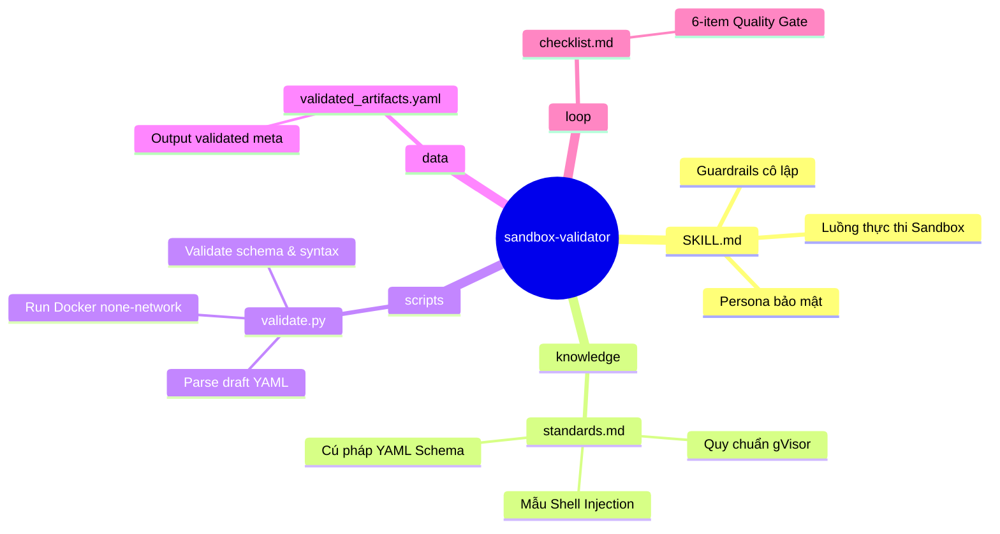
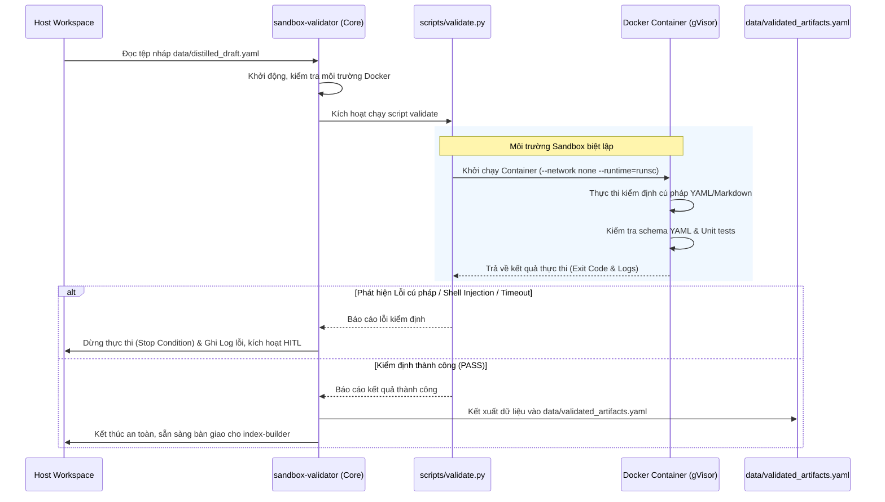

# sandbox-validator — Bản Thiết Kế Kiến Trúc Hoàn Chỉnh

> **Khởi tạo**: 2026-05-25
> **Nguồn gốc**: Báo cáo Stage 0 của master skill 'knowledge-distiller'
> **Bản đồ chỉ dẫn cha**: [master-exploration](file:///home/steve/Work-space/deep_work_by_steve/.skill-context/knowledge-distiller/exploration.md)
> **Quy tắc đệ quy**: [CẤM PHÂN RÃ] Đây là nút lá của hệ thống.

---

## 1. Problem Statement

### A. Vấn đề thực tế (Pain Points)
Khi tiến hành tự động hóa chắt lọc tri thức từ tài nguyên thô (Markdown, mã nguồn, cấu hình hệ thống), AI Agent bắt buộc phải thực hiện các bước kiểm định cú pháp, chạy schema validator, hoặc kiểm thử các mã nguồn ví dụ (L3: Examples). Tuy nhiên, việc này đối mặt với các nguy cơ bảo mật và vận hành cực kỳ nghiêm trọng:
1. **Rủi ro Prompt Injection**: Mã nguồn ví dụ hoặc dữ liệu thô do bên thứ ba tải lên có thể ẩn chứa các đoạn mã độc hại hòng chiếm quyền kiểm soát máy host, xóa tập tin hoặc lấy trộm thông tin bảo mật (SSH/AWS Credentials).
2. **Xung đột môi trường cục bộ**: Thực thi các kịch bản kiểm thử trực tiếp trên máy host dễ làm phát sinh các file rác, rò rỉ bộ nhớ hoặc gây xung đột phiên bản của các thư viện phần mềm.
3. **Thiếu kiểm soát luồng egress**: Các script kiểm thử độc hại hoặc bị inject có thể cố gắng thiết lập kết nối ra mạng ngoài để gửi dữ liệu nhạy cảm ra ngoài (Data Exfiltration).

### B. Vai trò trong Orchestration Flow
`sandbox-validator` là một micro-skill con cực kỳ quan trọng thuộc master skill `knowledge-distiller`. Nó hoạt động ở Phase 3 của pipeline:
- **Nhận đầu vào**: Tệp cấu hình tri thức nháp `data/distilled_draft.yaml` do micro-skill `format-converter` tạo ra.
- **Nhiệm vụ chính**: Đóng gói các đoạn mã, cấu hình nghiệp vụ, YAML file và đưa vào một Docker Sandbox hoàn toàn biệt lập (gVisor runtime, ngắt kết nối mạng tuyệt đối) để chạy script kiểm định `scripts/validate.py`.
- **Xuất đầu ra**: Tệp `data/validated_artifacts.yaml` chứa thông tin các tri thức đã được kiểm định an toàn 100% để chuyển tiếp cho micro-skill `index-builder` đóng gói.

---

## 2. Capability Map

### 2.1 Tri thức (Knowledge — Pillar 1)
- **Tiêu chuẩn an toàn Docker Sandbox**: Hiểu rõ cấu trúc lệnh cô lập của Docker, cơ chế gVisor (`--runtime=runsc`), cách tắt kết nối mạng hoàn toàn (`--network none`) và hạn chế tài nguyên cpu/memory.
- **Tiêu chuẩn kiểm định Schema YAML**: Nắm rõ các quy tắc cấu trúc YAML chuẩn hóa phục vụ phân tầng tri thức AI.
- **Quy tắc bảo mật Anti-Injection**: Nhận diện các mẫu câu lệnh thực thi terminal nguy hiểm trong input thô.

### 2.2 Quy trình (Process — Pillar 2)

```
Phase 1: COLLECT & INITIALIZE
├── Đọc tệp tin data/distilled_draft.yaml từ format-converter
├── Xác minh tính toàn vẹn của tệp tin nháp (draft YAML)
└── Kiểm tra sự hiện diện của Docker daemon trên máy host

Phase 2: SANDBOX RUNTIME SETUP
├── Soạn thảo và chuẩn bị môi trường chạy biệt lập Docker
├── Thiết lập tham số bảo mật cực đoan:
│   ├── gVisor runtime (--runtime=runsc)
│   ├── Khóa kết nối mạng ngoài (--network none)
│   ├── Giới hạn thời gian chạy (timeout 60 giây)
│   └── Gắn cờ tự hủy sau khi hoàn thành (--rm)
└── Chuẩn bị thư mục gắn tạm thời (mount) tối giản, CẤM mount ~/.ssh, ~/.aws

Phase 3: AUTOMATED VALIDATION
├── Thực thi scripts/validate.py bên trong Docker Sandbox để:
│   ├── Kiểm tra cú pháp YAML/JSON/Markdown
│   ├── Kiểm định tính hợp lệ của Schema YAML
│   └── Thực thi thử nghiệm unit tests của các đoạn mã ví dụ (nếu có)
└── Ghi nhận kết quả log chi tiết từ container

Phase 4: ARTIFACT GENERATION & HANDOFF
├── Nếu có bất kỳ lỗi cú pháp hoặc bảo mật nào:
│   ├── Ghi log chi tiết lỗi phát hiện
│   └── Dừng luồng (Stop Condition) để kích hoạt Human-in-the-loop (HITL)
└── Nếu tất cả đều PASS:
    ├── Kết xuất thông tin đã kiểm định vào data/validated_artifacts.yaml
    └── Chuyển tiếp trạng thái thành công cho index-builder
```

### 2.3 Kiểm soát (Guardrails — Pillar 3)

| ID | Luật bảo mật (Rule) | Mô tả hành vi | Cách thức kiểm định |
|----|---------------------|---------------|----------------------|
| G1 | Network Isolation | Cấm tuyệt đối kết nối mạng ngoài của container | Sử dụng tham số `--network none` khi run Docker |
| G2 | Execution Timeout | Giới hạn thời gian thực thi tối đa là 60 giây | Thiết lập timeout cứng trong script Python điều khiển |
| G3 | gVisor Runtime | Bắt buộc chạy bằng runtime gVisor nếu có sẵn | Tham số `--runtime=runsc` (nếu không có thì fallback sang default kèm cảnh báo) |
| G4 | Safe Mounts | Tuyệt đối cấm mount các thư mục nhạy cảm của máy host | Quét chuỗi tham số mount để từ chối `~/.ssh`, `~/.aws`, `/etc` |
| G5 | Strict Error Gate | Phát hiện lỗi schema/syntax là dừng ngay lập tức | Exit code != 0 của script validate sẽ kích hoạt Stop Condition |
| G6 | Anti-Injection | Quét thô tìm các từ khóa shell injection độc hại trong YAML | Sử dụng regex lọc các câu lệnh nguy hiểm |

---

## 3. Zone Mapping

Bản đồ quy hoạch 7 Zones kiến trúc của `sandbox-validator`:

| Zone | Files cần tạo | Nội dung | Bắt buộc? |
|------|--------------|----------|-----------|
| **Core (SKILL.md)** | `SKILL.md` | Persona chuyên gia bảo mật sandbox, quy định workflow và cách thức điều khiển Docker | ✅ Bắt buộc |
| **Knowledge** | `knowledge/standards.md` | Đặc tả quy chuẩn kỹ thuật an toàn của gVisor, cấu trúc schema và các lỗ hổng shell injection | ✅ Bắt buộc |
| **Scripts** | `scripts/validate.py` | Script Python thực thi kiểm định cú pháp, cấu trúc schema YAML và chạy tests trong Docker | ✅ Bắt buộc |
| **Templates** | Không cần | Không sử dụng template cho micro-skill này | ❌ Không |
| **Data** | `data/validated_artifacts.yaml` | Tệp lưu trữ kết quả và danh sách các tri thức đã được kiểm định an toàn thành công | ✅ Bắt buộc |
| **Loop** | `loop/checklist.md` | Bộ checklist 6 chỉ tiêu QA để tự kiểm tra chất lượng trước khi hoàn thành | ✅ Bắt buộc |
| **Assets** | Không cần | Không sử dụng assets | ❌ Không |

---

## 4. Folder Structure

Cấu trúc thư mục của micro-skill `sandbox-validator` được quy hoạch như sau:



---

## 5. Execution Flow

Quy trình tuần tự tương tác giữa các Zone của `sandbox-validator` và môi trường ngoài:



---

## 6. Interaction Points

Bảng định nghĩa các điểm tương tác dừng luồng (HITL) hoặc khôi phục (Fallback):

| # | Thời điểm xảy ra | Lý do dừng/xử lý | Hành động của AI Agent |
|---|------------------|-------------------|-------------------------|
| 1 | Phase 1: Bắt đầu | Không tìm thấy Docker daemon trên hệ thống | Đưa ra cảnh báo, chuyển sang chế độ **Local Fallback Mode** (chỉ chạy kiểm định cú pháp local bằng Python, KHÔNG chạy mã ví dụ L3, đánh dấu trạng thái *local-only*). |
| 2 | Phase 3: Thực thi | Phát hiện lỗi cú pháp YAML hoặc vi phạm Schema | Ghi log chi tiết lỗi (dòng bị lỗi, thuộc tính không khớp), dừng luồng, chuyển giao thông báo cho người dùng sửa lại bản nháp. |
| 3 | Phase 3: Thực thi | Phát hiện mẫu Shell Injection nguy hại trong dữ liệu thô | Ghi cảnh báo bảo mật mức Đỏ (Severity: CRITICAL), cách ly tệp tin nháp, dừng luồng lập tức và yêu cầu người dùng xác nhận an toàn. |
| 4 | Phase 3: Thực thi | Thực thi bị quá hạn 60 giây (Timeout) | Buộc kill container Docker, ghi log lỗi timeout và dừng luồng. |

---

## 7. Progressive Disclosure Plan

Chiến lược nạp ngữ cảnh từng bước nhằm tiết kiệm Token tối đa:

### Tier 1: Nạp khi Boot (Mandatory)
- `SKILL.md`: Chứa Persona và quy định điều khiển lõi của Sandbox.
- `loop/checklist.md`: Checklist QA để kiểm soát chất lượng đầu ra ngay từ đầu.

### Tier 2: Nạp khi phân tích và thực thi (Conditional)
- `knowledge/standards.md`: Chỉ tải khi bắt đầu quá trình phân tích an toàn gVisor và biên soạn schema.
- `scripts/validate.py`: Chỉ nạp khi bắt đầu giai đoạn gọi tool chạy Docker Sandbox validation.

### Tier 3: Nạp khi kết xuất (On-Demand)
- `data/validated_artifacts.yaml`: Chỉ nạp và ghi dữ liệu khi tất cả các bài test kiểm định trong container đã vượt qua thành công.

---

## 8. Risks & Blind Spots

Bảng quản lý rủi ro và các điểm mù trong kiến trúc:

| # | Rủi ro tiềm ẩn (Risk) | Mức độ | Giải pháp giảm thiểu (Mitigation) |
|---|----------------------|--------|-----------------------------------|
| 1 | gVisor runtime (`runsc`) chưa được cài đặt trên Docker của Host | **Trung bình** | Script `validate.py` tự động phát hiện nếu thiếu `runsc` và tự động fallback sang Docker default kèm thông báo cảnh báo bảo mật. |
| 2 | Cố tình phá hoại qua các lệnh Docker lồng nhau (Docker-in-Docker) | **Cao** | Cấm mount socket Docker (`/var/run/docker.sock`) vào container để triệt tiêu hoàn toàn khả năng điều khiển Docker từ bên trong. |
| 3 | Tràn dung lượng lưu trữ do container tạo quá nhiều file tạm | **Thấp** | Luôn áp dụng cờ `--rm` khi chạy Docker để container tự động bị xóa bỏ sạch sẽ ngay sau khi dừng. |
| 4 | Kích thước file nháp `data/distilled_draft.yaml` vượt quá token budget | **Trung bình** | Áp dụng parser phân dòng thông minh để xử lý chunking dữ liệu, tránh load toàn bộ file lớn vào bộ nhớ prompt. |

---

## 9. Open Questions

| # | Câu hỏi nghiên cứu | Nguồn phát sinh | Trạng thái |
|---|-------------------|-----------------|------------|
| 1 | Có nên hỗ trợ validator cho các ngôn ngữ khác ngoài Python không? | Phase 3 | ✅ Đã giải quyết: Tạm thời chỉ hỗ trợ kiểm định cú pháp YAML/Markdown/JSON và chạy unit test Python. Các ngôn ngữ khác sẽ là cải tiến tương lai. |
| 2 | Làm sao để xử lý mount file an toàn trên môi trường Windows (nếu có)? | Phase 2 | ✅ Đã giải quyết: Tập trung tối đa vào môi trường Linux/macOS theo tệp luật của user. Trên Windows sẽ sử dụng WSL2. |

---

## 10. Metadata

- **Skill Name**: sandbox-validator
- **Created**: 2026-05-25
- **Author**: Steve (Senior Architect)
- **Framework**: architect.md v3.0
- **Status**: ready_for_planner
- **Version**: 3.0.0
- **Handoff Checklist**:
  - [x] design.md hoàn thiện đầy đủ 12 chương mục.
  - [x] Frontmatter khớp 100% với JSON Schema.
  - [x] Cập nhật Zone Mapping chỉ định đúng validate.py và validated_artifacts.yaml.
  - [x] Đã sẵn sàng chuyển giao cho Stage 2 (Planner).

---

## 10.1 Version & Dependencies

### Quản lý phiên bản (Version Management)
```
MAJOR.MINOR.PATCH
- MAJOR: Thay đổi lớn về kiến trúc cô lập Sandbox hoặc thay đổi Input/Output contract.
- MINOR: Bổ sung thêm tính năng kiểm định schema mới, thêm thư viện kiểm tra cú pháp.
- PATCH: Fix bug nhỏ trong scripts/validate.py, cập nhật checklist loop.
```
- **Phiên bản hiện tại**: 3.0.0 (Bản phát hành đầu tiên dưới dạng Micro-skill biệt lập trong pipeline `knowledge-distiller`).

### Các phụ thuộc (Dependencies)
- **Tiền nhiệm (Predecessor)**: `format-converter` (Cung cấp file nháp `data/distilled_draft.yaml`).
- **Hậu nhiệm (Successor)**: `index-builder` (Nhận file an toàn `data/validated_artifacts.yaml` để đóng gói).
- **Môi trường yêu cầu (Requirements)**: Docker Daemon (tùy chọn gVisor runtime).

---

## 11. Naming Conventions

### Tên thư mục & Tệp tin
- Tên thư mục chính: `sandbox-validator` (chữ thường, nối nhau bằng dấu gạch ngang - kebab-case).
- Scripts: `action.py` -> `validate.py` (chữ thường, ngắn gọn).
- Tài liệu học thuật: `standards.md`.
- Checklist QA: `checklist.md`.

### Quy ước trong mã nguồn Python
- Tên biến & Hàm: Sử dụng kiểu `snake_case` (ví dụ: `run_sandbox_validation()`, `check_yaml_syntax()`).
- Tên lớp (Classes): Sử dụng kiểu `PascalCase` (ví dụ: `SandboxValidator`).
- Hằng số: Sử dụng chữ IN HOA (ví dụ: `TIMEOUT_LIMIT = 60`).

---

## 12. Rollback Procedures

### Quy trình khôi phục khi lỗi khởi động (Phase 1)
- **Dấu hiệu**: Docker không phản hồi hoặc thiếu Docker daemon.
- **Hành động**: Chuyển đổi trạng thái sang `Local Fallback Mode`, ghi nhận cảnh báo và chỉ thực hiện validate tĩnh (static linting) trực tiếp trên máy host mà không chạy mã nguồn kiểm thử.

### Quy trình khôi phục khi lỗi thực thi (Phase 2 & 3)
- **Dấu hiệu**: Container bị đứng (hang), rò rỉ bộ nhớ hoặc lỗi timeout.
- **Hành động**: 
  1. Gửi lệnh SIGKILL để cưỡng bức dừng container Docker đang chạy.
  2. Dọn dẹp các container bị treo bằng lệnh `docker rm -f`.
  3. Ghi log nguyên nhân lỗi (Timeout hoặc Over-resource).
  4. Trả về mã lỗi cho hệ thống điều khiển và dừng luồng.

### Quy trình khôi phục khi dữ liệu đầu ra lỗi (Phase 4)
- **Dấu hiệu**: File `data/validated_artifacts.yaml` bị hỏng cấu trúc hoặc trống rỗng.
- **Hành động**: Khôi phục lại phiên bản backup gần nhất của file dữ liệu hoặc xóa bỏ file hỏng và yêu cầu chạy lại pipeline từ Phase 2.
