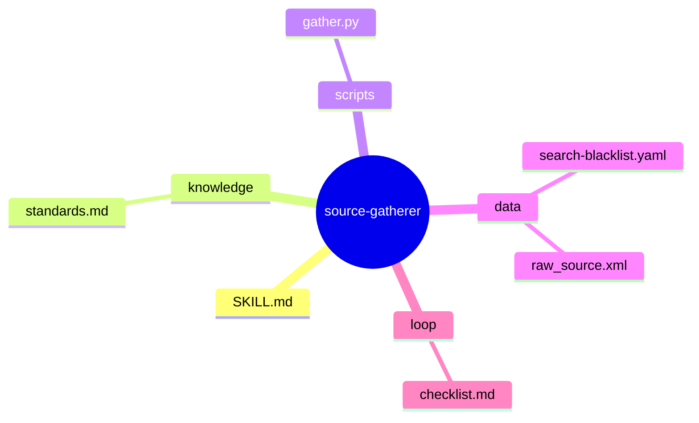
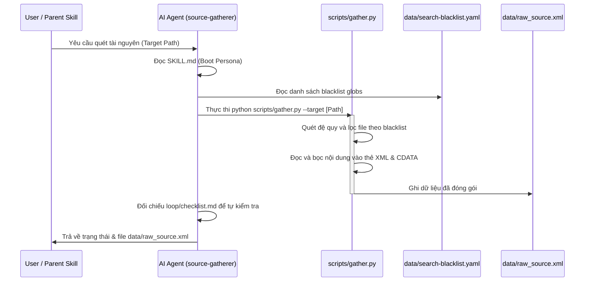

# source-gatherer — Phân Rã Kiến Trúc Micro-Skill

> **Khởi tạo**: 2026-05-25
> **Nguồn gốc**: Báo cáo Stage 0 của master skill 'knowledge-distiller'
> **Bản đồ chỉ dẫn cha**: [master-exploration](file:///home/steve/Work-space/deep_work_by_steve/.skill-context/knowledge-distiller/exploration.md)
> **Quy tắc đệ quy**: [CẤM PHÂN RÃ] Đây là nút lá của hệ thống.

---

## 1. Phát biểu vấn đề (Problem Statement)

**Vấn đề (Pain Points)**:
Trong quy trình chắt lọc tri thức (Knowledge Distillation) tự động, dữ liệu thô (raw documentation, source code, web pages) thường rất hỗn tạp, chứa nhiều thông tin nhiễu (log files, build artifacts, node_modules) và đặc biệt là rủi ro bị Prompt Injection thông qua các câu lệnh phá hoại được nhúng trong tài liệu nguồn. Nếu không có cơ chế thu thập an sau, lọc nhiễu chủ động và bọc ranh giới dữ liệu rõ ràng, AI Agent hạ nguồn dễ bị đánh lừa hoặc bị quá tải ngữ cảnh dẫn đến suy đoán mơ hồ (hallucination).

**Người dùng (Target Audience)**:
Các AI Agent phát triển phần mềm tự động trong pipeline hoặc các nhà phát triển hệ thống AI cần thu thập dữ liệu sạch, an toàn từ codebase và web để huấn luyện hoặc làm ngữ cảnh (context) cho LLMs.

**Lý do cần thiết (Value Proposition)**:
Micro-skill `source-gatherer` giải quyết triệt để vấn đề này bằng cách tự động hóa quy trình:
1. Quét codebase/tài nguyên đệ quy dựa trên cấu hình loại trừ (blacklist patterns) xác định trước.
2. Trích xuất và làm sạch dữ liệu thô một cách có kiểm soát.
3. Bọc ranh giới dữ liệu thô bằng các thẻ XML bảo mật (`<external_input>`), ngăn chặn triệt để Prompt Injection.
4. Xuất dữ liệu sạch chuẩn hóa dưới dạng XML để làm đầu vào an toàn cho các micro-skills tiếp theo trong hệ thống.

---

## 2. Bản đồ năng lực (Capability Map)

### 2.1 Tri thức (Knowledge — Pillar 1)
Micro-skill cần nắm vững các tri thức nghiệp vụ sau:
- **Nguyên tắc an toàn dữ liệu đầu vào (Data Isolation)**: Cách sử dụng XML boundaries để đóng gói dữ liệu thô, ngăn chặn LLM diễn giải dữ liệu thành lệnh điều khiển.
- **Tiêu chuẩn lọc nhiễu (Noise Filtering)**: Hiểu và phân loại các tệp tin rác, các thư mục build, dependencies, hoặc các định dạng nhị phân không cần thiết trong phát triển phần mềm để loại bỏ hiệu quả.
- **Quản lý Token Economics**: Nhận thức về dung lượng tệp tin và giới hạn token để tránh đưa các tệp tin quá lớn hoặc không phù hợp vào ngữ cảnh.

### 2.2 Quy trình (Process — Pillar 2)
Quy trình thực thi gồm các bước tuần tự rõ ràng:
1. **Boot**: Đọc `SKILL.md` và kiểm tra môi trường chạy.
2. **Load Configuration**: Nạp danh sách blacklist từ `data/search-blacklist.yaml`.
3. **Scan & Filter**: Thực hiện quét đệ quy thư mục mục tiêu, đối chiếu từng đường dẫn tệp tin với danh sách blacklist. Bỏ qua các tệp tin khớp với blacklist hoặc các tệp tin nhị phân lớn.
4. **Wrap & Package**: Đọc nội dung của các tệp tin hợp lệ, bọc nội dung trong thẻ CDATA của XML và đóng gói tất cả vào cấu trúc thẻ `<external_input>`.
5. **Output**: Ghi dữ liệu đã đóng gói vào `data/raw_source.xml` và trả về kết quả thống kê.

### 2.3 Kiểm soát (Guardrails — Pillar 3)
Các cơ chế bảo mật và chất lượng:
- **Chống Prompt Injection**: Bắt buộc bọc 100% nội dung thô trong thẻ `<external_input>` và CDATA block. Thêm chỉ thị hệ thống cấm LLM diễn giải bất kỳ nội dung nào bên trong thẻ này.
- **Giới hạn kích thước**: Không quét các tệp tin có kích thước lớn vượt ngưỡng quy định (mặc định > 500KB) trừ khi có cấu hình đặc biệt.
- **Lọc đường dẫn an toàn**: Ngăn chặn tuyệt đối việc sử dụng đường dẫn tuyệt đối hoặc chứa `..` để tránh lỗ hổng Directory Traversal khi quét.

---

## 3. Zone Mapping

| Zone | Files cần tạo | Nội dung | Bắt buộc? |
|------|--------------|----------|-----------|
| Core (SKILL.md) | `SKILL.md` | Persona, phases, guardrails | ✅ |
| Knowledge | `knowledge/standards.md` | Tri thức domain, tiêu chuẩn kỹ thuật | ✅ |
| Scripts | `scripts/gather.py` | Automation tools, deterministic tasks | ✅ |
| Templates | Không cần | N/A | ❌ |
| Data | `data/search-blacklist.yaml`, `data/raw_source.xml` | Config tĩnh, schema definitions | ✅ |
| Loop | `loop/checklist.md` | Checklist, verify rules, test cases | ✅ |
| Assets | Không cần | N/A | ❌ |

---

## 4. Cấu trúc thư mục (Folder Structure)

---

## 5. Luồng thực thi (Execution Flow)

---

## 6. Các điểm tương tác (Interaction Points)

| # | Thời điểm | Lý do dừng | Hành động của AI |
|---|-----------|-----------|-----------------|
| 1 | Trước khi quét | Nếu đường dẫn mục tiêu không tồn tại hoặc rỗng | Dừng lại, báo cáo lỗi và yêu cầu người dùng cung cấp đường dẫn hợp lệ. |
| 2 | Sau khi quét | Nếu không tìm thấy bất kỳ tệp tin hợp lệ nào (tất cả bị lọc hoặc thư mục trống) | Dừng lại, ghi log và hỏi người dùng có muốn điều chỉnh blacklist không. |

---

## 7. Kế hoạch bộc lộ lũy tiến (Progressive Disclosure Plan)

### Tier 1: Bắt buộc đọc (Mandatory)
- `SKILL.md`: Persona cào quét, quy trình cốt lõi và các chỉ thị an toàn.
- `loop/checklist.md`: Các tiêu chí chất lượng bắt buộc phải tự kiểm tra trước khi hoàn thành.

### Tier 2: Đọc khi cần (Conditional)
- `knowledge/standards.md`: Đọc khi cần hiểu rõ sâu hơn về tiêu chuẩn kỹ thuật bọc XML chống Prompt Injection.
- `data/search-blacklist.yaml`: Tham chiếu khi cần sửa đổi cấu hình loại trừ tệp tin.

---

## 8. Rủi ro & Điểm mù (Risks & Blind Spots)

| # | Rủi ro (Risk) | Mức độ | Giải pháp giảm thiểu (Mitigation) |
|---|---------------|--------|-----------------------------------|
| 1 | Prompt Injection từ tài liệu nguồn đánh lừa AI thực thi mã độc. | Nghiêm trọng | Sử dụng CDATA block trong XML và chỉ thị hệ thống nghiêm ngặt cấm thực thi câu lệnh bên trong thẻ `<external_input>`. |
| 2 | Quét phải tệp tin nhị phân lớn (PDF, hình ảnh) gây tràn bộ nhớ hoặc lãng phí token. | Cao | Chỉ đọc các tệp tin văn bản (text), giới hạn kích thước tệp tin quét tối đa (< 500KB) và tự động bỏ qua định dạng nhị phân. |
| 3 | Lỗi Directory Traversal khi quét đường dẫn độc hại. | Trung bình | Chuẩn hóa đường dẫn bằng `os.path.abspath` và xác thực đường dẫn mục tiêu nằm trong phạm vi cho phép trước khi quét. |

---

## 9. Câu hỏi mở (Open Questions)

| # | Câu hỏi | Nguồn (Phase) | Trạng thái |
|---|---------|--------------|-----------|
| 1 | Có nên hỗ trợ cào quét trực tiếp các URL trên Web trong phiên bản này không? | Phase Architect | ❓ Chưa rõ (Hiện tại ưu tiên quét codebase nội bộ trước, tích hợp web-scraper trong tương lai). |

---

## 10. Metadata

- **Skill Name**: source-gatherer
- **Created**: 2026-05-25
- **Author**: Senior Architect
- **Framework**: architect.md v3.0
- **Status**: ready_for_planner
- **Handoff Checklist**:
  - [x] design.md hoàn thiện (checklist pass)
  - [x] Sẵn sàng cho skill-planner

---

## 10.1 Phiên bản & Phụ thuộc (Version & Dependencies)

### Quản lý phiên bản (Version Management)
Phiên bản hiện tại: `1.0.0`
- Tuân thủ Semantic Versioning (MAJOR.MINOR.PATCH).
- Thay đổi cấu trúc XML boundary hoặc thêm cơ chế lọc mới sẽ tăng MINOR.
- Sửa lỗi nhỏ hoặc cập nhật tài liệu sẽ tăng PATCH.

### Quan hệ phụ thuộc (Skill Dependencies)
- **Kỹ năng tiền nhiệm**: Không có (Đây là điểm bắt đầu của pipeline `knowledge-distiller`).
- **Kỹ năng kế nhiệm**: `format-converter` (Tiêu thụ tệp `data/raw_source.xml` để chuyển đổi định dạng).

---

## 11. Quy ước đặt tên (Naming Conventions)

- **Kỹ năng con**: `source-gatherer` (Kebab-case).
- **Tệp mã nguồn**: `scripts/gather.py` (Kebab-case cho thư mục, snake_case cho hành động/script Python nếu cần, hoặc tên trực diện đơn giản).
- **Tệp dữ liệu**: `data/search-blacklist.yaml`, `data/raw_source.xml`.
- **Thẻ XML bảo mật**: `<external_input>` (Chứa toàn bộ dữ liệu cào quét).
- **Thẻ tệp tin con**: `<file path="..." size="...">` (Chứa nội dung từng tệp tin).

---

## 12. Quy trình Rollback (Rollback Procedures)

### Rollback khi lỗi quét
Nếu quá trình quét hoặc ghi tệp `data/raw_source.xml` bị lỗi giữa chừng:
1. Xóa bỏ tệp `data/raw_source.xml` bị lỗi/hỏng.
2. Trả trạng thái Agent về trạng thái khởi tạo (Boot state).
3. Ghi nhận log chi tiết nguyên nhân lỗi (ví dụ: quyền truy cập, ổ đĩa đầy).
4. Báo cáo lên Parent Agent hoặc người dùng để xử lý thủ công.
