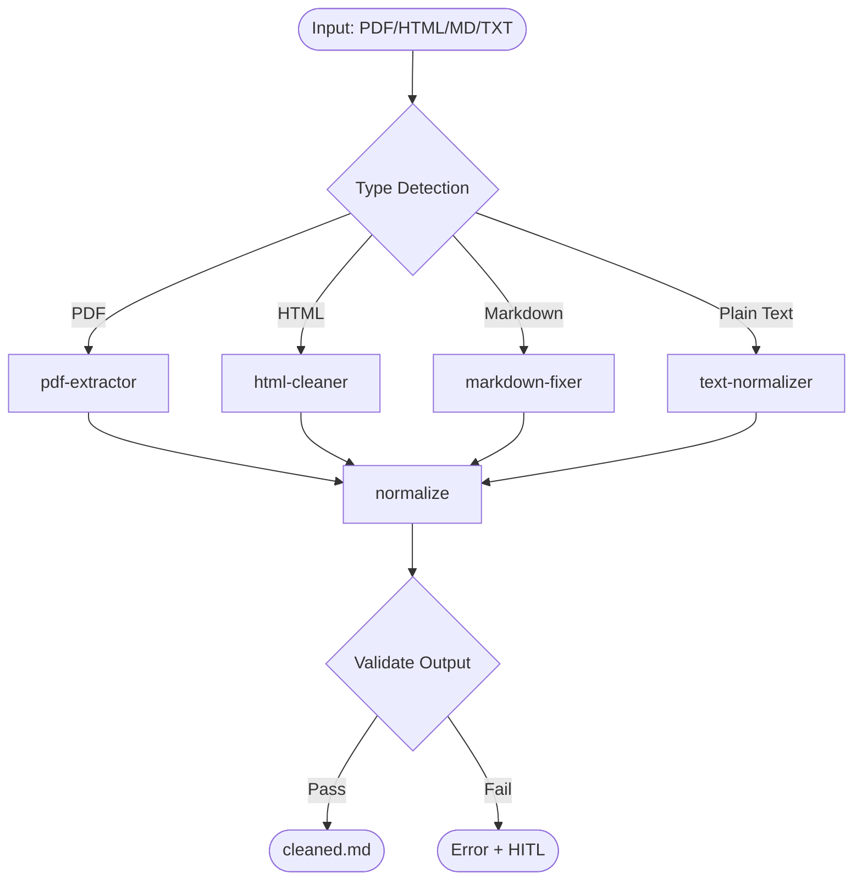
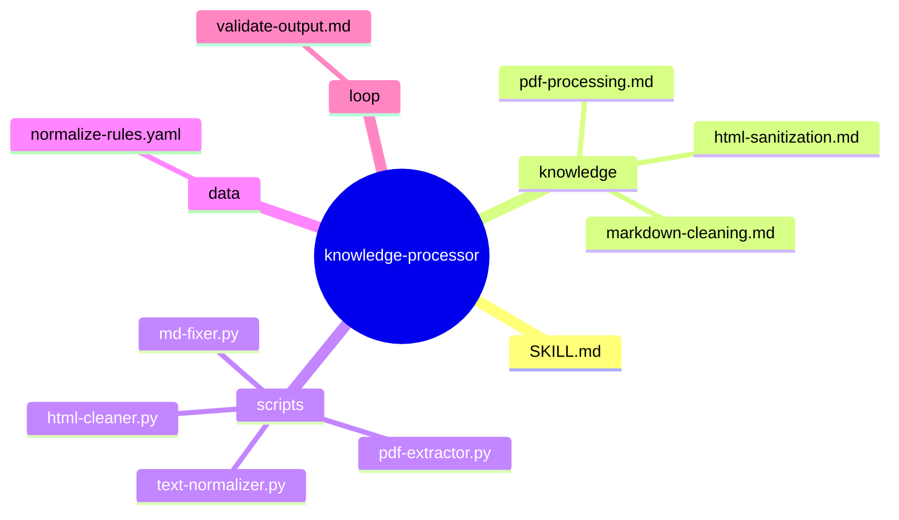
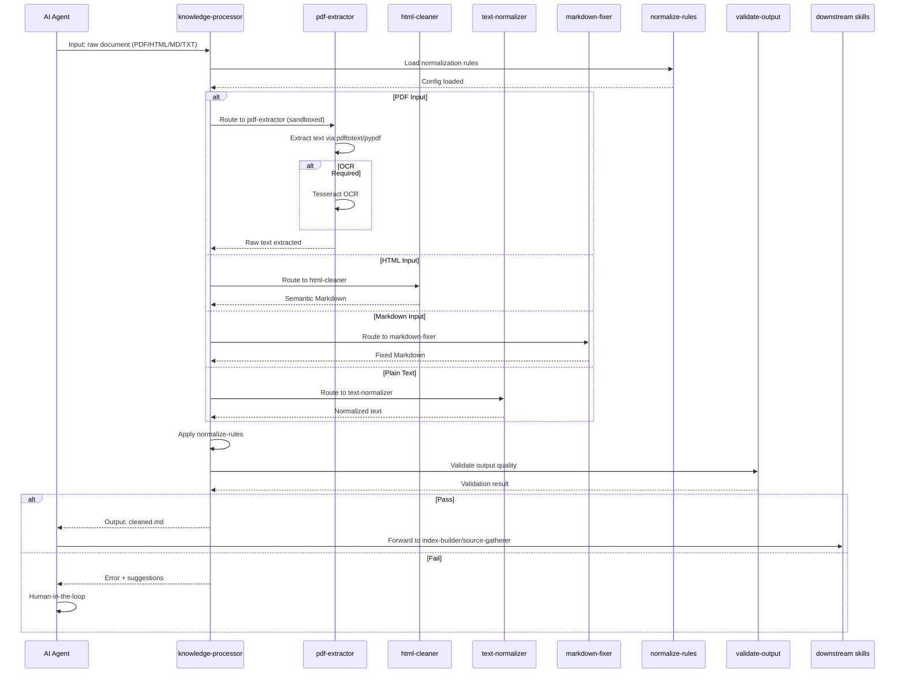

# knowledge-processor — Architecture Design

> Generated by skill-architect | 2026-05-26
> Status: 🔵 IN PROGRESS
> SCS Score: 3.4 > 3.0 — **MANDATORY DECOMPOSITION** into 4 micro-skills

---

## 1. Problem Statement

[TỪ EXPLORATION §1, §4]

**Pain Point**: AI agents cần xử lý tài liệu thô từ nhiều nguồn (PDF, HTML, Markdown, Plain Text) nhưng gặp khó khăn:
- PDF chứa bảng, hình ảnh, footnote khó trích xuất sạch
- Markdown từ nhiều nguồn có định dạng không đồng nhất
- Text thuần thiếu cấu trúc semantic
- Raw documents có thể chứa malicious scripts hoặc code injection

[TỪ EXPLORATION §1]

**User**: Các skill AI downstream (`index-builder`, `source-gatherer`, RAG pipelines) cần cleaned Markdown để index hoặc phân tích.

[TỪ EXPLORATION §1]

**Expected Output**: 4 micro-skills chuyên biệt (pdf-extractor, html-cleaner, text-normalizer, markdown-fixer) xử lý đầu vào và output Markdown thuần chuẩn hóa.

[TỪ EXPLORATION §4]

**Trigger Keywords**: "xử lý tài liệu", "PDF", "trích xuất nội dung", "làm sạch markdown", "chuẩn hóa text"

---

## 2. Capability Map

### 2.1 Tri thức (Knowledge — Pillar 1)

[TỪ EXPLORATION §2 INPUT CONTRACT + §7]
|| # | Knowledge | Source | Format |
|---|-----------|--------|--------|
| K1 | Input type detection | exploration.md §2 | YAML |
| K2 | PDF processing patterns | knowledge/pdf-processing.md | Markdown |
| K3 | Markdown normalization rules | knowledge/markdown-cleaning.md | Markdown |
| K4 | HTML sanitization rules | knowledge/html-sanitization.md | Markdown |
| K5 | Normalization config | data/normalize-rules.yaml | YAML |

### 2.2 Quy trình (Process — Pillar 2)

[TỪ EXPLORATION §4 SCS DECOMPOSITION]


**Micro-skills Execution Model**:
| Micro-skill | Responsibility | Sandbox Required? |
|-------------|----------------|-------------------|
| pdf-extractor | Trích xuất text từ PDF | ✅ BẮT BUỘC |
| html-cleaner | Làm sạch HTML → semantic Markdown | ✅ Có |
| text-normalizer | Chuẩn hóa plain text | ❌ Không |
| markdown-fixer | Sửa cấu trúc Markdown | ❌ Không |

### 2.3 Kiểm soát (Guardrails — Pillar 3)

[TỪ EXPLORATION §3 SECURITY — NGƯỠNG ĐỎ]
```yaml
guardrails:
  G1_Security:
    must:
      - run pdf-extractor in Docker gVisor sandbox
      - sanitize all HTML before processing
      - wrap raw input in <external_input> delimiters
      - block network egress in sandbox
    must_not:
      - execute embedded scripts from PDF/HTML
      - store raw files outside sandbox
      - use eval() or exec() on document content
    priority_order:
      - security_constraints  # Chặn unsafe operations
      - format_fidelity       # Giữ cấu trúc gốc
      - completeness          # Trích xuất tối đa nội dung

  G2_Quality:
    must:
      - preserve headings hierarchy
      - preserve code blocks
      - preserve tables
      - strip hidden metadata
      - normalize encoding to UTF-8
    must_not:
      - include binary content in body
      - violate heading hierarchy

  G3_Fallback:
    must:
      - log execution to loop/
      - fallback sequence: PDF → text extraction → error + HITL
      - trigger HITL when confidence < 70%
```

---

## 3. Zone Mapping

[TỪ EXPLORATION §7 ARCHITECTURAL RECOMMENDATIONS]

> ⚠️ **Contract Section** — Planner đọc §3 để decompose thành Tasks cho từng micro-skill.

|| Zone | Files cần tạo | Nội dung | Bắt buộc? |
|------|--------------|----------|-----------|
| **Core** | SKILL.md | Meta-orchestrator + workflow + guardrails | ✅ |
| **Knowledge** | knowledge/pdf-processing.md | PDF extraction domain knowledge (OCR options, table handling) | ✅ |
| **Knowledge** | knowledge/markdown-cleaning.md | Markdown normalization rules (headings, lists, code blocks) | ✅ |
| **Knowledge** | knowledge/html-sanitization.md | HTML→Markdown conversion rules (semantic tags, stripping) | ✅ |
| **Scripts** | scripts/pdf-extractor.py | PDF parsing với sandbox (pypdfeteer/pdftotext) | ✅ |
| **Scripts** | scripts/html-cleaner.py | HTML→Markdown converter với sanitization | ✅ |
| **Scripts** | scripts/text-normalizer.py | Plain text standardizer (line endings, encoding) | ✅ |
| **Scripts** | scripts/md-fixer.py | Markdown structure fixer (heading hierarchy, list indentation) | ✅ |
| **Data** | data/normalize-rules.yaml | Centralized normalization configuration | ✅ |
| **Loop** | loop/validate-output.md | Output quality checklist | ✅ |

**Micro-skill Zone Assignment**:
| Micro-skill | Primary Zone | Supporting Zones |
|-------------|--------------|------------------|
| pdf-extractor | Scripts | Knowledge (pdf-processing), Loop (validate) |
| html-cleaner | Scripts | Knowledge (html-sanitization), Data (normalize-rules) |
| text-normalizer | Scripts | Data (normalize-rules) |
| markdown-fixer | Scripts | Knowledge (markdown-cleaning), Data (normalize-rules) |

---

## 4. Folder Structure

[TỪ §3 ZONE MAPPING]


---

## 5. Execution Flow

[TỪ EXPLORATION §4 PIPELINE FLOW]


---

## 6. Interaction Points

[TỪ EXPLORATION §3 SECURITY + §8 OPEN QUESTIONS]

|| # | Thời điểm | Lý do dừng | Hành động của AI |
|---|-----------|-----------|-----------------|
| 1 | Khi PDF fails extraction | pdftotext returns empty + OCR fails | Trigger HITL: ask user for alternative source |
| 2 | Khi confidence < 70% | Validation score low | Ask user to verify output quality |
| 3 | Khi table detection ambiguous | Merged cells or nested tables | Log issue + output with [TABLE_AMBIGUOUS] marker |
| 4 | Khi OCR engine unavailable | Tesseract not installed | Fallback to text extraction only + warning |

---

## 7. Progressive Disclosure

[TỪ EXPLORATION §3 CONTEXT EFFICIENCY]
```yaml
tier1_mandatory:
  - SKILL.md                          # Boot: orchestrator + guardrails
  - data/normalize-rules.yaml         # Config: normalization constants
  - loop/validate-output.md           # Quality: output checklist

tier2_conditional:
  - knowledge/pdf-processing.md       # Load when PDF input detected
  - knowledge/markdown-cleaning.md    # Load when MD input detected
  - knowledge/html-sanitization.md   # Load when HTML input detected
  - scripts/pdf-extractor.py          # Execute when PDF route selected
  - scripts/html-cleaner.py           # Execute when HTML route selected
  - scripts/text-normalizer.py        # Execute when TXT route selected
  - scripts/md-fixer.py               # Execute when MD route selected
```

**Tier 1 Budget**: 3 files — ensures fast boot (< 900 tokens SKILL.md)

---

## 8. Risks & Blind Spots

[TỪ EXPLORATION §3 SECURITY — NGƯỠNG ĐỎ + §8 OPEN QUESTIONS]

|| # | Risk | Severity | Mitigation | Trace |
|---|------|---------|------------|-------|
| R1 | Malicious scripts in PDF/HTML execute during parsing | **P0** | gVisor sandbox isolation + strip_scripts before processing | [TỪ EXPLORATION §3 Security] |
| R2 | OCR engine unavailable or fails silently | **P1** | Fallback chain: pdftotext → pypdf → error + HITL | [TỪ EXPLORATION §8 Q1] |
| R3 | Complex tables (merged cells, nested) lose structure | **P1** | Output [TABLE_AMBIGUOUS] marker + log for human review | [TỪ EXPLORATION §8 Q3] |
| R4 | Password-protected PDF causes silent failure | **P2** | Detect encrypted + return error with [ENCRYPTED] marker | [TỪ EXPLORATION §8 Q4] |
| R5 | Large file causes memory exhaustion | **P2** | Enforce max file size (10MB default) + streaming parser | [TỪ EXPLORATION §8 Q2] |
| R6 | Image extraction — keep or discard | **P2** | Default: discard images, output [IMAGE_REMOVED] markers; configurable | [TỪ EXPLORATION §8 Q5] |

---

## 9. Open Questions

[TỪ EXPLORATION §8]

|| # | Câu hỏi | Nguồn | Trạng thái |
|---|---------|-------|-----------|
| 1 | OCR engine nào được phép sử dụng? (Tesseract, cloud-based?) | exploration §8 Q1 | ❓ Mở — Security review needed |
| 2 | Kích thước file tối đa cho phép? | exploration §8 Q2 | ❓ Mở — Default 10MB proposed |
| 3 | Xử lý table phức tạp (merged cells, nested) như thế nào? | exploration §8 Q3 | ❓ Mở — [TABLE_AMBIGUOUS] marker agreed |
| 4 | Có cần hỗ trợ password-protected PDF không? | exploration §8 Q4 | ❓ Mở — Default: reject with error |
| 5 | Image extraction — giữ nguyên hay loại bỏ? | exploration §8 Q5 | ❓ Mở — Default: discard + marker |

---

## 10. Metadata

```yaml
skill_name: knowledge-processor
created: 2026-05-26
author: skill-architect
framework: skill-architect v4.0.0 + format-standards + design-exemplars
status: 🔵 IN PROGRESS
scs_score: 3.4
decomposition_required: true
micro_skills:
  - pdf-extractor
  - html-cleaner
  - text-normalizer
  - markdown-fixer
orchestration_pattern: "Sequential Pipeline + Condition Router"

handoff_checklist:
  - [ ] §3 Zone Mapping complete — 10 files mapped
  - [ ] §4 Folder Structure matches §3 exactly
  - [ ] §5 Execution Flow covers all 4 micro-skills
  - [ ] §6 Interaction Points — 4 stop conditions defined
  - [ ] §7 Progressive Disclosure — Tier 1 ≤ 4 files
  - [ ] §8 Risks — 6 risks with mitigations
  - [ ] §9 Open Questions — 5 questions with status
  - [ ] Sẵn sàng cho skill-planner
```
