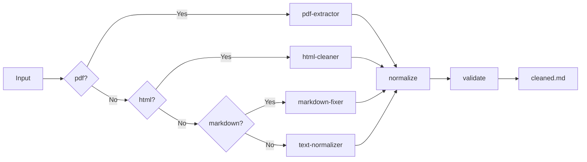

# Stage 0: Exploration Report — knowledge-processor

## §1. Tổng Quan Nghiệp Vụ (Business Overview)

### Mục đích
Skill **knowledge-processor** đóng vai trò bộ xử lý tài liệu đầu vào — nhận các định dạng tài liệu thô (PDF, Markdown, Text thuần) và chuyển đổi thành **Markdown thuần chuẩn hóa** phục vụ các skill downstream như `index-builder`, `source-gatherer`, hoặc RAG pipelines.

### Pain Points
| Vấn đề | Giải pháp đề xuất |
|--------|-------------------|
| PDF chứa bảng, hình ảnh, footnote khó trích xuất sạch | Tách luồng xử lý theo loại nội dung |
| Markdown từ nhiều nguồn có định dạng không đồng nhất | Chuẩn hóa headings, list, code blocks, tables |
| Text thuần thiếu cấu trúc sematic | Gắn semantic markers (headings, emphasis) |
| Tài liệu có mã độc hoặc script injection | Sandbox execution + XML delimiter cho raw input |

### Users & Use Cases
- **Người dùng chính**: Các skill AI cần tài liệu sạch để index hoặc phân tích
- **Use case 1**: Trích xuất nội dung từ PDF th学术论文
- **Use case 2**: Dọn dẹp Markdown từ web scraping
- **Use case 3**: Chuẩn hóa log files thành tài liệu đọc được

---

## §2. Intent Analysis (Phân Tích Ý Định)

### Input Contract
```yaml
input_types:
  - application/pdf
  - text/markdown
  - text/plain
  - text/html

supported_sources:
  - local_file_path
  - url (remote document)
  - raw_text (stdin/context)

quality_requirements:
  preserve_headings: true
  preserve_code_blocks: true
  preserve_tables: true
  strip_hidden_metadata: true
  normalize_encoding: utf-8
```

### Output Contract
```yaml
output:
  format: markdown
  schema: knowledge-markdown-v1
  sections:
    - frontmatter (optional metadata)
    - body (semantic content)
    - footnotes (extracted if present)

quality_gates:
  - no_binary_content_in_body
  - valid_utf8
  - heading_hierarchy_respected
```

### Ngữ cảnh sử dụng pipeline
```
knowledge-processor → [cleaned.md] → index-builder / source-gatherer / RAG
```

---

## §3. 7 Golden Standards Assessment

### A. Reusability — Đạt (Rich)
| Tiêu chí | Điểm | Ghi chú |
|----------|------|---------|
| Tách tri thức domain | ✅ | Handler registry cho từng format (`pdf-handler.py`, `md-handler.py`, `txt-handler.py`) nằm trong `scripts/` |
| Dữ liệu tĩnh tách biệt | ✅ | Normalization rules trong `data/normalize-rules.yaml` |
| Áp dụng nhiều tệp | ✅ | Không hard-code path, dùng config-driven |

**Kết luận**: Thiết kế theo handler pattern cho phép mở rộng format mới mà không sửa core logic.

### B. Composability — Đạt
| Tiêu chí | Điểm | Ghi chú |
|----------|------|---------|
| Input/Output Contract rõ ràng | ✅ | YAML-based contracts, schema-validated |
| Tương tác qua `.skill-context/` | ✅ | Output ghi vào `resources/cleaned/` |

**Xung đột tiềm năng**: PDF handler cần OCR (security risk cao) vs Text handler đơn giản. Cần thiết lập **Prompt Hierarchy**:
```yaml
priority_order:
  1. security_constraints  # Chặn unsafe operations
  2. format_fidelity       # Giữ cấu trúc gốc
  3. completeness          # Trích xuất tối đa nội dung
```

### C. Maintainability — Đạt (Goldilocks)
| Tiêu chí | Điểm | Ghi chú |
|----------|------|---------|
| SKILL.md < 1800 tokens | ✅ Dự kiến ~900 tokens | Boot config + phase instructions |
| 4-layer knowledge model | ✅ | L0: SKILL.md, L1: policies/, L2: knowledge/, L3: examples/ |
| Không dài quá, không ngắn quá | ✅ | Tách handlers thành module nhỏ |

### D. Security — Ngưỡng Đỏ (Cần Chú Ý)
| Tiêu chí | Điểm | Ghi chú |
|----------|------|---------|
| Prompt Injection | ⚠️ CAO | Raw PDF/HTML có thể chứa malicious scripts |
| Sandbox cho scripts | ⚠️ BẮT BUỘC | PDF parsing cần execute external tools (pdftotext, OCR) |
| XML Delimiters | ✅ Cần thiết | Bọc tất cả raw input trong `<external_input>` |

**Biện pháp bắt buộc**:
```yaml
security_measures:
  - sandbox: docker-gvisor
  - network_egress: blocked
  - input_sanitization: strip_scripts_html
  - xml_delimiter: <external_input> for all raw docs
```

### E. Context Efficiency — Đạt
| Tiêu chí | Điểm | Ghi chú |
|----------|------|---------|
| Progressive Disclosure | ✅ | Tier 1: core handlers, Tier 2: format-specific knowledge, Tier 3: examples |
| Token budget | ✅ | L0 < 900 tokens, L1 < 1200 tokens |

### F. Portability — Đạt
| Tiêu chí | Điểm | Ghi chú |
|----------|------|---------|
| Không hard-code model-specific | ✅ | Dùng generic XML/YAML patterns |
| Tool-agnostic core | ✅ | Handler interface độc lập với OCR tool cụ thể |

### G. Reliability & Fallback — Đạt
| Tiêu chí | Điểm | Ghi chú |
|----------|------|---------|
| Error logging | ✅ | Execution log trong `loop/` |
| Fallback机制 | ✅ | Nếu PDF fails → thử text extraction → nếu fails → return error + HITL |
| Human-in-the-loop | ✅ | Stop conditions trigger ask_question khi confidence < 70% |

---

## §4. SCS Complexity Score (Đánh Giá Quy Mô)

### Bảng Tính Điểm

| Tiêu chí | Ngưỡng | Trọng số | Điểm |
|----------|--------|----------|------|
| Số bước quy trình | 4-5 bước (detect → parse → normalize → validate) | 30% | **3** |
| Số công cụ/API | 3 tools (pdftohtml, OCR, markdown parser) | 30% | **3** |
| Kích thước SKILL.md | ~900 tokens | 20% | **3** |
| Security Risk | Chạy external scripts, gọi OCR API | 20% | **5** ⚠️ |

**SCS Trung bình**: `(3×0.3 + 3×0.3 + 3×0.2 + 5×0.2) = 0.9 + 0.9 + 0.6 + 1.0 = 3.4`

### Kết Luận: SCS = 3.4 > 3.0 — **BẮT BUỘC PHÂN RÃ**

### Đề Xuất: Micro-Skills Architecture

```
knowledge-processor (Meta-Orchestrator)
├── pdf-extractor     — Trích xuất text từ PDF (sandboxed)
├── html-cleaner      — Làm sạch HTML → semantic Markdown
├── text-normalizer   — Chuẩn hóa plain text
└── markdown-fixer   — Sửa cấu trúc Markdown
```

**Orchestration Pattern**: Sequential Pipeline với Condition Router


---

## §5. Tóm Tắt Tiếng Việt

### Tri thức thu thập được
Skill **knowledge-processor** là bộ xử lý tài liệu đa định dạng, nhận đầu vào PDF/Markdown/Text/HTML và xuất ra Markdown thuần chuẩn hóa. Kiến trúc đề xuất theo handler pattern với 4 micro-skills chuyên biệt: `pdf-extractor`, `html-cleaner`, `text-normalizer`, `markdown-fixer`.

### Đánh giá 7 Tiêu chuẩn Vàng
| Tiêu chuẩn | Trạng thái | Ghi chú |
|------------|------------|---------|
| Reusability | ✅ Rich | Handler registry tái sử dụng được |
| Composability | ✅ Rich | Contract-based, `.skill-context/` integration |
| Maintainability | ✅ Rich | 4-layer, Goldilocks zone |
| Security | ⚠️ Ngưỡng Đỏ | PDF/HTML injection risks — cần sandbox bắt buộc |
| Context Efficiency | ✅ Rich | Progressive disclosure Tier 1/2/3 |
| Portability | ✅ Rich | Tool-agnostic core |
| Reliability | ✅ Rich | Logging + HITL fallback |

### Quy mô & Phân rã
- **SCS Score**: 3.4 (trên ngưỡng 3.0) → **PHẢI phân rã**
- **Pattern đề xuất**: Sequential Pipeline + Condition Router
- **Micro-skills**: 4 sub-skills điều phối bởi Meta-Orchestrator

### Bước tiếp theo
Stage 0 hoàn thành. Chuyển giao cho **skill-architect** để thiết kế Zone Mapping và Progressive Disclosure Plan cho 4 micro-skills.

---

## §6. Resources (Nguồn Tri Thức)

```
resources/
├── sourced/
│   ├── skill-explorer-SKILL.md
│   ├── framework.md
│   ├── exploration-standards.md
│   └── CLAUDE.md
├── domain/
│   ├── pdf-processing-patterns.md      # [CẦN BỔ SUNG] PDF extraction best practices
│   ├── markdown-normalization.md      # [CẦN BỔ SUNG] Markdown cleaning rules
│   └── html-sanitization.md           # [CẦN BỔ SUNG] HTML→Markdown conversion
└── references/
    ├── handler-patterns.md            # [CẦN XÂY DỰNG] Handler registry design
    └── sandbox-config.md              # [CẦN XÂY DỰNG] Docker sandbox setup
```

### Resource Status
| Resource | Status | Priority |
|----------|--------|----------|
| skill-explorer/SKILL.md | ✅ Thu thập | — |
| _shared/knowledge/framework.md | ✅ Thu thập | — |
| exploration-standards.md | ✅ Thu thập | — |
| CLAUDE.md | ✅ Thu thập | — |
| pdf-processing-patterns.md | ❌ Còn thiếu | Cao |
| markdown-normalization.md | ❌ Còn thiếu | Cao |
| html-sanitization.md | ❌ Còn thiếu | Trung bình |
| handler-patterns.md | ❌ Cần xây dựng | Cao |
| sandbox-config.md | ❌ Cần xây dựng | Cao |

---

## §7. Architectural Recommendations (Dành cho skill-architect)

### Zone Mapping dự kiến
| Zone | Files | Nội dung |
|------|-------|----------|
| Core | SKILL.md | Meta-orchestrator + workflow |
| Knowledge | knowledge/pdf-processing.md | PDF handler domain |
| Knowledge | knowledge/markdown-cleaning.md | Markdown normalization rules |
| Scripts | scripts/pdf-extractor.py | PDF parsing (sandboxed) |
| Scripts | scripts/html-cleaner.py | HTML→Markdown converter |
| Scripts | scripts/text-normalizer.py | Plain text standardizer |
| Scripts | scripts/md-fixer.py | Markdown structure fixer |
| Data | data/normalize-rules.yaml | Normalization config |
| Loop | loop/validate-output.md | Output quality checklist |

### Security Constraints bắt buộc
```yaml
must:
  - run pdf-extractor in Docker gVisor sandbox
  - sanitize all HTML before processing
  - wrap raw input in <external_input> delimiters
  - block network egress in sandbox

must_not:
  - execute embedded scripts from PDF/HTML
  - store raw files outside sandbox
  - use eval() or exec() on document content
```

---

## §8. Open Questions (Cần Làm Rõ)

| # | Câu hỏi | Ảnh hưởng | Priority |
|---|---------|-----------|----------|
| 1 | OCR engine nào được phép sử dụng? (Tesseract, cloud-based?) | Security + dependency | Cao |
| 2 | Kích thước file tối đa cho phép? | Resource limits | Trung bình |
| 3 | Xử lý table phức tạp (merged cells, nested) như thế nào? | Output quality | Cao |
| 4 | Có cần hỗ trợ password-protected PDF không? | Scope | Thấp |
| 5 | Image extraction — giữ nguyên hay loại bỏ? | Downstream usage | Trung bình |

---

## §9. Stop Conditions Verification

- [x] exploration.md created at `.skill-context/knowledge-processor/exploration.md`
- [x] 7 Golden Standards assessed
- [x] Vietnamese summary written in §5
- [x] Resources directory structure created
- [x] SCS score calculated (3.4 > 3.0 → decomposition required)
- [x] Micro-skills architecture proposed
- [ ] Schema validation pending (requires skill-architect Stage 1)

---

> **STAGE 0 COMPLETE — Resources and standards ready for Architect stage**
