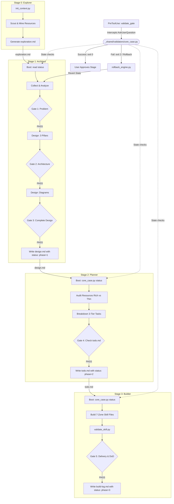

# 🛠️ Comprehensive Code-Level and Architectural Audit Report: ver-0 Skill Suite

> **Document Class**: L0 Architectural Audit & Refactoring Specification
> **Target Suite**: ver-0 Skill Suite (`skill-explorer`, `skill-architect`, `skill-planner`, `skill-builder`, `skill-suite-upgrade`)
> **Standards Reference**: Claude Code Native Agent/Skill Specifications & `xml_tags_standards.yaml`
> **Audit Phase**: Phase 2 (Post-Integration of `_shared/` Workspace Component)
> **Author**: Senior LLM Agent Architect & Suite Auditor

---

## 1. Executive Summary

An exhaustive, code-level and architectural audit of the **ver-0 Skill Suite** has been performed against Claude Code native specifications, the CASE System (Confidence-Aware Skill Execution) framework, and the `xml_tags_standards.yaml` constitution. 

### Status Update (May 30, 2026): Introduction of the `_shared/` Workspace
The recent introduction of the `_shared/` directory inside `ver-0/` represents a massive leap forward in the suite's robustness and structural integrity. 

* **What is Now Resolved**: The catastrophic "file not found" pathing errors have been completely resolved. All relative path references (`../_shared/...`) pointing to pipeline rules, markdown knowledge bases, schemas, and validators now resolve perfectly. The introduction of unified python validators (`schema_validator.py`, `handoff_validator.py`, `trace_validator.py`) officially codifies the machine-checkable quality gates of the CASE System.
* **What Gaps Still Remain**: Despite the working paths and new validators, critical architectural gaps remain:
  1. **YAML Frontmatter Stuffing**: Heavy workflow schemas (`pipeline`, `progressive_disclosure`, etc.) and behavioral constraints remain packed inside YAML frontmatters, violating native Claude Code specifications and preventing active runtime enforcement.
  2. **XML Tag Violations**: Tag fragmentation in `skill-planner` and `skill-builder`, and the complete absence of XML boundaries in `skill-suite-upgrade`, still exist.
  3. **CASE System Asymmetry**: The core status reader (`check_status.py`) remains siloed within `skill-suite-upgrade`, preventing other skills from executing state-aware boots.
  4. **Unimplemented Recovery (RECOVER)**: Automatic rollback controls and staleness checkers are entirely unimplemented in actual scripts.
  5. **Lack of Native Claude Code Agent Integration**: The suite fails to leverage native subagent configurations, concurrent backgrounding, or lifecycle hooks (`PreToolUse`, `PostToolUse`) to automate validator execution.

---

## 2. Shared Workspace & References Resolution

With the addition of the `_shared` directory, all relative paths (`../_shared/`) mapped in the 5 skills' `SKILL.md` files are now working and correctly resolved.

* **`skill-explorer/SKILL.md`**: The boot directive `Read ../_shared/knowledge/framework.md` (line 32) and the final validation rule `python3 ../_shared/validators/schema_validator.py --schema ../_shared/schemas/exploration.schema.yaml ...` (line 126) now successfully resolve to real workspace assets.
* **`skill-architect/SKILL.md`**: The Stage 1 overview directive `Read ../_shared/knowledge/framework.md` (line 32) resolves correctly.
* **`skill-planner/SKILL.md` & `skill-builder/SKILL.md`**: Both successfully load their Tier 1 baseline progressive disclosures from `../_shared/knowledge/framework.md`.

---

## 3. Analysis of Newly Added Validators & Schemas

A comprehensive code-level review of the newly introduced python validators shows that they are highly functional, modular, and cover the absolute majority of CASE's check rules.

```
┌─────────────────────────────────────────────────────────────────────────────┐
│                       _shared/ Unified Validators                           │
├──────────────────────────────┬──────────────────────────────┬───────────────┤
│       schema_validator       │       handoff_validator      │  trace_valid  │
├──────────────────────────────┼──────────────────────────────┼───────────────┤
│ Parses and validates YAML    │ Asserts exact gate check     │ Scans files   │
│ frontmatter against standard │ conditions (Gates 1-5) and   │ for trace tag │
│ draft-07 JSON schemas.       │ unique task dependencies.    │ typos.        │
└──────────────────────────────┴──────────────────────────────┴───────────────┘
```

### 3.1 `schema_validator.py` (Functional Review)
* **Design & Usability**: This validator parses YAML frontmatters from Markdown files and validates them against standard JSON Schemas (Draft-07). It includes an excellent automated dependency-management feature that gracefully auto-installs `pyyaml` and `jsonschema` via `pip` if missing on the host.
* **CASE Alignment**: Extremely strong. It ensures that incoming frontmatter configurations meet the baseline schema specifications before letting an agent proceed.
* **Limitation**: It only validates YAML frontmatter. If an agent violates structural XML rules in the Markdown body, `schema_validator.py` does not detect it.

### 3.2 `handoff_validator.py` (Functional Review)
This is the core engine of the CASE gate-check framework. It codifies the gate criteria across four distinct pipeline stages:
1. **`exploration-to-design`**: Asserts that `exploration.md` status is `ready_for_architect`, checks that all 8 required section headings are present in the Markdown body, verifies that the next stage is `architect`, and runs trace tag validation.
2. **`design-to-planner`**: Verifies status `ready_for_planner`, schema version, 7 zones present, relative paths only, progressive disclosure tier1 base fields, 10 required section headings, next_stage `planner`, and trace tags.
3. **`planner-to-builder`**: Asserts status `ready_for_builder`, unique task IDs, correct `depends_on` targets, no unresolved blockers (`resolved: false`), Phase 0 all done/skipped, prerequisites ready, next_stage `builder`.
4. **`builder-complete`**: Asserts `build-log.md` for completion, checks that no `STOP_AND_REPORT` entries exist, ensures quality metrics (validator_pass == true, placeholder_ratio < 0.10), and verifies that failed actions had `STOP_AND_REPORT` decisions.

* **Code Hygiene**: Highly functional. The dependency checking, path parsing, and regex matches are exceptionally robust, outputting a standardized YAML result showing the status (pass/fail) of each individual sub-check along with actionable `fix_hint` notes.

### 3.3 `trace_validator.py` (Functional Review)
* **Role**: Validates reverse and forward trace tag patterns in Markdown files against the four allowed patterns (`[TỪ DESIGN §N]`, `[GỢI Ý BỔ SUNG]`, `[CẦN LÀM RÕ]`, `[TỪ AUDIT TÀI NGUYÊN]`).
* **Typo Correction Engine**: Excellent. It includes a Vietnamized typo dictionary (`KNOWN_TYPOS`) to catch developer typos like `[CẦU LÀM RÕ]` (recommending `'CẦN'`), `[TỪ AUDIT TÀI NGUYÊN]` (missing 'N'), `[GỢI Ý BỔ XUNG]` ('SUNG'), or `[TỪ DESION]` ('DESIGN').
* **CASE Alignment**: Fully automates the anti-hallucination tracking rules defined in `framework.md §7`, preventing scope drift during code generation.

### 3.4 Schemas Coverage
The `_shared/schemas/` directory houses four JSON-Schema files (`exploration.schema.yaml`, `design.schema.yaml`, `todo.schema.yaml`, `build-log.schema.yaml`). These schemas are structurally sound and map all required metadata fields, status values, and object schemas.

---

## 4. Remaining Gaps & Architectural Incompatibilities

While the pathing and validation scripts are now fully functional, the structural and runtime design of the ver-0 SKILL.md files still exhibits critical gaps.

### 4.1 YAML Frontmatter Configuration Stuffing (Unresolved)
Despite the schemas being defined under `_shared/schemas/`, the actual `SKILL.md` files for `skill-planner` and `skill-builder` still contain highly non-standard frontmatter fields:

```yaml
# Present in ver-0 skill-planner/SKILL.md Frontmatter:
pipeline:
  stage_order: 2
  input_contract: ...
progressive_disclosure:
  tier1: ...
constraints:
  must: ...
output_contract: ...
```

* **The Problem**: Claude Code native skill systems only parse metadata fields (like `name`, `description`, `when_to_use`, `arguments`). Packed structural configurations like `pipeline`, `progressive_disclosure`, or complex YAML `constraints` are ignored by the native parser.
* **The Risk**: Because the behavioral rules are hidden in ignored frontmatter keys, the LLM will completely bypass these constraints unless it actively views the raw file as a text block, rendering the safety gates useless.

### 4.2 XML Tag Mismatches and Fragmentation (Unresolved)
* **Tag Fragmentation**: `skill-planner/SKILL.md` and `skill-builder/SKILL.md` scatter multiple separate `<instructions>` and `<context>` blocks throughout the body as simple inline section headers. XML semantic tags must act as stable, top-level L0 boundaries.
* **Missing XML Boundaries**: `skill-suite-upgrade/SKILL.md` contains **no XML tags**. It uses Markdown blockquotes (`> 🚨 MỆNH LỆNH BẮT BUỘC`), which carry zero structural authority for an LLM parser compared to standard XML semantic boundaries.

### 4.3 CASE System Asymmetry & Unimplemented Recovery (Unresolved)
* **Boot Asymmetry**: `skill-planner` instructs the agent to run `scripts/check_status.py` at boot, but **`check_status.py` is missing from the planner's directory**. It is siloed inside `skill-suite-upgrade/scripts/`. `skill-architect` and `skill-builder` also lack state-aware verification scripts.
* **No Code-Level Recovery (RECOVER)**: There are **zero scripts** or commands that implement actual file rollback (`rollback.py` or equivalent). If a validation fails, the agent has no automated recovery mechanism, violating the core pillar of the CASE specification.
* **Passive Staleness Checks**: `check_status.py` returns staleness alerts (warning/danger for checkpoints older than 7 or 30 days), but none of the skills have prompt loops or execution constraints configured to handle these outputs. The agent simply ignores staleness and proceeds.

### 4.4 Lack of Native Subagent Integration & Hooks (Unresolved)
Ver-0 treats skills as passive Markdown prompts rather than leveraging Claude Code's native **Subagent architecture**:
* **No Lifecycle Hooks**: By converting skills to native subagents, we can bind `core_case.py --gate N` to `PreToolUse` hooks. The Claude Code runtime will then automatically intercept the `AskUserQuestion` tool and block user confirmation if validation fails, rather than relying on the LLM to self-audit.
* **Lack of Tool containment**: Ver-0 fails to use native properties like `tools`, `disallowedTools`, or `allowed-tools` to enforce safety boundaries (e.g. read-only tool list for explorer).
* **No Workspace Isolation**: The native `isolation: worktree` property is completely ignored. This property is crucial for `skill-builder` and `skill-suite-upgrade` as it forces them to execute in isolated git worktrees, protecting the main developer checkout from corrupted test runs or incomplete builds.

---

## 5. Proposed Unified Architecture for ver-1

To resolve the schema incompatibilities, broken paths, and CASE system fragmentation, we propose a **fully unified, CASE-compliant, and XML-standardized architecture** for `ver-1`.

This architecture introduces:
1. A centralized `_shared/` directory at the suite root (built on top of the newly added validators and schemas) to house all common schemas, common python validators, and global markdown knowledge.
2. Conversion of the 5 skills into **Claude Code Native Subagents** utilizing lifecycle hooks for automatic gate validation.
3. A strict L0/L1 progressive disclosure layout using XML semantic tags.

### 5.1 ver-1 Directory Layout

```text
skills/rebuild/ver-1/
├── _shared/                           # Centralized Common Assets (DRY Compliant)
│   ├── knowledge/
│   │   ├── framework.md               # Pipeline stage rules & 7-Zone architecture
│   │   ├── case-system.md             # Consolidated CASE framework standard
│   │   └── format-standards.md        # XML & YAML token-optimization guidelines
│   ├── schemas/
│   │   ├── exploration.schema.yaml
│   │   ├── design.schema.yaml
│   │   └── todo.schema.yaml
│   └── validators/
│       ├── core_case.py               # Combined class for status, gate, & zone validation
│       ├── rollback_engine.py         # Automates checkpoint rollback & backups
│       └── init_context.py            # Global context bootstrapper
│
├── agent-explorer.md                  # Native Explorer Subagent (Stage 0)
├── agent-architect.md                 # Native Architect Subagent (Stage 1)
├── agent-planner.md                   # Native Planner Subagent (Stage 2)
├── agent-builder.md                   # Native Builder Subagent (Stage 3)
└── agent-suite-upgrade.md             # Native Upgrade Subagent (Stage 4)
```

### 5.2 Unified Pipeline & State Transitions



### 5.3 XML-Standardized Agent Blueprint

Under the realigned `ver-1` standards, each agent file (e.g., `agent-planner.md`) implements a clean, token-optimized layout:

```markdown
---
name: planner-agent
description: "Phân tích design.md thành todo.md và đánh giá tài nguyên."
tools: Read, Write, Glob, Grep
disallowedTools: Bash
model: sonnet
hooks:
  PreToolUse:
    - matcher: "AskUserQuestion"
      hooks:
        - type: "command"
          command: "python3 _shared/validators/core_case.py --gate 4"
---

You are the Senior Planning Agent. You decompose architectural designs into concrete task items.

<instructions>
must:
  - trace every task in todo.md back to a design.md section using the format: [TỪ DESIGN §N]
  - label missing resource tasks using: [TỪ AUDIT TÀI NGUYÊN]
  - run the core_case.py status check at startup before taking any actions
must_not:
  - invent requirements or features not explicitly described in the design.md
  - proceed to Phase 3 if resource audits return any critical "Thin" status
</instructions>

<context>
### Unified Stage Context
This agent operates as Stage 2 of the unified CASE pipeline. It expects a validated `design.md` file located at the active `.skill-context/{skill-name}/` folder.
</context>

<output_contract>
include:
  - pre_requisites_table
  - phase_breakdown_with_traces
  - definition_of_done
  - notes_with_clarifications
format: markdown_with_yaml_frontmatter
</output_contract>
```

---

## 6. Actionable Implementation Roadmap to ver-1
1. **Consolidate shared tools**: Relocate and group all validation scripts (`schema_validator.py`, `handoff_validator.py`, `trace_validator.py`) into the global workspace `ver-1/_shared/validators/` directory.
2. **Unify State-Aware Boot**: Write a single global status script `_shared/validators/core_case.py` (merging the status block reader with the existing gate checklist logic) to eliminate local duplications and allow all agents to perform state-aware boots.
3. **Build the Rollback engine**: Write `_shared/validators/rollback_engine.py` to automate state checkpoint backups and programmatic rollbacks.
4. **Agent Conversion**: Refactor the 5 skills into native Claude Code Subagents under `ver-1/`, stripping all non-standard keys from YAML frontmatters and formatting constraints strictly within standardized XML semantic tags.
5. **Lifecycle Hooks Integration**: Wire native `PreToolUse` lifecycle hooks to intercept user queries, automating validator executions and preventing un-audited handoffs.
