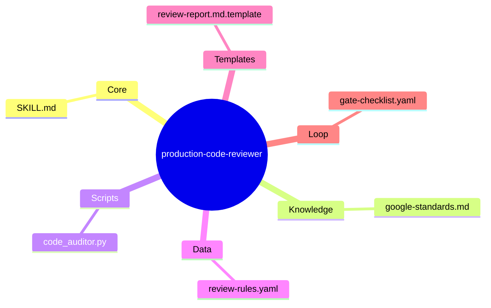
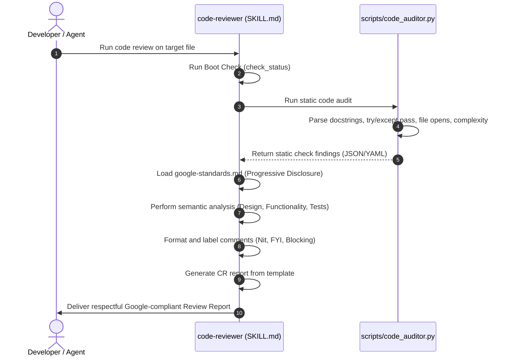

# 🏗️ Architectural Design Specification: production-code-reviewer

> **Stage**: 1 — Architect Design Complete
> **Target Path**: `/skills/rebuild/production-code-reviewer/`

---

## 1. Problem Statement

* **Context**: Developers working with AI Agents often receive reviews that are either too superficial (only checking syntax) or too aggressive (arguing over personal style).
* **The Core Pain Point**: AI review outputs lack a structured, standardized benchmark, leading to inconsistent feedback. AI comments often tell authors *what* is wrong but fail to explain *why*, and they fail to distinguish critical blocking bugs from minor optional suggestions (`nits`), creating friction and slowing down team velocity.
* **The Solution**: Build `production-code-reviewer`, an Agent Skill that codifies the **Google Code Review Standards**. It uses a local static code parser (`code_auditor.py`) to catch programmatic code health violations and combines it with a high-fidelity knowledge base (`google-standards.md`) to generate constructive, respectful, multi-layered review reports that clearly separate blocking issues from minor nits.

---

## 2. Capability Map (3 Pillars of Design)

```
┌─────────────────────────────────────────────────────────────────┐
│              production-code-reviewer                           │
├───────────────────┬──────────────────────┬──────────────────────┤
│     KNOWLEDGE     │       PROCESS        │      GUARDRAILS      │
│  Google review    │  Multi-stage navig.  │  Code health priority│
│  standards (L1)   │  & comment tagging   │  vs personal style   │
└───────────────────┴──────────────────────┴──────────────────────┘
```

* **Pillar 1: Knowledge (Google Guidelines)**:
  * Employs the gold standards of Google engineering: codebase health first, continuous improvement, clear comment labels (`Nit:`, `FYI:`, `Optional:`), small CL boundaries, and refactoring separation.
* **Pillar 2: Process (The Review Pipeline)**:
  * Standardizes CL navigation: (1) Overall design sanity, (2) Core logic files review, (3) Testing and secondary helper review. Integrates static checks with LLM semantic reasoning.
* **Pillar 3: Guardrails (Decoupled Critique)**:
  * Forces the reviewer to respect the author's personal coding style if it complies with the official Style Guide. Prevents over-engineering pushback.

---

## 3. Zone Mapping

Every file of the skill package is mapped below following the 7 Zones framework:

| Zone | Path | Content / Purpose | Required |
| :--- | :--- | :--- | :--- |
| **Core** | `SKILL.md` | Persona, orchestration rules, and progressive disclosure | ✅ Yes |
| **Knowledge** | `knowledge/google-standards.md` | Google Code Review Guidelines tiếng Việt | ✅ Yes |
| **Scripts** | `scripts/code_auditor.py` | Local static check python script to audit lines, docstrings, empty try/excepts, complexity | ✅ Yes |
| **Data** | `data/review-rules.yaml` | Static YAML definition of review rules and severity catalogs | ✅ Yes |
| **Templates** | `templates/review-report.md.template`| Markdown layout for the final Code Review Report | ✅ Yes |
| **Loop** | `loop/gate-checklist.yaml` | Audit checklist to verify report compliance | ✅ Yes |
| **Assets** | N/A | Not required | ❌ No |

---

## 4. Folder Structure



---

## 5. Execution Flow



---

## 6. Interaction Points

* `/code-reviewer [target_file]` - Manually run the review on a specific code file.
* Outputs the structured report containing design feedback, logical issues, naming/docstring issues, test coverage reviews, and minor nits.

---

## 7. Progressive Disclosure Plan

```yaml
progressive_disclosure:
  tier1: # Loaded at Boot
    - "SKILL.md"
    - "data/review-rules.yaml"
  tier2: # Loaded Conditionally
    - "knowledge/google-standards.md" # Triggered when: executing semantic analysis
  tier3: # Loaded On-Demand
    - "templates/review-report.md.template" # Triggered when: compiling report
    - "loop/gate-checklist.yaml"             # Triggered when: validating gate
```

---

## 8. Risks & Mitigations

* **Overly aggressive nitpicking**: Risk: Reviewer slows down velocity by arguing over style. Mitigation: Strict rule that if it's not in the Style Guide, it's a `Nit:` and cannot block approval.
* **Respectful Tone**: Risk: LLM comments sound condescending or accusing. Mitigation: Enforce constructive phrasing templates (focus on code, explain "why").
* **Complexity Hallucination**: Risk: Reviewer incorrectly flags complex but highly optimal code. Mitigation: Enforce `code_auditor.py` to only report metrics, and prompt the LLM to justify any complexity claims with concrete alternate designs.

---

## 9. Metadata

* **Stage Order**: 1 (Architect Design Complete)
* **Successor Stage**: Stage 2 (Planner - todo.md creation)
* **Author**: Steve Void Team
