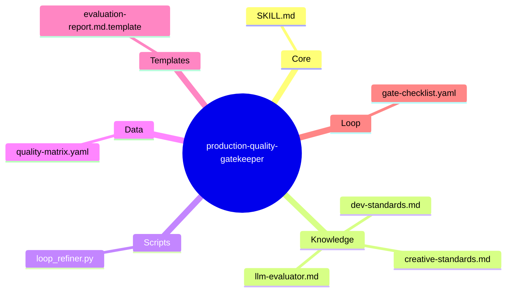
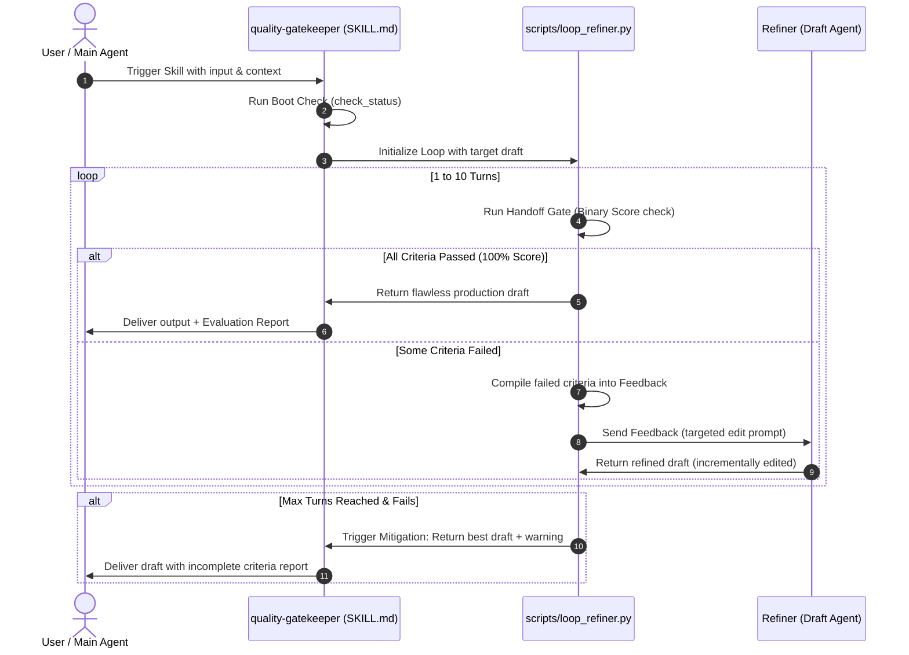

# 🏗️ Architectural Design Specification: production-quality-gatekeeper

> **Stage**: 1 — Architect Design Complete
> **Target Path**: `/skills/rebuild/production-quality-gatekeeper/`

---

## 1. Problem Statement

* **Context**: Human developers and AI users face low-quality, generic outputs from AI Agents that fall short of "production-grade" standards. 
* **The Core Pain Point**: AI inputs usually lack robust, structured criteria to measure success, and humans have limited time or domain knowledge to detail them. Manual iterative cycles take at least 10 rounds of back-and-forth prompting, wasting resources and context space.
* **The Solution**: Build `production-quality-gatekeeper`, a micro-skill that automatically generates a multi-dimensional, layered quality matrix (across Creative, Dev, and LLM domains) and manages an automated, local self-refining loop to iteratively edit and polish the output until 100% of the criteria are met, ensuring production quality in a single prompt transaction.

---

## 2. Capability Map (3 Pillars of Design)

```
┌─────────────────────────────────────────────────────────────────┐
│              production-quality-gatekeeper                      │
├───────────────────┬──────────────────────┬──────────────────────┤
│     KNOWLEDGE     │       PROCESS        │      GUARDRAILS      │
│  Domain standards │  Iterative refinement│  Strict pass criteria│
│  & Quality Matrix │  loop (1-10 turns)   │  & error mitigation  │
└───────────────────┴──────────────────────┴──────────────────────┘
```

* **Pillar 1: Knowledge (Domain Expertise)**:
  * Codifies industry-standard guidelines for Creative writing (Pacing, Narrative Arc, Cliché avoidance), Dev/Coding (SOLID, Exception Handling, Edge cases, Security), and LLM Evaluation (Rule enforcement, System isolation).
* **Pillar 2: Process (The Loop Engine)**:
  * Orchestrates the 10-turn self-refining loop. Programmatically identifies failed criteria, compiles detailed feedback, and feeds it back to the drafting agent to perform highly targeted incremental edits.
* **Pillar 3: Guardrails (Quality Gates)**:
  * Implements strict binary check policies (Pass/Fail) to remove model ambiguity. If a critical criterion fails 3 times in a row, it triggers mitigation steps to prevent infinite looping.

---

## 3. Zone Mapping

Every file of the skill package is mapped below following the 7 Zones framework:

| Zone | Path | Content / Purpose | Required |
| :--- | :--- | :--- | :--- |
| **Core** | `SKILL.md` | Persona, orchestration rules, and progressive disclosure | ✅ Yes |
| **Knowledge** | `knowledge/creative-standards.md` | Rules for Creative writing, avoiding sáo ngữ AI | ✅ Yes |
| **Knowledge** | `knowledge/dev-standards.md` | Rules for production-grade coding, safety, solid | ✅ Yes |
| **Knowledge** | `knowledge/llm-evaluator.md` | Standard evaluations for prompt-engineering/XML | ✅ Yes |
| **Scripts** | `scripts/loop_refiner.py` | Local python engine that automates the 1-10 self-refinement loops | ✅ Yes |
| **Data** | `data/quality-matrix.yaml` | Static YAML configurations of scoring parameters | ✅ Yes |
| **Templates** | `templates/evaluation-report.md.template` | Document layout for the evaluation report output | ✅ Yes |
| **Loop** | `loop/gate-checklist.yaml` | Machine-readable checklist to audit output readiness | ✅ Yes |
| **Assets** | N/A | Not required | ❌ No |

---

## 4. Folder Structure



---

## 5. Execution Flow

The sequence diagram below shows how the self-refining loop operates programmatically using `loop_refiner.py`:



---

## 6. Interaction Points

| Trigger / Command | Actor | Action / Purpose | Expected Output |
| :--- | :--- | :--- | :--- |
| `/quality-gatekeeper [target_file]` | User / Agent | Manually runs the quality evaluation on a specific file | Detailed `evaluation-report.md` |
| `--refine` argument | Agent | Starts the 10-turn self-refinement loop on the target draft | Perfected draft + report |

---

## 7. Progressive Disclosure Plan

To optimize token usage, the skill loads its files incrementally:

```yaml
progressive_disclosure:
  tier1: # Loaded at Boot
    - "SKILL.md"
    - "data/quality-matrix.yaml"
  tier2: # Loaded Conditionally
    - "knowledge/creative-standards.md" # Triggered when: domain == creative
    - "knowledge/dev-standards.md"      # Triggered when: domain == dev
    - "knowledge/llm-evaluator.md"      # Triggered when: domain == llm
  tier3: # Loaded On-Demand
    - "templates/evaluation-report.md.template" # Loaded when: generating report
    - "loop/gate-checklist.yaml"                 # Loaded when: validating gate
```

---

## 8. Risks & Mitigations

| Risk / Blind Spot | Severity | Mitigation Strategy |
| :--- | :--- | :--- |
| **Infinite LLM Loop**: LLM refines endlessly without passing a minor criteria. | High | **Turn Cap**: Strict limit of 10 turns managed by `loop_refiner.py`. **Targeted Editing**: Forcing the refiner to only touch the failed lines, protecting already passed lines. |
| **Context Bloat**: Feeding the entire history of 10 loops into the LLM context. | Medium | **Compaction**: The script compiles *only* the current draft and the active failed criteria feedback list for the next turn, discarding previous intermediates. |
| **Criterion Ambiguity**: LLM grades too leniently (hallucinates success). | High | **Binary strictly check**: All criteria must be written as testable, non-ambiguous parameters, evaluated with strict regex or binary rules in `loop_refiner.py`. |

---

## 9. Open Questions

| Question | Status | Planned Resolution |
| :--- | :--- | :--- |
| Should we integrate Python AST parsing for coding checks? | Deferred | For `ver-1`, we will use regex and LLM binary checking. In `ver-2`, we can hook AST/linters to the validator. |

---

## 10. Metadata

* **Stage Order**: 1 (Architect Design Complete)
* **Successor Stage**: Stage 2 (Planner - todo.md creation)
* **Approval Date**: 2026-05-30
* **Author**: Steve Void Team
