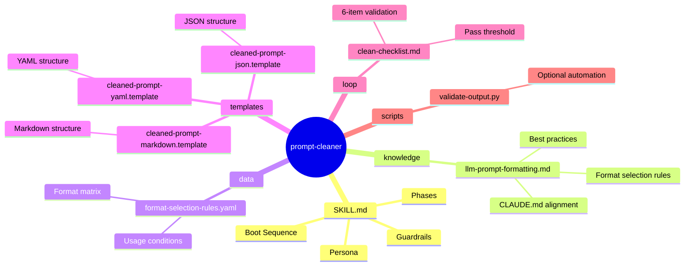
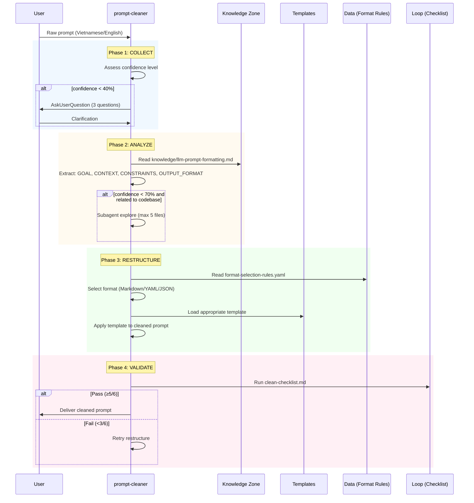

# prompt-cleaner — Architecture Design

> Generated by skill-architect | 2026-05-18
> Status: ✅ COMPLETE

> **💡 Reference**: Xem ví dụ hoàn chỉnh tại `references/examples/design-api-integrator.md`

---

## 1. Problem Statement

**Vấn đề**: User gửi prompt "thô" (tiếng Việt/tiếng Anh) không có cấu trúc. CLAUDE.md chuẩn hóa format output theo semantic role — Markdown cho explanation, YAML cho constraints/policies, JSON cho structured data. Skill hiện tại dùng XML cứng nhắc, không còn phù hợp.

**Người dùng**: Developers dùng Claude Code, gửi unstructured prompts để clean TRƯỚC KHI gửi cho Claude Code agent.

**Lý do cần skill**: 
- Transform raw prompts → structured prompts theo CLAUDE.md format selection rules
- Multi-format output: Markdown/YAML/JSON thay vì XML-only
- Đảm bảo prompts chứa đủ: goal, context, constraints, output_format
- Giảm hallucination bằng context augmentation với cite source:line

---

## 2. Capability Map

### 2.1 Tri thức (Knowledge — Pillar 1)

| Knowledge | Source | Format | Usage |
|-----------|--------|--------|-------|
| CLAUDE.md format rules | External reference | Markdown | Base standard for format selection |
| LLM prompt patterns | knowledge/llm-prompt-formatting.md | Markdown | Best practices for LLM prompt structuring |
| Format selection rules | data/format-selection-rules.yaml | YAML | When to use Markdown vs YAML vs JSON |

### 2.2 Quy trình (Process — Pillar 2)

```
Phase 1: COLLECT
├── Receive raw prompt (Vietnamese/English)
├── Assess confidence level
│   ├── < 40% → AskUserQuestion (3 specific questions)
│   ├── 40-70% → Proceed to Phase 2 + Optional subagent explore
│   └── ≥ 70% → Proceed to Phase 2

Phase 2: ANALYZE
├── Extract 4 components:
│   ├── GOAL → Mục tiêu chính (1-3 dòng)
│   ├── CONTEXT → Thông tin hiện có (đủ/thiếu?)
│   ├── CONSTRAINTS → Rules, giới hạn
│   └── OUTPUT_FORMAT → Kỳ vọng format đầu ra
└── (Optional) Context Augmentation via subagent (max 5 files)

Phase 3: RESTRUCTURE
├── Select format based on format-selection-rules.yaml:
│   ├── explanation/context → Markdown
│   ├── constraints/policies → YAML
│   └── structured data → JSON
├── Apply template (markdown/yaml/json)
└── Validate via clean-checklist.md (≥5/6 = PASS)

Phase 4: OUTPUT
├── If prompt already OK → Return as-is + note
├── If confidence < 40% → AskUserQuestion first
└── Otherwise → Return cleaned prompt in selected format
```

### 2.3 Kiểm soát (Guardrails — Pillar 3)

| ID | Rule | Description | Validation |
|----|------|-------------|------------|
| G1 | No hallucination | Must cite source:line for all context additions | Via subagent explore |
| G2 | Over-clean guard | If prompt already structured → return as-is + note | Via checklist item 1 |
| G3 | Format whitelist | Only use formats in data/format-selection-rules.yaml | Via checklist item 6 |
| G4 | Goal-first | `<goal>` MUST appear first in output | Via checklist item 1 |
| G5 | Ask when unsure | Confidence < 40% → AskUserQuestion, don't guess | Via Phase 1 gate |
| G6 | Length budget | Cleaned prompt ≤ 3x original length | Via checklist item 5 |

---

## 3. Zone Mapping

> ⚠️ Contract Section — Planner đọc §3 để decompose thành Tasks.
> Mọi Zone PHẢI có giá trị trong cột "Files cần tạo". Zone không dùng → ghi "Không cần".

| Zone | Files cần tạo | Nội dung | Bắt buộc? |
|------|--------------|----------|-----------|
| Core (SKILL.md) | `SKILL.md` | Persona, phases, guardrails | ✅ |
| Knowledge | `knowledge/llm-prompt-formatting.md` | CLAUDE.md format rules, best practices LLM prompts | ✅ |
| Scripts | `scripts/validate-output.py` | Validation script (optional) | ❌ |
| Templates | `templates/cleaned-prompt-markdown.template`<br/>`templates/cleaned-prompt-yaml.template`<br/>`templates/cleaned-prompt-json.template` | 3 output format templates | ✅ |
| Data | `data/format-selection-rules.yaml` | Format selection matrix (when to use MD/YAML/JSON) | ✅ |
| Loop | `loop/clean-checklist.md` | 6-item validation checklist | ✅ |
| Assets | Không cần | N/A | ❌ |

> ⚠️ **Quy tắc**: Điền "Không cần" cho Zones không sử dụng. Cột "Files cần tạo" PHẢI có tên file cụ thể (không placeholder).

---

## 4. Folder Structure



---

## 5. Execution Flow



---

## 6. Interaction Points

| # | Thời điểm | Lý do dừng | Hành động của AI |
|---|-----------|-----------|-----------------|
| 1 | Phase 1: Confidence < 40% | Input quá ngắn/thiếu context nghiêm trọng | Hỏi user 2-3 câu cụ thể, không tự đoán |
| 2 | Phase 2: After extraction | Cần user xác nhận components đúng? | Trình bày 4 components, chờ confirm nếu confidence 40-70% |
| 3 | Phase 4: Validation fail | Cleaned prompt không đạt threshold | Retry restructure với feedback từ checklist |

> **Rule**: Interaction Point #2 chỉ xảy ra khi confidence 40-70%. Confidence ≥ 70% → tự động proceed.

---

## 7. Progressive Disclosure Plan

### Tier 1: Bắt buộc đọc (Mandatory)

- `SKILL.md` — Persona, workflow, guardrails
- `data/format-selection-rules.yaml` — Format selection matrix (always needed)

### Tier 2: Đọc khi cần (Conditional)

- `knowledge/llm-prompt-formatting.md` — Khi cần hiểu CLAUDE.md format alignment
- `templates/cleaned-prompt-markdown.template` — Khi output_format = markdown
- `templates/cleaned-prompt-yaml.template` — Khi output_format = yaml
- `templates/cleaned-prompt-json.template` — Khi output_format = json
- `loop/clean-checklist.md` — Khi validate cleaned prompt

---

## 8. Risks & Blind Spots

| # | Risk | Severity | Mitigation |
|---|------|----------|-----------|
| 1 | AI chọn sai format (dùng XML thay vì MD/YAML/JSON) | P0 | G1: Bắt buộc đọc format-selection-rules.yaml trước khi output |
| 2 | AI tự thêm context không có trong source | P0 | G2: Subagent explore phải cite source:line; manual additions forbidden |
| 3 | Over-clean: prompt đã OK bị thay đổi | P1 | G3: Checklist item 1 check "Already structured?" → return as-is |
| 4 | Cleaned prompt quá dài (>3x original) | P1 | G6: Checklist item 5 hard limit; compress redundant info |
| 5 | Confidence threshold không nhất quán (Phase 1 vs Phase 2) | P2 | Fix: Align Phase 1 và Phase 2 rules — see Open Questions |

---

## 9. Open Questions

| # | Câu hỏi | Nguồn (Phase) | Trạng thái |
|---|---------|--------------|-----------|
| 1 | Subagent explore giới hạn 5 files — đủ cho typical prompt? | Phase 2 | ❓ Cần confirm từ Planner |
| 2 | Confidence threshold: Phase 1 dùng <40% nhưng Phase 2 Context Augmentation dùng <70% — nên thống nhất? | Phase 2 | ✅ Thống nhất: <40% = Ask, 40-70% = optional explore, ≥70% = auto |
| 3 | Templates có cần backup (nếu format không match)? | Phase 3 | ✅ Default sang Markdown nếu không match |
| 4 | Optional scripts/validate-output.py — cần tạo hay không? | Zone Mapping | ❌ Không cần — validation qua loop/clean-checklist.md |

---

## 10. Metadata

- **Skill Name**: prompt-cleaner
- **Created**: 2026-05-18
- **Author**: Steve (skill-architect)
- **Framework**: architect.md v2.0
- **Status**: ✅ COMPLETE
- **Version**: 2.0.0 (MAJOR — format change from XML to MD/YAML/JSON)
- **Handoff Checklist**:
  - [x] design.md hoàn thiện (checklist pass)
  - [x] Sẵn sàng cho skill-planner

---

## 10.1 Version & Dependencies

### Version Management

```
MAJOR.MINOR.PATCH
- MAJOR: Breaking change — output format change (XML → MD/YAML/JSON)
- MINOR: Backward-compatible additions (new templates, new rules)
- PATCH: Bug fixes, documentation updates
```

**Version History**:
- 1.x.x → Original XML-only format
- 2.0.0 → Multi-format (Markdown/YAML/JSON) per CLAUDE.md

### Dependencies

| Type | Skill | Required | Reason |
|------|-------|----------|--------|
| Predecessor | None | - | Đây là skill đầu tiên trong pipeline |
| Successor | skill-planner | ✅ | Cần design.md để tạo todo.md |
| Successor | skill-builder | ❌ | Chạy sau skill-planner |
| Reference | CLAUDE.md | ✅ | External source for format selection rules |

### Pipeline Stage

| Stage | Skill | Output |
|-------|-------|--------|
| 1 | skill-architect | design.md |
| 2 | skill-planner | todo.md |
| 3 | skill-builder | skill files |

---

## 11. Naming Conventions

### Skill Name

- **Pattern**: `kebab-case` (lowercase, hyphen-separated)
- ✅ `prompt-cleaner`
- ❌ `PromptCleaner`, `prompt_cleaner`, `prompt cleaner`

### File Names in Zones

| Zone | Pattern | Example |
|------|---------|---------|
| knowledge/ | `domain-topic.md` | `llm-prompt-formatting.md` |
| scripts/ | `action-target.py` | `validate-output.py` |
| templates/ | `output-format.template` | `cleaned-prompt-markdown.template` |
| loop/ | `purpose-checklist.md` | `clean-checklist.md` |
| data/ | `config-name.yaml` | `format-selection-rules.yaml` |

---

## 12. Rollback Procedures

### Phase 1 Rollback — Collect

**Trigger**: User rejects Problem Statement hoặc muốn thay đổi skill-name.

**Dấu hiệu nhận biết**:
- User nói "Tôi muốn thay đổi mô tả"
- User nói "Tên skill không đúng"
- Confidence < 50% sau khi thu thập yêu cầu

**Rollback Steps**:
```
1. Reset §1 Problem Statement → draft state
2. Reset §10 Metadata (status: DRAFT)
3. Xóa mọi note/artifact đã tạo tạm thời
4. Quay lại Phase 1: Collect — thu thập lại
```

### Phase 2 Rollback — Analyze

**Trigger**: User rejects Capability Map hoặc Zone Mapping.

**Dấu hiệu nhận biết**:
- User nói "Pillar này không đúng"
- User nói "Zone Mapping thiếu zone X"
- User muốn thêm zone mới

**Rollback Steps**:
```
1. Reset §2 Capability Map → draft state
2. Reset §3 Zone Mapping → draft state
3. Reset §8 Risks & Blind Spots → draft state
4. Cần xem xét lại Phase 1 nếu pain point thay đổi
5. Quay lại Phase 2: Analyze — phân tích lại
```

### Phase 3 Rollback — Design

**Trigger**: User rejects final design hoặc một phần cụ thể.

**Dấu hiệu nhận biết**:
- User nói "Folder structure không đúng"
- User nói "Thiếu diagram X"
- User muốn thêm interaction point mới

**Rollback Steps**:
```
1. Reset §4 Folder Structure → draft state
2. Reset §5 Execution Flow → draft state
3. Reset §6 Interaction Points → draft state
4. Reset §7 Progressive Disclosure Plan → draft state
5. Reset §9 Open Questions → draft state
6. Có thể giữ nguyên §2, §3, §8 nếu không liên quan
7. Quay lại Phase 3: Design — thiết kế lại
```

### Emergency Rollback (Any Phase)

**Trigger**: Phát hiện lỗi nghiêm trọng trong design đã xuất.

**Procedure**:
```
1. Dừng ngay lập tức
2. Thông báo user về lỗi phát hiện
3. Xác định phase gây ra lỗi
4. Rollback về phase đó
5. Tiếp tục lại từ đầu phase đó
```
