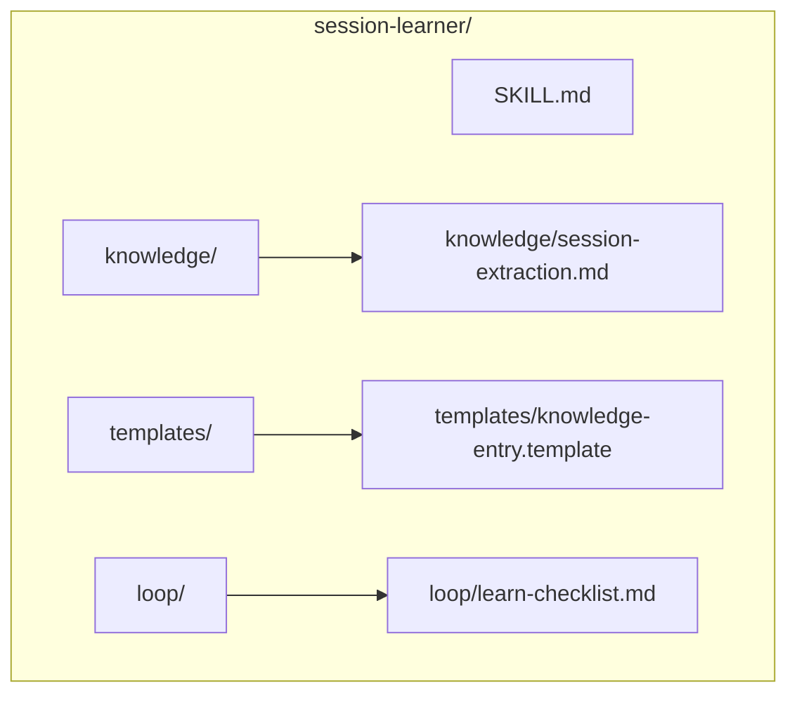
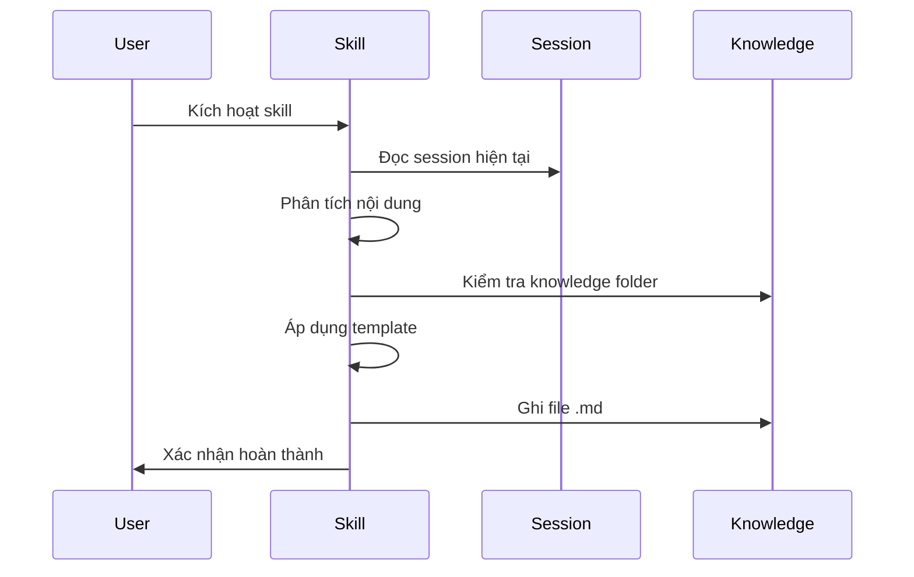

# design.md — session-learner

**Skill Name:** `session-learner`
**Status:** COMPLETE
**Date:** 2026-05-08
**Author:** Steve

---

## §1. Problem Statement

**Pain Point:** Người dùng có nhiều session chat quý giá nhưng kiến thức không được lưu lại, khó tìm kiếm và tái sử dụng.

**User & Context:** Developer/knowledge worker sử dụng Hermes Agent, muốn khai thác insights từ các session làm việc để xây dựng knowledge base cá nhân.

**Expected Output:** File markdown chứa kiến thức/trích xuất, được ghi vào thư mục knowledge của dự án.

---

## §2. Capability Map

### 3 Pillars Analysis

| Pillar | Nội dung |
|--------|----------|
| **Knowledge** | Session data structure, Hermes session management, knowledge categorization |
| **Process** | Scan current session → Extract entities → Structure insights → Write to knowledge |
| **Guardrails** | Không ghi đè file có sẵn, validate markdown syntax, limit file size |

---

## §3. Zone Mapping

| Zone | Files cần tạo | Nội dung | Bắt buộc? |
|------|---------------|----------|------------|
| Core | `SKILL.md` | Persona, 2-phase workflow, guardrails | ✅ |
| Knowledge | `knowledge/session-extraction.md` | Cách extract insights từ session | ✅ |
| Scripts | N/A | Không cần | ❌ |
| Templates | `templates/knowledge-entry.template` | Template markdown cho knowledge entry | ✅ |
| Data | N/A | Không cần | ❌ |
| Loop | `loop/learn-checklist.md` | Checklist trước khi ghi file | ✅ |

---

## §4. Folder Structure

---

## §5. Execution Flow

---

## §6. Interaction Points

| Điểm dừng | Khi nào | Hành động |
|------------|---------|-----------|
| Gate 1 | Sau khi extract insights | Hỏi user về tên file và category |
| Gate 2 | Trước khi ghi file | Confirm nội dung trước khi lưu |

---

## §7. Progressive Disclosure Plan

### Tier 1 (Mandatory)
- `SKILL.md` — Boot bắt buộc
- `../_shared/knowledge/framework.md` — Shared framework

### Tier 2 (Conditional)
- `knowledge/session-extraction.md` — Khi cần hướng dẫn extract
- `templates/knowledge-entry.template` — Khi viết output
- `loop/learn-checklist.md` — Trước khi deliver

---

## §8. Risks & Blind Spots

| Risk | Mitigation |
|------|------------|
| Session quá dài → cắt mất nội dung quan trọng | Giới hạn scan 50 messages cuối |
| Trùng lặp kiến thức đã có | Check file tồn tại trước khi ghi |
| Markdown syntax lỗi | Validate format trước khi ghi |
| File quá lớn (>100KB) | Warn user, đề nghị chia nhỏ |

---

## §9. Open Questions

- [x] Hardcoded path `/home/steve/Work-space/deep_work_by_steve/knowledge/` — sẽ thay bằng config sau
- [ ] Có nên hỏi user về category (experience/projects/notes) không?

---

## §10. Metadata

| Field | Value |
|-------|-------|
| Name | `session-learner` |
| Version | 1.0.0 |
| Category | meta |
| Pipeline Stage | standalone |
| Dependencies | None |

---

## §10.1 Version & Dependencies

**Version:** 1.0.0 (initial)
**Dependencies:** None — standalone skill
