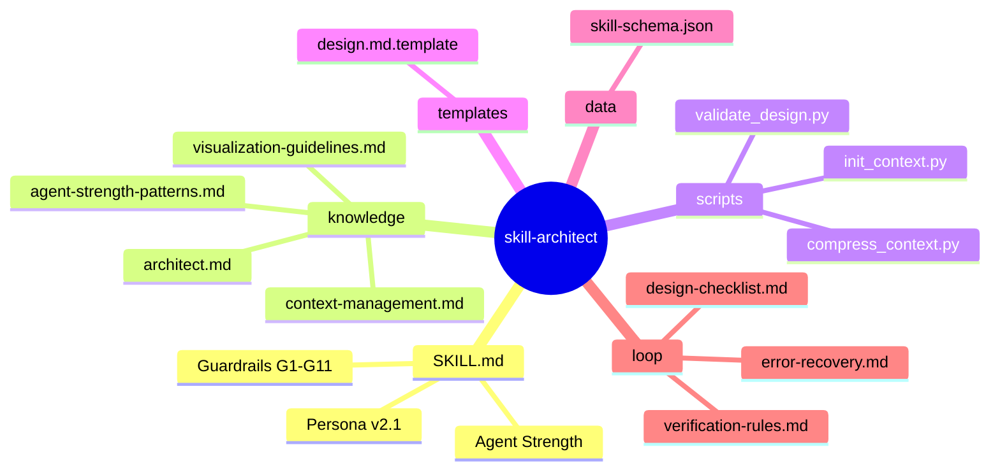
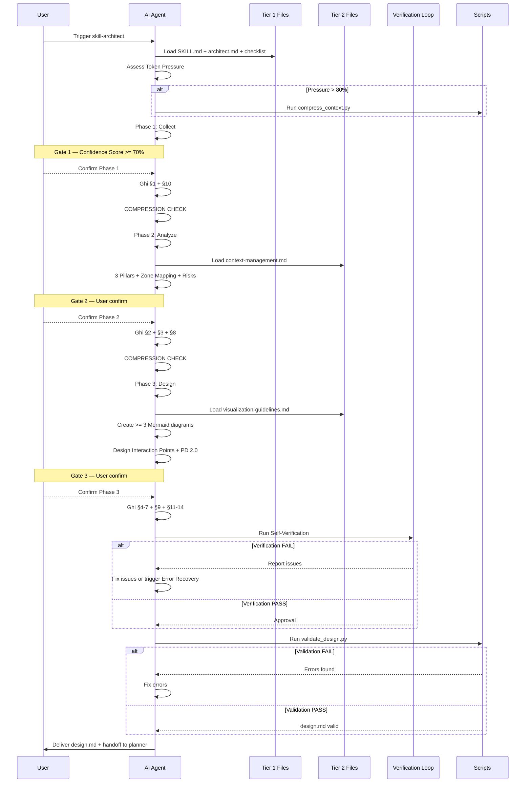
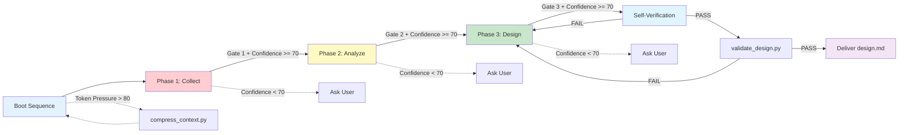

# skill-architect v2.1 — Architecture Design

> Generated by: skill-architect | 2026-05-03
> Status: IN PROGRESS
> Version: 2.1.0

---

## 1. Problem Statement

**Vấn đề**: skill-architect v2.0 có 12 weaknesses nghiêm trọng làm giảm hiệu quả AI agent:
1. Không quản lý context window → AI load files không cần thiết, waste tokens
2. Không có self-verification loop → deliver design với lỗi chưa phát hiện
3. Progressive Disclosure tĩnh → không adapt theo độ phức tạp task
4. Không có error recovery → khi AI hallucinate hoặc fail, không có graceful degradation
5. Thiếu anti-hallucination guards → knowledge files không enforce source-tracing
6. Template có nhiều HTML comments → token bloat
7. Không có multi-agent coordination hints → handoff với planner/builder yếu
8. Không có confidence scoring → architect proceed mà không đo chất lượng
9. Scripts thiếu robustness → init_context.py không handle edge cases
10. Rollback chỉ manual → không có automated recovery
11. Knowledge files redundant → không có token compression
12. Zone mapping tĩnh → không adapt theo skill complexity

**Ngưới dùng**: AI Agent (Claude Code) sử dụng skill-architect để thiết kế các Agent Skill mới

**Lý do cần skill**: Cần tăng sức mạnh AI agent để:
- Giảm token waste tối thiểu 40%
- Tăng design quality với self-verification
- Tăng robustness với error recovery
- Cải thiện handoff với planner/builder

---

## 2. Capability Map

### 2.1 Tri thức (Knowledge — Pillar 1)

| Knowledge Area | File | Mục đích |
|----------------|------|----------|
| Workflow Framework | `knowledge/architect.md` | 3-phase workflow với gates |
| Visualization Standards | `knowledge/visualization-guidelines.md` | Mermaid syntax & diagram rules |
| Context Management | `knowledge/context-management.md` | Token optimization, compression |
| Agent Strength Patterns | `knowledge/agent-strength-patterns.md` | Patterns tăng sức mạnh AI |
| Skill Schema | `data/skill-schema.json` | Structured schema validation |

### 2.2 Quy trình (Process — Pillar 2)

```
Boot Sequence
  ├── Load Tier 1 (Mandatory): SKILL.md + architect.md + checklist
  ├── Assess Token Pressure
  │   ├── Pressure < 50%: Load Tier 2 on-demand
  │   └── Pressure > 80%: Trigger compress_context.py
  │
  Phase 1: Collect
  ├── Xác định skill-name (kebab-case)
  ├── Thu thập: Pain Point, User & Context, Expected Output
  ├── Confidence Scoring (< 70% → ask more)
  └── Gate 1: User confirm → Ghi §1 + §10 → COMPRESSION CHECK

  Phase 2: Analyze
  ├── 3 Pillars Analysis (Knowledge/Process/Guardrails)
  ├── 7 Zones Mapping với complexity adaptation
  ├── Risk Identification (>= 3 risks)
  └── Gate 2: User confirm → Ghi §2 + §3 + §8 → COMPRESSION CHECK

  Phase 3: Design & Output
  ├── Load visualization-guidelines.md (Tier 2)
  ├── Create >= 3 Mermaid diagrams
  ├── Design §6 Interaction Points
  ├── Design §7 Progressive Disclosure 2.0
  ├── Self-Verification Loop (verification-rules.md)
  └── Gate 3: User confirm → Ghi §4 + §5 + §6 + §7 + §9 + §11-14

  Pre-Delivery
  ├── Run validate_design.py
  ├── Check all acceptance criteria
  └── Mark status: COMPLETE
```

### 2.3 Kiểm soát (Guardrails — Pillar 3)

| ID | Rule | Mô tả |
|----|------|-------|
| G1 | Design Only | Không viết code, không implement |
| G2 | Gate Enforcement | Mỗi Phase PHẢI có gate + confidence score |
| G3 | Diagrams First | >= 3 Mermaid diagrams trước text |
| G4 | Confidence Threshold | < 70% = hỏi thêm |
| G5 | Zone Mapping Contract | Cột "Files cần tạo" phải có tên file cụ thể |
| G6 | Single Context Rule | 1 skill mỗi lần |
| G7 | Checklist Gate | Bắt buộc verification trước deliver |
| G8 | **NEW** Token Budget | Giữ context < 70% window, trigger compression khi > 80% |
| G9 | **NEW** Source Trace | Mọi claim trong knowledge PHẢI trace về source |
| G10 | **NEW** Self-Verify | Run verification loop trước khi declare hoàn thành |
| G11 | **NEW** Error Recovery | Khi detect hallucination → rollback về phase gần nhất |

---

## 3. Zone Mapping

> Contract Section — Planner đọc §3 để decompose thành Tasks.

| Zone | Files cần tạo | Nội dung | Bắt buộc? |
|------|--------------|----------|-----------|
| Core (SKILL.md) | `SKILL.md` | Persona, phases, guardrails v2.1 | ✅ |
| Knowledge | `knowledge/architect.md` | Workflow framework | ✅ |
| Knowledge | `knowledge/visualization-guidelines.md` | Mermaid standards | ✅ |
| Knowledge | `knowledge/context-management.md` | Token optimization strategy | ✅ |
| Knowledge | `knowledge/agent-strength-patterns.md` | AI optimization patterns | ✅ |
| Scripts | `scripts/init_context.py` | Bootstrap .skill-context/ | ✅ |
| Scripts | `scripts/validate_design.py` | Validate design.md completeness | ✅ |
| Scripts | `scripts/compress_context.py` | Token compression (optional) | ❌ |
| Templates | `templates/design.md.template` | Output template v2.1 | ✅ |
| Data | `data/skill-schema.json` | Schema for validation | ✅ |
| Loop | `loop/design-checklist.md` | Quality gate checklist | ✅ |
| Loop | `loop/verification-rules.md` | Self-check rules | ✅ |
| Loop | `loop/error-recovery.md` | Failure handling procedures | ✅ |
| Assets | Không cần | N/A | ❌ |

---

## 4. Folder Structure



---

## 5. Execution Flow



---

## 5.1 Workflow Phases (D3)



---

## 6. Interaction Points

| # | Thời điểm | Lý do dừng | Hành động của AI |
|---|-----------|-----------|-----------------|
| 1 | Sau Phase 1 (Collect) | Cần xác nhận Problem Statement, skill-name, output format | Trình bày summary §1 + Confidence Score. Chờ user confirm hoặc clarify. |
| 2 | Sau Phase 2 (Analyze) | Cần xác nhận Capability Map, Zone Mapping, Risks | Trình bày bảng phân tích 3 Pillars + Zone Mapping. Chờ confirm. |
| 3 | Sau Phase 3 (Design) | Cần xác nhận toàn bộ design trước ghi file | Trình bày diagrams + folder structure + interaction points. Chờ confirm. |
| 4 | **NEW** Khi Confidence < 70% | Thông tin chưa đủ để proceed | Hỏi thêm 1-3 câu cụ thể, không đoán. |
| 5 | **NEW** Khi Token Pressure > 80% | Context window sắp đầy | Thông báo user, offer compress hoặc split task. |
| 6 | **NEW** Khi Verification FAIL | Self-check phát hiện lỗi | Trình bày issues found + plan fix. Chờ user confirm approach. |

---

## 7. Progressive Disclosure Plan 2.0

### Tier 1: Bắt buộc đọc (Mandatory — Always Load)

| File | Lý do bắt buộc | Est. Tokens |
|------|---------------|-------------|
| `SKILL.md` | Persona, scope, guardrails | ~300 |
| `knowledge/architect.md` | 3-phase workflow | ~150 |
| `loop/design-checklist.md` | Quality gate | ~150 |
| **Total Tier 1** | | **~600 tokens** |

> Target: Giữ Tier 1 < 1000 tokens để luôn fit trong context window nhỏ.

### Tier 2: Đọc khi cần (Conditional — On-Demand)

| File | Điều kiện load | Est. Tokens |
|------|---------------|-------------|
| `knowledge/visualization-guidelines.md` | Phase 3: cần vẽ diagram | ~400 |
| `knowledge/context-management.md` | Boot hoặc token pressure > 50% | ~300 |
| `knowledge/agent-strength-patterns.md` | Design skill phức tạp hoặc multi-agent | ~350 |
| `templates/design.md.template` | Khi viết design.md output | ~500 |
| **Total Tier 2 (max)** | | **~1550 tokens** |

### Tier 3: Đọc khi verify/recover (Verification & Recovery)

| File | Điều kiện load | Est. Tokens |
|------|---------------|-------------|
| `scripts/validate_design.py` | Pre-delivery verification | ~300 |
| `scripts/compress_context.py` | Token pressure > 80% | ~200 |
| `loop/verification-rules.md` | Trước khi declare completion | ~250 |
| `loop/error-recovery.md` | Khi detect error/hallucination | ~200 |
| `data/skill-schema.json` | Khi validate schema | ~150 |
| **Total Tier 3 (max)** | | **~1100 tokens** |

> **Token Budget Strategy**: Tier 1 luôn load. Tier 2 load on-demand. Tier 3 chỉ load khi cần verify/recover. Tổng max ~3250 tokens (well within Claude 200K context).

---

## 8. Risks & Blind Spots

| # | Risk | Severity | Mitigation |
|---|------|----------|-----------|
| 1 | AI bịa thông tin không có trong resources | P0 | **Source Trace Rule**: Mọi claim trong knowledge PHẢI có source reference. Verification loop kiểm tra traceability. |
| 2 | Context window overflow khi design skill phức tạp | P0 | **Token Budget Guard**: Theo dõi token usage, trigger compression khi > 80%. compress_context.py tự động loại bỏ redundant content. |
| 3 | Self-verification loop bị skip hoặc incomplete | P0 | **Mandatory Check**: verification-rules.md được load như Tier 3 bắt buộc trước delivery. Script validate_design.py kiểm tra programmatically. |
| 4 | User reject design sau khi đã ghi file | P1 | **Rollback Procedures**: Mỗi phase có rollback steps. Emergency rollback cho phép revert nhanh về phase trước. |
| 5 | Handoff với planner/builder thiếu thông tin | P1 | **Handoff Checklist**: §3 Zone Mapping + §7 PD Plan là contract. validate_design.py kiểm tra handoff readiness. |
| 6 | Template v2.1 quá phức tạp so với v2.0 | P1 | **Backward Compatibility**: Giữ nguyên pipeline A→P→B. Chỉ thêm sections optional (§11-14). Template vẫn có 10 sections core. |

---

## 9. Open Questions

| # | Câu hỏi | Nguồn (Phase) | Trạng thái |
|---|---------|--------------|-----------|
| 1 | Có nên thêm telemetry để track token usage thực tế? | Phase 2 | ❓ Chưa rõ — cần quyết định về privacy |
| 2 | compress_context.py nên là Python script hay bash script? | Phase 3 | ❓ Chưa rõ — Python có thể phân tích markdown tốt hơn |
| 3 | Có nên hỗ trợ design.md output dạng JSON thay vì Markdown? | Phase 1 | ✅ Đã giải quyết — Giữ Markdown làm primary, JSON làm optional export |

---

## 10. Metadata

- **Skill Name**: skill-architect
- **Version**: 2.1.0
- **Created**: 2026-05-03
- **Author**: Steve Void Team
- **Framework**: architect.md v2.1
- **Status**: IN PROGRESS
- **Handoff Checklist**:
  - [x] §3 Zone Mapping đủ thông tin cho Planner
  - [x] §7 PD Plan phân biệt rõ Tier 1/2/3
  - [x] §8 có >= 3 risks kèm mitigation
  - [x] §9 Open Questions đã ghi chú rõ

---

## 11. Context Management (NEW v2.1)

### 11.1 Token Budget Framework

```markdown
| Budget Level | Threshold | Action |
|-------------|-----------|--------|
| Green | < 50% | Load Tier 2 on-demand |
| Yellow | 50-80% | Skip non-essential Tier 2, trigger compression hints |
| Red | > 80% | Run compress_context.py, load only critical files |
```

### 11.2 Compression Strategy

1. **Remove HTML Comments**: Template có <!-- --> → remove sau khi render
2. **Deduplicate Knowledge**: architect.md và SKILL.md có overlap → reference thay vì duplicate
3. **Lazy Loading**: Tier 2/3 chỉ load khi thực sự cần
4. **Summary Mode**: Khi Red budget, load "executive summary" thay vì full file

### 11.3 Context Health Monitor

- Theo dõi số files đã load
- Theo dõi estimated token usage
- Trigger compression tự động khi cần

---

## 12. Verification Loop (NEW v2.1)

### 12.1 Self-Check Procedure

Trước khi declare hoàn thành, AI PHẢI chạy qua verification-rules.md:

```
Step 1: Structure Check
  ├── All 10 core sections present? (§1-§10)
  ├── §11-§14 present (for v2.1+)?
  └── Frontmatter valid YAML?

Step 2: Content Check
  ├── §1: Problem statement rõ ràng (3 questions answered)?
  ├── §2: 3 Pillars đầy đủ?
  ├── §3: Zone Mapping có tên file cụ thể?
  ├── §4: >= 3 Mermaid diagrams?
  ├── §6: >= 1 interaction point?
  ├── §7: Tier 1/2 phân biệt rõ?
  └── §8: >= 3 risks?

Step 3: Quality Check
  ├── No placeholder text remaining?
  ├── Mermaid syntax valid?
  ├── All references resolveable?
  └── Handoff contract complete?

Step 4: Cross-Reference Check
  ├── §3 Zone Mapping khớp với §4 Folder Structure?
  ├── §7 Tier files khớp với §3 files?
  └── §10 Metadata đầy đủ?
```

### 12.2 Verification Automation

- `scripts/validate_design.py` chạy programmatic check
- Return: PASS / FAIL với list issues
- Nếu FAIL → fix hoặc trigger Error Recovery

---

## 13. Error Recovery (NEW v2.1)

### 13.1 Error Detection

AI detect lỗi khi:
- Verification loop FAIL
- User reject design
- Context corruption (file not found, parse error)
- Hallucination detected (claim không có source)

### 13.2 Recovery Procedures

```markdown
| Error Type | Recovery Action |
|-----------|----------------|
| Verification FAIL | Fix issues → Re-verify. Nếu không fix được → rollback phase. |
| User Reject | Rollback về phase user reject. Giữ nguyên phases trước đó. |
| Context Corruption | Reload Tier 1. Skip cache. Re-initialize từ đầu phase hiện tại. |
| Hallucination Detected | Trace claim về source. Nếu không trace được → remove claim. |
| Token Overflow | Run compress_context.py. Reduce Tier 2 load. Summarize thay vì full. |
```

### 13.3 Graceful Degradation

Khi skill gặp vấn đề không recover được:
1. Thông báo user về issue cụ thể
2. Offer alternatives: simplify scope, split into multiple skills, manual design
3. Never deliver incomplete or incorrect design.md

---

## 14. Agent Strength Optimization (NEW v2.1)

### 14.1 Chain-of-Thought Enforcement

Mọi design decision PHẢI có reasoning:
```markdown
**Decision**: [What]
**Reasoning**: [Why] — dựa trên Pillar nào? Risk nào?
**Alternative Considered**: [What else] — tại sao không chọn?
```

### 14.2 Confidence Scoring

```markdown
| Metric | Score | Weight |
|--------|-------|--------|
| Output clarity | 0-100 | 30% |
| Zone mapping completeness | 0-100 | 25% |
| Risk coverage | 0-100 | 20% |
| Diagram quality | 0-100 | 15% |
| Handoff readiness | 0-100 | 10% |
| **Total** | **0-100** | **100%** |

- Score >= 70: Proceed
- Score 50-69: Ask clarifying questions
- Score < 50: Redesign or scope reduction
```

### 14.3 Multi-Agent Coordination Hints

**Handoff A→P** (Architect → Planner):
- §3 Zone Mapping → Planner decompose thành tasks
- §7 PD Plan → Planner biết Tier 1/2 files
- §8 Risks → Planner setup guardrails
- **NEW** §12 Verification Rules → Planner biết quality standards

**Handoff P→B** (Planner → Builder):
- todo.md + resources/ → Builder execution plan
- **NEW** §13 Error Recovery → Builder biết failure handling
- **NEW** §14 Agent Strength → Builder optimize implementation

### 14.4 Persistent Learning

- `progress.txt` ghi lại learnings từ mỗi session
- Builder ghi feedback vào build-log.md
- Architect đọc feedback ở session tiếp theo để cải thiện
