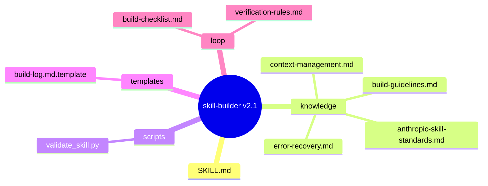
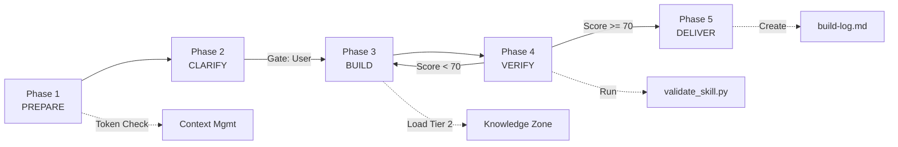
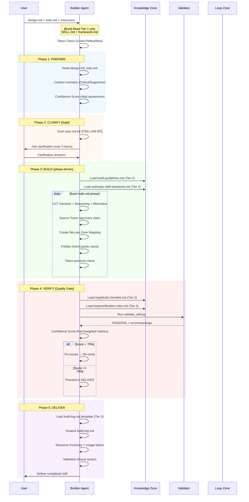

# skill-builder v2.1 — Architecture Design

> Generated by skill-architect | 2026-05-03
> Status: IN PROGRESS

---

## 1. Problem Statement

**Vấn đề**: skill-builder v1.x là implementation-grade meta-skill nhưng thiếu 5 subsystem quan trọng mà skill-architect v2.1 đã chứng minh hiệu quả: Context Management, Confidence Scoring, Chain-of-Thought Enforcement, Source Trace Rule, và Error Recovery.

**Người dùng**: AI Agent (Claude) thực thi build skill từ design.md + todo.md. Vận hành trong pipeline A→P→B.

**Lý do cần redesign**:
- Builder hiện tại có 15 weaknesses/anti-patterns đã audit (xem §9)
- Không có cơ chế chống hallucination (Source Trace)
- Không có token budget → context blow-up trên skill phức tạp
- Không có confidence scoring → quality binary (placeholder < 5 = PASS)
- Validation script nửa vời (check_error_handling là no-op)
- Duplicate content (~100 lines wasted in knowledge/architect.md)

---

## 2. Capability Map

### 2.1 Tri thức (Knowledge — Pillar 1)

| Domain | Knowledge Needed | Format | Source |
|--------|-----------------|--------|--------|
| 7-Zone Architecture | Zone definitions, file naming, structure rules | Reference doc | `../_shared/knowledge/framework.md` |
| Anthropic Skill Standards | YAML frontmatter, PD, examples pattern, size limits | Reference doc | `knowledge/anthropic-skill-standards.md` |
| Build Guidelines | Content writing rules, naming, fidelity standards | Reference doc | `knowledge/build-guidelines.md` |
| Context Management | Token budget (Green/Yellow/Red), compression techniques | Reference doc | `knowledge/context-management.md` (NEW) |
| Error Recovery | Graceful degradation, rollback procedures | Reference doc | `knowledge/error-recovery.md` (NEW) |

### 2.2 Quy trình (Process — Pillar 2)

```
PREPARE → CLARIFY → BUILD → VERIFY → DELIVER
   │          │        │        │         │
   │          │        │        │         └─ Finalize build-log, Resource Matrix
   │          │        │        └─ Self-check, validate_skill.py, confidence score
   │          │        └─ Phase-driven build, CoT reasoning, source trace
   │          └─ Gate: wait for user clarification
   └─ Read inputs, context inventory, token check
```

### 2.3 Kiểm soát (Guardrails — Pillar 3)

| AI Failure Point | Guardrail | Enforcement |
|-----------------|-----------|-------------|
| Hallucinate content not in resources | Source Trace Rule | Every claim must trace to `[TỪ DESIGN §N]` or `[TỪ RESOURCE]` |
| Blow context window on large skills | Token Budget (Green/Yellow/Red) | Context monitoring + compression at Red |
| Skip quality gates | Phase Gate Enforcement | Mandatory verification loop before deliver |
| Make arbitrary build decisions | Chain-of-Thought | Every decision needs: Decision + Reasoning + Alternative |
| Claim "done" when quality is low | Confidence Scoring | Weighted metrics, < 70% = fix before proceed |
| Summarize critical resources | Fidelity Rule | Parity check: target must match source item count |
| Create files outside design.md §3 | Zone Contract Block | Only create files listed in design.md §3 |

---

## 3. Zone Mapping

| Zone | Files cần tạo | Nội dung | Bắt buộc? |
|------|--------------|----------|-----------|
| Core (SKILL.md) | `SKILL.md` | Persona, 5-phase workflow, guardrails v2.1, confidence scoring, CoT | ✅ |
| Knowledge | `knowledge/build-guidelines.md` | Content writing rules, fidelity, naming | ✅ |
| Knowledge | `knowledge/anthropic-skill-standards.md` | YAML, PD, tracker, examples, size limits | ✅ |
| Knowledge | `knowledge/context-management.md` | Token budget (Green/Yellow/Red), compression techniques | ✅ |
| Knowledge | `knowledge/error-recovery.md` | Graceful degradation, rollback per phase, recovery patterns | ✅ |
| Scripts | `scripts/validate_skill.py` | Structure check, PD links, placeholder density, fidelity, error handling | ✅ |
| Templates | `templates/build-log.md.template` | Execution trace, quality metrics, feedback fields | ✅ |
| Loop | `loop/build-checklist.md` | Quality gate with confidence scoring criteria | ✅ |
| Loop | `loop/verification-rules.md` | Self-check rules before completion | ✅ |
| Data | Không cần | — | ❌ |
| Assets | Không cần | — | ❌ |

---

## 4. Folder Structure



---

## 5. Execution Flow

### D2 — Workflow Phases Flowchart



### D3 — Execution Sequence



---

## 6. Interaction Points

| # | Thời điểm | Lý do dừng | Hành động của AI |
|---|-----------|-----------|-----------------|
| 1 | Phase 2: CLARIFY | `[CẦN LÀM RÕ]` items in todo.md | Ask user max 5 clarifying questions, record answers to design.md §Clarifications |
| 2 | Phase 3: BUILD | Critical resource missing (design.md, todo.md, resources/*) | Log error, notify user, STOP (Log-Notify-Stop) |
| 3 | Phase 4: VERIFY | Confidence score < 50% | Report weak areas, ask user whether to fix or accept |
| 4 | Phase 4: VERIFY | validate_skill.py FAIL with errors | Report specific errors, fix and re-verify |

---

## 7. Progressive Disclosure Plan

### Tier 1: Bắt buộc đọc (Mandatory — Boot)

| File | Lý do | load_when |
|------|-------|-----------|
| `SKILL.md` | Core orchestration, always loaded | Always (auto by system) |
| `../_shared/knowledge/framework.md` | 7-Zone architecture, naming, anti-hallucination | Boot sequence |

### Tier 2: Đọc khi cần (Conditional)

| File | load_when |
|------|-----------|
| `knowledge/build-guidelines.md` | Phase 3: BUILD — khi bắt đầu viết content |
| `knowledge/anthropic-skill-standards.md` | Phase 3: BUILD — khi viết SKILL.md |
| `knowledge/context-management.md` | Boot hoặc khi token pressure > 50% |
| `knowledge/error-recovery.md` | Khi detect error hoặc Phase 5 DELIVER |
| `loop/build-checklist.md` | Phase 4: VERIFY quality gate |
| `loop/verification-rules.md` | Trước khi declare completion |
| `scripts/validate_skill.py` | Phase 4: VERIFY — run validation |

### Tier 3: Optional (on-demand)

| File | load_when |
|------|-----------|
| `templates/build-log.md.template` | Phase 5: DELIVER — khi tạo build-log.md |

---

## 8. Risks & Blind Spots

| # | Risk | Severity | Mitigation |
|---|------|----------|-----------|
| 1 | **Backward compatibility break** — v2.1 thay đổi output format có thể làm skill-planner và skill-architect cũ không đọc được | HIGH | Giữ nguyên output contract (.skill-context/{name}/skill files), chỉ thay đổi internal process. Zone Mapping format preserved. |
| 2 | **Context blow-up** — thêm 4 knowledge files mới có thể tăng total context | MEDIUM | Strict Tier 2 loading theo load_when. Xóa duplicate content (knowledge/architect.md → redirect). Compress at Red token budget. |
| 3 | **Validation script regression** — enhance validate_skill.py có thể break trên skills cũ | HIGH | Add new checks as WARNING first, only ERROR after migration period. Backward-compatible error codes. |
| 4 | **Over-engineering** — thêm quá nhiều guardrails có thể làm Builder chậm và overly cautious | MEDIUM | Confidence scoring thresholds (>= 70 proceed, < 70 clarify). CoT enforcement only for non-trivial decisions. |
| 5 | **CoT token overhead** — Chain-of-Thought cho mọi decision tăng token usage | MEDIUM | CoT required only for decisions affecting > 1 file or Zone Mapping choices. Trivial decisions (naming, formatting) exempt. |
| 6 | **Knowledge file fragmentation** — 4 knowledge files thay vì 2 có thể làm Builder mất context switches | LOW | Clear load_when conditions. Progressive disclosure prevents loading unnecessary files. |
| 7 | **Pipeline feedback loop unused** — feedback_to_planner/architect fields in build-log never filled | LOW | Keep fields, make optional. Builder should fill only when genuine feedback exists. |

---

## 9. Open Questions

| # | Câu hỏi | Nguon (Phase) | Trạng thái |
|---|---------|--------------|-----------|
| 1 | Nên giữ knowledge/architect.md hay merge vào SKILL.md boot sequence? | Phase 1 | ✅ Quyết định: XÓA knowledge/architect.md, dùng ../_shared/knowledge/framework.md trực tiếp |
| 2 | validate_skill.py mới nên WARNING hay ERROR cho checks mới? | Phase 3 | ✅ Quyết định: WARNING cho iteration 1, ERROR sau khi migration verified |
| 3 | templates/build-log.md.template nên ở templates/ hay loop/? | Phase 2 | ✅ Quyết định: templates/ (tuân thủ 7-Zone) |
| 4 | CoT enforcement nên mandatory hay optional? | Phase 3 | ✅ Quyết định: Mandatory cho non-trivial decisions, exempt cho trivial naming/formatting |
| 5 | Confidence scoring weights nên giống architect hay customize? | Phase 3 | ✅ Quyết định: Customize — Builder có metrics khác (Fidelity 30%, Zone Contract 25%, PD Compliance 20%, Anthropic Standards 15%, Build-log 10%) |

---

## 10. Metadata

- **Skill Name**: skill-builder
- **Created**: 2026-05-03
- **Author**: skill-architect (v2.1 rebuild)
- **Framework**: architect.md v2.1
- **Status**: IN PROGRESS
- **Version**: 2.1.0 (MINOR — added §11-§14 subsystems)
- **Handoff Checklist**:
  - [ ] design.md hoàn chỉnh (checklist pass)
  - [ ] Sẵn sàng cho skill-planner

### Pipeline Stage

| Stage | Skill | Output |
|-------|-------|--------|
| 1 | skill-architect | design.md |
| 2 | skill-planner | todo.md |
| 3 | skill-builder | skill files |

### Dependencies

| Type | Skill | Required | Reason |
|------|-------|----------|--------|
| Predecessor | skill-planner | ✅ | Cần design.md + todo.md |
| Successor | None | - | Final stage trong pipeline |

### Handoff Contracts Preserved

**Architect → Planner → Builder**:
- §3 Zone Mapping → Planner creates task breakdown (UNCHANGED)
- §7 Progressive Disclosure → Planner + Builder know Tier files (ENHANCED: Tier 3 added)
- §8 Risks → Builder references Guardrails (ENHANCED: 7 risks vs 3)
- Builder output contract: `.skill-context/{skill-name}/` directory (UNCHANGED)

---

## 11. Context Management

### Token Budget

| Level | Threshold | Action |
|-------|-----------|--------|
| Green | < 50% | Load Tier 2 on-demand as specified |
| Yellow | 50-80% | Skip non-essential Tier 2. Load only Tier 1 + current phase needs |
| Red | > 80% | Run compression: remove HTML comments, summarize old phases, skip Tier 3 entirely |

### Compression Techniques

1. **Remove HTML comments** from templates during build
2. **Deduplicate knowledge** — reference framework.md instead of repeating content
3. **Lazy loading** — Tier 2/3 files load only when phase reaches them
4. **Summary mode** — at Red budget, summarize completed phases instead of full content
5. **Delete knowledge/architect.md** — redirect to shared framework (saves ~100 lines)

### Monitoring

Builder MUST check token pressure at:
- Boot (after Tier 1 load)
- Start of Phase 3 BUILD (before loading Tier 2 knowledge files)
- Before Phase 4 VERIFY (before loading Tier 2 loop files)

---

## 12. Verification Loop

### Self-Check Procedure (Before DELIVER)

**MANDATORY** — Builder must run through ALL checks before declaring completion:

1. **Structure Check**: All 4 mandatory zones present? (Core, Knowledge, Loop, Scripts)
2. **Zone Contract Check**: Every file created exists in design.md §3? No hallucinated files?
3. **Content Check**: Every file has substantive content (no HTML comments, no `[MISSING_DOMAIN_DATA]`)?
4. **PD Check**: All Tier 2 files linked from SKILL.md? No orphan files?
5. **Fidelity Check**: Resource parity — source has N items, target has N items?
6. **Anthropic Standards**: YAML frontmatter, description third-person, name kebab-case ≤ 64 chars?
7. **Run** `scripts/validate_skill.py --design {design_path} --log`
8. **Confidence Score**: Calculate weighted score (see §14)
9. **Build-log Complete**: Resource Inventory + Resource Usage Matrix + Validation Result present?

If ANY check fails → fix → re-verify loop.

---

## 13. Error Recovery

### Per-Phase Rollback

| Phase | Trigger | Recovery |
|-------|---------|----------|
| PREPARE | design.md missing or corrupted | STOP. Notify user. Cannot proceed without design input. |
| CLARIFY | User provides contradictory answers | Record contradiction, present options, wait for resolution. |
| BUILD | Critical resource missing | Log → Notify → STOP. Do NOT fabricate content. |
| BUILD | File creation fails (permission, path) | Log error, skip file, flag as blocker in build-log.md. |
| VERIFY | validate_skill.py FAIL | Parse errors, fix files, re-run. Max 3 retry loops. |
| VERIFY | Confidence < 50% | Report weak areas. Ask user: fix or accept with documented risks? |
| DELIVER | build-log.md write fails | Try alternate path. If fails → output to stdout. |

### Graceful Degradation

| Scenario | Strategy |
|----------|----------|
| Token pressure Red during BUILD | Compress completed phases, skip Tier 3 templates, continue with essential files only |
| validate_skill.py not available | Run manual checklist (loop/build-checklist.md) with stricter self-assessment |
| User not responding to CLARIFY gate | After 1 attempt → proceed with reasonable assumptions, log assumptions in build-log.md |
| design.md §3 has placeholder filenames | STOP. This is an architect error. Notify user to re-run skill-architect. |

### Error Policy (Log-Notify-Stop)

For SYSTEM errors (not content errors):
1. **Log**: Append full error to build-log.md with timestamp
2. **Notify**: Use AskUserQuestion to report blockage with context
3. **STOP**: Halt all tasks. Do NOT continue building on broken foundation.

---

## 14. Agent Strength Optimization

### Confidence Scoring (Weighted Metrics)

| Metric | Weight | Measurement |
|--------|--------|-------------|
| Fidelity (parity check) | 30% | Target files maintain ≥ 80% of source item count |
| Zone Contract compliance | 25% | All files from §3 created, no extras |
| PD Compliance | 20% | All Tier 2 linked from SKILL.md, correct load_when |
| Anthropic Standards | 15% | YAML, description, naming, size limits |
| Build-log completeness | 10% | Resource Inventory + Matrix + Validation Result |

**Thresholds**:
- >= 70: Proceed to DELIVER
- 50-69: Fix issues, re-verify
- < 50: Report to user, ask for guidance

### Chain-of-Thought Enforcement

Every non-trivial build decision MUST follow:

```
Decision: [What was decided]
Reasoning: [Why] — references design.md §N or resource evidence
Alternative: [What else considered] — why not chosen
```

**Exempt** (trivial decisions, no CoT needed):
- File naming following kebab-case convention
- Formatting (tables vs lists) when both are valid
- Ordering of items when no dependency exists

### Source Trace Rule

Every content claim in built files MUST be traceable:

| Tag | Meaning |
|-----|---------|
| `[TỪ DESIGN §N]` | Derived from design.md section N |
| `[TỪ RESOURCE: path]` | Derived from specific resource file |
| `[GỢI Ý BỔ SUNG]` | Builder suggestion, not in design/resources |
| `[CẦN LÀM RÕ]` | Needs user clarification |

**Enforcement**: During VERIFY phase, sample-check 3 random content blocks for trace tags. If missing → FAIL fidelity check.
