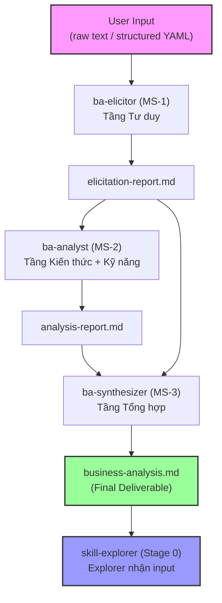

# skill-business-analyst — Báo Cáo Khảo Sát Nghiệp Vụ & Khai Thác Tài Nguyên

> **Ngày khảo sát**: 2026-06-06
> **Trạng thái**: Hoàn thành (`completed`)
> **Skills áp dụng**: skill-explorer (Stage 0) + production-quality-gatekeeper (LLM domain)

---

## 1. Pain Point & Core Objective

### A. Vấn đề thực tế (Pain Points)

1. **Thiếu khâu phân tích nghiệp vụ trước khi tạo skill**: Pipeline hiện tại bắt đầu từ Explorer (Stage 0) — khảo sát tài nguyên và đánh giá tiêu chuẩn. Nhưng KHÔNG có bước phân tích nghiệp vụ bài bản: phân rã yêu cầu, xác định luồng xử lý, cấu trúc dữ liệu, và tiêu chí nghiệm thu.

2. **Yêu cầu skill thường mơ hồ**: Người dùng (developer/Steve) đưa ra mô tả skill dạng cảm tính ("tạo skill review code", "skill tự động deploy"). Không có cơ chế tự động làm rõ các vùng thông tin thiếu hụt.

3. **Không có structured deliverables chuẩn BA cho skill**: Thiếu:
   - Phân loại yêu cầu chức năng / phi chức năng
   - Luồng tương tác (Sequence Diagram) giữa User ↔ Agent ↔ Tools
   - Cấu trúc dữ liệu (input/output/config/state)
   - Acceptance Criteria dạng Gherkin
   - Ma trận rủi ro & tác động

4. **Explorer chỉ khảo sát, không phân tích**: Explorer tập trung vào việc tìm tài nguyên có sẵn, đánh giá tiêu chuẩn kỹ thuật. Nhưng không phân tích "skill đó CẦN LÀM GÌ" ở tầng nghiệp vụ.

### B. Mục tiêu tự động hóa (Core Objective)

Xây dựng hệ thống 3 micro-skills phối hợp (**skill-business-analyst**) hoạt động ở **Stage -1** (trước Explorer), chuyên:
1. Nhận yêu cầu skill thô (raw text hoặc structured input) → normalize về cấu trúc chuẩn
2. Phân tích nghiệp vụ chuyên sâu → phân loại yêu cầu, sinh sơ đồ, thiết kế data schema
3. Xuất tài liệu phân tích chuẩn (`business-analysis.md`) → handoff cho Explorer (Stage 0)

**Đối tượng sử dụng**: AI Agent (Claude Code, Antigravity, Hermes) hoạt động trong pipeline tạo skill.

**Hệ thống**: Personal AI Skill Lab (deep_work_by_steve workspace).

---

## 2. Existing Resources Audit

Bảng khảo sát hiện trạng tài nguyên nghiệp vụ trong dự án:

| Đường dẫn tài nguyên | Nội dung tóm tắt | Phân loại (Thin/Rich) | Ghi chú |
|----------------------|------------------|----------------------|---------|
| `docs/raw/brainstorm/bussines=analys/thong-tin-mau.md` | Kiến trúc đa tầng AI Agent BA: Vector mapping, semantic chunking, agentic RAG, system prompt | **Rich** | Tài liệu chuyên sâu về cấu trúc 3 tầng (Mindset-Knowledge-Skills), chunking strategies, payload schema. Dùng làm domain knowledge reference. |
| `docs/raw/brainstorm/bussines=analys/raw2.md` | Cấu trúc 3 lĩnh vực: Tư duy → Kiến thức → Kỹ năng, bảng mapping chi tiết | **Rich** | Bảng mapping từng tầng sang hành vi Agent: Mindset Keywords, Knowledge Base, System Skills. Dùng làm framework reference. |
| `.agents/skills/skill-explorer/` | Skill Explorer Stage 0 hiện tại | **Rich** | Có 7 Golden Standards, SCS scoring, template. Tham chiếu output contract. |
| `.agents/skills/production-quality-gatekeeper/` | Quality gatekeeper + LLM evaluator | **Rich** | LLM evaluation matrix 3 tầng (Foundation, Operational, Sophistication). Dùng làm quality criteria cho skill output. |
| `skills/rebuild/_shared/knowledge/framework.md` | Master Framework pipeline | **Rich** | Pipeline flow, zone structure, handoff contracts, naming conventions. |

**Kết luận tổng thể**: Tài nguyên **Rich** — đủ nền tảng tri thức để Builder triển khai trực tiếp mà không cần bổ sung Phase 0 phụ.

---

## 3. Seven Golden Standards Assessment

### A. Khả năng tái sử dụng (Reusability) — ✅ Rich

- Skill không mã hóa cứng bất kỳ nghiệp vụ cụ thể nào. Logic BA là generic: phân tích yêu cầu, phân loại, mô hình hóa.
- Tri thức domain (Mindset Keywords, BABOK references, Mermaid syntax) nằm trong `knowledge/` — nạp động.
- Áp dụng được cho mọi loại skill: code review, deploy automation, data processing, prompt engineering, v.v.

### B. Khả năng kết hợp (Composability) — ✅ Rich

- Input/Output Contract rõ ràng:
  - **Input**: Raw text hoặc structured YAML mô tả nhu cầu skill
  - **Output**: `business-analysis.md` với frontmatter handoff metadata
- Tương tác qua `.skill-context/skill-business-analyst/` — stateless giữa các micro-skills
- Không xung đột với Explorer: BA chạy trước, output feed vào Explorer Phase 1

### C. Khả năng bảo trì (Maintainability - Goldilocks Zone) — ✅ Rich

- Cấu trúc 4 lớp Progressive Disclosure:
  - L0: `SKILL.md` mỗi micro-skill < 500 tokens
  - L1: `policy/ba-rules.md` — luật phản biện, normalize
  - L2: `knowledge/` — Mindset Keywords, BABOK reference, Mermaid syntax guide
  - L3: `templates/` — Output templates cho từng deliverable

### D. Độ an toàn và bảo mật (Security) — ⚠️ Medium Risk

- **Prompt Injection**: Skill nhận raw text từ người dùng → cần XML boundaries:
  ```xml
  <user_skill_request>
  [Mô tả skill thô của người dùng]
  </user_skill_request>
  ```
- **Không chạy scripts nguy hiểm**: BA skill chỉ phân tích text, không thực thi code hay gọi API bên thứ ba.
- **Docker Sandbox**: Không cần — không có scripts execution trong BA workflow.

### E. Hiệu suất ngữ cảnh (Context Efficiency) — ✅ Rich

- Progressive Disclosure Plan:
  - **Tier 1 (Boot)**: `SKILL.md` + core rules
  - **Tier 2 (Phase-specific)**: `knowledge/mindset-keywords.md`, `knowledge/mermaid-syntax.md` — chỉ nạp khi cần sinh diagram
  - **Tier 3 (On-demand)**: `templates/` — chỉ nạp khi ghi output
- Mỗi micro-skill chỉ nạp tri thức cần cho phase của nó → tiết kiệm context window

### F. Tính di động (Portability) — ✅ Rich

- Không phụ thuộc API đặc thù của bất kỳ model nào
- Dùng ngôn ngữ tự nhiên chuẩn hóa + YAML/Markdown conventions
- Chạy được trên Claude Code, Antigravity, Hermes, hoặc bất kỳ LLM agent nào hỗ trợ skill files

### G. Độ tin cậy & Luồng dự phòng (Reliability & Fallback) — ✅ Rich

- **Execution logging**: Mỗi micro-skill ghi log vào `.skill-context/skill-business-analyst/log/`
- **Fallback**: Nếu input quá mơ hồ (confidence < 70%) → dừng, sinh danh sách câu hỏi cần làm rõ, chờ Human-in-the-loop
- **Stop Conditions**: Không đoán mò. Nếu thiếu thông tin critical → tag `[CẦN LÀM RÕ]` và hỏi lại

---

## 3.3. Skill Scale & Decomposition Assessment

### A. Bảng tính điểm phức tạp kỹ năng (Complexity Score Table)

| Tiêu chí | Điểm SCS (1-5) | Dẫn chứng nghiệp vụ thực tế |
|----------|----------------|------------------------------|
| **Số bước quy trình** | **5** (>5 bước) | 7 deliverables: Normalize → Elicitation → FR/NFR Classification → MoSCoW → Sequence/Activity Diagram → ERD → Acceptance Criteria |
| **Số công cụ / API tương tác** | **3** (3-4 công cụ) | Mermaid.js rendering, YAML parsing, Markdown generation. Không gọi API bên ngoài. |
| **Kích thước SKILL.md dự kiến** | **5** (>1500 tokens) | Nếu monolithic: ~2000+ tokens cho toàn bộ 7 deliverables + phản biện logic + templates |
| **Độ nhạy cảm an ninh** | **1** (không chạy scripts) | Chỉ phân tích text, sinh Markdown. Không thực thi code hay shell commands. |

- **Điểm SCS Trung bình**: (5×0.3 + 3×0.3 + 5×0.2 + 1×0.2) = 1.5 + 0.9 + 1.0 + 0.2 = **3.6**
- **Kết luận**: SCS = 3.6 > 3.0 VÀ có 2 tiêu chí đạt 5 (ngưỡng đỏ) → **BẮT BUỘC PHÂN RÃ thành Micro-Skills**

### B. Phương án phân rã thành 3 Micro-Skills

#### MS-1: `ba-elicitor` — Tầng Tư duy (Mindset Layer)
- **Nhiệm vụ**: Nhận raw/structured input → Normalize → Áp dụng Mindset Keywords (Systems Thinking, Root Cause, MECE, First Principles) → Phát hiện vùng mơ hồ → Sinh bộ câu hỏi khai thác hoặc gap report
- **Input**: User's raw skill description
- **Output**: `elicitation-report.md` — structured report với:
  - Mô tả skill đã normalize
  - Danh sách vùng thông tin thiếu hụt
  - Câu hỏi phản biện (nếu one-shot mode: gắn tag `[CẦN LÀM RÕ]`)
  - Initial pain point mapping

#### MS-2: `ba-analyst` — Tầng Kiến thức + Kỹ năng (Knowledge + Skills Layer)
- **Nhiệm vụ**: Nhận elicitation-report → Phân loại FR/NFR → Áp dụng MoSCoW → Sinh Sequence Diagram + Activity/Flowchart + ERD + Acceptance Criteria + Risk Matrix
- **Input**: `elicitation-report.md`
- **Output**: `analysis-report.md` — chứa:
  - Requirements Classification (FR/NFR + MoSCoW)
  - Sequence Diagram (Mermaid.js)
  - Activity/Flowchart (Happy/Alternative/Exception paths)
  - Data Schema (ERD — entities, relationships, data types)
  - Acceptance Criteria (Gherkin format)
  - Risk & Impact Matrix

#### MS-3: `ba-synthesizer` — Tầng Tổng hợp & Quality Gate
- **Nhiệm vụ**: Gộp 2 outputs trên → Kiểm định quality (cross-reference deliverables) → Sinh consolidated `business-analysis.md` → Gắn handoff metadata cho Explorer
- **Input**: `elicitation-report.md` + `analysis-report.md`
- **Output**: `business-analysis.md` — final deliverable với:
  - Tất cả 7 deliverables tổng hợp
  - Frontmatter handoff cho Explorer
  - Quality assessment summary
  - Open questions (nếu còn)

### C. Sơ đồ phối hợp luồng tuần tự (Mermaid Flow)



---

## 4. AI Instruction Standards & Rules

Các chỉ dẫn nghiệp vụ cứng và ràng buộc kỹ thuật bắt buộc AI phải tuân thủ:

### A. Luật chung cho toàn bộ 3 micro-skills

```yaml
rules_for_ai:
  must:
    - Bọc mọi input thô từ người dùng trong thẻ <user_skill_request>...</user_skill_request>
    - Ghi output vào .skill-context/skill-business-analyst/ theo đúng tên file quy định
    - Dùng tiếng Việt cho tất cả phần giải thích, summary, và câu hỏi phản biện
    - Dùng tiếng Anh cho technical terms, diagram labels, Gherkin scenarios
    - Gắn trace tag [TỪ INPUT], [SUY LUẬN], hoặc [CẦN LÀM RÕ] cho mọi thông tin
    - Tuân thủ Progressive Disclosure — chỉ nạp knowledge cần cho phase hiện tại
    - Output cuối cùng (business-analysis.md) phải có YAML frontmatter handoff metadata
  must_not:
    - Tự suy đoán yêu cầu khi thông tin mơ hồ — dừng lại và tag [CẦN LÀM RÕ]
    - Sinh Mermaid diagram sai cú pháp (validate syntax trước khi ghi)
    - Ghép chuỗi trực tiếp user input vào prompt instructions
    - Sửa hoặc tạo bất kỳ source code nào ngoài .skill-context/
    - Bỏ qua bất kỳ deliverable nào trong 7 deliverables đã cam kết
```

### B. Luật riêng cho từng micro-skill

```yaml
ba-elicitor_rules:
  must:
    - Kích hoạt Mindset Keywords khi phân tích input (Systems Thinking, MECE, Root Cause, Impact Analysis)
    - Xác định ≥3 vùng thông tin thiếu hụt cho mọi input
    - One-shot mode: gắn [CẦN LÀM RÕ] và sinh câu hỏi, KHÔNG block workflow
  must_not:
    - Chấp nhận yêu cầu cảm tính mà không lượng hóa (VD: "skill chạy nhanh" → phải yêu cầu metric cụ thể)

ba-analyst_rules:
  must:
    - Phân loại MỌI yêu cầu thành Functional hoặc Non-functional
    - Áp dụng MoSCoW cho từng yêu cầu (Must/Should/Could/Won't)
    - Sinh ≥3 Gherkin scenarios (1 Happy + 1 Alternative + 1 Exception)
    - Mermaid Sequence Diagram phải có ≥3 actors (User, Agent, Tool/System)
    - ERD phải xác định rõ PK/FK, data types
  must_not:
    - Sinh diagram placeholder (TODO, TBD trong diagram = FAIL)

ba-synthesizer_rules:
  must:
    - Cross-reference tất cả deliverables — đảm bảo consistency
    - Gắn frontmatter handoff metadata cho Explorer
    - Sinh Quality Assessment Summary (pass/fail cho từng deliverable)
  must_not:
    - Thay đổi nội dung từ MS-1 và MS-2 — chỉ tổng hợp và gắn metadata
```

---

## 5. Process Flow & Automation Mapping

### A. Luồng nghiệp vụ hiện tại (As-Is — Thủ công)

```
Người dùng → Mô tả ý tưởng skill bằng lời → Explorer khảo sát tài nguyên
(KHÔNG CÓ phân tích nghiệp vụ → Explorer thiếu context → Architect thiết kế thiếu)
```

**Hệ quả**: Architect phải tự suy đoán nghiệp vụ, dẫn đến:
- Skill thiết kế không bao phủ đủ use cases
- Acceptance criteria mơ hồ hoặc thiếu
- Data schema không phản ánh đúng luồng xử lý thực tế

### B. Luồng tự động hóa đích (To-Be — Lí tưởng)

```
Người dùng
    │
    ▼ (mô tả raw / structured)
ba-elicitor (MS-1)
    │ normalize, phản biện, gap analysis
    ▼
ba-analyst (MS-2)
    │ FR/NFR, MoSCoW, Diagrams, ERD, Gherkin
    ▼
ba-synthesizer (MS-3)
    │ consolidate, quality gate, handoff metadata
    ▼
business-analysis.md
    │
    ▼
Explorer (Stage 0)   ← nhận business-analysis.md làm input bổ sung
    │
    ▼
Architect (Stage 1)  ← có đủ context nghiệp vụ để thiết kế chính xác
    │
    ▼ ...
```

**Cải tiến**:
- Explorer nhận thêm `business-analysis.md` → Phase 1 (Input & Intent Analysis) có context nghiệp vụ đầy đủ
- Architect có Sequence Diagram, ERD, Gherkin → thiết kế Zone Mapping chính xác hơn
- Planner có Acceptance Criteria → sinh task breakdown với verification criteria rõ ràng

---

## 6. Architectural Recommendations

Đề xuất quy hoạch 7 Zones cho từng micro-skill:

### 6.1. `ba-elicitor` (MS-1)

| Zone | Files cần tạo | Nội dung | Bắt buộc? |
|------|--------------|----------|-----------:|
| Core | `SKILL.md` | Persona Tư duy Phản biện, phases, normalize logic, guardrails | ✅ |
| Knowledge | `knowledge/mindset-keywords.md` | 6 Mindset Keywords + Vector Anchors + hành vi Agent | ✅ |
| Knowledge | `knowledge/elicitation-rules.md` | Bộ câu hỏi chuẩn hóa (Who/What/Why/How), logic khai thác | ✅ |
| Templates | `templates/elicitation-report.md.template` | Cấu trúc output cho elicitation-report.md | ✅ |
| Data | `data/input-schema.yaml` | Schema cho structured input (optional) | ❌ |
| Loop | `loop/elicitor-checklist.md` | Checklist tự kiểm tra trước khi handoff sang MS-2 | ✅ |
| Scripts | — | Không cần | ❌ |

### 6.2. `ba-analyst` (MS-2)

| Zone | Files cần tạo | Nội dung | Bắt buộc? |
|------|--------------|----------|-----------:|
| Core | `SKILL.md` | Persona Kiến tạo, phases: classify → model → design → criteria | ✅ |
| Knowledge | `knowledge/classification-rules.md` | Logic phân loại FR/NFR, MoSCoW matrix | ✅ |
| Knowledge | `knowledge/mermaid-syntax.md` | Cú pháp Mermaid.js cho Sequence, Activity, ERD | ✅ |
| Knowledge | `knowledge/gherkin-guide.md` | Chuẩn viết Acceptance Criteria dạng Gherkin | ✅ |
| Knowledge | `knowledge/risk-assessment.md` | Framework đánh giá rủi ro & tác động | ✅ |
| Templates | `templates/analysis-report.md.template` | Cấu trúc output cho analysis-report.md | ✅ |
| Loop | `loop/analyst-checklist.md` | Checklist tự kiểm tra deliverables | ✅ |
| Scripts | — | Không cần | ❌ |

### 6.3. `ba-synthesizer` (MS-3)

| Zone | Files cần tạo | Nội dung | Bắt buộc? |
|------|--------------|----------|-----------:|
| Core | `SKILL.md` | Persona Tổng hợp, phases: consolidate → validate → handoff | ✅ |
| Knowledge | `knowledge/quality-criteria.md` | Tiêu chí chất lượng cho từng deliverable | ✅ |
| Templates | `templates/business-analysis.md.template` | Cấu trúc output cuối cùng | ✅ |
| Loop | `loop/synthesizer-checklist.md` | Quality gate checklist trước khi handoff Explorer | ✅ |
| Data | `data/quality-matrix.yaml` | Ma trận chất lượng định lượng | ✅ |
| Scripts | — | Không cần | ❌ |

---

## 7. Risks & Open Questions

### A. Bảng rủi ro & giải pháp giảm thiểu

| # | Rủi ro tiềm ẩn | Mức độ | Giải pháp giảm thiểu |
|---|----------------|--------|---------------------|
| 1 | Input quá mơ hồ → ba-elicitor không thể normalize | Cao | Fallback: sinh danh sách câu hỏi [CẦN LÀM RÕ], dừng pipeline chờ HITL |
| 2 | Mermaid diagram syntax lỗi → render fail | Trung bình | Knowledge file `mermaid-syntax.md` chứa cú pháp validated. Loop checklist kiểm tra syntax. |
| 3 | Context window overflow khi nạp cả 3 micro-skills | Trung bình | Sequential pipeline — chỉ 1 micro-skill active tại mỗi thời điểm. Progressive Disclosure. |
| 4 | Handoff giữa micro-skills bị mất thông tin | Trung bình | State ledger tại `.skill-context/` + frontmatter metadata bắt buộc |
| 5 | ba-analyst sinh Gherkin quá generic, không actionable | Trung bình | knowledge/gherkin-guide.md chứa examples cụ thể. Checklist yêu cầu ≥3 scenarios. |
| 6 | Explorer chưa được update để nhận business-analysis.md | Thấp | Cần sửa Explorer Phase 1 để kiểm tra file `business-analysis.md` trong .skill-context/ |

### B. Các câu hỏi mở cần làm rõ (Open Questions)

1. **[ĐÃ LÀM RÕ]** Vị trí trong pipeline → Stage -1, trước Explorer
2. **[ĐÃ LÀM RÕ]** Phạm vi phân tích → Chỉ cho skill AI Agent/LLM
3. **[ĐÃ LÀM RÕ]** Deliverables → 7 loại sản phẩm
4. **[ĐÃ LÀM RÕ]** Input format → Linh hoạt (raw + structured)
5. **[ĐÃ LÀM RÕ]** Interaction mode → One-shot với follow-up
6. **[ĐÃ LÀM RÕ]** Decomposition → 3 micro-skills
7. **[CẦN XÁC NHẬN]** Explorer cần update Phase 1 để đọc `business-analysis.md`?

---

## 8. Production Quality Criteria (từ production-quality-gatekeeper — LLM Domain)

Dựa trên `knowledge/llm-evaluator.md`, các tiêu chí chất lượng skill BA phải đạt:

### Tầng 1: Kiến trúc & Định hướng (Foundation & Rule Enforcement)

| Mã | Tiêu chí | Yêu cầu cụ thể cho skill BA | Pass/Fail |
|----|---------|-------------------------------|-----------|
| LLM-1.1 | Absolute Rule Enforcement | Mọi `SKILL.md` phải có khối `<instructions>` với `must`/`must_not` rõ ràng | — |
| LLM-1.2 | XML Boundary Isolation | User input bọc trong `<user_skill_request>`. External resources bọc trong `<external_input>` | — |
| LLM-1.3 | Structured Output Contract | Mỗi micro-skill phải có `<output_contract>` cuối SKILL.md, quy định format output | — |

### Tầng 2: Vận hành & Hiệu năng ngữ cảnh (Operational & Token Economics)

| Mã | Tiêu chí | Yêu cầu cụ thể cho skill BA | Pass/Fail |
|----|---------|-------------------------------|-----------|
| LLM-2.1 | Token Economics | Mỗi SKILL.md < 500 tokens. Tổng L0+L1 < 1200 tokens/micro-skill | — |
| LLM-2.2 | Progressive Disclosure | 3-Tier loading: Boot (SKILL.md) → Phase-specific (knowledge/) → Output (templates/) | — |
| LLM-2.3 | Anti-Hallucination | Trace tags bắt buộc: `[TỪ INPUT]`, `[SUY LUẬN]`, `[CẦN LÀM RÕ]`. Cấm suy đoán. | — |

### Tầng 3: Tinh tế & Bảo mật nâng cao (Sophistication & Safety)

| Mã | Tiêu chí | Yêu cầu cụ thể cho skill BA | Pass/Fail |
|----|---------|-------------------------------|-----------|
| LLM-3.1 | Prompt Leakage Prevention | SKILL.md không chứa business logic nhạy cảm — chỉ chứa orchestration rules | — |
| LLM-3.2 | Prompt Injection Defense | XML boundaries cho mọi user input. Không ghép chuỗi trực tiếp. | — |
| LLM-3.3 | Self-Verification Loop | Mỗi micro-skill có loop/ checklist. ba-synthesizer chạy cross-reference validation. | — |

### Tiêu chí bổ sung từ Acceptance Matrix (AGENTS.md)

| # | Tiêu chí | Yêu cầu |
|---|---------|---------|
| Q1 | YAML frontmatter đầy đủ | name, description, version, tags, when_to_use |
| Q2 | SKILL.md ≤ 700 tokens | Áp dụng cho mỗi micro-skill |
| Q3 | Có sections Limitations + When not to use | Trong mỗi SKILL.md |
| Q4 | Zero placeholders | Không TODO, TBD, pass, mock() trong production |
| Q5 | criteria.md có ≥5 tiêu chí + ≥2 test case | Trong .skill-context/ |
| Q6 | verification.md PASS từ sandbox | Ba-synthesizer quality gate đóng vai trò này |

---

## 9. Metadata

- **Skill Name**: skill-business-analyst (hệ thống 3 micro-skills)
- **Micro-Skills**: ba-elicitor, ba-analyst, ba-synthesizer
- **Stage**: exploration (Stage 0 — khảo sát)
- **Pipeline Position**: Stage -1 (trước Explorer)
- **Artifact Type**: exploration
- **Author**: Skill Explorer + Production Quality Gatekeeper
- **Handoff Target**: skill-architect (Stage 1)
- **Orchestration Pattern**: Sequential Pipeline
- **State Ledger**: `.skill-context/skill-business-analyst/`
