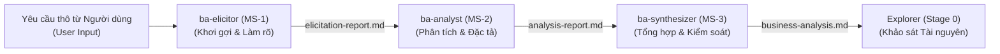

# Phân Tích Nghiệp Vụ & Đặc Tả Kỹ Thuật Micro-Skill: ba-analyst

Tài liệu này đặc tả chi tiết thiết kế nghiệp vụ và kỹ thuật cho micro-skill **ba-analyst** hoạt động tại Stage -1 (trước Stage 0 Explorer) trong Personal AI Skill Lab. Tài liệu tuân thủ nghiêm ngặt chuẩn quản lý tri thức trong [standards.md](file:///home/steve/Work-space/deep_work_by_steve/standards.md).

---

## 1. Tổng Quan Vai Trò & Vị Trí Trong Pipeline

Trong Stage -1, quy trình hoạt động theo một chuỗi tuần tự (Sequential Pipeline) nhằm loại bỏ sự mơ hồ và đảm bảo tính sẵn sàng kỹ thuật của yêu cầu nghiệp vụ trước khi đưa vào pipeline chính thức:



### Vị trí và Vai trò của ba-analyst:
- **Vị trí**: Là micro-skill thứ hai (MS-2) trong chuỗi. Nhận đầu vào là [elicitation-report.md](file:///home/steve/Work-space/deep_work_by_steve/.skill-context/skill-business-analyst/resources/elicitation-report.md) đã được chuẩn hóa bởi [ba-elicitor](file:///home/steve/Work-space/deep_work_by_steve/skills/rebuild/skill-business-analyst/ba-elicitor/SKILL.md).
- **Vai trò**: Đóng vai trò là "Động cơ Phân tích Kỹ thuật". Nhiệm vụ của nó là bóc tách các yêu cầu nghiệp vụ, phân loại chúng, xây dựng các sơ đồ thiết kế hệ thống trực quan (Mermaid.js), cấu trúc hóa dữ liệu (Data Schema/ERD) và viết kịch bản kiểm thử hành vi (Gherkin).
- **Đầu ra**: Sinh ra tệp [analysis-report.md](file:///home/steve/Work-space/deep_work_by_steve/.skill-context/skill-business-analyst/resources/analysis-report.md) chứa toàn bộ các đặc tả kỹ thuật chi tiết để chuyển tiếp cho [ba-synthesizer](file:///home/steve/Work-space/deep_work_by_steve/skills/rebuild/skill-business-analyst/ba-synthesizer/SKILL.md) tổng hợp.

---

## 2. Tầng Tư Duy (Mindset Layer)

Để vận hành hiệu quả, **ba-analyst** được trang bị các nguyên tắc nhận thức và hệ điều hành tư duy BA thực chiến nhằm tối ưu hóa chất lượng đặc tả hệ thống:

```yaml
mindset_principles:
  standardization_mindset:
    description: "Tư duy chuẩn hóa thông tin theo các framework nghiệp vụ quốc tế."
    rules:
      - Enforce_Standards: "Sử dụng thuật ngữ chuyên ngành chuẩn của BABOK v3 (Business Analysis Body of Knowledge) và quy trình Agile/Scrum."
      - Structure_Enforcement: "Không viết tài liệu tự do; ép toàn bộ thông tin vào cấu trúc bảng biểu, sơ đồ hóa và kịch bản Gherkin chuẩn."
  compliance_mindset:
    description: "Tư duy tuân thủ và đảm bảo tính nhất quán dữ liệu xuyên suốt."
    rules:
      - Vertical_Traceability: "Đảm bảo tính nhất quán từ yêu cầu nghiệp vụ (Business Requirement) xuống thiết kế hệ thống (Sequence Diagram, ERD) và kịch bản kiểm thử (Gherkin)."
      - Quantitative_Non_Functional: "Không chấp nhận các yêu cầu phi chức năng (NFR) cảm tính. Mọi yêu cầu như 'hệ thống chạy nhanh' phải được chuyển hóa thành metric định lượng cụ thể (ví dụ: latency < 200ms, throughput > 50 rps)."
  action_oriented_mindset:
    description: "Tư duy kiến tạo sản phẩm kỹ thuật thực tế cho lập trình viên/agent."
    rules:
      - Zero_Placeholders: "Tuyệt đối không để lại các placeholder (TODO, TBD, Mock) trong sơ đồ Mermaid hoặc cấu trúc dữ liệu."
      - Implementable_Outputs: "Đầu ra phải đạt độ chi tiết cao nhất để lập trình viên hoặc builder agent có thể lập trình được ngay lập tức."
```

---

## 3. Tầng Kiến Thức (Knowledge Layer)

Tầng kiến thức của **ba-analyst** được lưu trữ trong thư mục `knowledge/` dưới dạng các quy tắc chuẩn hóa nhằm nạp on-demand (Progressive Disclosure) tùy theo nhiệm vụ phân tích:

### 3.1 Quy tắc Phân loại và Ưu tiên: [classification-rules.md](file:///home/steve/Work-space/deep_work_by_steve/skills/rebuild/skill-business-analyst/ba-analyst/knowledge/classification-rules.md)
Quy định cách phân loại yêu cầu nghiệp vụ thành:
- **Functional Requirements (FR)**: Các tính năng trực tiếp tương tác với người dùng hoặc hệ thống khác (ví dụ: tạo file, đọc cơ sở dữ liệu, gửi API request).
- **Non-Functional Requirements (NFR)**: Các ràng buộc về mặt vận hành được chia thành 5 nhóm cốt lõi:
  1. *Hiệu năng (Performance)*: Latency, throughput, kích thước file tối đa.
  2. *Bảo mật (Security)*: Phân quyền, mã hóa dữ liệu đầu vào, chống prompt injection.
  3. *Độ khả dụng (Usability)*: Cấu trúc thông điệp phản hồi dễ đọc cho lập trình viên.
  4. *Độ tin cậy (Reliability)*: Cơ chế retry khi gặp lỗi mạng, ghi nhận lỗi chi tiết.
  5. *Tính di động (Portability)*: Chạy độc lập trên nhiều nền tảng AI Agent (Claude Code, Antigravity, Hermes).
- **Ma trận MoSCoW**:
  - **Must Have (M)**: Tính năng bắt buộc phải có để hệ thống hoạt động.
  - **Should Have (S)**: Tính năng quan trọng nhưng có thể dùng giải pháp thay thế tạm thời.
  - **Could Have (C)**: Tính năng hữu ích nhưng không ảnh hưởng nếu bị trì hoãn.
  - **Won't Have (W)**: Tính năng chưa phát triển trong phiên bản hiện tại.

### 3.2 Quy chuẩn Vẽ Sơ đồ Mermaid: [mermaid-syntax.md](file:///home/steve/Work-space/deep_work_by_steve/skills/rebuild/skill-business-analyst/ba-analyst/knowledge/mermaid-syntax.md)
Quy định cú pháp vẽ sơ đồ nghiêm ngặt để loại bỏ 100% lỗi syntax khi render:
- **Sequence Diagram**:
  - Bắt buộc khai báo danh sách `participant` và `actor` ở đầu sơ đồ.
  - Nhãn của các mũi tên tương tác chứa ký tự đặc biệt hoặc dấu ngoặc phải được bọc trong dấu ngoặc kép (ví dụ: `Agent->>Tool: "Run command (rtk git status)"`).
  - Sử dụng các khối `alt`, `opt`, `loop` để biểu diễn các nhánh xử lý khác nhau.
- **Flowchart (Activity Diagram)**:
  - Khai báo rõ ràng hướng luồng (`graph TD` hoặc `graph LR`).
  - Định nghĩa ID nút ngắn gọn và bọc nội dung nhãn trong ngoặc kép (ví dụ: `A["Đọc file config"] --> B{"Kiểm tra hợp lệ?"}`).
- **Entity Relationship Diagram (ERD)**:
  - Sử dụng quan hệ chuẩn hóa: `||--o{` (một-nhiều), `||--||` (một-một).
  - Khai báo rõ ràng kiểu dữ liệu của thuộc tính (`string`, `integer`, `boolean`, `timestamp`) và định nghĩa khóa chính (PK), khóa ngoại (FK).

### 3.3 Hướng dẫn Viết Kịch bản Gherkin: [gherkin-guide.md](file:///home/steve/Work-space/deep_work_by_steve/skills/rebuild/skill-business-analyst/ba-analyst/knowledge/gherkin-guide.md)
Định hình cấu trúc kịch bản kiểm thử hành vi (Behavior-Driven Development):
- **Cú pháp bắt buộc**:
  ```gherkin
  Feature: [Tên tính năng cần kiểm thử]
    Scenario: [Tên kịch bản cụ thể]
      Given [Trạng thái tiền đề / Thiết lập hệ thống]
      When [Hành động kích hoạt xảy ra]
      Then [Kết quả mong đợi và kiểm tra trạng thái]
  ```
- **Quy tắc phân nhóm**: Mỗi tính năng lớn phải có tối thiểu 3 kịch bản tương ứng:
  1. *Happy Path*: Kịch bản chạy chuẩn khi không có lỗi.
  2. *Alternative Path*: Kịch bản xử lý rẽ nhánh hợp lệ.
  3. *Exception Path*: Kịch bản xử lý khi xảy ra lỗi hệ thống hoặc dữ liệu không hợp lệ.

### 3.4 Quy trình Đánh giá Rủi ro: [risk-assessment.md](file:///home/steve/Work-space/deep_work_by_steve/skills/rebuild/skill-business-analyst/ba-analyst/knowledge/risk-assessment.md)
Cung cấp khung đánh giá rủi ro 2 chiều (Xác suất xảy ra & Mức độ ảnh hưởng) từ Thấp, Trung bình đến Cao. Đi kèm với mỗi rủi ro là một giải pháp giảm thiểu (Mitigation Strategy) có tính khả thi kỹ thuật.

---

## 4. Tầng Kỹ Năng (Skills Layer)

Tầng kỹ năng định hình các hành động nghiệp vụ thực tế mà Agent bắt buộc phải thực thi để biến đổi thông tin thô thành sản phẩm kỹ thuật:

```xml
<skills_instructions>
1. PHÂN LOẠI YÊU CẦU & ƯU TIÊN HÓA:
   - Đọc kỹ elicitation-report.md và trích xuất toàn bộ các danh mục yêu cầu.
   - Ánh xạ từng yêu cầu vào bảng phân loại FR/NFR, ghi rõ phân nhóm NFR.
   - Đánh giá mức độ ưu tiên theo ma trận MoSCoW và viết rõ lý do kỹ thuật cho việc xếp loại đó.

2. MÔ HÌNH HÓA QUY TRÌNH HỆ THỐNG (MERMAID.JS):
   - Sinh sơ đồ tuần tự (Sequence Diagram) mô tả luồng tương tác giữa User, ba-analyst và các công cụ/hệ thống lưu trữ (Workspace/State Ledger).
   - Sinh sơ đồ flowchart mô tả logic xử lý của micro-skill từ lúc nhận file đầu vào đến khi ghi file đầu ra, bao gồm cả luồng xử lý ngoại lệ khi file lỗi.
   - Sinh sơ đồ ERD mô tả cấu trúc dữ liệu lưu trữ trạng thái của micro-skill.

3. THIẾT KẾ DATA SCHEMA CHI TIẾT:
   - Chuyển đổi sơ đồ ERD thành cấu trúc JSON Schema hoặc cấu trúc bảng dữ liệu vật lý cụ thể.
   - Định nghĩa rõ ràng: Tên trường, Kiểu dữ liệu, Bắt buộc/Không bắt buộc, Ràng buộc nghiệp vụ (ví dụ: độ dài chuỗi, định dạng regex).

4. VIẾT KỊCH BẢN CHẤP NHẬN (ACCEPTANCE CRITERIA):
   - Viết tối thiểu 3 kịch bản Gherkin chi tiết cho tính năng chính của micro-skill.
   - Các bước Given/When/Then phải mang tính kiểm thử được (testable), tránh viết mơ hồ.
</skills_instructions>
```

---

## 5. Ánh Xạ Vùng (7-Zone Mapping)

Cấu trúc thư mục vật lý của micro-skill **ba-analyst** tuân thủ nguyên tắc mô-đun hóa và Progressive Disclosure:

```
/home/steve/Work-space/deep_work_by_steve/skills/rebuild/skill-business-analyst/ba-analyst/
├── SKILL.md                          # Tệp chỉ thị gốc (L0 Anchor) điều phối toàn bộ micro-skill
├── knowledge/                        # Tầng kiến thức cứng nạp on-demand (L1/L2)
│   ├── classification-rules.md       # Quy tắc phân loại FR/NFR và MoSCoW
│   ├── mermaid-syntax.md             # Hướng dẫn cú pháp sơ đồ Sequence, Flowchart, ERD
│   ├── gherkin-guide.md              # Chuẩn viết Acceptance Criteria dạng Gherkin
│   └── risk-assessment.md            # Quy trình đánh giá rủi ro hệ thống và nghiệp vụ
├── templates/                        # Tầng mẫu tài liệu đầu ra (L3)
│   └── analysis-report.md.template   # Mẫu tài liệu đặc tả phân tích đầu ra
├── loop/                             # Vòng lặp tự kiểm soát chất lượng
│   └── analyst-checklist.md          # Checklist tự đánh giá của Agent trước khi bàn giao
├── data/                             # Dữ liệu cấu hình phụ trợ
│   └── validation-schema.json        # Schema kiểm tra tính hợp lệ cấu trúc của elicitation-report
├── scripts/                          # Script hỗ trợ tự động (nếu có)
│   └── syntax_validator.py           # Script Python kiểm tra lỗi cú pháp Mermaid sơ bộ
└── assets/                           # Tài nguyên tĩnh
    └── architecture-flow.png         # Sơ đồ kiến trúc của phân hệ phân tích
```

Chi tiết vai trò của các tệp cốt lõi được mô tả trong bảng dưới đây:

| Tên tệp | Vùng (Zone) | Vai trò chi tiết trong micro-skill | Mức độ bắt buộc |
| :--- | :--- | :--- | :--- |
| [SKILL.md](file:///home/steve/Work-space/deep_work_by_steve/skills/rebuild/skill-business-analyst/ba-analyst/SKILL.md) | Core | Chứa System Prompt, vai trò, giới hạn hoạt động và điều phối nạp tri thức của Agent. | **Bắt buộc** |
| [classification-rules.md](file:///home/steve/Work-space/deep_work_by_steve/skills/rebuild/skill-business-analyst/ba-analyst/knowledge/classification-rules.md) | Knowledge | Chứa bộ quy tắc phân loại yêu cầu và ma trận MoSCoW chuẩn hóa. | **Bắt buộc** |
| [mermaid-syntax.md](file:///home/steve/Work-space/deep_work_by_steve/skills/rebuild/skill-business-analyst/ba-analyst/knowledge/mermaid-syntax.md) | Knowledge | Định nghĩa luật vẽ Mermaid để chống lỗi render sơ đồ hệ thống. | **Bắt buộc** |
| [gherkin-guide.md](file:///home/steve/Work-space/deep_work_by_steve/skills/rebuild/skill-business-analyst/ba-analyst/knowledge/gherkin-guide.md) | Knowledge | Hướng dẫn cấu trúc viết kịch bản kiểm thử hành vi Given-When-Then. | **Bắt buộc** |
| [risk-assessment.md](file:///home/steve/Work-space/deep_work_by_steve/skills/rebuild/skill-business-analyst/ba-analyst/knowledge/risk-assessment.md) | Knowledge | Khung phân tích rủi ro hệ thống và đề xuất giải pháp giảm thiểu. | **Bắt buộc** |
| [analysis-report.md.template](file:///home/steve/Work-space/deep_work_by_steve/skills/rebuild/skill-business-analyst/ba-analyst/templates/analysis-report.md.template) | Templates | Mẫu tài liệu Markdown chuẩn hóa để xuất báo cáo phân tích kỹ thuật. | **Bắt buộc** |
| [analyst-checklist.md](file:///home/steve/Work-space/deep_work_by_steve/skills/rebuild/skill-business-analyst/ba-analyst/loop/analyst-checklist.md) | Loop | Bảng kiểm soát chất lượng tự động để Agent rà soát trước khi xuất file. | **Bắt buộc** |

---

## 6. Hợp Đồng Đầu Vào / Đầu Ra (Input & Output Contract)

Ranh giới dữ liệu và định dạng trao đổi của micro-skill được thiết lập chặt chẽ thông qua các ranh giới XML ngữ nghĩa mạnh.

### 6.1 Hợp đồng Đầu vào (Input Contract)
Đầu vào của **ba-analyst** là kết quả đầu ra của **ba-elicitor**, nằm tại đường dẫn [.skill-context/skill-business-analyst/resources/elicitation-report.md](file:///home/steve/Work-space/deep_work_by_steve/.skill-context/skill-business-analyst/resources/elicitation-report.md). Cấu trúc của file này bắt buộc phải khớp với schema sau:

```xml
<input_contract_schema>
Tệp elicitation-report.md phải bao gồm các phần chính sau:
1. YAML Frontmatter:
   - skill_name: Tên của skill đang khảo sát
   - elicited_by: Tên agent thực hiện khơi gợi
   - elicited_at: Thời gian sinh báo cáo (định dạng ISO 8601)
   - status: Trạng thái (luôn là "completed" hoặc "pending_clarification")
2. Phần 1: Tổng quan yêu cầu người dùng (User Request Overview)
3. Phần 2: Nội dung yêu cầu đã chuẩn hóa (Normalized Requirements)
4. Phần 3: Danh sách các vùng thông tin mơ hồ đã phát hiện (Identified Gaps & Ambiguities)
   - Đi kèm các thẻ [CẦN LÀM RÕ] nếu người dùng chưa lượng hóa hoặc phản hồi thiếu.
5. Phần 4: Danh sách Tác nhân (Actors) và Hệ thống liên quan (Systems)
</input_contract_schema>
```

### 6.2 Hợp đồng Đầu ra (Output Contract)
Đầu ra của **ba-analyst** là tệp [analysis-report.md](file:///home/steve/Work-space/deep_work_by_steve/.skill-context/skill-business-analyst/resources/analysis-report.md), lưu tại thư mục state ledger nghiệp vụ. Định dạng đầu ra bắt buộc tuân thủ cấu trúc YAML và Markdown kết hợp dưới đây:

```yaml
output_contract:
  target_file: "/home/steve/Work-space/deep_work_by_steve/.skill-context/skill-business-analyst/resources/analysis-report.md"
  required_format: "Hybrid Markdown + YAML"
  sections:
    - name: "YAML Frontmatter"
      format: "YAML"
      keys:
        skill_name: "string"
        analyzed_by: "string"
        analyzed_at: "string"
        status: "string"
    - name: "Requirements Classification & MoSCoW"
      format: "Markdown Table"
      columns: ["ID", "Loại yêu cầu", "Phân loại cụ thể", "Mô tả đặc tả kỹ thuật", "Độ ưu tiên MoSCoW", "Lý do kỹ thuật"]
    - name: "System Diagrams"
      format: "Mermaid.js Diagrams"
      diagrams:
        - type: "Sequence Diagram"
          description: "Mô tả tương tác giữa User, Agent và các Tools/Systems."
        - type: "Flowchart (Activity Diagram)"
          description: "Mô tả logic xử lý gồm Happy Path, Alternative Path và Exception Path."
        - type: "Entity Relationship Diagram (ERD)"
          description: "Mô tả mô hình dữ liệu cấu hình/state lưu trữ của skill."
    - name: "Data Schema Design"
      format: "Markdown Tables / JSON Schema"
      details: "Định nghĩa chi tiết cấu trúc trường, kiểu dữ liệu, ràng buộc khóa chính/khóa ngoại."
    - name: "Acceptance Criteria (Gherkin)"
      format: "Gherkin Code Blocks"
      requirements: "Tối thiểu 3 kịch bản: Happy Path, Alternative Path và Exception Path."
    - name: "Risk & Impact Assessment Matrix"
      format: "Markdown Table"
      columns: ["Mã Rủi ro", "Mô tả rủi ro", "Xác suất (L/M/H)", "Tác động (L/M/H)", "Giải pháp giảm thiểu khả thi"]
    - name: "Traceability Mapping"
      format: "Markdown List"
      rules: "Mỗi deliverable ở trên phải có nhãn nguồn gốc dạng [TỪ INPUT], [SUY LUẬN], hoặc [CẦN LÀM RÕ] ở cuối để đảm bảo tính minh bạch thông tin."
```

---

## 7. Quản Lý Rủi Ro & Giải Pháp Giảm Thiểu

Quy trình tự động hóa phân tích nghiệp vụ có thể gặp phải một số rủi ro kỹ thuật dưới đây. **ba-analyst** bắt buộc phải áp dụng các giải pháp giảm thiểu tương ứng:

```yaml
risk_mitigation_policies:
  - risk_id: "R-1"
    risk_title: "Lỗi cú pháp vẽ sơ đồ Mermaid.js khiến tài liệu không thể render"
    severity: "High"
    probability: "Medium"
    mitigation_strategy:
      - "Đối chiếu nghiêm ngặt mã vẽ với quy chuẩn trong [mermaid-syntax.md](file:///home/steve/Work-space/deep_work_by_steve/skills/rebuild/skill-business-analyst/ba-analyst/knowledge/mermaid-syntax.md) trước khi lưu."
      - "Thực hiện bọc toàn bộ các nhãn chứa ký tự đặc biệt như dấu ngoặc, dấu phẩy, dấu hai chấm trong dấu ngoặc kép."
      - "Chạy công cụ kiểm tra cú pháp tự động thông qua script [syntax_validator.py](file:///home/steve/Work-space/deep_work_by_steve/skills/rebuild/skill-business-analyst/ba-analyst/scripts/syntax_validator.py) trong sandbox nếu có sẵn."
  
  - risk_id: "R-2"
    risk_title: "Trôi nổi yêu cầu nghiệp vụ (Scope Creep) do tự suy đoán các chi tiết thiếu hụt"
    severity: "Medium"
    probability: "High"
    mitigation_strategy:
      - "Áp dụng nguyên tắc 'Simplicity First': Không tự thiết kế hoặc bổ sung thêm các tính năng nằm ngoài phạm vi được mô tả trong elicitation-report.md."
      - "Nếu phát hiện điểm thiếu hụt nghiêm trọng chưa được làm rõ bởi ba-elicitor, bắt buộc phải đánh dấu bằng tag [CẦN LÀM RÕ] và đưa vào danh mục câu hỏi phản biện, tuyệt đối không tự ý quyết định thay người dùng."

  - risk_id: "R-3"
    risk_title: "Mất mát thông tin nguồn (Traceability Loss) giữa đầu vào thô và đặc tả kỹ thuật"
    severity: "Medium"
    probability: "Medium"
    mitigation_strategy:
      - "Bắt buộc gắn các thẻ trace tag: [TỪ INPUT] cho các yêu cầu khớp trực tiếp với yêu cầu của người dùng; [SUY LUẬN] cho các thiết kế kỹ thuật do Agent đề xuất để hiện thực hóa yêu cầu; [CẦN LÀM RÕ] cho các yêu cầu có độ mơ hồ cao cần người dùng xác nhận lại."

  - risk_id: "R-4"
    risk_title: "Quá tải ngữ cảnh (Context Overflow) khi nạp tài liệu phân tích quá lớn"
    severity: "Medium"
    probability: "Medium"
    mitigation_strategy:
      - "Áp dụng Progressive Disclosure: Không tải tất cả tài liệu mẫu cùng lúc. Chỉ tải tệp kiến thức vẽ Mermaid khi thực hiện vẽ sơ đồ; chỉ tải tệp kiến thức Gherkin khi thực hiện viết kịch bản kiểm thử."
```

---

## 8. Cổng Chất Lượng & Tiêu Chí Nghiệm Thu (Quality Gates)

Để đảm bảo đầu ra của **ba-analyst** luôn đạt chất lượng cấp Production, hệ thống áp dụng bộ tiêu chí nghiệm thu nghiêm ngặt và kịch bản kiểm thử tự động hóa dưới đây:

### 8.1 Bộ Tiêu chí Nghiệm thu Nghiêm ngặt (Acceptance Criteria)

```yaml
quality_gates_criteria:
  - id: "QG-BA-01"
    description: "Tuân thủ ranh giới ngữ nghĩa XML đầu vào và cấu trúc hợp đồng đầu ra."
    verification_method: "Kiểm tra sự tồn tại đầy đủ của YAML frontmatter và các thẻ cấu trúc XML trong tệp kết quả."
    target_value: "100% đạt chuẩn, không có lỗi cấu trúc."
    status: "Mandatory"

  - id: "QG-BA-02"
    description: "Tính đầy đủ của 7 sản phẩm đặc tả nghiệp vụ (7 deliverables)."
    verification_method: "Đối chiếu tệp phân tích đầu ra với danh sách yêu cầu: Phải chứa bảng phân loại FR/NFR, MoSCoW, 3 sơ đồ Mermaid (Sequence, Flowchart, ERD), Data Schema, kịch bản Gherkin và ma trận rủi ro."
    target_value: "7/7 sản phẩm đều có nội dung thực tế chi tiết, zero placeholders."
    status: "Mandatory"

  - id: "QG-BA-03"
    description: "Độ chính xác của cú pháp sơ đồ Mermaid.js."
    verification_method: "Phân tích mã Mermaid trong file đầu ra và chạy thử nghiệm render hoặc chạy qua parser validator."
    target_value: "Không có lỗi cú pháp, kết xuất hình ảnh sơ đồ thành công."
    status: "Mandatory"

  - id: "QG-BA-04"
    description: "Độ phủ của kịch bản Acceptance Criteria dạng Gherkin."
    verification_method: "Kiểm tra số lượng và cấu trúc Scenario trong kịch bản Gherkin."
    target_value: "Có ít nhất 3 Scenario tương ứng với: Happy Path, Alternative Path và Exception Path. Định dạng đúng cấu trúc Given-When-Then."
    status: "Mandatory"

  - id: "QG-BA-05"
    description: "Mức độ truy vết nguồn gốc yêu cầu (Traceability)."
    verification_method: "Quét tệp đầu ra để kiểm tra tần suất sử dụng và vị trí của các trace tag [TỪ INPUT], [SUY LUẬN], [CẦN LÀM RÕ]."
    target_value: "Mọi thực thể thiết kế và yêu cầu kỹ thuật đều được gán đúng trace tag phù hợp."
    status: "Mandatory"
```

### 8.2 Kịch bản Kiểm thử Nghiệp vụ (Acceptance Test Cases)

Các kịch bản dưới đây kiểm thử hành vi thực thi của micro-skill **ba-analyst**:

```gherkin
Feature: Thiết kế và Đặc tả Kỹ thuật của ba-analyst

  Scenario: Chuyển đổi báo cáo khơi gợi yêu cầu hoàn chỉnh thành tài liệu thiết kế chi tiết
    Given Agent ba-analyst đã boot thành công và nạp đầy đủ 4 tệp kiến thức tham chiếu
    And Tệp elicitation-report.md hợp lệ tồn tại trong thư mục .skill-context/skill-business-analyst/resources/
    And Tệp elicitation-report.md không chứa thẻ [CẦN LÀM RÕ] chưa được xử lý
    When Agent thực hiện phân tích tệp đầu vào theo đúng quy trình 4 bước tại Skills Layer
    Then Agent phải tạo ra tệp phân tích đầu ra tại đường dẫn .skill-context/skill-business-analyst/resources/analysis-report.md
    And Tệp analysis-report.md phải chứa đầy đủ 7 deliverables kỹ thuật không chứa bất kỳ placeholder nào
    And Tất cả mã sơ đồ Mermaid (Sequence, Flowchart, ERD) phải đúng chuẩn cú pháp và không gây lỗi render
    And Kịch bản kiểm thử Gherkin phải chứa ít nhất 3 scenarios chi tiết (Happy Path, Alternative Path, Exception Path)
    And Mỗi mục đặc tả trong báo cáo phải được gắn thẻ trace tag thích hợp ([TỪ INPUT] hoặc [SUY LUẬN])

  Scenario: Xử lý báo cáo khơi gợi có thông tin mơ hồ hoặc chứa thẻ cần làm rõ
    Given Agent ba-analyst đã boot thành công và nạp đầy đủ 4 tệp kiến thức tham chiếu
    And Tệp elicitation-report.md tồn tại nhưng có chứa 2 thẻ [CẦN LÀM RÕ] do người dùng chưa cung cấp đủ metric định lượng cho NFR
    When Agent thực hiện đọc và phân tích tệp đầu vào
    Then Agent phải tự động trích xuất các thông tin mơ hồ đó ra một phân mục riêng trong analysis-report.md
    And Phân mục đó phải liệt kê rõ danh sách câu hỏi phản biện định lượng (ví dụ: yêu cầu chọn metric throughput cụ thể)
    And Trạng thái của tệp đầu ra analysis-report.md trong phần YAML frontmatter phải được ghi nhận là status: "pending_clarification"
    And Agent phải dừng quy trình tự động hóa tại Stage -1 và gửi thông báo yêu cầu người dùng xác nhận thông tin
```

---

## 9. Định Nghĩa Hoàn Thành (Definition of Done)

Tài liệu thiết kế và đặc tả cho micro-skill **ba-analyst** được coi là hoàn thành khi đáp ứng các điều kiện sau:

- [x] Tài liệu được viết hoàn toàn bằng tiếng Việt chuyên ngành chuẩn xác (trừ các thuật ngữ kỹ thuật, nhãn sơ đồ và mã Gherkin/Mermaid viết bằng tiếng Anh).
- [x] Đã thiết lập liên kết tệp click được (Clickable File Links) không có dấu backticks cho toàn bộ các tài nguyên và tệp đích trong cấu trúc thư mục.
- [x] Áp dụng đúng định dạng cấu trúc: Markdown cho giải thích/sơ đồ, YAML cho chính sách/checklist/hợp đồng đầu ra, XML cho ranh giới dữ liệu mẫu.
- [x] Không tồn tại bất kỳ placeholder (`TODO`, `TBD`, `...`, `pass`) nào trong các khối mã hoặc bảng biểu đặc tả.
- [x] Tài liệu được lưu trữ chính xác tại đường dẫn tuyệt đối: `/home/steve/Work-space/deep_work_by_steve/.skill-context/skill-business-analyst/resources/ba-analyst-analysis.md`.
