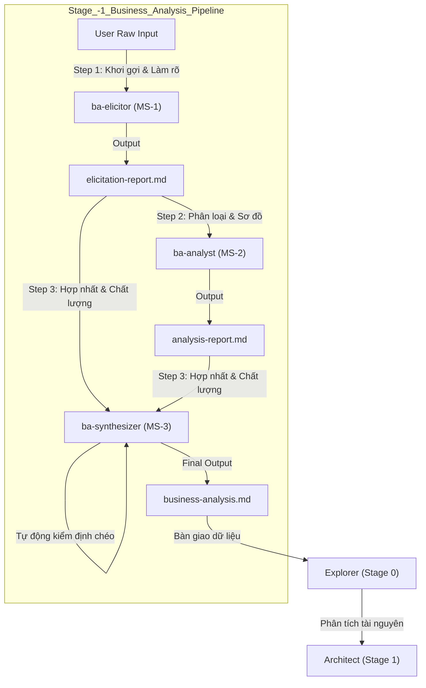

# Tài liệu Đặc tả Nghiệp vụ & Kỹ thuật - Micro-skill ba-synthesizer

Tài liệu này đặc tả chi tiết về mặt nghiệp vụ và kỹ thuật của micro-skill **ba-synthesizer**, thuộc hệ thống **skill-business-analyst** hoạt động ở Stage -1 trong pipeline phát triển Agent Skill.

---

## 1. Giới thiệu & Vai trò trong Pipeline (Role Overview & Position)

Trong pipeline thiết kế và xây dựng kỹ năng cho AI Agent (Master Skill Suite), giai đoạn phân tích nghiệp vụ (Stage -1) đóng vai trò chuẩn bị bối cảnh và yêu cầu chi tiết trước khi bước vào Stage 0 (Explorer). Micro-skill **ba-synthesizer** là bước cuối cùng (Consolidator & Quality Gate) của Stage -1.

### 1.1 Vị trí trong Pipeline
Luồng phối hợp tuần tự của Stage -1 được mô tả như sau:



### 1.2 Vai trò cốt lõi
- **Hợp nhất (Consolidation)**: Thu thập kết quả từ [elicitation-report.md](file:///home/steve/Work-space/deep_work_by_steve/.skill-context/skill-business-analyst/elicitation-report.md) (kết quả khơi gợi yêu cầu, câu hỏi phản biện, giả định) và [analysis-report.md](file:///home/steve/Work-space/deep_work_by_steve/.skill-context/skill-business-analyst/analysis-report.md) (bản vẽ kỹ thuật, phân loại MoSCoW, kịch bản Gherkin, ma trận rủi ro).
- **Kiểm soát chất lượng chéo (Cross-Reference Validation)**: Chạy thuật toán đối chiếu logic giữa các phần (ví dụ: đảm bảo các bảng dữ liệu trong ERD ăn khớp với các thực thể trong Sequence Diagram và kịch bản Gherkin).
- **Bàn giao siêu dữ liệu (Handoff Metadata)**: Đóng gói và gắn thẻ siêu dữ liệu dạng YAML Frontmatter vào đầu ra cuối cùng [business-analysis.md](file:///home/steve/Work-space/deep_work_by_steve/.skill-context/skill-business-analyst/business-analysis.md) để cung cấp đầu vào chuẩn hóa cho Explorer (Stage 0).

---

## 2. Tầng Tư duy (Mindset Layer)

Tầng tư duy định hình hệ điều hành nhận thức của **ba-synthesizer**, tập trung vào tính toàn vẹn, nhất quán và độ tin cậy của sản phẩm bàn giao.

* **Integration (Tư duy Tích hợp)**: Không chỉ đơn thuần là nối file, Agent phải hiểu mối quan hệ hữu cơ giữa các báo cáo trung gian để tạo ra một bức tranh nghiệp vụ toàn cảnh mạch lạc.
* **Consistency (Tư duy Nhất quán)**: Nhìn nhận tài liệu như một thể thống nhất. Phát hiện các điểm mâu thuẫn chéo giữa mô tả nghiệp vụ và các sơ đồ kỹ thuật/kịch bản kiểm thử.
* **Quality Control (Tư duy Kiểm soát Chất lượng)**: Đóng vai trò là chốt chặn kỹ thuật cuối cùng trước khi chuyển sang giai đoạn phát triển kỹ năng thực tế. Agent sẵn sàng từ chối bàn giao hoặc gắn cảnh báo nghiêm khắc nếu tài liệu trung gian không đạt tiêu chuẩn.
* **Handoff Focus (Tư duy Handoff)**: Định hướng phục vụ cho Agent kế tiếp (Explorer). Mã hóa các thông tin nghiệp vụ phức tạp thành siêu dữ liệu dễ dàng phân tách (parseable YAML metadata).

Các quy tắc kiểm soát tư duy bắt buộc đối với Agent được cấu hình như sau:

```yaml
mindset_policies:
  must:
    - "Phân tích tính đầy đủ của tất cả 7 sản phẩm nghiệp vụ yêu cầu từ elicitation và analysis."
    - "Đối chiếu chéo các tác nhân (Actors), hệ thống (Systems), thực thể dữ liệu (Data Entities) trên Sequence Diagram, ERD và kịch bản Gherkin."
    - "Gắn nhãn rõ ràng [MAU THUẪN NGHIỆP VỤ] hoặc [THIẾU THÔNG TIN] khi phát hiện sai lệch chéo."
    - "Đo lường mức độ tin cậy nghiệp vụ (Confidence Score) dựa trên tỷ lệ phản hồi và tính đầy đủ của tài liệu."
  must_not:
    - "Tự ý bỏ qua hoặc lược bỏ các phân tích rủi ro hoặc kịch bản kiểm thử lỗi."
    - "Chấp nhận các sơ đồ Mermaid.js bị lỗi cú pháp hiển thị."
    - "Tự động sửa chữa các mâu thuẫn nghiệp vụ lớn mà không ghi chú rõ ràng cho người dùng."
```

---

## 3. Tầng Kiến thức (Knowledge Layer)

Tầng kiến thức của **ba-synthesizer** chứa các quy chuẩn đánh giá chất lượng sản phẩm BA và ma trận trọng số hoàn thành.

### 3.1 Tài liệu tham chiếu
- [quality-criteria.md](file:///home/steve/Work-space/deep_work_by_steve/skills/rebuild/ba-synthesizer/knowledge/quality-criteria.md): Quy định chi tiết các tiêu chuẩn chấp nhận cho từng sản phẩm thành phần.
- [quality-matrix.yaml](file:///home/steve/Work-space/deep_work_by_steve/skills/rebuild/ba-synthesizer/data/quality-matrix.yaml): Định nghĩa ma trận tính toán điểm chất lượng và ngưỡng thông qua (Pass/Fail).

### 3.2 Cấu trúc Đặc tả Kiến thức (Knowledge Schema)

Cấu trúc lưu trữ và đánh giá chất lượng được chuẩn hóa như sau:

<knowledge_reference>

```yaml
quality_matrix_schema:
  deliverables:
    elicitation_report:
      weight: 0.15
      min_criteria:
        - "Có mô tả nghiệp vụ đã normalize."
        - "Xác định rõ Pain Points của người dùng."
        - "Xác định danh sách giả định hệ thống."
    requirements_classification:
      weight: 0.15
      min_criteria:
        - "Phân biệt rõ ràng Functional (FR) và Non-Functional (NFR)."
        - "Áp dụng ma trận ưu tiên MoSCoW đầy đủ."
    sequence_diagram:
      weight: 0.15
      min_criteria:
        - "Sơ đồ Mermaid.js hợp lệ về cú pháp."
        - "Thể hiện tối thiểu 3 tác nhân tương tác (User, Agent, Tool/System)."
    flowchart_activity:
      weight: 0.15
      min_criteria:
        - "Bao phủ đủ 3 luồng: Happy Path, Alternative Path và Exception Path."
    erd_schema:
      weight: 0.15
      min_criteria:
        - "Có định nghĩa Khóa chính (PK) và Khóa ngoại (FK)."
        - "Định nghĩa rõ kiểu dữ liệu của các trường."
    acceptance_criteria:
      weight: 0.15
      min_criteria:
        - "Viết theo định dạng Gherkin chuẩn (Given-When-Then)."
        - "Tối thiểu 3 kịch bản kiểm thử tương ứng với 3 luồng nghiệp vụ chính."
    risk_matrix:
      weight: 0.10
      min_criteria:
        - "Liệt kê ít nhất 3 rủi ro nghiệp vụ kèm giải pháp giảm thiểu."

  evaluation_rules:
    pass_threshold: 0.80 # Điểm tối thiểu để thông qua chất lượng (80%)
    calculation_method: "weighted_sum"
```

</knowledge_reference>

---

## 4. Tầng Kỹ năng (Skills Layer)

Tầng kỹ năng chuyển hóa tư duy và kiến thức thành các hành động logic thực tế của Agent:

1. **Hợp nhất văn bản (Consolidation)**: Đọc và phân tách cấu trúc của [elicitation-report.md](file:///home/steve/Work-space/deep_work_by_steve/.skill-context/skill-business-analyst/elicitation-report.md) và [analysis-report.md](file:///home/steve/Work-space/deep_work_by_steve/.skill-context/skill-business-analyst/analysis-report.md). Sử dụng template [business-analysis.md.template](file:///home/steve/Work-space/deep_work_by_steve/skills/rebuild/ba-synthesizer/templates/business-analysis.md.template) để tái cấu trúc và kết hợp thông tin một cách mạch lạc.
2. **Kiểm tra nhất quán chéo (Cross-Reference Validation)**: Thực hiện kiểm tra chéo tự động:
   - Ánh xạ các thực thể trong ERD với các thành phần tham gia (participants/database) trong Sequence Diagram.
   - Kiểm tra xem mọi yêu cầu chức năng (FR) mức "Must" trong bảng MoSCoW có tương ứng với ít nhất một kịch bản kiểm thử Gherkin hay không.
3. **Đóng gói siêu dữ liệu (Metadata Packaging)**: Phân tích toàn bộ thông tin nghiệp vụ đã thu thập để tính toán điểm phức tạp (SCS Score) của kỹ năng mục tiêu, xác định ranh giới (scope boundary), và trích xuất siêu dữ liệu phục vụ cho Explorer (Stage 0).

Các quy tắc kỹ thuật và thuật toán kiểm tra được quy định như sau:

```yaml
validation_algorithms:
  actor_entity_matching:
    - "Quét mã nguồn Mermaid của Sequence Diagram để trích xuất danh sách Actor và Participant."
    - "Quét mã nguồn Mermaid của ERD để trích xuất danh sách Entity."
    - "Đối chiếu: Nếu Sequence Diagram có hành động lưu trữ/truy xuất dữ liệu liên quan đến một thực thể không tồn tại trong ERD -> Cảnh báo [MAU THUẪN NGHIỆP VỤ: Thực thể cơ sở dữ liệu thiếu hụt]."
  moscow_gherkin_matching:
    - "Quét bảng MoSCoW, trích xuất tất cả dòng có nhãn priority = Must."
    - "Quét phần Acceptance Criteria, kiểm tra từ khóa của Scenario tương ứng với tên tính năng."
    - "Nếu một tính năng Must không có kịch bản Given-When-Then tương ứng -> Cảnh báo [THIẾU KỊCH BẢN KIỂM THỬ: Tính năng cốt lõi chưa được đặc tả kiểm thử]."
```

---

## 5. Quy hoạch Thư mục 7 Vùng (7-Zone Mapping)

Cấu trúc mã nguồn và tài nguyên của micro-skill `ba-synthesizer` tuân thủ nghiêm ngặt mô hình 7 Zones của dự án:

| Tên vùng (Zone) | Đường dẫn file / thư mục tuyệt đối | Vai trò nghiệp vụ và nội dung tài nguyên | Trạng thái |
| :--- | :--- | :--- | :--- |
| **1. Core** | [SKILL.md](file:///home/steve/Work-space/deep_work_by_steve/skills/rebuild/ba-synthesizer/SKILL.md) | File điều phối trung tâm, quy định Persona tổng hợp, luồng xử lý chính và các quy tắc cứng. | Bắt buộc |
| **2. Knowledge** | [quality-criteria.md](file:///home/steve/Work-space/deep_work_by_steve/skills/rebuild/ba-synthesizer/knowledge/quality-criteria.md) | Chứa các quy chuẩn chất lượng chi tiết cho 7 sản phẩm nghiệp vụ BA. | Bắt buộc |
| **3. Scripts** | [validator.py](file:///home/steve/Work-space/deep_work_by_steve/skills/rebuild/ba-synthesizer/scripts/validator.py) | Script python chạy trong sandbox để kiểm tra cú pháp Mermaid và kiểm tra chéo thực thể/kịch bản. | Tùy chọn |
| **4. Templates** | [business-analysis.md.template](file:///home/steve/Work-space/deep_work_by_steve/skills/rebuild/ba-synthesizer/templates/business-analysis.md.template) | Bản mẫu cấu trúc để ghi đầu ra cuối cùng của tài liệu business-analysis.md. | Bắt buộc |
| **5. Data** | [quality-matrix.yaml](file:///home/steve/Work-space/deep_work_by_steve/skills/rebuild/ba-synthesizer/data/quality-matrix.yaml) | Ma trận trọng số và điểm số chất lượng đầu ra. | Bắt buộc |
| **6. Loop** | [synthesizer-checklist.md](file:///home/steve/Work-space/deep_work_by_steve/skills/rebuild/ba-synthesizer/loop/synthesizer-checklist.md) | Checklist tự kiểm tra của Agent trước khi hoàn tất công việc ghi file. | Bắt buộc |
| **7. Assets** | — | Không có hình ảnh hoặc assets tĩnh trong micro-skill này. | Không áp dụng |

---

## 6. Hợp đồng Đầu vào & Đầu ra (Input/Output Contract)

Hợp đồng dữ liệu đảm bảo sự truyền nhận thông tin không bị suy hao hoặc nhiễu trong pipeline Agentic.

### 6.1 Hợp đồng Đầu vào (Input Contract)
`ba-synthesizer` yêu cầu hai file báo cáo trung gian đặt tại thư mục trạng thái của Stage -1:

1. [elicitation-report.md](file:///home/steve/Work-space/deep_work_by_steve/.skill-context/skill-business-analyst/elicitation-report.md)
2. [analysis-report.md](file:///home/steve/Work-space/deep_work_by_steve/.skill-context/skill-business-analyst/analysis-report.md)

Cấu trúc đầu vào khi nạp vào Agent phải được phân tách rõ ràng qua XML delimiters:

```xml
<elicitation_report_input>
  <!-- Nội dung chi tiết của elicitation-report.md -->
</elicitation_report_input>

<analysis_report_input>
  <!-- Nội dung chi tiết của analysis-report.md -->
</analysis_report_input>
```

### 6.2 Hợp đồng Đầu ra (Output Contract)
Sản phẩm cuối cùng là file [business-analysis.md](file:///home/steve/Work-space/deep_work_by_steve/.skill-context/skill-business-analyst/business-analysis.md). File này bắt buộc phải có cấu trúc YAML Frontmatter cụ thể để bàn giao cho Explorer (Stage 0):

```yaml
---
skill_handoff:
  target_skill_name: "tên-kebab-case-của-skill"
  version: "1.0.0"
  scs_complexity_score: 3.6
  decomposition_recommended: true
  sub_skills_proposed:
    - "tên-sub-skill-1"
    - "tên-sub-skill-2"
  scope_boundary:
    in_scope:
      - "Yêu cầu nghiệp vụ 1"
      - "Yêu cầu nghiệp vụ 2"
    out_scope:
      - "Giới hạn biên ngoài 1"
  technical_frameworks_recommended:
    - "Ví dụ: Mermaid.js"
    - "Ví dụ: Gherkin"
  detected_risks:
    - "Rủi ro 1"
  quality_gate_status: "PASS" # Hoặc WARNING
  quality_score_percentage: 92.5
---
```

---

## 7. Rủi ro & Giải pháp Giảm thiểu (Risks & Mitigations)

| # | Rủi ro (Risk) | Mức độ | Giải pháp giảm thiểu (Mitigation) |
|---|---|---|---|
| 1 | Mất mát thông tin (Information Loss) trong quá trình hợp nhất báo cáo thô. | Trung bình | Yêu cầu sử dụng cấu trúc template cứng [business-analysis.md.template](file:///home/steve/Work-space/deep_work_by_steve/skills/rebuild/ba-synthesizer/templates/business-analysis.md.template) and checklist đếm số lượng mục trước/sau khi tổng hợp. |
| 2 | Diagram Mermaid.js bị sai lỗi cú pháp khi gộp và tối ưu hóa. | Cao | Tích hợp bộ parser regex kiểm tra cú pháp Mermaid cơ bản trước khi ghi file, hoặc chạy kiểm tra thử trong môi trường sandbox cô lập. |
| 3 | Mâu thuẫn logic chéo giữa ERD và Sequence Diagram không được phát hiện. | Cao | Định nghĩa quy tắc ánh xạ tự động (Mapping Rules) trong [quality-criteria.md](file:///home/steve/Work-space/deep_work_by_steve/skills/rebuild/ba-synthesizer/knowledge/quality-criteria.md). |
| 4 | Tràn ngữ cảnh (Context Window Overflow) khi hợp nhất tài liệu lớn. | Trung bình | Áp dụng chính sách tải động (Progressive Disclosure): nạp tài liệu theo từng phân đoạn nghiệp vụ, kiểm tra chéo độc lập trước khi ráp nối tổng thể. |

---

## 8. Cổng Chất lượng & Tiêu chí Nghiệm thu (Quality Gates & Acceptance Criteria)

### 8.1 Tiêu chí nghiệm thu (Acceptance Criteria)

```yaml
acceptance_criteria:
  AC_1_YAML_Frontmatter_Compliance:
    description: "File business-analysis.md bắt buộc chứa đầy đủ siêu dữ liệu chuyển giao dạng YAML Frontmatter."
    validation: "Phép so khớp schema khớp 100% với cấu trúc quy định tại Hợp đồng đầu ra."
  AC_2_Diagram_Syntax_Validation:
    description: "Mọi sơ đồ Mermaid.js (Sequence, Activity, ERD) được tích hợp trong file phải hợp lệ, không chứa lỗi cú pháp kết nối."
    validation: "Tất cả khối mã mermaid được bọc đúng thẻ và kiểm tra từ khóa cú pháp không bị lỗi."
  AC_3_Cross_Reference_Check_Execution:
    description: "Báo cáo chất lượng trong file hợp nhất phải thể hiện kết quả kiểm tra đối chiếu chéo giữa ERD, Sequence Diagram và Gherkin."
    validation: "Có mục 'Kiểm định nhất quán chéo (Cross-Reference Validation)' ghi nhận rõ kết quả đối chiếu."
  AC_4_Zero_Placeholder_Enforcement:
    description: "Tài liệu business-analysis.md tuyệt đối không chứa bất kỳ từ khóa tạm thời nào (TBD, TODO, placeholder, mock, pass)."
    validation: "Quét Regex tìm kiếm các cụm từ nghi ngờ; nếu phát hiện, hệ thống từ chối nghiệm thu."
  AC_5_Vietnamese_Language_Standard:
    description: "Toàn bộ phần giải thích, phân tích và hướng dẫn phải viết bằng tiếng Việt chuẩn mực, ngoại trừ thuật ngữ kỹ thuật và kịch bản Gherkin viết bằng tiếng Anh."
    validation: "Kiểm tra ngôn ngữ thủ công hoặc qua mô hình phân tích ngôn ngữ."
```

### 8.2 Kịch bản kiểm thử hành vi (Gherkin Scenarios)

Dưới đây là các kịch bản kiểm thử hành vi mẫu cho `ba-synthesizer`:

#### Scenario 1: Successful synthesis and validation with 100% consistency
```gherkin
Given the input reports elicitation-report.md and analysis-report.md exist in the state ledger
And elicitation-report.md contains a normalized skill request and active user requirements
And analysis-report.md contains valid Mermaid Diagrams and corresponding Gherkin scenarios
And the Sequence Diagram actors match the ERD schema entities perfectly
When ba-synthesizer executes the consolidation and validation process
Then it should merge all 7 deliverables into business-analysis.md according to the template
And it should compute a quality score above the 80% pass threshold
And it should write the output file with the quality_gate_status set to "PASS" in the YAML frontmatter
And the output document must contain no placeholder values
```

#### Scenario 2: Synthesis with consistency warning due to missing ERD entity referenced in Sequence Diagram
```gherkin
Given the input reports elicitation-report.md and analysis-report.md exist in the state ledger
And the Sequence Diagram in analysis-report.md references a "PaymentGateway" component to update transaction status
But the ERD schema in analysis-report.md does not contain any "Transactions" or "Payments" entity
When ba-synthesizer executes the consolidation and validation process
Then it should proceed with the merge of deliverables into business-analysis.md
But it must inject a critical warning tag "[MAU THUẪN NGHIỆP VỤ: Thực thể cơ sở dữ liệu thiếu hụt]" in the Quality Assessment section
And it should compute a quality score reflecting the mismatch penalty
And it should write the output file with the quality_gate_status set to "WARNING" in the YAML frontmatter
And the output document must contain no placeholder values
```
