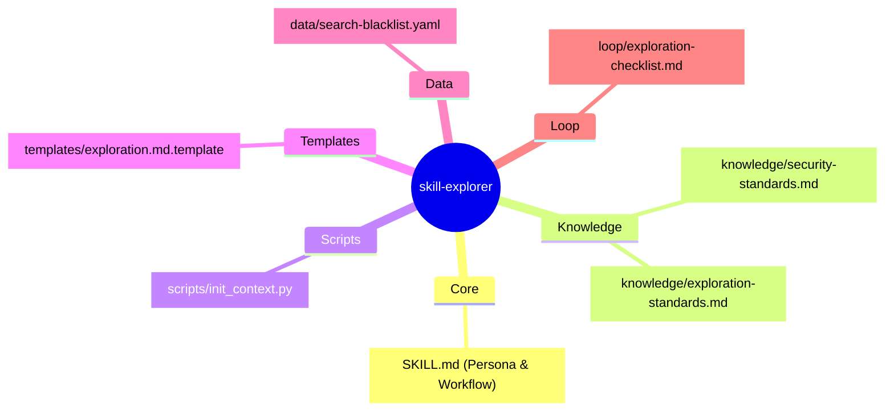
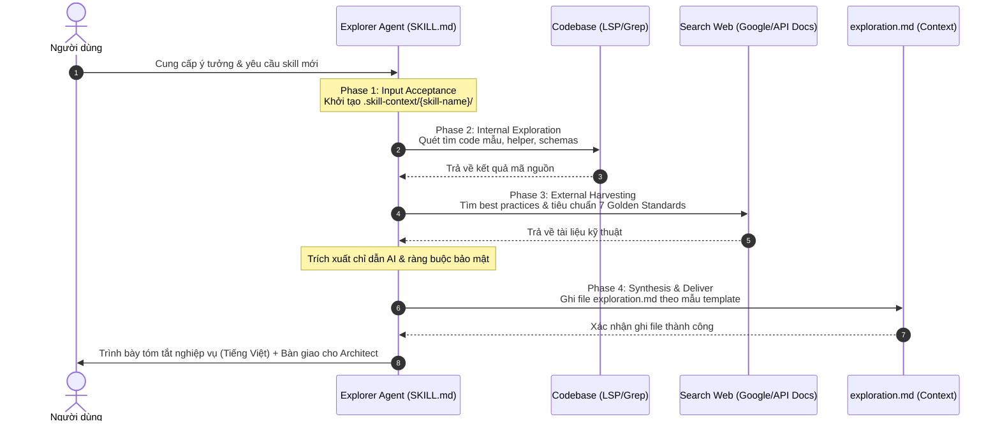

# skill-explorer — Kiến Trúc Thiết Kế Kỹ Năng Khảo Sát & Khai Thác Tài Nguyên

> **Ngày tạo**: 2026-05-24
> **Tác giả**: Skill Architect
> **Trạng thái**: Sẵn sàng bàn giao cho Planner (`ready_for_planner`)
> **Nguồn nghiên cứu gốc**: [scout-report](file:///home/steve/Work-space/deep_work_by_steve/.skill-context/skill-explorer/resources/skill-explorer-scout-report.md)

---

## 1. Problem Statement

### A. Vấn đề thực tế (Pain Points)
1. **Thiếu Tài Nguyên Thực Tế**: Hiện tại, bộ ba meta-skills bắt đầu trực tiếp từ `skill-architect` mà không có bước chuẩn bị. Khi Architect thiết kế kịch bản, nó thường bị ảo giác (hallucinate) hoặc đoán mò cấu trúc API, mã nguồn mẫu hiện có vì chưa có tài nguyên được thu thập sẵn sàng tại `.skill-context/{skill-name}/resources/`.
2. **Skill Đầu Ra Chưa Đạt Chất Lượng**: AI agent chưa có một hệ phương pháp chuẩn mực để tự đánh giá chất lượng của kỹ năng cần xây dựng, dẫn đến sản phẩm cuối thiếu chặt chẽ, dễ bị tiêm mã độc (prompt injection), hao phí token ngữ cảnh (nhiễu context) và không có cơ chế bắt lỗi/fallback đáng tin cậy.
3. **Thiếu Tích Hợp Tiêu Chuẩn Vàng**: Không có khâu kiểm soát các tiêu chuẩn tối cao như tính **Tái sử dụng, Tương tác ghép chuỗi, Môi trường cô lập Docker, Tối ưu Token và HITL** trước khi bắt tay lập kế hoạch hoặc triển khai.

### B. Giải pháp & Mục tiêu của `skill-explorer` (Stage 0)
`skill-explorer` đóng vai trò là một **Scout/Explorer Agent** chạy hoàn toàn trước `skill-architect`. Nó tự động cào quét codebase hiện tại để thu thập mã mẫu, tìm API schemas phù hợp, nghiên cứu best practices trên mạng và phân tích nghiệp vụ kỹ năng đích dựa trên **7 Tiêu chuẩn Vàng** để tạo ra tài liệu khảo sát nghiệp vụ hoàn chỉnh `exploration.md` tại `.skill-context/{skill-name}/exploration.md`.

---

## 2. Capability Map

Áp dụng mô hình phân tích **3 Trụ Cột Tri Thức** để làm sáng tỏ các tính năng cần có:

```yaml
pillars:
  domain_knowledge:
    description: "Các khái niệm nghiệp vụ, quy chuẩn thiết kế kỹ năng AI chất lượng cao"
    items:
      - "Khái niệm và định nghĩa của 7 Tiêu chuẩn Vàng (Reusability, Composability, Maintainability, Security, Context Economics, Portability, Reliability)"
      - "Bộ nguyên tắc an toàn thông tin: Prompt Injection (XML isolation, Structured Calling), Docker Sandboxing (gVisor/Firecracker, Ephemeral environment)"
      - "Quy chuẩn bộc lộ lũy tiến (Progressive Disclosure) tối ưu ngữ cảnh"

  technical_requirements:
    description: "Các công cụ, script và thư viện tự động hóa cần thiết"
    items:
      - "API quét codebase: search_files, grep_search, LSP APIs (lsp_hover, lsp_goto_definition)"
      - "API khảo sát bên ngoài: search_web, read_url_content"
      - "Script Python 'init_context.py' để khởi tạo thư mục và ghi template exploration.md"
      - "Tích hợp hook proxy rtk (Rust Token Killer) cho các lệnh terminal"

  packaging:
    description: "Quy chuẩn đóng gói kỹ năng tác nhân theo mô hình 7 Zones của Framework"
    items:
      - "Định nghĩa tệp cấu hình trung tâm SKILL.md chứa Persona, 4-Phase Workflow và Guardrails cứng"
      - "Thiết kế schemas/exploration.schema.yaml để validator tự động kiểm tra cú pháp"
      - "Cập nhật handoff_validator.py để tạo cổng bàn giao exploration-to-design"
```

---

## 3. Zone Mapping

Bảng quy hoạch 7 phân vùng Zones kỹ thuật bắt buộc phải tạo (Hợp đồng Architect → Planner):

| Zone | File cần tạo | Nội dung nghiệp vụ | Bắt buộc? |
|------|--------------|--------------------|-----------|
| **Core** | `SKILL.md` | Persona của Explorer Agent, 4-Phase Workflow, luật cứng bảo mật | ✅ Có |
| **Knowledge** | `knowledge/security-standards.md` | Tài liệu chuẩn bảo mật: Prompt Injection & Docker Sandboxing chi tiết | ✅ Có |
| **Knowledge** | `knowledge/exploration-standards.md` | Đặc tả chi tiết 7 Tiêu chuẩn Vàng và định nghĩa tài nguyên Rich vs Thin | ✅ Có |
| **Scripts** | `scripts/init_context.py` | Script khởi tạo thư mục `.skill-context/{skill-name}/` và ghi template | ✅ Có |
| **Templates** | `templates/exploration.md.template` | Mẫu chuẩn của tệp khảo sát đầu ra chứa 8 chương mục nghiệp vụ | ✅ Có |
| **Data** | `data/search-blacklist.yaml` | Danh sách đen các tệp/thư mục hệ thống cần bỏ qua khi quét code mẫu | ✅ Có |
| **Loop** | `loop/exploration-checklist.md` | Checklist tự đánh giá độ bao phủ tài nguyên nghiệp vụ trước bàn giao | ✅ Có |
| **Assets** | N/A | Không cần dùng | ❌ Không |

---

## 4. Folder Structure

Bản đồ cấu trúc thư mục của kỹ năng mới dưới dạng Mermaid Mindmap:



---

## 5. Execution Flow

Biểu đồ trình tự thực thi ở runtime của Explorer Agent (gồm 4 Phases):



---

## 6. Interaction Points

Bảng định nghĩa các điểm dừng tương tác kiểm soát chất lượng (Quality Gates & Human-in-the-loop):

| Tình huống chạy | Hành vi Agent | Lý do nghiệp vụ | Hành động tương tác |
|-----------------|---------------|-----------------|---------------------|
| Khởi tạo Context | Dừng hỏi tên skill | Tránh tạo sai thư mục | Yêu cầu nhập tên skill dạng kebab-case |
| Đánh giá Tài nguyên | Dừng khi `confidence < 70%` | Yêu cầu thô quá mơ hồ hoặc thiếu tài liệu | Gửi câu hỏi yêu cầu người dùng làm rõ bối cảnh |
| Thực thi mã mẫu | Dừng trước khi chạy lệnh shell | An toàn hệ thống | Hiện cảnh báo, yêu cầu người dùng xác nhận cho phép chạy |
| Bàn giao Stage | Dừng chạy checklist cuối | Đảm bảo cổng bàn giao | Hiển thị checklist, yêu cầu người dùng xác nhận "Approve" |

---

## 7. Progressive Disclosure Plan

Mô hình phân tầng nạp tri thức 3 lớp (Token Economics) để giảm nhiễu context cho AI:

```yaml
progressive_disclosure:
  tier1:
    mandatory_files:
      - "SKILL.md (Cơ chế điều khiển hành vi gốc)"
      - "loop/exploration-checklist.md (Tiêu chí cổng chất lượng)"
    load_policy: "Luôn luôn nạp lúc boot sequence khởi động"

  tier2:
    conditional_files:
      - "knowledge/security-standards.md (Nạp khi phân tích bảo mật)"
      - "knowledge/exploration-standards.md (Nạp khi đánh giá 7 Tiêu chuẩn Vàng)"
      - "data/search-blacklist.yaml (Nạp khi đi sâu quét codebase)"
    load_policy: "Chỉ nạp khi agent bước vào Phase 2 & Phase 3 tương ứng"

  tier3:
    optional_files:
      - "templates/exploration.md.template"
    load_policy: "Chỉ nạp khi agent chuẩn bị ghi dữ liệu ra tệp ở Phase 4"
```

---

## 8. Risks & Blind Spots

Bộ chỉ số quản trị rủi ro an toàn và bảo mật (Bắt buộc tối thiểu 3 rủi ro):

| # | Rủi ro phát hiện | Mức độ nguy hại | Giải pháp giảm thiểu (Mitigation) |
|---|------------------|-----------------|-----------------------------------|
| 1 | **Prompt Injection** từ tài liệu bên ngoài | 🔴 Cực cao | 1. Bao bọc toàn bộ đầu vào RAG/Web bằng thẻ XML delimiters nghiêm ngặt.<br/>2. Sử dụng Structured Tool Calling.<br/>3. Áp dụng nguyên tắc quyền hạn tối thiểu (Không cấp quyền ghi đè mã nguồn). |
| 2 | **Đoán mò API** hoặc thư viện không tồn tại | 🟡 Trung bình | Bắt buộc phải xác minh sự tồn tại của thư viện bằng cách tra cứu API schema thực tế trong codebase hoặc tài liệu trực tuyến chính thức. |
| 3 | **Tràn cửa sổ ngữ cảnh** (Context Overflow) | 🟡 Trung bình | Áp dụng triệt để cơ chế Progressive Disclosure; cấm đọc toàn bộ thư mục `knowledge/` đồng thời; giới hạn độ sâu quét thư mục max_depth = 3. |
| 4 | **Thực thi mã độc hại** khi chạy test scripts | 🔴 Cực cao | Bắt buộc phải chạy trong Ephemeral Sandbox (Docker container biệt lập sử dụng gVisor), chặn network egress mặc định và cô lập các thư mục host nhạy cảm. |

---

## 9. Open Questions

Các câu hỏi nghiệp vụ và kỹ thuật cần làm rõ trong các phase tiếp theo:
1. **Liên kết Sandboxing**: Hệ thống local của người dùng đã được cài đặt sẵn Docker và gVisor chưa? Nếu chưa, Explorer Agent sẽ đưa ra cơ chế dự phòng (Fallback) cảnh báo thế nào khi muốn chạy thử nghiệm code?
2. **Định dạng XML**: Liệu các thẻ XML delimiters có cần được parser tự động bóc tách ở mức hệ thống để lọc hoàn toàn các chỉ lệnh tấn công hay không?

---

## 10. Metadata

```yaml
metadata:
  skill_name: "skill-explorer"
  stage: "architect"
  artifact_type: "design"
  version: "1.0.0"
  schema_compliance: "design.schema.yaml"
  author: "Skill Architect"
  review_status: "approved_by_scout"
  next_step: "skill-planner"
```
