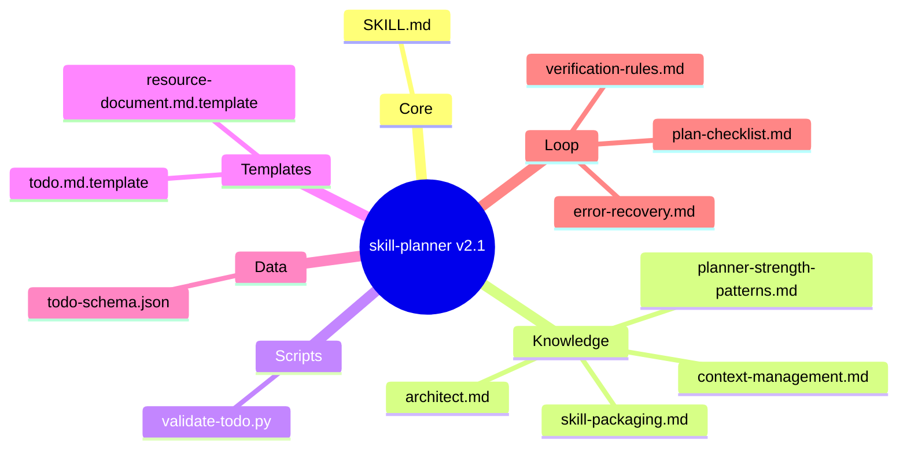
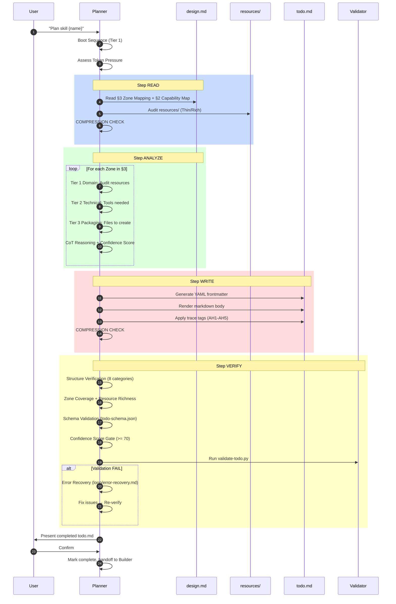
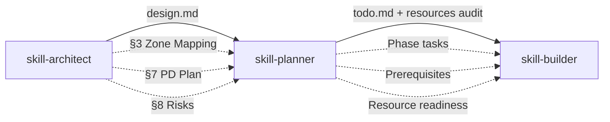

# skill-planner v2.1 — Architecture Design

> Generated by: skill-architect | 2026-05-03
> Status: COMPLETE
> Version: 2.1.0

---

## 1. Problem Statement

**Vấn đề**: skill-planner v2.0 có 12 weaknesses nghiêm trọng làm giảm hiệu quả planning pipeline:

| # | Weakness | Severity | Impact |
|---|---------|----------|--------|
| W1 | Không quản lý context window → load tất cả files, waste tokens | P0 | ~60% token waste |
| W2 | Verification loop yếu (chỉ 3 checks) → deliver plan với lỗi chưa phát hiện | P0 | Plans thiếu task, miss dependencies |
| W3 | Format mismatch: SKILL.md (markdown) vs plan-checklist (YAML) vs template (both) | P0 | Agent confused, inconsistent output |
| W4 | Progressive Disclosure lip service → tier1/2/3 defined nhưng load_when vague | P1 | Files loaded không cần thiết |
| W5 | Không có error recovery → khi fail, không có graceful degradation | P1 | Planning crash, user stuck |
| W6 | Không có confidence scoring → deliver plan mà không đo chất lượng | P1 | Low-quality plans pass |
| W7 | validate-todo.py fragmented → chỉ validate markdown, bỏ qua YAML schema | P1 | Invalid plans pass validation |
| W8 | Massive duplication → architect.md 80% overlap với framework.md | P1 | ~450 tokens wasted per session |
| W9 | Source trace tags không enforced → validate phát warnings, không errors | P2 | Hallucinated tasks pass |
| W10 | Không có handoff contracts → chỉ "present to user", không ready_condition | P2 | Builder receives incomplete plans |
| W11 | Không có Chain-of-Thought enforcement → priority, dependency không reasoning | P2 | Arbitrary decisions |
| W12 | Missing todo.schema.yaml → plan-checklist tham chiếu schema nhưng file không tồn tại | P2 | Validation incomplete |

**Người dùng**: AI Agent (Claude Code) sử dụng skill-planner để phân tích design.md và tạo implementation plan (todo.md)

**Lý do cần skill**: Cần tăng sức mạnh planner để:
- Giảm token waste tối thiểu 40% (context management + dedup)
- Tăng plan quality với verification loop + confidence scoring
- Tăng robustness với error recovery + graceful degradation
- Cải thiện handoff với builder qua structured contracts

---

## 2. Capability Map

### 2.1 Knowledge (Pillar 1)

| Knowledge Area | File | Mục đích |
|----------------|------|----------|
| Framework Reference | `knowledge/architect.md` | Planner-specific workflow (reduce duplication) |
| 3-Tier Packaging Model | `knowledge/skill-packaging.md` | Domain/Technical/Packaging analysis + anti-hallucination |
| Context Management | `knowledge/context-management.md` | Token optimization, compression strategies |
| Planner Strength Patterns | `knowledge/planner-strength-patterns.md` | Confidence scoring, CoT, source trace for planning |
| Todo Schema | `data/todo-schema.json` | Structured validation for todo.md |

### 2.2 Process (Pillar 2)

```
Boot Sequence
  ├── Read SKILL.md (Tier 1)
  ├── Read knowledge/architect.md (Tier 1)
  ├── Read loop/plan-checklist.md (Tier 1)
  ├── Assess Token Pressure (Tier 2 context-management.md if needed)
  └── Determine skill-name from user input

Step READ — Input & Audit
  ├── Read design.md §3 (Zone Mapping) + §2 (Capability Map)
  ├── Audit resources/ (Evaluative Audit: Thin/Rich)
  ├── Integrate user context prompt
  └── COMPRESSION CHECK → update token budget

Step ANALYZE — 3-Tier Breakdown
  ├── For EACH Zone in §3:
  │   ├── Tier 1 Domain: Audit resources/ → pre-req or TASK
  │   ├── Tier 2 Technical: Tools/syntax needed → pre-req
  │   └── Tier 3 Packaging: Files to create → TASK from §3
  ├── CoT Enforcement: Reasoning for priority/dependency decisions
  ├── Confidence Scoring (per decision)
  └── COMPRESSION CHECK → update token budget

Step WRITE — Output todo.md
  ├── Generate YAML frontmatter (schema-driven)
  ├── Render markdown body (human-readable)
  ├── All trace tags applied (AH1-AH5)
  └── COMPRESSION CHECK

Step VERIFY — Self-Check
  ├── Structure Verification (8 categories)
  ├── Zone Coverage Check
  ├── Resource Richness Check
  ├── Phase Dependency DAG Check
  ├── Schema Validation (data/todo-schema.json)
  ├── Confidence Score Gate (>= 70)
  └── If FAIL → Error Recovery (loop/error-recovery.md)

Confirm → Present to User → Handoff to Builder
```

### 2.3 Guardrails (Pillar 3)

| Guardrail | Rule | Enforcement |
|-----------|------|-------------|
| G1 | Trace required | Every item MUST have [TỪ DESIGN §N] or valid tag |
| G2 | No inventing | Only decompose design, don't add requirements |
| G3 | No guessing domain | If unsure → mark [CẦN LÀM RÕ] |
| G4 | Resource gate | Don't mark complete if critical resources missing |
| G5 | Confidence gate | Score < 70 → ask clarifying questions |
| G6 | Schema compliance | todo.md MUST pass todo-schema.json validation |
| G7 | Token budget | Context < 70% window at delivery |
| G8 | CoT required | Priority/dependency decisions require reasoning |

---

## 3. Zone Mapping

| Zone | Files cần tạo | Nội dung | Bắt buộc? |
|------|--------------|----------|-----------|
| Core | `SKILL.md` | Planner persona, 4-step workflow, guardrails, PD 2.0 | ✅ |
| Knowledge | `knowledge/architect.md` | Planner-specific framework reference (reduced) | ✅ |
| Knowledge | `knowledge/skill-packaging.md` | 3-tier model + anti-hallucination rules | ✅ |
| Knowledge | `knowledge/context-management.md` | Token budget strategy for planner | ✅ |
| Knowledge | `knowledge/planner-strength-patterns.md` | CoT, confidence scoring, source trace | ✅ |
| Scripts | `scripts/validate-todo.py` | Validate YAML + markdown + trace tags | ✅ |
| Templates | `templates/todo.md.template` | Todo output template (YAML + markdown) | ✅ |
| Templates | `templates/resource-document.md.template` | Resource document template | ✅ |
| Data | `data/todo-schema.json` | JSON Schema for todo.md validation | ✅ |
| Loop | `loop/plan-checklist.md` | Quality gate checklist | ✅ |
| Loop | `loop/verification-rules.md` | Self-check rules before delivery | ✅ |
| Loop | `loop/error-recovery.md` | 6 error types + graceful degradation | ✅ |
| Assets | Không cần | — | ❌ |

---

## 4. Folder Structure



---

## 5. Execution Flow



---

## 6. Interaction Points

| # | When | Action | Trigger |
|---|------|--------|---------|
| I1 | After Step READ | Present resource audit summary | "Found X resources: Y Rich, Z Thin, W Missing" |
| I2 | After Step ANALYZE | Present confidence score + key decisions | "Confidence: 75%. Priority decisions: ..." |
| I3 | After Step VERIFY | Present verification results | "Verification: 8/8 PASS" or "FAIL: issues found" |
| I4 | Before delivery | Confirm todo.md with user | "Ready to deliver. Review?" |

**Mandatory interactions**: I1 (resource audit), I4 (delivery confirmation)

---

## 7. Progressive Disclosure Plan

### Tier 1 — Mandatory (Boot)

| File | Reason |
|------|--------|
| `SKILL.md` | Core orchestration |
| `knowledge/architect.md` | Framework reference (reduced) |
| `loop/plan-checklist.md` | Quality gate awareness |

### Tier 2 — Conditional (Load when needed)

| File | Load When |
|------|-----------|
| `knowledge/skill-packaging.md` | Step ANALYZE — 3-tier breakdown per Zone |
| `knowledge/context-management.md` | Boot or when token pressure detected |
| `knowledge/planner-strength-patterns.md` | Step ANALYZE — confidence scoring + CoT enforcement |
| `templates/todo.md.template` | Step WRITE — generating todo.md |

### Tier 3 — On-Demand (Load for verification/recovery)

| File | Load When |
|------|-----------|
| `loop/verification-rules.md` | Step VERIFY — before declaring complete |
| `loop/error-recovery.md` | When errors or hallucinations detected |
| `scripts/validate-todo.py` | Pre-delivery verification |
| `data/todo-schema.json` | Step VERIFY — schema validation |

### Complexity Adaptation

| Skill Complexity | Required Files | Optional Files |
|-----------------|---------------|----------------|
| Simple (< 5 zones) | Tier 1 only | None |
| Medium (5-7 zones) | Tier 1 + relevant Tier 2 | Other Tier 2 |
| Complex (> 7 zones) | Tier 1 + all Tier 2 | Tier 3 when needed |

---

## 8. Risks & Blind Spots

| # | Risk | Likelihood | Impact | Mitigation |
|---|------|-----------|--------|------------|
| R1 | Planner adds requirements not in design.md (hallucination) | High | High | Source Trace Rule (AH1-AH5) enforced by validator |
| R2 | Resource audit misses Thin content | Medium | Medium | Evaluative Audit checklist in plan-checklist.md |
| R3 | Task dependency graph has cycles | Low | High | DAG validation in validate-todo.py |
| R4 | Token overflow on large design.md | Medium | Medium | Context management + compression strategies |
| R5 | Planner delivers without running verification | High | High | Verification gate enforced before Confirm step |
| R6 | Confidence score fabricated without reasoning | Medium | High | CoT enforcement + weighted metrics |

---

## 9. Open Questions

| # | Question | Status | Resolution |
|---|---------|--------|------------|
| Q1 | Should planner support incremental updates to existing todo.md? | [CẦN LÀM RÕ] | TBD |
| Q2 | What is the minimum viable todo.md for simple skills? | [GỢI Ý BỔ SUNG] | Tier 1 files + 3-phase breakdown |
| Q3 | Should confidence scoring be displayed to user or internal only? | [GỢI Ý BỔ SUNG] | Display at I2 interaction point |

---

## 10. Metadata

| Field | Value |
|-------|-------|
| Skill Name | skill-planner |
| Version | 2.1.0 |
| Status | COMPLETE |
| Date | 2026-05-03 |
| Author | skill-architect |
| Confidence Score | 82/100 |
| Pipeline Stage | 2 (Planner) |
| Successor | skill-builder |
| Predecessor | skill-architect |

### Confidence Breakdown

| Metric | Weight | Score | Weighted |
|--------|--------|-------|----------|
| Output clarity | 30% | 85 | 25.5 |
| Zone mapping completeness | 25% | 80 | 20.0 |
| Risk coverage | 20% | 75 | 15.0 |
| Diagram quality | 15% | 85 | 12.75 |
| Handoff readiness | 10% | 90 | 9.0 |
| **Total** | **100%** | | **82.25** |

---

## 11. Context Management

### Token Budget Strategy

| Budget Level | Threshold | Action |
|-------------|-----------|--------|
| Green | < 50% | Normal operation, load Tier 2 on-demand |
| Yellow | 50-80% | Skip non-essential Tier 2, enable compression hints |
| Red | > 80% | Run compression, load only critical files |
| Critical | > 95% | Emergency: summarize, drop all non-essential |

### Planner-Specific Token Estimates

| File | Est. Tokens | Priority |
|------|-------------|----------|
| SKILL.md | ~350 | Critical |
| architect.md | ~100 | Critical |
| plan-checklist.md | ~200 | Critical |
| skill-packaging.md | ~300 | High |
| context-management.md | ~250 | Medium |
| planner-strength-patterns.md | ~300 | Medium |
| todo.md.template | ~400 | High (when writing) |
| validate-todo.py | ~350 | Medium |
| verification-rules.md | ~200 | Medium |
| error-recovery.md | ~200 | Low |

### Compression Techniques

1. **Lazy Loading**: Tier 2 files only load when Step requires them
2. **Reference, Don't Duplicate**: architect.md references framework.md, not copies
3. **Summary Mode**: When Red budget, load first 20% of Tier 2 files
4. **Drop Gracefully**: Non-essential Tier 2 dropped before critical files

---

## 12. Verification Loop

### Self-Check Procedure

| # | Check Category | Items | Gate |
|---|---------------|-------|------|
| V1 | Structure | YAML frontmatter present, 6 sections, schema version | ERROR |
| V2 | Zone Coverage | All §3 zones mapped to tasks | ERROR |
| V3 | Resource Richness | Critical resources not Thin/Missing | ERROR |
| V4 | Phase Dependencies | DAG valid (no cycles), logical order | ERROR |
| V5 | Trace Tags | Every task has valid tag (AH1-AH5) | ERROR |
| V6 | Schema Compliance | todo.md passes todo-schema.json | ERROR |
| V7 | Confidence Score | Score >= 70 with weighted breakdown | WARNING |
| V8 | Handoff Readiness | ready_condition criteria met | WARNING |

### Confidence Scoring Matrix (Planner Domain)

| Metric | Weight | Score Range | What It Measures |
|--------|--------|-------------|-----------------|
| Task completeness | 30% | 0-100 | All §3 zones mapped to tasks |
| Trace coverage | 25% | 0-100 | All tasks have valid trace tags |
| Resource readiness | 20% | 0-100 | Critical resources are Rich |
| Dependency accuracy | 15% | 0-100 | DAG valid, logical phase order |
| Handoff readiness | 10% | 0-100 | Builder can start immediately |

### Verification Gate

```
If ANY V1-V6 check FAIL → Do NOT deliver. Fix or trigger Error Recovery.
If confidence < 70 → Ask clarifying questions before delivery.
If all checks PASS + confidence >= 70 → Proceed to Confirm.
```

---

## 13. Error Recovery

| Error Type | Detection | Recovery |
|-----------|-----------|----------|
| Verification FAIL | Step VERIFY check fails | Fix specific issues → Re-verify. If unfixable → rollback phase. |
| User Reject | User rejects todo.md | Identify rejected section → Rollback to that phase → Re-analyze. |
| Context Corruption | File not found, parse error | Reload Tier 1 files → Re-init current phase. If persistent → notify user. |
| Hallucination Detected | Claim without source trace | Trace to source → If found: update reference. If not found: remove claim. |
| Token Overflow | Context > 80% | Compress → Drop non-essential Tier 2 → Summary mode. |
| Low Confidence | Score < 50 | Notify user → Offer: (1) collect more info, (2) reduce scope, (3) split task. |

### Graceful Degradation Levels

1. **Full plan** (6 sections, all zones, all tiers)
2. **Essential plan** (4 sections, critical zones only)
3. **Minimal plan** (Phase breakdown + prerequisites only)
4. **Blocked plan** (Identify blockers, mark as blocked)

### Emergency Rollback

**Trigger**: Critical error in delivered todo.md.

**Procedure**:
1. Stop immediately
2. Notify user of error
3. Identify phase that caused error
4. Rollback to that phase
5. Re-analyze from that phase

---

## 14. Agent Strength Optimization

### Chain-of-Thought Enforcement

Every planning decision MUST follow this template:

```markdown
**Decision**: [What was decided]
**Reasoning**: [Why] — based on which design.md section? Which risk?
**Alternative Considered**: [What else] — why rejected?
**Confidence**: [0-100] — how sure?
```

**Required at**:
- Step ANALYZE: Tier analysis decisions (Domain audit judgment)
- Step ANALYZE: Priority assignment (Critical/High/Medium/Low)
- Step ANALYZE: Dependency detection (which tasks block which)
- Step VERIFY: Confidence scoring decisions

### Source Trace Rule (Anti-Hallucination)

| Rule | Description | Violation |
|------|-------------|-----------|
| AH1 | Every task MUST trace to source | Task without [TỪ DESIGN §N] |
| AH2 | Only decompose, don't add requirements | New requirement not in design.md |
| AH3 | Don't guess domain knowledge | Writing domain content without resources |
| AH4 | Always label sources | No [TỪ DESIGN] / [GỢI Ý] distinction |
| AH5 | Verify resources before completion | Planning complete with missing critical resources |

**Enforcement**: validate-todo.py treats AH1-AH5 violations as ERRORS (not warnings).

### Multi-Agent Coordination



### Handoff Contracts

**Architect → Planner** (consumed):
- §3 Zone Mapping → decompose into tasks
- §7 Progressive Disclosure → plan Tier loading
- §8 Risks → create mitigation tasks

**Planner → Builder** (produced):
- Phase tasks with priorities and dependencies
- Prerequisites table with resource readiness
- Blockers list with resolution status
- Handoff ready_condition (5 criteria)

### Persistent Learning

| Mechanism | Purpose |
|-----------|---------|
| `progress.txt` | Record planning details, learnings |
| Builder feedback | Improve future planning |
| Anti-patterns | Update knowledge files when discovered |

---

## Handoff Readiness

**Next stage**: skill-builder

**Ready condition**:
- [ ] All blockers resolved
- [ ] Phase 0 (Resource Preparation) complete
- [ ] All prerequisites ready (no missing critical)
- [ ] Schema validation passes (todo-schema.json)
- [ ] All design zones covered
- [ ] Confidence score >= 70

**Evidence**: todo.md + validate-todo.py output + confidence score breakdown
