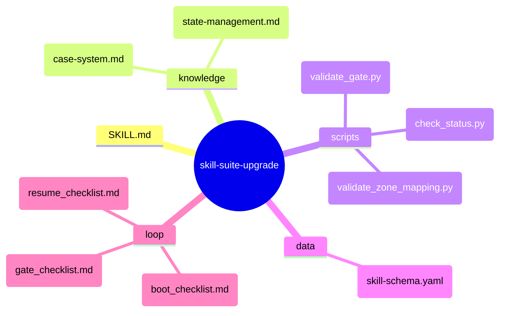
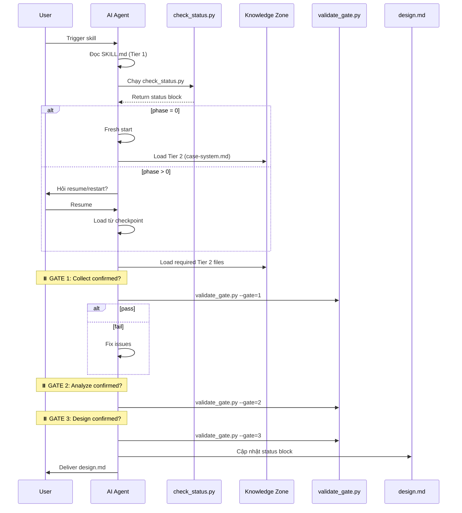

# skill-suite-upgrade — Architecture Design

> Generated by skill-architect | 2026-05-10T12:00:00Z
> Status: 🔵 IN PROGRESS

---

## 1. Problem Statement

<!-- Trả lời 3 câu hỏi:
(1) Vấn đề gì? — mô tả pain point cụ thể
(2) Ai gặp vấn đề này? — ai là user của skill
(3) Tại sao cần skill? — giá trị mang lại
-->

**Vấn đề**: Bộ 3 skill (skill-architect → skill-planner → skill-builder) hiện tại có 6 vấn đề nền tảng:

1. **Context không persistent** — Mỗi lần gọi skill = fresh start, không biết đang ở phase nào
2. **Handoff dựa trên text, không có contract** — design.md → todo.md = "best effort" translation, lỗi accumulate
3. **Progressive Disclosure không có enforcement** — Tier 2/3 có thể bị skip → hallucination
4. **Không có error recovery** — Lỗi Phase 1 → Phase 2 & 3 tiếp tục với input sai
5. **Boot sequence tự mâu thuẫn** — "Chỉ đọc SKILL.md" nhưng SKILL.md bảo đọc thêm nhiều thứ
6. **Output quality không đo được** — Placeholder count ≠ usability

**Người dùng**: Steve (skill suite developer) và các AI agents sử dụng skill suite

**Lý do cần skill**: Áp dụng CASE System (Confidence-Aware Skill Execution) — tổng hợp từ Heavy Thinking analysis — để nâng cấp bộ skill với 3 mechanism: **PREVENT → DETECT → RECOVER**

---

## 2. Capability Map

### 2.1 Tri thức (Knowledge — Pillar 1)

| Tri thức cần | Dạng tài liệu | Mục đích |
|--------------|----------------|----------|
| CASE System Framework | `knowledge/case-system.md` | Định nghĩa 3 mechanism PREVENT/DETECT/RECOVER |
| State Management Protocol | `knowledge/state-management.md` | Quy tắc đọc/ghi status block vào design.md |
| Zone Mapping Schema | `data/skill-schema.yaml` | Schema cho §3 Zone Mapping validation |
| Gate Validation Logic | `scripts/validate_gate.py` | Script kiểm tra gate checklist |
| Status Checker | `scripts/check_status.py` | Script đọc status từ design.md |

### 2.2 Quy trình (Process — Pillar 2)

```
BOOT SEQUENCE (State-aware):
1. AI được trigger
2. AI đọc SKILL.md (Tier 1)
3. AI chạy check_status.py → lấy status từ design.md
4. AI xác định phase hiện tại:
   - phase=0 → bắt đầu fresh
   - phase>=1 → hỏi resume/restart
5. AI load Tier 2 files theo triggers cụ thể
6. AI tiếp tục từ checkpoint

GATE SYSTEM (3 gates):
- Gate 1: Sau Phase 1 (Collect) → validate §1 + status block
- Gate 2: Sau Phase 2 (Analyze) → validate §2 + §3 + §8
- Gate 3: Sau Phase 3 (Design) → validate §4-§9 + diagrams

HANDOFF VALIDATION:
- Planner nhận design.md → chạy validate_zone_mapping.py
- Builder nhận todo.md → chạy validate_gate.py
- Fail = STOP + WARN, không proceed
```

### 2.3 Kiểm soát (Guardrails — Pillar 3)

| # | Risk | Mitigation |
|---|------|------------|
| 1 | **AI skip Tier 2/3, hallucinate** | Explicit triggers trong PD plan + boot_checklist.md verify |
| 2 | **Handoff mất thông tin** | validate_zone_mapping.py check §3 schema + trace_validator |
| 3 | **Lỗi propagate undetected** | Gate validators check consistency giữa phases |
| 4 | **Resume không biết checkpoint** | Status block + check_status.py mandatory ở boot |
| 5 | **Confidence < 70% nhưng proceed** | Explicit confidence declaration + gate blocks |
| 6 | **Output quality thấp** | Placeholder density <5 + fidelity check + smoke test |

---

## 3. Zone Mapping

> ⚠️ Contract Section — Planner đọc §3 để decompose thành Tasks.
> Mọi Zone PHẢI có giá trị trong cột "Files cần tạo". Zone không dùng → ghi "Không cần".

| Zone | Files cần tạo | Nội dung | Bắt buộc? |
|------|--------------|----------|-----------|
| Core (SKILL.md) | `SKILL.md` | Persona, CASE-aware boot, 3-gate workflow, guardrails | ✅ |
| Knowledge | `knowledge/case-system.md`, `knowledge/state-management.md` | CASE framework + state protocol | ✅ |
| Scripts | `scripts/validate_gate.py`, `scripts/check_status.py`, `scripts/validate_zone_mapping.py` | Gate validators, status checker, schema validator | ✅ |
| Templates | Không cần | — | ❌ |
| Data | `data/skill-schema.yaml` | YAML schema cho design.md frontmatter + §3 | ✅ |
| Loop | `loop/boot_checklist.md`, `loop/gate_checklist.md`, `loop/resume_checklist.md` | Boot verify, gate exit criteria, resume procedure | ✅ |
| Assets | Không cần | — | ❌ |

---

## 4. Folder Structure



---

## 5. Execution Flow



---

## 6. Interaction Points

| # | Thời điểm | Lý do dừng | Hành động của AI |
|---|-----------|-----------|-----------------|
| 1 | **Sau Boot** | Xác định resume/fresh | Trình bày checkpoint status + hỏi "Resume từ phase X hay bắt đầu mới?" |
| 2 | **Sau Phase 1 (Collect)** | Gate 1 — cần user confirm | Trình bày §1 + status block + hỏi "Đã đúng ý bạn chưa?" |
| 3 | **Sau Phase 2 (Analyze)** | Gate 2 — cần user confirm | Trình bày §2 + §3 + §8 + hỏi "Analysis này có chính xác không?" |
| 4 | **Sau Phase 3 (Design)** | Gate 3 — cần user confirm | Trình bày §4-§9 + diagrams + hỏi "Design này có acceptable không?" |

---

## 7. Progressive Disclosure Plan

### Tier 1: Bắt buộc đọc (Mandatory)

| File | Required For |
|------|-------------|
| `SKILL.md` | Always at boot |
| `data/skill-schema.yaml` | Schema reference at boot |

### Tier 2: Đọc khi cần (Conditional)

| File | Trigger | Required For |
|------|---------|-------------|
| `knowledge/case-system.md` | entering_phase_1, confidence_below_70 | Phase 1 analysis |
| `knowledge/state-management.md` | boot_sequence, resuming_session | Boot + Resume |
| `scripts/check_status.py` | boot_sequence | Status check |
| `scripts/validate_gate.py` | before_gate_confirmation | Gate validation |

### Tier 3: Tham khảo (Reference Only)

| File | Trigger | Required For |
|------|---------|-------------|
| `loop/resume_checklist.md` | resuming_from_checkpoint | Resume procedure |
| `loop/boot_checklist.md` | after_boot_before_phase1 | Boot verification |

---

## 8. Risks & Blind Spots

| # | Risk | Severity | Mitigation |
|---|------|----------|-----------|
| 1 | **AI đọc status sai hoặc không đọc status** | P0 | check_status.py output phải được parse và verify trong boot_checklist.md |
| 2 | **Gate validator bị bypass** | P0 | Gate confirmation PHẢI include validator output |
| 3 | **Tier 2 files không load đúng trigger** | P1 | boot_checklist.md verify all required reads |
| 4 | **Resume với stale status** | P1 | resume_checklist.md verify timestamp vs file modification |
| 5 | **Confidence declaration không trung thực** | P2 | Gate checklist verify confidence basis |
| 6 | **Schema validation fail nhưng AI proceed** | P1 | validate_gate.py exit code = 0/1, non-zero = STOP |

---

## 9. Open Questions

| # | Câu hỏi | Nguồn (Phase) | Trạng thái |
|---|---------|--------------|-------------|
| 1 | Liệu validator scripts có cần phải là Python, hay shell scripts đủ? | Phase 2 | ❓ Cần làm rõ |
| 2 | Case system có nên apply cho tất cả 3 skills (architect/planner/builder) hay chỉ architect? | Phase 1 | ❓ Cần làm rõ |
| 3 | Zone Mapping §3 schema — nên extend frontmatter hay giữ nguyên markdown table? | Phase 2 | ❓ Cần làm rõ |
| 4 | Backward compatibility: old design.md files không có status block → tự tạo hay require manual? | Phase 3 | ❓ Cần làm rõ |

---

## 10. Metadata

- **Skill Name**: skill-suite-upgrade
- **Created**: 2026-05-10
- **Author**: Steve (via skill-architect)
- **Framework**: architect.md v3.0
- **Status**: 🟢 GATE 3 PASSED — Ready for Planner
- **Handoff Checklist**:
  - [ ] design.md hoàn thiện (gate validators pass)
  - [ ] scripts/validate_gate.py hoạt động
  - [ ] scripts/check_status.py hoạt động
  - [ ] data/skill-schema.yaml validate được
  - [ ] Sẵn sàng cho skill-planner

---

## 10.1 Version & Dependencies

### Version Management

```
MAJOR.MINOR.PATCH
- MAJOR: Schema change, workflow change (v2 → v3)
- MINOR: Add mechanism (PREVENT/DETECT/RECOVER)
- PATCH: Fix validators, add examples
```

### Skill Dependencies

| Type | Skill | Required | Reason |
|------|-------|----------|--------|
| Predecessor | None | — | First in pipeline |
| Successor | skill-planner | ✅ | Needs design.md to create todo.md |
| Successor | skill-builder | ✅ | Needs todo.md to build |

---

## 11. Naming Conventions

### Skill Name Rules

**Required Pattern**: `kebab-case` (lowercase, hyphen-separated)

### Zone File Naming

| Zone | Pattern | Example |
|------|---------|---------|
| knowledge/ | `concept-topic.md` | `case-system.md`, `state-management.md` |
| scripts/ | `verb_object.py` | `validate_gate.py`, `check_status.py` |
| data/ | `schema-name.yaml` | `skill-schema.yaml` |
| loop/ | `purpose-checklist.md` | `boot_checklist.md`, `gate_checklist.md` |

---

## 12. Rollback Procedures

### Phase 1 Rollback — Collect

**Trigger**: User rejects Problem Statement or wants to change skill-name.

**Rollback Steps**:
```
1. Reset §1 Problem Statement → draft state
2. Reset status.phase = 0
3. Xóa checkpoint artifacts
4. Quay lại Phase 1: Collect
```

### Phase 2 Rollback — Analyze

**Trigger**: User rejects Capability Map or Zone Mapping.

**Rollback Steps**:
```
1. Reset §2 Capability Map → draft state
2. Reset §3 Zone Mapping → draft state
3. Reset §8 Risks & Blind Spots → draft state
4. status.gates_passed = []
5. Quay lại Phase 2: Analyze
```

### Phase 3 Rollback — Design

**Trigger**: User rejects final design or specific parts.

**Rollback Steps**:
```
1. Reset §4-§9 → draft state
2. Keep §1, §2, §3, §8 if unchanged
3. status.phase = 2
4. Quay lại Phase 3: Design
```

### Emergency Rollback (Resume from Checkpoint)

**Trigger**: Phát hiện lỗi nghiêm trọng trong design đã xuất.

**Procedure**:
```
1. Xác định checkpoint gần nhất
2. Reset design.md về checkpoint state
3. status.gates_passed = gates trước checkpoint
4. Thông báo user về lỗi và checkpoint
5. Tiếp tục từ checkpoint
```
