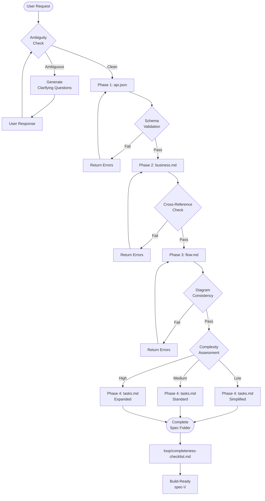
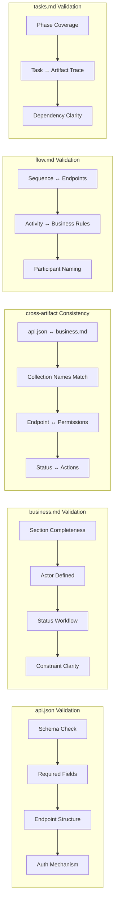
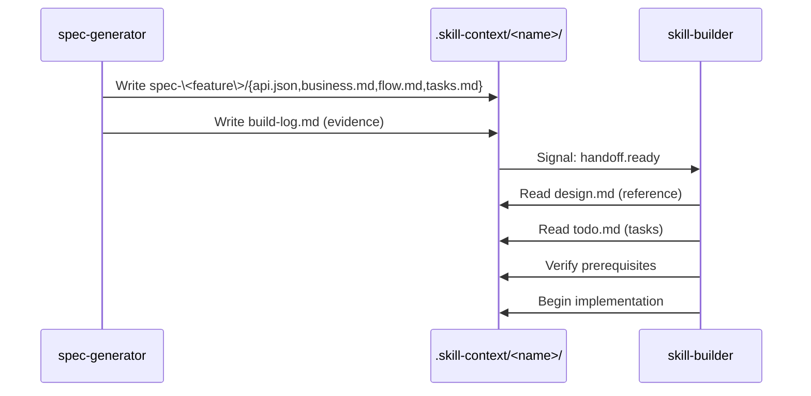
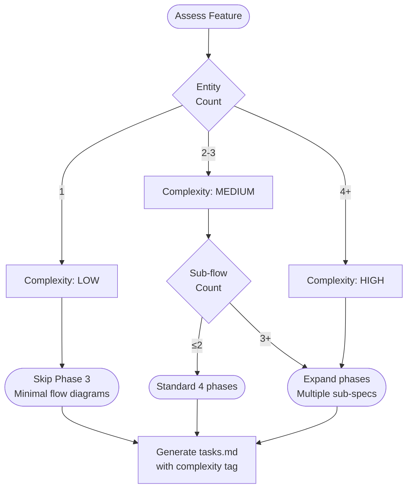

# Spec Generator — AI-First Redesign

> **Version**: 2.0.0  
> **Status**: Design Proposal  
> **Date**: 2026-05-07  
> **Architect**: Skill Architect  
> **Trace**: Pipeline v3.0

---

## 1. Problem Statement

### Current Pain Points

| # | Pain Point | Symptom | Root Cause |
|---|------------|---------|------------|
| P1 | **Ambiguity Blindness** | AI generates specs with missing fields, undefined edge cases | No Clarifying Question protocol |
| P2 | **No Self-Verification** | Spec outputs drift from actual codebase over time | No cross-reference validation |
| P3 | **Tasks.md Rigidity** | Always 4 phases regardless of complexity | Hardcoded phase structure |
| P4 | **Traceability Gap** | Cannot map task → implementation target | No spec-to-code trace mechanism |
| P5 | **Reference Docs Hollow** | `api_reference.md` is placeholder | No actual API contract documentation |
| P6 | **Skill-Builder Handoff Broken** | Missing integration protocol | No defined handoff flow |

### Why Human-Readable ≠ AI-Executable

```
Human-Readable                 AI-Executable
─────────────────              ──────────────────────────
Natural language prose    →    Structured schema + rules
Implicit assumptions      →    Explicit prerequisite checks  
Global context assumed    →    Tiered context loading
Iterative refinement      →    Validation gates before proceeding
Single output             →    Multi-artifact with cross-links
```

---

## 2. New 3 Pillars Architecture

### Pillar 1: KNOWLEDGE (What to Know)

| Layer | Content | File Pattern |
|-------|---------|--------------|
| **Domain** | Spec structure, output schemas, conventions | `knowledge/spec-structure.md` |
| **Validation** | Cross-reference rules, ambiguity detection | `knowledge/validation-rules.md` |
| **Templates** | Output schemas for all 5 artifacts | `templates/*.schema.yaml` |

### Pillar 2: PROCESS (How to Act)

| Phase | Trigger | Output | Validation Gate |
|-------|---------|--------|----------------|
| **Phase 0** | User request | Clarifying questions OR proceed signal | Ambiguity check |
| **Phase 1** | Context sufficient | `api.json` (validated) | Schema validation |
| **Phase 2** | api.json approved | `business.md` | Cross-ref check |
| **Phase 3** | business.md approved | `flow.md` | Diagram consistency |
| **Phase 4** | flow.md approved | `tasks.md` | Phase synthesis |
| **Phase 5** | tasks.md approved | Build-ready spec folder | Completeness gate |

### Pillar 3: GUARDRAILS (When to Stop)

| Guard | Purpose | File |
|-------|---------|------|
| **Ambiguity Detection** | Flag undefined terms, missing fields | `loop/ambiguity-detector.md` |
| **Validation Rules** | Cross-check between artifacts | `loop/cross-reference-checker.md` |
| **Progressive Disclosure** | Tier 1 (always) vs Tier 2 (on-demand) | `SKILL.md` boot sequence |

---

## 3. Zone Mapping (7 Zones)

| Zone | Files to Create | Content | Mandatory |
|------|-----------------|---------|-----------|
| **Core** | `SKILL.md` | AI-First persona, 5-phase workflow, guardrails | ✅ |
| **Knowledge** | `knowledge/spec-structure.md` | Complete spec anatomy for 5 artifacts | ✅ |
| **Knowledge** | `knowledge/validation-rules.md` | Cross-reference rules, ambiguity detection | ✅ |
| **Knowledge** | `knowledge/ai-prompts.md` | Structured prompts for each phase | ✅ |
| **Scripts** | `scripts/validate-spec.py` | Validate spec completeness, schema check | ✅ |
| **Scripts** | `scripts/check-consistency.py` | Cross-artifact consistency verification | ✅ |
| **Templates** | `templates/api-json.schema.yaml` | api.json JSON Schema | ✅ |
| **Templates** | `templates/business-md.schema.yaml` | business.md section schema | ✅ |
| **Templates** | `templates/flow-md.schema.yaml` | flow.md diagram schema | ✅ |
| **Templates** | `templates/tasks-md.schema.yaml` | tasks.md phase schema | ✅ |
| **Templates** | `templates/clarity-questions.yaml` | Standard clarifying question sets | ✅ |
| **Data** | `data/phase-gates.yaml` | Validation gates per phase | ✅ |
| **Data** | `data/complexity-matrix.yaml` | Complexity assessment criteria | ✅ |
| **Loop** | `loop/ambiguity-detector.md` | Ambiguity detection checklist | ✅ |
| **Loop** | `loop/cross-reference-checker.md` | Artifact consistency rules | ✅ |
| **Loop** | `loop/completeness-checklist.md` | Final spec completeness check | ✅ |

### Files NOT in Current Design (Removed)

- `references/template-api-json.md` → Replaced by `templates/api-json.schema.yaml`
- `references/template-business-md.md` → Replaced by `templates/business-md.schema.yaml`
- `references/template-flow-md.md` → Replaced by `templates/flow-md.schema.yaml`
- `references/template-tasks-md.md` → Replaced by `templates/tasks-md.schema.yaml`
- `references/spec-output-structure.md` → Replaced by `knowledge/spec-structure.md`
- `references/api_reference.md` → Removed (placeholder, no value)

---

## 4. Capability Map

### 4.1 Ambiguity Detection Engine

```
Input: User request or feature description
       │
       ▼
┌─────────────────────────────────────────┐
│  Ambiguity Detector                      │
│  - Missing actor definition?             │
│  - Undefined data fields?                │
│  - Unclear auth requirements?            │
│  - Unspecified edge cases?              │
└─────────────────────────────────────────┘
       │
   ┌───┴───┐
   ▼       ▼
┌─────────┐ ┌─────────────────────────────────┐
│ CLEAN   │ │ AMBIGUOUS                      │
│ Proceed │ │ Generate clarifying questions  │
│ to P1   │ │ from templates/clarity-questions.yaml │
└─────────┘ └─────────────────────────────────┘
```

### 4.2 Validation Pipeline

```
Phase 1 (api.json) 
       │
       ▼ Schema Validation ──── FAIL ──→ Return errors
       │
       ▼ Completeness Check
       │
Phase 2 (business.md)
       │
       ▼ Cross-Reference ──── api.json ↔ business.md
       │
       ▼ Consistency Check
       │
Phase 3 (flow.md)
       │
       ▼ Diagram ↔ Business Rules consistency
       │
Phase 4 (tasks.md)
       │
       ▼ All 3 prior artifacts → tasks mapping
       │
       ▼ Completeness Gate
       │
   FINISHED
```

### 4.3 Complexity-Based Phase Adaptation

| Complexity | Criteria | Phase Structure |
|------------|----------|-----------------|
| **Low** | 1 entity, ≤3 endpoints, no sub-flows | P1→P2→P4 (skip P3) |
| **Medium** | 2-3 entities, ≤10 endpoints, ≤2 sub-flows | P1→P2→P3→P4 (4 phases) |
| **High** | 4+ entities, 10+ endpoints, complex sub-flows | P1→P2→P3→P4 + sub-phase splitting |

---

## 5. Execution Flow Diagrams

### 5.1 Skill Boot Sequence

```mermaid
sequenceDiagram
    participant AI as AI Agent
    participant SKILL as SKILL.md
    participant KNOWLEDGE as knowledge/spec-structure.md
    participant TEMPLATES as templates/*.schema.yaml
    participant LOOP as loop/ambiguity-detector.md

    AI->>SKILL: Load Tier 1 (Boot)
    SKILL->>AI: Return: persona, workflow, guardrails
    AI->>KNOWLEDGE: Load Tier 1 (always)
    AI->>TEMPLATES: Load Tier 1 (always)
    AI->>LOOP: Load Tier 1 (ambiguity detector)
    
    Note over AI: User request arrives
    
    alt Ambiguity Detected
        AI->>AI: Generate clarifying questions
        AI-->>User: Present questions
    else Context Sufficient
        AI->>AI: Proceed to Phase 1
    end
```

### 5.2 Main Execution Flow



### 5.3 Validation Flow



### 5.4 Handoff Flow to skill-builder



### 5.5 Complexity Assessment Flow



---

## 6. Interaction Points

### 6.1 AI ↔ User Interaction

| Point | Trigger | AI Action | Expected User Response |
|-------|---------|-----------|------------------------|
| **IP1** | Ambiguity detected | Present clarifying questions from `templates/clarity-questions.yaml` | Provide missing info |
| **IP2** | Phase 1 complete | Show api.json summary, ask confirmation | Confirm or request changes |
| **IP3** | Phase 2 complete | Show business.md summary, highlight cross-ref | Confirm or request changes |
| **IP4** | Phase 3 complete | Show flow.md diagrams, verify with business.md | Confirm or request changes |
| **IP5** | Final output | Present completeness checklist result | Accept or reject |

### 6.2 AI ↔ Skill-builder Handoff

| Point | Signal | Content |
|-------|--------|---------|
| **HP1** | `handoff.ready` | All 4 artifacts in `spec-<feature>/` |
| **HP2** | `build-log.md` | Evidence of validation passes |
| **HP3** | Schema version | `spec_schema_version: "2.0.0"` |

---

## 7. Progressive Disclosure Plan

### Tier 1: Always Loaded (Boot)

| File | Purpose |
|------|---------|
| `SKILL.md` | Persona, 5-phase workflow, guardrails |
| `knowledge/spec-structure.md` | Spec anatomy for all artifacts |
| `templates/api-json.schema.yaml` | JSON Schema for api.json |
| `loop/ambiguity-detector.md` | Phase 0 ambiguity check |

### Tier 2: Loaded When Context Requires

| File | Trigger |
|------|---------|
| `knowledge/validation-rules.md` | Before Phase 2 (cross-ref check) |
| `knowledge/ai-prompts.md` | When generating each artifact |
| `templates/business-md.schema.yaml` | When writing business.md |
| `templates/flow-md.schema.yaml` | When writing flow.md |
| `templates/tasks-md.schema.yaml` | When writing tasks.md |
| `data/complexity-matrix.yaml` | When assessing complexity |
| `loop/cross-reference-checker.md` | After Phase 2 complete |

### Tier 3: On-Demand

| File | Trigger |
|------|---------|
| `templates/clarity-questions.yaml` | When ambiguity detected |
| `scripts/validate-spec.py` | Manual validation request |
| `scripts/check-consistency.py` | Manual consistency check |
| `data/phase-gates.yaml` | When implementing validation gates |

---

## 8. Risks & Blind Spots

| # | Risk | Severity | Mitigation |
|---|------|----------|------------|
| R1 | **User provides vague requirements** | HIGH | Phase 0 ambiguity detector MUST run before any generation |
| R2 | **AI generates inconsistent cross-artifacts** | HIGH | Mandatory cross-reference gate between Phase 2→3 |
| R3 | **Complexity mis-assessment** | MEDIUM | User can override complexity tag in tasks.md |
| R4 | **skill-builder cannot trace task→code** | MEDIUM | Every task in tasks.md MUST have `trace` field to source artifact |
| R5 | **Schema evolution** | LOW | Version each template schema, maintain changelog |
| R6 | **Over-engineering for simple features** | MEDIUM | Skip logic for Low complexity features |

---

## 9. Open Questions

| # | Question | Decision Needed | Priority |
|---|----------|-----------------|----------|
| Q1 | Should spec-generator create the folder directly or return content for user to confirm first? | Recommend: Create folder only after Phase 1 validation | HIGH |
| Q2 | How to handle backend TBD features (no API yet)? | Use `engine: TBD` pattern, defer validation gate | MEDIUM |
| Q3 | Should we support incremental spec updates? | Recommend: Full regeneration (simpler than merge logic) | LOW |
| Q4 | How to version the output spec folder? | Recommend: No versioning in folder name, changelog in build-log.md | LOW |

---

## 10. Migration Path from v1 → v2

### Phase 0: Parallel Development
- Keep current `spec-generator` at `skills/spec-generator-v1/`
- Create new `skills/spec-generator/` with v2 design

### Phase 1: Core Zone First
- Implement `SKILL.md` with new 5-phase workflow
- Implement `knowledge/spec-structure.md`

### Phase 2: Validation Infrastructure
- Implement `templates/*.schema.yaml`
- Implement `loop/ambiguity-detector.md`

### Phase 3: Scripts & Automation
- Implement `scripts/validate-spec.py`
- Implement `scripts/check-consistency.py`

### Phase 4: Deprecate v1
- Move v1 to `skills/spec-generator-v1/legacy/`
- Promote v2 to `skills/spec-generator/`

---

## 11. Output Specification

### Target Directory Structure

```
skills/spec-generator/
├── SKILL.md                                    # Core Zone
├── knowledge/
│   ├── spec-structure.md                       # Spec anatomy
│   ├── validation-rules.md                     # Cross-ref rules
│   └── ai-prompts.md                          # Structured prompts
├── templates/
│   ├── api-json.schema.yaml                    # JSON Schema
│   ├── business-md.schema.yaml                 # Section Schema
│   ├── flow-md.schema.yaml                    # Diagram Schema
│   ├── tasks-md.schema.yaml                   # Phase Schema
│   └── clarity-questions.yaml                 # Clarifying Q templates
├── scripts/
│   ├── validate-spec.py                        # Spec validation
│   └── check-consistency.py                   # Cross-ref check
├── data/
│   ├── phase-gates.yaml                        # Validation gates
│   └── complexity-matrix.yaml                  # Complexity criteria
└── loop/
    ├── ambiguity-detector.md                   # Phase 0 check
    ├── cross-reference-checker.md             # Artifact consistency
    └── completeness-checklist.md             # Final check
```

### Output Artifact Structure (Generated Spec)

```
docs/features/spec-<feature-name>/
├── api.json                    # Backend API spec (v2 schema)
├── business.md                 # Business rules
├── flow.md                     # Mermaid diagrams
├── tasks.md                    # Implementation phases
└── spec-meta.yaml             # Metadata (complexity, version, traces)
```

---

## 12. Success Metrics

| Metric | Target | Measurement |
|--------|--------|-------------|
| **Ambiguity Detection Rate** | ≥90% of vague requests flagged | User feedback survey |
| **Cross-Artifact Consistency** | 100% pass on validation gates | Automated check |
| **Trace Coverage** | 100% tasks have trace field | Schema validation |
| **skill-builder Satisfaction** | ≥80% can start without questions | Builder feedback |
| **User Confirmation Rate** | ≥70% confirm without major changes | Phase approval tracking |

---

## Appendix A: Current vs New Comparison

| Aspect | v1 (Current) | v2 (Proposed) |
|--------|--------------|---------------|
| Phases | 4 (fixed) | 5 (adaptive: 3-5 based on complexity) |
| Validation | None | Schema + Cross-ref + Completeness |
| Ambiguity | Silent acceptance | Mandatory Phase 0 detection |
| Output | 4 files | 4 files + `spec-meta.yaml` |
| Traceability | None | Task → Artifact mapping |
| skill-builder handoff | Implicit | Explicit via `build-log.md` |
| Complexity handling | None | Low/Medium/High adaptation |
| Reference docs | Placeholder | Full with schemas |

---

## Appendix B: Schema Versioning

| Schema | Version | Status |
|--------|---------|--------|
| api-json.schema.yaml | 2.0.0 | New |
| business-md.schema.yaml | 2.0.0 | New |
| flow-md.schema.yaml | 2.0.0 | New |
| tasks-md.schema.yaml | 2.0.0 | New |

---

**End of Design Document**
