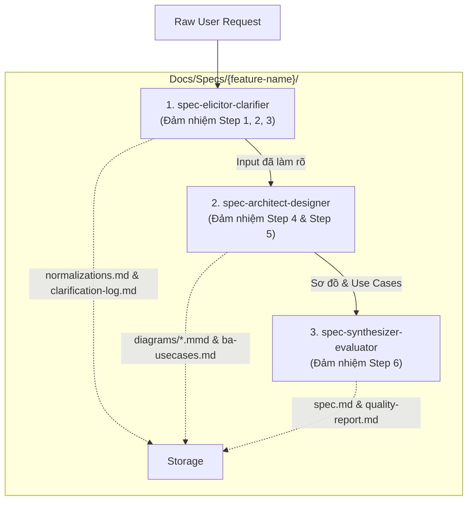

Nhận xét của bạn **hoàn toàn chính xác**! Đây là một điểm thiếu sót trong luồng tự động đánh giá phân rã ở giai đoạn đầu của Pipeline.

---

## 1. Nguyên nhân Gốc (Root Cause)

> [!WARNING]
> Tại **Stage -1 (`ba-analyst`)**, hệ thống đã tính toán chỉ số độ phức tạp `scs_complexity_score: 0.65` và tự động đánh dấu `decomposition_recommended: false`. 
> 
> Do đó, các subagent ở các giai đoạn tiếp theo (Stage 1 Architect & Stage 3 Builder) đã thiết kế và đóng gói toàn bộ quy trình 6 bước vào **một Skill đơn lẻ duy nhất (`SKILL.md`)** thay vì phân rã thành một **Bộ Micro Skill Suite**.

---

## 2. Tại sao quy trình này BẮT BUỘC nên là một Bộ Micro Skills?

Quy trình thiết kế Feature Spec 6 bước có phạm vi công việc và tri thức rất rộng:
1. **Step 1 & Step 2**: Chuẩn hóa Yêu cầu vs Context (`spec-elicitor`)
2. **Step 3**: Tương tác làm rõ & Sinh câu hỏi trắc nghiệm options (`spec-clarifier`)
3. **Step 4**: Phân tích nghiệp vụ BA, Use Cases & Gherkin (`spec-ba-analyzer`)
4. **Step 5**: Thiết kế kiến trúc, Sub-modules & Mermaid Diagrams Isolation (`spec-architect`)
5. **Step 6**: Tổng hợp Final Spec & Đánh giá Quality Gate theo `standards.md` (`spec-evaluator`)

Việc gom tất cả vào **1 Skill đơn lẻ** khiến:
- File `SKILL.md` bị ôm đồm quá nhiều trách nhiệm (vi phạm *Single Responsibility Principle*).
- LLM bị lãng phí Token Context khi phải nạp toàn bộ tri thức của cả 6 bước dù đang chỉ ở Step 1 hoặc Step 3.

---

## 3. Phương án Phân rã thành Bộ Micro Skill Suite (Proposed Micro Skill Suite)

Để đưa kết quả về đúng mô hình **Micro Skill Suite** chuẩn của hệ thống, chúng ta có thể phân rã thành **Bộ 3 Micro Skills chuyên biệt** (hoặc 4 Micro Skills) như sau:

### Bộ Micro Skills Đề xuất:

1. **`spec-elicitor-clarifier`** (Micro Skill 1):
   - **Nhiệm vụ**: Đảm nhiệm Step 1, Step 2, Step 3 (Input Analysis, Normalization Requirements vs Context, Interactive Clarification với 3-5 options trắc nghiệm + 300s Timeout Fallback).
   - **Output**: `normalizations.md` và `clarification-log.md`.

2. **`spec-architect-designer`** (Micro Skill 2):
   - **Nhiệm vụ**: Đảm nhiệm Step 4 & Step 5 (Phân rã Use Cases, NFRs, BDD Gherkin, Kiến trúc Sub-modules 5.1-5.2 và vẽ sơ đồ Mermaid 5.3 cô lập tại `diagrams/`).
   - **Output**: `diagrams/sequence.mmd`, `diagrams/flowchart.mmd`, `diagrams/erd.mmd`.

3. **`spec-synthesizer-evaluator`** (Micro Skill 3):
   - **Nhiệm vụ**: Đảm nhiệm Step 6 (Hợp nhất Final Feature Spec tại `spec.md`, chạy script `spec-validator.py` và chấm điểm Quality Score theo `standards.md`).
   - **Output**: `spec.md` và `quality-report.md`.

---

## 4. Hành động Tiếp theo

> [!TIP]
> Bạn có muốn tôi tái cấu trúc (refactor) kết quả hiện tại thành **Bộ Micro Skill Suite** gồm 3 micro-skills chuyên biệt (`spec-elicitor-clarifier`, `spec-architect-designer`, `spec-synthesizer-evaluator`) đặt trong thư mục `.agents/skills/` không?