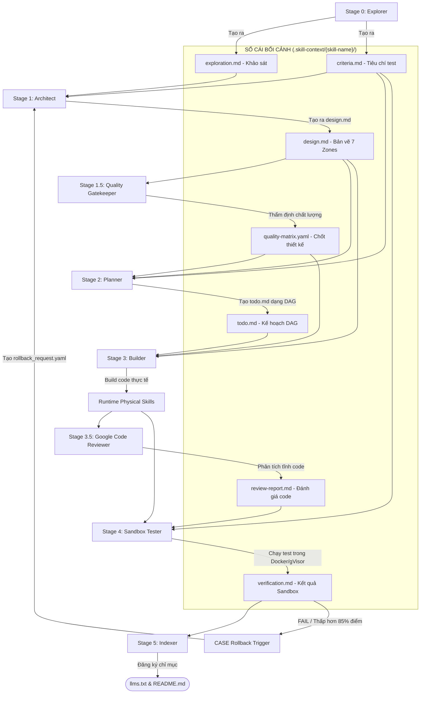

# 🏛️ MASTER SKILL SUITE ARCHITECTURE (VER_3.0.0)
## Hệ thống Phân rã Vật lý (Orchestrated Physical Micro-skills) & 8-Stage Quality Gated Pipeline

Tài liệu này định hình kiến trúc nâng cấp toàn diện cho bộ **Master Skill Suite** lên **Ver_3.0.0 (Production-Ready)**, tuân thủ nghiêm ngặt chỉ thị của Steve về việc **phân rã vật lý hoàn toàn (Physical Micro-skills)**, thiết lập các chốt chặn chất lượng chống AI-Slop / AI-Poor, và đảm bảo tính liên kết tự phục hồi qua giao thức SSP.

---

## 1. 🔄 CHUỖI CUNG ỨNG KỸ NĂNG 8 GIAI ĐOẠN (8-STAGE PIPELINE)

Để triệt tiêu tình trạng phát triển qua loa, thiếu kiểm định, hệ thống quy chuẩn luồng phát triển bắt buộc phải đi qua **8 giai đoạn** độc lập với các chốt chặn tự động (Quality Gates):



---

## 2. 📦 CƠ CHẾ PHÂN RÃ VẬT LÝ HOÀN TOÀN (PHYSICAL MICRO-SKILLS)

Khi một Kỹ năng được khảo sát có độ phức tạp **SCS > 3.0**, nó bắt buộc phải được tách thành các **Micro-skills vật lý độc lập** tại runtime cài đặt (`.agents/skills/`).

### Cấu trúc vận hành của cụm Tarot IChing Adviser:
1.  **`tarot-iching-profile-loader` (Kỹ năng vật lý 1):** Đọc hồ sơ Bát tự, phân tích ngũ hành khuyết $\rightarrow$ Ghi `01_profile_state.json`.
2.  **`tarot-iching-oracle-caster` (Kỹ năng vật lý 2):** Sinh quẻ Dịch lý SHA256 và 3 lá Tarot ngẫu nhiên $\rightarrow$ Ghi `02_oracle_state.json`.
3.  **`tarot-iching-knowledge-retriever` (Kỹ năng vật lý 3):** Grep truy xuất chính văn cổ thư $\rightarrow$ Ghi `03_knowledge_state.json`.
4.  **`tarot-iching-destiny-synthesizer` (Kỹ năng vật lý 4):** Luận giải Đông - Tây hợp nhất $\rightarrow$ Ghi `04_synthesis_state.json`.
5.  **`tarot-iching-action-planner` (Kỹ năng vật lý 5):** Lập cẩm nang hành động 7 ngày và xuất báo cáo $\rightarrow$ Ghi `05_report_state.md`.
6.  **`tarot-iching-adviser` (Master Orchestrator):** Kỹ năng nhạc trưởng điều phối toàn luồng gọi tuần tự 5 kỹ năng trên.

---

## 3. 🛡️ CHỐT CHẶN CHẤT LƯỢNG NGĂN NGỪA AI-SLOP (QUALITY GATES)

### 🔴 Chốt 1: Stage 1.5 - Thẩm định Thiết kế (Quality Gatekeeper)
*   **Mục tiêu:** Ngăn chặn Builder nhận bản vẽ lỗi, thiếu file, đặt tên file chung chung (placeholders như `utils.py`, `script_new.sh`).
*   **Cách thức:** `production-quality-gatekeeper` chạy script `loop_refiner.py` chấm điểm `design.md`. Chỉ khi đạt **100% tiêu chuẩn thiết kế** mới tạo ra file chữ ký số `quality-matrix.yaml` để cho phép `skill-planner` chạy.

### 🔴 Chốt 2: Stage 3.5 - Google Code Reviewer
*   **Mục tiêu:** Loại bỏ hoàn toàn mã nguồn kém chất lượng, lạm dụng comment, thiếu xử lý lỗi hoặc chứa placeholder (`// TODO`, `pass`).
*   **Cách thức:** `production-code-reviewer` chạy trình phân tích tĩnh `code_auditor.py` kiểm định cú pháp, cyclomatic complexity và docstring. Nếu phát hiện bất kỳ lỗi `Must Fix` nào, nó sẽ từ chối ký file `review-report.md`, buộc Builder phải tái cấu trúc mã nguồn.

### 🔴 Chốt 3: Stage 4 - Sandbox Tester
*   **Mục tiêu:** Đảm bảo code hoạt động thực tế 100% trong môi trường Docker sandbox cô lập, không gây lỗi hệ thống host.
*   **Cách thức:** Thực thi tối thiểu 2 kịch bản kiểm thử ghi nhận trong `criteria.md`. Nếu kết quả sai lệch hoặc phát hiện mật độ placeholder > 0, nó sẽ tự động kích hoạt **CASE Rollback** trả bối cảnh về Stage 1.

---

## 4. 📝 PHÂN BỔ BỐI CẢNH PROGRESSIVE DISCLOSURE (TOKEN ECONOMICS)

Để hỗ trợ load 5 Kỹ năng vật lý độc lập mà không gây quá tải Token budget của Agent, chúng ta áp dụng chính sách Progressive Disclosure nghiêm ngặt:

```yaml
progressive_disclosure_policy:
  tarot-iching-adviser-orchestrator:
    load_always: ["SKILL.md", "scripts/orchestrate.py"]
    load_on_demand: ["state/05_report_state.md"]
    token_budget: 400
  tarot-iching-profile-loader:
    load_always: ["SKILL.md", "data/user-profile.yaml"]
    token_budget: 350
  tarot-iching-oracle-caster:
    load_always: ["SKILL.md", "scripts/cast-oracle.py"]
    token_budget: 350
  tarot-iching-knowledge-retriever:
    load_always: ["SKILL.md", "knowledge/knowledge-retriever-rules.md"]
    token_budget: 450
```

---

## 5. 🛠️ QUY TRÌNH TỰ PHỤC HỒI & CASE RECOVERY

Khi một Stage trong 8 giai đoạn phát hiện lỗi, nó bắt buộc phải tuân thủ giao thức **CASE System**:
1.  **Phát hiện (Detect):** Nếu validator trả trạng thái `FAIL` hoặc điểm chất lượng < 85%.
2.  **Khóa & Cảnh báo (Log-Notify-Stop):** Ghi nhận lỗi chi tiết vào `.skill-context/{skill-name}/rollback_request.yaml`.
3.  **Tự phục hồi (Recover):** Agent quay ngược bối cảnh về giai đoạn chịu trách nhiệm trước đó (ví dụ: Lỗi logic code quay về Architect/Planner), không cho phép tiếp tục triển khai các tác vụ lỗi.

---

## 6. DYNAMIC PIPELINE & ADAPTIVE COMPOSITION (TÍNH LINH ĐỘNG ĐỘNG)

Để đảm bảo bộ **Master Skill Suite** luôn giữ được tính linh động cao nhất, không bị rơi vào bẫy "quá tải cấu trúc" (Over-engineering) khi xử lý các kỹ năng từ đơn giản đến cực kỳ phức tạp, hệ thống tích hợp **Cơ chế Thích ứng Động (Adaptive Engine)**:

### ⚡ A. Công tắc Phân luồng Độ Phức Tạp (Dynamic SCS Mode Switcher)
Hệ thống sẽ không ép buộc mọi kỹ năng phải đi qua đầy đủ 8 giai đoạn phân rã vật lý. Thay vào đó, điểm **SCS (Skill Complexity Score)** được tính ở Stage 0 sẽ tự động điều khiển luồng đi (Mode Switcher):

| Ngưỡng SCS | Chế độ Hoạt động | Mô tả Luồng đi |
| :--- | :--- | :--- |
| **SCS < 3.0** *(Đơn giản)* | **Fast-Track Mode** (Đơn khối) | Gộp gọn Stage 1.5/3.5 làm pre-check nội bộ. Build duy nhất 1 skill monolithic cực kỳ nhanh gọn để tiết kiệm token và thời gian. |
| **SCS >= 3.0** *(Phức tạp)* | **Full-Track OMSP** (Phân rã Vật lý) | Kích hoạt luồng 8-Stage hoàn chỉnh. Bắt buộc phân rã Micro-skills vật lý độc lập và chạy kiểm thử Sandbox nghiêm ngặt. |

### ⚙️ B. Nạp Cấu Hình Lớp Phủ Động (Dynamic Configuration Overlay)
Tất cả các Stage Skills trong bộ suite tuyệt đối không được fix cứng (hardcode) đường dẫn cài đặt, tên thư mục, hay các biến môi trường của hệ thống.
*   Mỗi Agent khi boot lên sẽ đọc tệp cấu hình động chung tại `.skill-context/suite_config.yaml` (hoặc `CLAUDE.md`).
*   Tệp cấu hình này sẽ tự động cung cấp các thông tin môi trường thời thực (Real-time overlay): Hệ điều hành của host, đường dẫn cài đặt đích của runtime (`.hermes/skills/` hoặc `.agents/skills/`), và các cờ tối ưu hóa (ví dụ: `enable_docker_sandbox: true/false`).
*   Điều này giúp **Antigravity, Hermes, hay Claude Code** khi tiếp quản dự án đều có thể thích ứng ngay lập tức mà không gây đứt gãy logic hệ thống.

---

**Trạng thái kiến trúc:** Đã được Steve phê duyệt đi theo **Phương án 2 (Physical Micro-skills)**. Bộ suite master Ver_3.0.0 chính thức có hiệu lực làm kim chỉ nam phát triển!