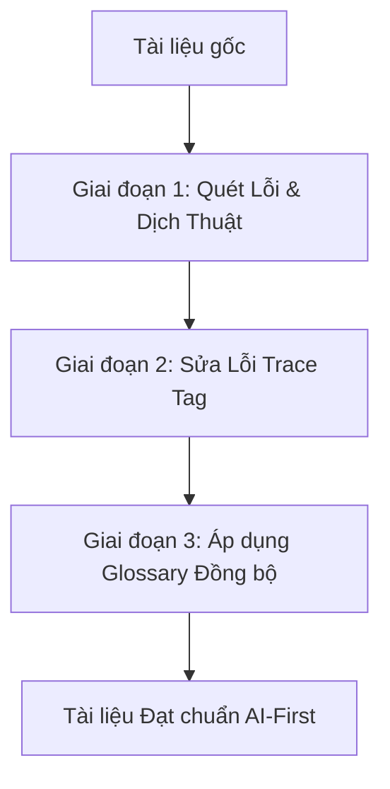

# Quy trình Tinh chỉnh Tài liệu Tri thức (Knowledge Refinement Workflow)

Tài liệu này ghi lại quy trình chuẩn hóa và tinh chỉnh chất lượng tài liệu trong Zone L1 (Knowledge), cụ thể là bộ tài liệu so sánh hệ thống `knowledge/experience/so_sanh_voi_suite/` nhằm mục tiêu chuẩn hóa cấu trúc, ngôn ngữ và thuật ngữ thân thiện với AI.

---

## 1. Thiết kế Quy trình (Three-Stage Refinement Pipeline)

### Giai đoạn 1: Quét Lỗi Chính Tả & Dịch Thuật (Localization & Spelling)
- **Mục tiêu**: Loại bỏ toàn bộ các ký tự ngoại lai không đúng ngữ cảnh (như chữ Trung Quốc) và sửa lỗi gõ dấu tiếng Việt.
- **Các lỗi thường gặp**:
  - Thiếu dấu hoặc sai dấu: `chính minh` (chính mình), `canh cảnh` (giám sát), `Tùy et` (tuyến tính).
  - Viết dính chữ: `NhậpLiệu` (Nhập Liệu), `PhânQuyền` (Phân Quyền).
  - Ký tự ngoại lai: `User提供原始需求` (User cung cấp yêu cầu thô).

### Giai đoạn 2: Khắc phục Lỗi Thẻ Truy Vết (Trace Tag Fixes)
- **Mục tiêu**: Đảm bảo tất cả các thẻ trace tag khớp chính xác với regex của `trace_validator.py`.
- **4 định dạng được chấp nhận**:
  1. `[TỪ DESIGN §N]` (Regex: `^\[TỪ DESIGN §[0-9]+(\.[0-9]+)?\]$`)
  2. `[GỢI Ý BỔ SUNG]`
  3. `[CẦN LÀM RÕ]`
  4. `[TỪ AUDIT TÀI NGUYÊN]`
- **Các lỗi đã sửa**: `[CẦN LÀM RỌ]`, `[CẦN LÀM RÓ]` $\rightarrow$ `[CẦN LÀM RÕ]`.

### Giai đoạn 3: Nhúng Glossary Chuẩn Hóa (Glossary Standardization)
- **Mục tiêu**: Nhúng một bảng thuật ngữ gồm 23 từ khóa cốt lõi của ngành công nghệ thông tin xuất hiện trong 7 chiều so sánh ở cuối mỗi tệp tin để AI agent có thể đối chiếu chính xác.

---

## 2. Danh sách 7 Tệp tin Đã Tinh chỉnh

Các tệp tin sau trong thư mục `knowledge/experience/so_sanh_voi_suite/` đã được cập nhật thành công:
1. `dimension-1-kien-truc-va-layering.md`
2. `dimension-2-pipeline-workflow-pattern.md`
3. `dimension-3-quality-gates-validation.md`
4. `dimension-4-rollback-error-recovery.md`
5. `dimension-5-human-in-the-loop-governance.md`
6. `dimension-6-security-testing.md`
7. `dimension-7-skill-portability-reusability.md`

---

## 3. Glossary Tiêu chuẩn (23 Thuật ngữ)

| Thuật ngữ | Giải thích |
|------------|-------------|
| **Pipeline** | Đường ống xử lý - chuỗi các giai đoạn xử lý công việc theo thứ tự tuyến tính hoặc tuần tự. |
| **Layering** | Phân lớp - kiến trúc tổ chức mã nguồn hoặc tri thức theo chiều dọc để đảm bảo tính độc lập và dễ bảo trì. |
| **Gate** | Cổng kiểm tra - điểm checkpoint kiểm soát chất lượng nơi các sản phẩm đầu ra (artifacts) được thẩm định. |
| **Rollback** | Quay lui - cơ chế tự động hoặc thủ công để phục hồi trạng thái làm việc về một phase ổn định trước đó khi xảy ra sự cố. |
| **Checkpoint** | Điểm kiểm tra - trạng thái công việc được lưu lại để có thể tiếp tục (resume) mà không phải làm lại từ đầu. |
| **Staleness** | Lỗi thời - trạng thái khi checkpoint quá cũ (ví dụ: > 7 ngày) đòi hỏi phải cảnh báo hoặc chạy lại explorer. |
| **Handoff** | Chuyển giao - quá trình bàn giao các artifacts đạt chuẩn từ stage này sang stage kế tiếp. |
| **Feedback Loop** | Vòng phản hồi - cơ chế đẩy thông tin lỗi hoặc đề xuất ngược về các stage trước để tự động điều chỉnh. |
| **CASE System** | Hệ thống CASE - cơ chế quản lý chất lượng toàn diện của ver-3 suite dựa trên 3 trụ cột: PREVENT $\rightarrow$ DETECT $\rightarrow$ RECOVER. |
| **Progressive Disclosure** | Tiết lộ lũy tiến - cơ chế nạp bối cảnh/tri thức theo từng tầng (Tiers) trên cơ sở nhu cầu thực tế của task để tối ưu hóa context window và token. |
| **Trace Tag** | Thẻ truy vết - thẻ dạng như `[TỪ DESIGN §N]` dùng để đối chiếu ngược mọi tác vụ lập trình về nguồn gốc thiết kế ban đầu. |
| **Ambiguity** | Sự mơ hồ - các điểm chưa rõ ràng hoặc mâu thuẫn trong yêu cầu nghiệp vụ cần được phát hiện và giải quyết triệt để. |
| **Sandbox** | Môi trường cô lập (Hộp cát) - môi trường thực thi mã độc lập và an toàn (như Docker/gVisor) để kiểm thử sản phẩm. |
| **Rule Hierarchy** | Phân cấp Luật - thứ tự ưu tiên áp dụng các tệp quy định trong hệ thống khi có xung đột (ví dụ: `.mdc` > `agents/` > `skills/`). |
| **Self-refinement** | Tự tinh chỉnh - cơ chế AI tự chạy vòng lặp đánh giá lỗi dựa trên critic engine và tự sửa đổi code cho đến khi đạt chuẩn. |
| **E2E Testing** | Kiểm thử đầu-cuối - quy trình chạy kiểm thử tự động giả làm người dùng thật trên toàn bộ hệ thống từ UI đến DB (như Playwright). |
| **Flaky Test** | Kiểm thử không ổn định - các ca kiểm thử lúc Pass lúc Fail không nhất quán dù không có sự thay đổi nào về mã nguồn hay môi trường. |
| **Orchestration** | Phối hợp quy trình (Đạo diễn) - cơ chế điều phối trung tâm để quản lý vòng đời, trạng thái và sự chuyển giao giữa các tác nhân. |
| **Governance** | Quản trị - cơ chế kiểm soát, phân quyền và phê duyệt tiến trình (đặc biệt là các cổng phê duyệt bắt buộc của con người - Human-in-the-Loop). |
| **Acceptance Criteria** | Tiêu chí nghiệm thu - các điều kiện bắt buộc phải thỏa mãn để một tính năng được coi là hoàn thành hoàn chỉnh. |
| **Portability** | Tính di động - khả năng chuyển đổi hoặc chạy một gói skill trên nhiều môi trường agent runtime khác nhau mà không cần sửa đổi cấu trúc. |
| **Reusability** | Tính tái sử dụng - khả năng sử dụng lại một skill hoặc module cho nhiều dự án khác nhau một cách độc lập. |
| **DoD (Definition of Done)** | Định nghĩa Hoàn thành - danh sách kiểm tra (checklist) tiêu chí chất lượng nghiêm ngặt cho mỗi phase trước khi bàn giao. |
