# Hermes-Native Skill Suite v3.0 — Architecture Design

> **Ngày:** 2026-05-09
> **Phiên bản:** 3.0
> **Tác giả:** Steve Void Team
> **Trạng thái:** Final Draft

---

## Tóm tắt Executive

Tài liệu này trình bày kiến trúc tổng thể của **Hermes-Native Skill Suite v3.0** — hệ thống xây dựng skill bài bản cho nền tảng Hermes. Kiến trúc gồm 4 thành phần chính: **Architect**, **Planner**, **Builder**, và **Validator**, hoạt động theo pipeline 3 giai đoạn với data flow rõ ràng.

**Các cải tiến chính so với v2.x:**
- Hỗ trợ multi-platform (Hermes + Claude) với Hermes là default
- YAML frontmatter là contract chính thức (thay thế Markdown table)
- 6 operation types: `create_new`, `patch_existing`, `refactor_existing`, `migrate_platform`, `consolidate_skills`, `deprecate_skill`
- Platform detection tự động dựa trên environment
- Hermes-native path conventions với `.hermes/skills/`

---

## 1. Component Architecture

### 1.1 Tổng quan 4 Component

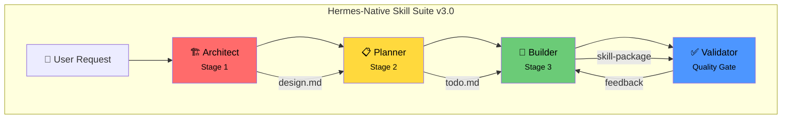

### 1.2 Chi tiết từng Component

#### 1.2.1 Architect (Stage 1)

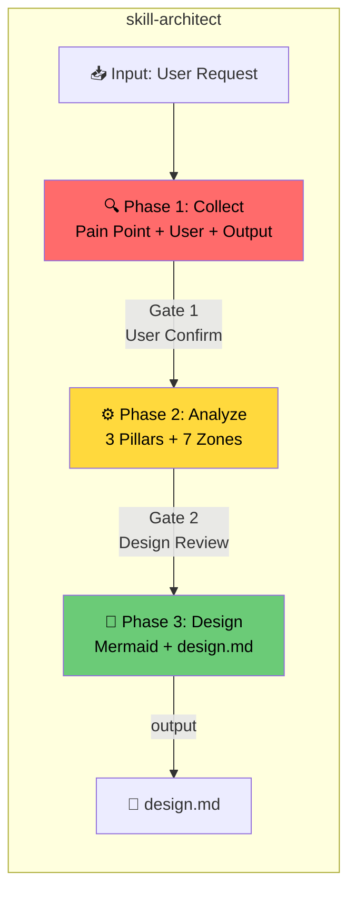

**Vai trò:** Senior Design Architect — phân tích yêu cầu, thiết kế kiến trúc skill.

**Input bắt buộc:**
- `platform_target`: `hermes` | `claude` | `both` (default: `both`)
- `operation_type`: `create_new` | `patch_existing` | `refactor_existing` | `migrate_platform` | `consolidate_skills` | `deprecate_skill`
- `execution_mode`: `lightweight` | `standard` | `strict`

**Output:** `design.md` với YAML frontmatter + 10+ sections (§1-§12)

---

#### 1.2.2 Planner (Stage 2)

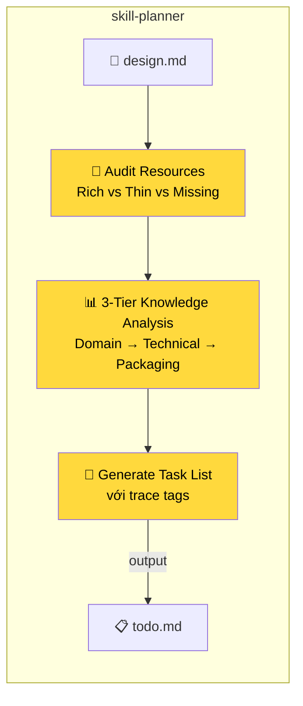

**Vai trò:** Senior Skill Planner — đọc design.md, phân tích kiến thức cần thiết, tạo kế hoạch triển khai.

**6 Sections bắt buộc:**
```markdown
## 1. Pre-requisites
## 2. Phase Breakdown
## 3. Knowledge & Resources Needed
## 4. Definition of Done
## 5. Notes
## 6. Builder Feedback Integration
```

**Output:** `todo.md` với YAML frontmatter + phase breakdown

---

#### 1.2.3 Builder (Stage 3)

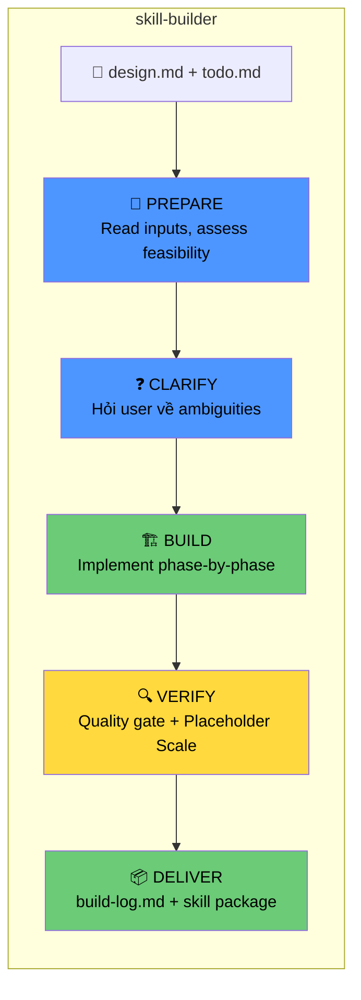

**Placeholder Scale:**
- `<5 placeholders` ✅ Pass
- `5-9 placeholders` ⚠️ Warning
- `≥10 placeholders` ❌ Fail

---

#### 1.2.4 Validator (Quality Gate)

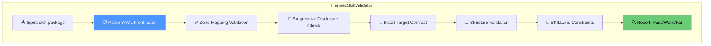

---

## 2. Data Flow Diagrams

### 2.1 Pipeline Data Flow

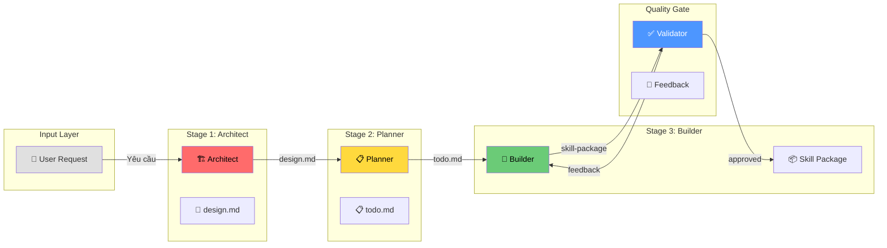

### 2.2 design.md → todo.md → skill-package Flow

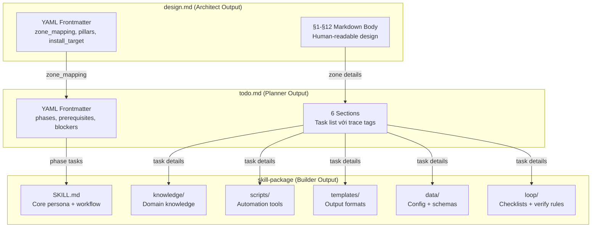

### 2.3 Contract Handoff giữa các Stage

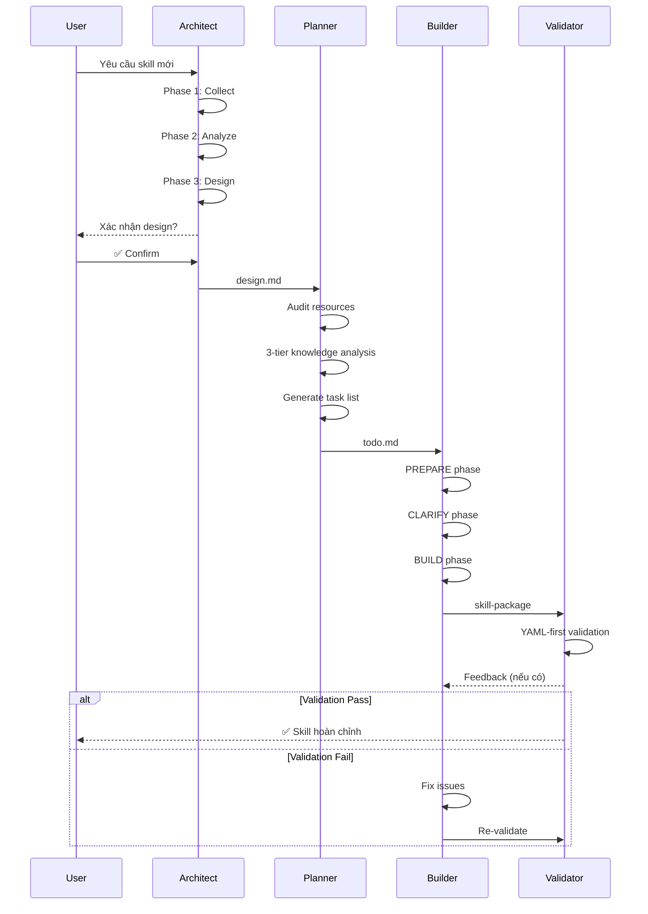

---

## 3. Platform Detection Flow

### 3.1 Platform Detection Algorithm

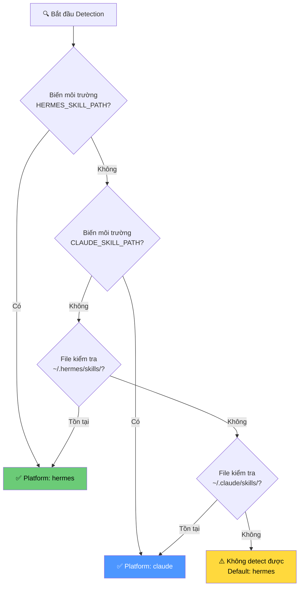

### 3.2 install_target Resolution Priority

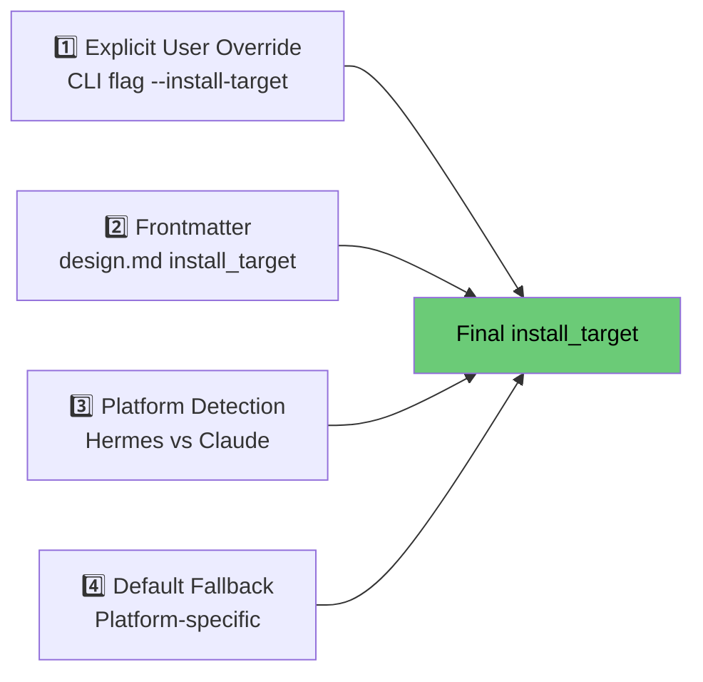

### 3.3 Platform vs Scope Matrix

| Platform | Scope | Target Path |
|----------|-------|-------------|
| **hermes** | user-local | `~/.hermes/skills/{category}/{skill-name}/` |
| **hermes** | repo | `{repo}/skills/{category}/{skill-name}/` |
| **hermes** | project-local | `{project}/.hermes/skills/{skill-name}/` |
| **claude** | user-local | `~/.claude/skills/{skill-name}/` |
| **both** | user-local | `~/.hermes/skills/...` (preferred) |

---

## 4. Hermes-Native Path Conventions

### 4.1 Directory Structure

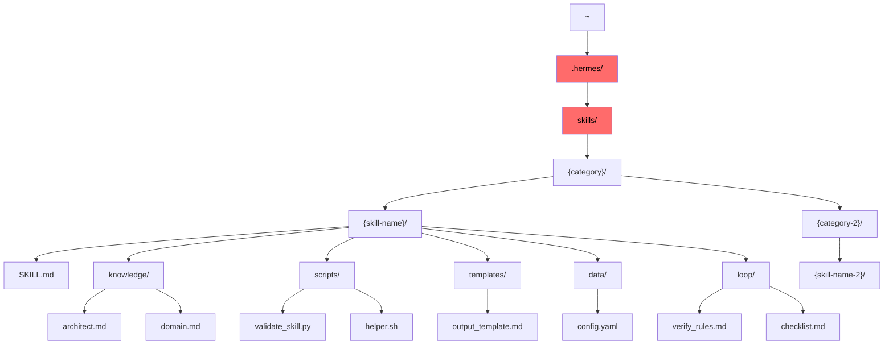

### 4.2 Hermes Skill Package Template

```
{skill-name}/
├── SKILL.md                    # Zone: core (mandatory, tier 1)
├── knowledge/
│   ├── architect.md            # Zone: knowledge (tier 2)
│   └── {domain-specific}.md    # Zone: knowledge
├── scripts/
│   ├── validate_skill.py       # Validation script
│   └── {helper-scripts}.sh     # Automation tools
├── templates/
│   └── {output-template}.md    # Output format templates
├── data/
│   └── config.yaml             # Configuration + schemas
└── loop/
    ├── verify_rules.md         # Verification rules
    └── checklist.md            # Phase checklists
```

### 4.3 Naming Conventions

| Element | Convention | Ví dụ |
|---------|------------|-------|
| Skill name | kebab-case | `session-learner`, `spec-generator` |
| Category | kebab-case | `mobile`, `web`, `thread` |
| Zone directories | snake_case | `knowledge/`, `scripts/` |
| Files | kebab-case hoặc snake_case | `SKILL.md`, `validate_skill.py` |
| Frontmatter fields | snake_case | `platform_target`, `install_target` |

---

## 5. Operation Types & Adaptive Workflows

### 5.1 Operation Types Overview

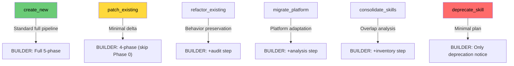

### 5.2 Execution Modes

| Mode | Gates | Behavior |
|------|-------|----------|
| **lightweight** | Không có gate | Tự động proceed |
| **standard** | Confirm sau mỗi phase | User interaction |
| **strict** | Full review + signoff | Formal approval |

---

## 6. YAML Frontmatter Contract

### 6.1 design.md Frontmatter Schema

```yaml
---
name: {skill-name}
version: "1.0.0"
status: in-progress | complete | deprecated

# Operation context
platform_target: hermes | claude | both
operation_type: create_new | patch_existing | refactor_existing | migrate_platform | consolidate_skills | deprecate_skill
execution_mode: lightweight | standard | strict

# Install target
install_target:
  platform: hermes | claude | both
  scope: user-local | repo | project-local
  path: ~/.hermes/skills/{category}/{skill-name}/

# Zone Mapping (machine-readable contract)
zone_mapping:
  - zone: core
    files:
      - path: SKILL.md
        tier: 1
        mandatory: true
        content_summary: "Persona, phases, guardrails"

# 3 Pillars Analysis
pillars:
  knowledge:
    domains: [list]
    gaps: [list]
  process:
    phases: [list]
    branches: [list]
  guardrails:
    risks: [list]
    mitigations: [list]

# Progressive Disclosure
progressive_disclosure:
  tier1:
    - SKILL.md
    - ../_shared/knowledge/framework.md

# Metadata
metadata:
  author: Steve Void Team
  date_created: YYYY-MM-DD
  date_modified: YYYY-MM-DD
---
```

### 6.2 todo.md Frontmatter Schema

```yaml
---
name: {skill-name}
version: "1.0.0"
date_created: YYYY-MM-DD
status: draft | complete | in-progress

operation_type: create_new
execution_mode: standard

phases:
  - id: 0
    name: Resource Preparation
    tasks:
      - id: "0.1"
        description: "Task description"
        priority: critical | high | medium | low
        estimated_hours: 4-8
        trace: "[TỪ AUDIT TÀI NGUYÊN]"
        dependencies: []
        status: pending | in-progress | done

prerequisites:
  - tier: domain
    topic: "Topic name"
    resource_path: "resources/topic.md"
    status: rich | thin | missing

blockers:
  - id: "B1"
    description: "Blocker description"
    resolved: false

traceability:
  task_to_design:
    "0.1": ["§3 Zone Mapping"]
---
```

---

## 7. Validator Architecture

### 7.1 HermesSkillValidator Flow

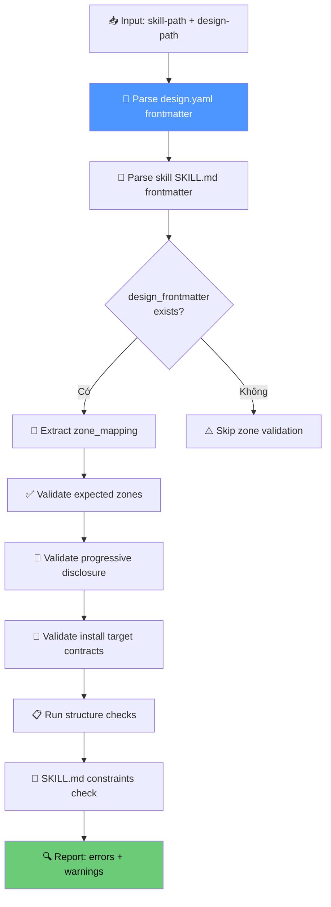

### 7.2 Validation Rules Priority

1. **YAML Frontmatter** (canonical contract) — parse trước
2. **Zone Mapping** — check expected files exist
3. **Progressive Disclosure** — tier1 files load at boot
4. **Install Target Contract** — path resolution validation
5. **SKILL.md Constraints** — persona, phases, guardrails presence
6. **Structure Validation** — directory + file naming

---

## 8. Complete System Diagram

### 8.1 Full Pipeline v3.0

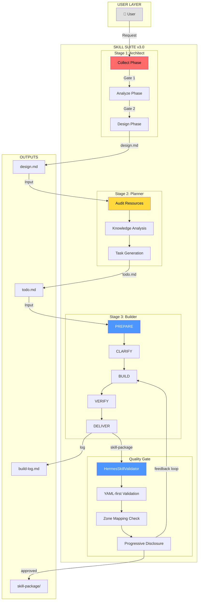

---

## 9. Hermes-Path Resolution Context

### 9.1 Environment Variables

| Variable | Mặc định | Mô tả |
|----------|-----------|-------|
| `HERMES_SKILL_PATH` | `~/.hermes/skills/` | Base path cho Hermes skills |
| `HERMES_SKILL_CATEGORY` | `{auto-detect}` | Category của skill đang active |
| `HERMES_CONFIG_PATH` | `~/.hermes/config/` | Config directory |

### 9.2 Shared Framework Location

```
_shared/
└── knowledge/
    └── framework.md    # Single source of truth cho cả bộ skill suite
```

**Framework chứa:**
- 7 Zones Structure
- Pipeline Flow & Handoff Contracts
- Naming Conventions (kebab-case)
- Anti-Hallucination Rules
- Quality Gates

---

## 10. Error Handling & Rollback

### 10.1 Per-Stage Error Handling

| Stage | On Failure | Retry | Continue? |
|-------|-----------|:-----:|----------|
| Architect | Abort | 2 | ❌ No |
| Planner | Abort | 2 | ❌ No |
| Builder (all fail) | Abort | 2 | ❌ No |
| Builder (partial) | Warning | 1 | ✅ Yes |
| Validator | Warning | 1 | ✅ Yes |

### 10.2 Rollback Procedures

**Phase 0 Rollback (Operation Context):**
```
Trigger: User muốn thay đổi platform_target, operation_type, hoặc execution_mode

Rollback Steps:
1. Reset § Metadata (operation context fields)
2. Quay lại Phase 1: Collect — thu thập lại operation context
```

**Stage Rollback:**
```
Trigger: Error at any gate

Steps:
1. Log error details vào build-log.md
2. Restore previous state (design.md hoặc todo.md)
3. Notify user với error summary
4. Chờ user instruction
```

---

## 11. Refinement Loop

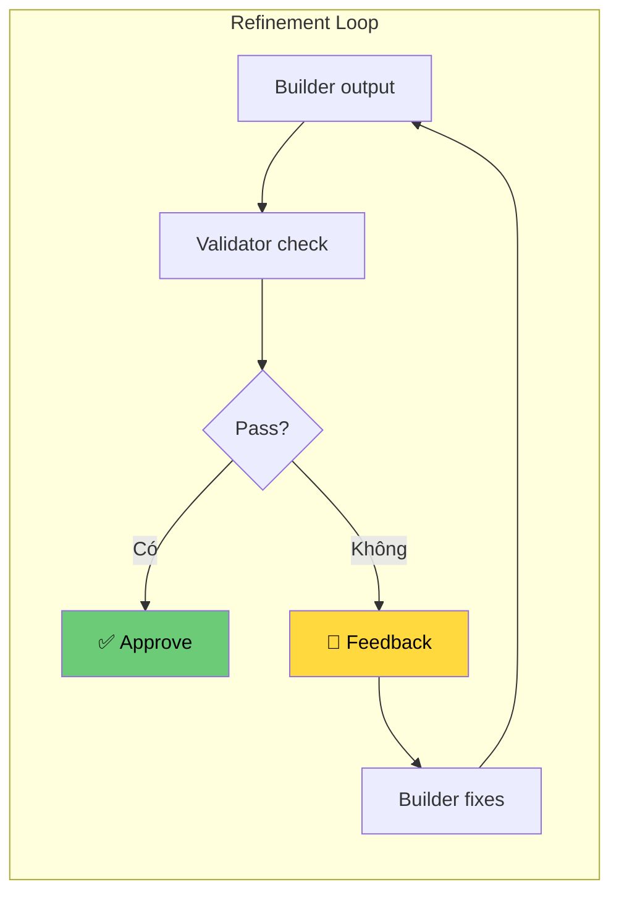

**Refinement triggers:**
- Placeholder count ≥ 10
- Zone files missing
- Validation errors
- User feedback

---

## 12. Glossary

| Term | Định nghĩa |
|------|------------|
| **Zone** | Logical grouping của files trong skill package |
| **Tier** | Load priority cho progressive disclosure |
| **Contract** | YAML frontmatter là canonical agreement giữa stages |
| **Placeholder** | `[TODO]` hoặc `[PLACEHOLDER]` markers trong code |
| **Hermes-native** | Path conventions và tools riêng của Hermes platform |

---

## 13. Related Documents

- `docs/raw/ideas/skill-suite-improvement-raw-notes/2026-05-09-master-skill-suite-v3-upgrade-spec.vi.md`
- `docs/raw/AGENTS.md` — Agent Architecture Documentation
- `.skill-context/registry/README.md` — Skill Registry

---

*Document generated: 2026-05-09*
*Hermes-Native Skill Suite v3.0 Architecture*
