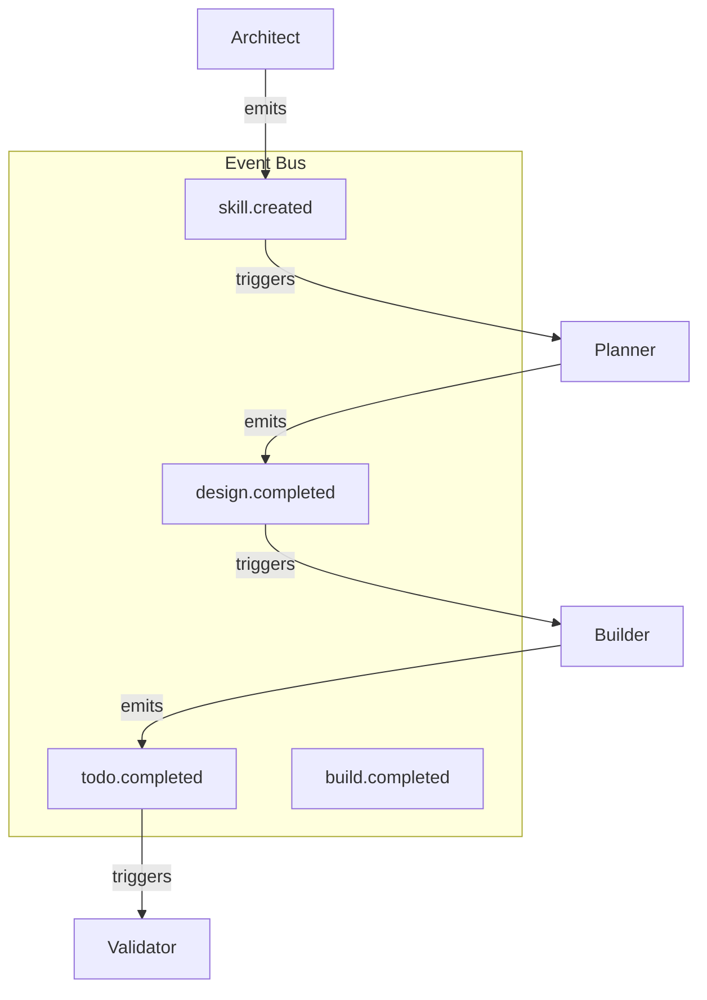
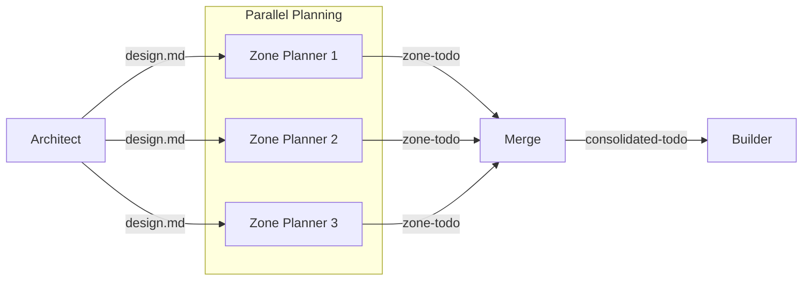
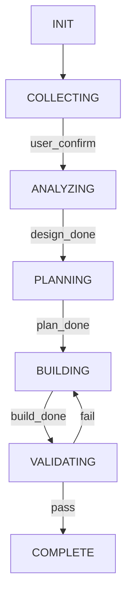

# Alternative Design Patterns — Skill Suite v3.0

> **Chain 4:** Alternative Approaches - What design patterns could work instead?
> **Date:** 2026-05-09
> **Status:** Analysis Document
> **Context:** If current design patterns fail, what are the alternatives?

---

## Tóm tắt

Tài liệu này phân tích các **design patterns thay thế** cho các patterns hiện tại của Skill Suite v3.0. Mỗi section trình bày pattern hiện tại, tại sao nó có thể thất bại, và các alternatives có thể.

---

## 1. Pipeline Architecture

### Current Pattern: Linear 3-Phase Pipeline

```
User Request → skill-architect → design.md
                            ↓
            skill-planner → todo.md
                            ↓
            skill-builder → skill-package
```

**Potential Failure Points:**
- Sequential dependency: Builder phải chờ Planner, Planner phải chờ Architect
- Single point of failure: Một stage fail thì toàn bộ pipeline dừng
- Inflexible: Không handle parallel work hoặc conditional flows

### Alternatives

#### Alternative 1.1: Event-Driven Architecture



**Pros:**
- Loose coupling giữa các stages
- Parallel processing possible
- Easy to add new consumers

**Cons:**
- Complexity in event ordering
- Debugging harder
- Event schema management needed

#### Alternative 1.2: Parallel Pipeline with Fan-out/Fan-in



**Pros:**
- Speed: Multiple zones planned in parallel
- Better scalability

**Cons:**
- Merge conflicts possible
- Zone interdependencies complex

#### Alternative 1.3: State Machine Pipeline



**Pros:**
- Clear state transitions
- Built-in rollback capability
- Explicit error handling

**Cons:**
- More boilerplate
- State explosion with branching

---

## 2. Contract Format

### Current Pattern: YAML Frontmatter

```yaml
---
name: skill-name
version: "1.0.0"
platform_target: hermes
zone_mapping:
  - zone: core
    files:
      - path: SKILL.md
---
```

**Potential Failure Points:**
- Parser differences between YAML libraries
- Schema evolution: Adding fields breaks old parsers
- Nested structures become unwieldy

### Alternatives

#### Alternative 2.1: JSON Schema + JSON

```json
{
  "$schema": "https://skill-schema.org/v3/design.json",
  "name": "skill-name",
  "version": "1.0.0",
  "platform": "hermes",
  "zones": [
    { "name": "core", "files": [{ "path": "SKILL.md" }] }
  ]
}
```

**Pros:**
- Stronger typing with JSON Schema
- Better tooling (VSCode, etc.)
- Standard validation

**Cons:**
- Less readable than YAML
- Brackets/braces fatigue

#### Alternative 2.2: TypeScript Interface Definitions

```typescript
interface SkillDesign {
  name: string;
  version: SemanticVersion;
  platform: 'hermes' | 'claude' | 'both';
  zones: Zone[];
  pillars: Pillars;
}

interface Zone {
  name: string;
  files: File[];
  tier: 1 | 2 | 3;
}
```

**Pros:**
- Type safety
- IDE autocomplete
- Generated documentation

**Cons:**
- Requires build step
- Overhead for simple cases

#### Alternative 2.3: Protocol Buffers (Binary)

```protobuf
message SkillDesign {
  string name = 1;
  string version = 2;
  Platform platform = 3;
  repeated Zone zones = 4;
}

message Zone {
  string name = 1;
  repeated File files = 2;
  int32 tier = 3;
}
```

**Pros:**
- Efficient binary format
- Strong schema evolution rules
- Cross-language support

**Cons:**
- Not human-readable
- Requires proto compiler

#### Alternative 2.4: Markdown-first with TOML metadata

```markdown
# Skill Name

**Version:** 1.0.0
**Platform:** hermes

## Zones

| Zone | Tier | Files |
|------|------|-------|
| core | 1 | SKILL.md |
| knowledge | 2 | knowledge/*.md |

<!-- METADATA -->
[zone-mapping]
core = { tier = 1, files = ["SKILL.md"] }
<!-- /METADATA -->
```

**Pros:**
- Markdown remains readable
- Metadata embedded where relevant
- Fallback for non-standard tools

**Cons:**
- Two formats to maintain
- Extraction logic needed

---

## 3. Operation Types

### Current Pattern: 6 Operation Types

| Operation | Description |
|-----------|-------------|
| create_new | Full 3-stage pipeline |
| patch_existing | Minimal delta |
| refactor_existing | Full + audit |
| migrate_platform | Platform adaptation |
| consolidate_skills | Overlap analysis |
| deprecate_skill | Minimal plan |

**Potential Failure Points:**
- Over-engineering: User chỉ muốn tạo skill mới, không cần 6 options
- Maintenance burden: Mỗi operation type cần unique workflow logic
- Ambiguous boundaries: Khi nào là patch vs refactor?

### Alternatives

#### Alternative 3.1: Simplified 3-Operation Model

| Operation | When to Use |
|-----------|-------------|
| **create** | Brand new skill |
| **update** | Modify existing (covers patch, refactor, migrate) |
| **remove** | Deprecate or delete |

**Pros:**
- Simple to understand
- Easy to implement
- Covers 90% of use cases

**Cons:**
- Loses semantic clarity
- Complex operations need parameters

#### Alternative 3.2: Operation + Modifiers

```
operation: create | update | delete
modifiers:
  - scope: full | partial | minimal
  - safety: audited | unchecked
  - target: single | multi
```

**Pros:**
- Flexible combination
- Explicit boundaries

**Cons:**
- More complex parsing
- Documentation burden

#### Alternative 3.3: Single Generic Operation with Flags

```yaml
operation:
  intent: create | modify | remove
  scope:
    zones: [all] | [specific zone names]
    depth: shallow | deep
  constraints:
    preserve_behavior: true | false
    backward_compatible: true | false
```

**Pros:**
- Maximum flexibility
- Fine-grained control

**Cons:**
- Complexity overload
- Hard to validate

---

## 4. Execution Modes

### Current Pattern: 3 Execution Modes

| Mode | Gates | Timeout |
|------|-------|---------|
| lightweight | None | 5 min |
| standard | Phase confirmations | 30 min |
| strict | Full review + signoff | 60 min |

**Potential Failure Points:**
- Mode selection is subjective: User không biết chọn mode nào
- Gates are blocking: Confirmation pauses break flow
- Timeout too rigid: Complex skills exceed limits

### Alternatives

#### Alternative 4.1: Continuous Integration Style

| Stage | Environment | Validation |
|-------|-------------|------------|
| **dev** | Local, fast | Lint only |
| **test** | Isolated | Unit tests |
| **staging** | Production-like | Full validation |
| **prod** | Production | Minimal gate |

**Pros:**
- Familiar metaphor
- Progressive validation
- Clear deployment pipeline

**Cons:**
- Overhead for simple tasks
- Multiple environments to maintain

#### Alternative 4.2: Risk-Based Levels

```yaml
risk_assessment:
  impact: low | medium | high | critical
  complexity: simple | moderate | complex
  automation_level: full | partial | manual

# Calculated validation requirements from risk
```

**Pros:**
- Appropriate validation for risk
- Data-driven decision

**Cons:**
- Risk assessment itself is error-prone
- Requires calibration

#### Alternative 4.3: Adaptive Gates

Instead of fixed modes, dynamically adjust validation based on:
- Number of placeholders in output
- Changes from previous version
- User history/track record
- File count/skill complexity

**Pros:**
- Proportionate validation
- No mode selection needed

**Cons:**
- Non-deterministic behavior
- Hard to explain to users

---

## 5. Zone Structure

### Current Pattern: 7 Zones

```
skill/
├── SKILL.md           # core
├── knowledge/         # knowledge
├── scripts/           # scripts
├── templates/         # templates
├── data/              # data
├── loop/              # loop
└── (shared/)          # shared (external reference)
```

**Potential Failure Points:**
- Over-organization: Không phải skill nào cũng cần tất cả zones
- Arbitrary boundaries: Script vs data vs template khó phân biệt
- Tier confusion: Tier 1 vs tier 2 không rõ ý nghĩa

### Alternatives

#### Alternative 5.1: Flat Structure with Manifest

```
skill/
├── manifest.yaml      # Single manifest defines all
├── src/               # All source files flat
└── tests/            # Co-located tests
```

**Pros:**
- Simple, no hierarchy
- Manifest is source of truth
- Flexible file organization

**Cons:**
- No convention enforcement
- Hard to discover structure

#### Alternative 5.2: Convention Over Configuration

```
skill/
├── SKILL.md           # Required, always here
├── *.md               # Any docs at root
├── [zone]*/           # Optional zones, if needed
│   ├── knowledge/
│   ├── scripts/
│   └── etc.
```

**Pros:**
- Only create what you need
- Clear defaults
- Flexible

**Cons:**
- Inconsistent structures
- Validation harder

#### Alternative 5.3: Feature-Based Modules

```
skill/
├── core/              # SKILL.md + persona
├── features/
│   ├── code-gen/      # Self-contained feature
│   ├── validation/   # Self-contained feature
│   └── api/          # Self-contained feature
└── shared/           # Cross-feature code
```

**Pros:**
- Cohesive feature units
- Independent development
- Clear dependencies

**Cons:**
- Overhead for simple skills
- Feature creep

---

## 6. Refinement Loop

### Current Pattern: 6-Step Loop

```
[1. OBSERVE] → [2. IDENTIFY] → [3. DECIDE] → [ACTION]
      ↑                                    ↓
[6. VERIFY] ← [5. DOCUMENT] ← [4. APPLY] ←
```

**Potential Failure Points:**
- Manual steps: OBSERVE và IDENTIFY require human input
- Long feedback cycle: Loop takes time to complete
- No automation: Không có self-healing

### Alternatives

#### Alternative 6.1: Continuous Deployment Model

```
┌─────────────────────────────────────────┐
│         CI/CD Pipeline                  │
│                                         │
│  Code → Build → Test -> Deploy -> Monitor│
│                            ↓            │
│                      Rollback if fail   │
└─────────────────────────────────────────┘
```

**Pros:**
- Fully automated
- Fast feedback
- Proven pattern

**Cons:**
- Requires stable test coverage
- Not all skills are deployable

#### Alternative 6.2: A/B Testing Feedback

```
Variant A ──▶ Metric Collection ──▶ Winner
Variant B ──▶                   ──▶ Next Experiment
```

**Pros:**
- Data-driven improvement
- User behavior insights
- Scientific approach

**Cons:**
- Requires traffic volume
- Long time to results
- Complex setup

#### Alternative 6.3: Real-Time Adaptation (Voyager-style)

```python
def execute_skill(skill, task):
    result = skill.execute(task)
    if not result.is_successful:
        # Generate fix automatically
        fix = llm.generate_fix(skill, result.error)
        skill.integrate(fix)
        return execute_skill(skill, task)  # Retry
    return result
```

**Pros:**
- Self-healing
- Automatic improvement
- Learns from failures

**Cons:**
- LLM quality varies
- Dangerous without safeguards

---

## 7. Platform Detection

### Current Pattern: Environment Variable → Path Check → Default

```python
1. HERMES_SKILL_PATH → hermes
2. CLAUDE_SKILL_PATH → claude
3. ~/.hermes/skills/ exists → hermes
4. ~/.claude/skills/ exists → claude
5. Default: hermes
```

**Potential Failure Points:**
- Ambiguous detection: User có cả hai paths
- Override confusion: Không rõ CLI flag vs frontmatter priority
- Path assumptions: Assumes home directory exists

### Alternatives

#### Alternative 7.1: Explicit Registration System

```yaml
# User registers skill location explicitly
registered_skills:
  - name: my-skill
    platform: hermes
    path: /custom/path/to/skill
    version: 1.0.0
```

**Pros:**
- No detection ambiguity
- User controls everything
- Supports custom paths

**Cons:**
- Registration overhead
- Stale registrations

#### Alternative 7.2: Plugin Architecture

```python
class PlatformPlugin(ABC):
    @abstractmethod
    def detect() -> Platform:
        pass
    
    @abstractmethod
    def install_target() -> Path:
        pass

# Discovered via entry points
plugins = discover_plugins('hermes_skills.platforms')
```

**Pros:**
- Extensible
- Testable
- Clear interface

**Cons:**
- Plugin management complexity
- Version conflicts

#### Alternative 7.3: Manifest-Based Detection

```yaml
# In skill's own manifest
platform: hermes
version: "1.0.0"
```

Detection: Read the manifest of target skill to determine platform.

**Pros:**
- Self-describing
- No global state
- Works with any path

**Cons:**
- Must read skill first
- Circular dependency possible

---

## 8. Validation Strategy

### Current Pattern: YAML-First + Schema Validation

```python
def validate_skill(skill_path, design_path=None):
    # 1. Parse YAML frontmatter FIRST
    design_frontmatter = parse_yaml_frontmatter(design_path)
    
    # 2. Extract canonical contract
    expected_zones = design_frontmatter.get('zone_mapping', {})
    
    # 3. Validate structure
    validator.check_structure()
    validator.check_skill_md_constraints()
    
    # 4. Frontmatter-based validation
    validator.validate_zone_mapping(expected_zones)
```

**Potential Failure Points:**
- Frontmatter becomes source of truth quá sớm
- Dual validation (frontmatter + body) conflicts
- Backward compatibility: Old skills without frontmatter

### Alternatives

#### Alternative 8.1: Schema-First with Code Generation

```python
# Generate validators from schema
from skill_schema import generate_validators

validators = generate_validators("skill-schema.json")

# Validate at parse time
skill = validators.parse_skill(skill_path)
```

**Pros:**
- Single source of truth
- Generated validation code
- Type-safe

**Cons:**
- Schema definition overhead
- Code generation step

#### Alternative 8.2: Layered Validation

```
Layer 1: Syntax (is valid YAML/Markdown?)
Layer 2: Structure (are required files present?)
Layer 3: Semantics (do contents make sense?)
Layer 4: Integration (does skill work with others?)
```

**Pros:**
- Progressive feedback
- Fast early failures
- Clear error categories

**Cons:**
- Multiple validation passes
- Overlap in checks

#### Alternative 8.3: Contract Testing

```python
# Instead of validating structure,
# Test actual behavior
def test_skill_contract(skill):
    # Does it load correctly?
    assert skill.load() is not None
    
    # Does it respond to expected inputs?
    assert skill.execute(sample_input).output is not None
    
    # Does it honor its frontmatter promises?
    assert skill.zones == frontmatter.zone_mapping
```

**Pros:**
- Tests real behavior
- Catch integration issues
- Living documentation

**Cons:**
- Requires execution environment
- Slow tests

---

## 9. Summary Matrix

| Pattern | Current | Best Alternative | When to Switch |
|---------|---------|------------------|----------------|
| Pipeline | Linear 3-phase | Event-driven | Need parallel processing |
| Contract | YAML Frontmatter | JSON Schema | Need stronger typing |
| Operations | 6 types | 3 + modifiers | Simpler is better |
| Modes | 3 fixed | Risk-based | Validation is too heavy |
| Zones | 7 fixed | Convention-based | Skills vary widely |
| Refinement | 6-step manual | Continuous | Need automation |
| Detection | Environment-based | Manifest-based | Multiple platforms |
| Validation | YAML-first | Layered | Too many false positives |

---

## 10. Recommendations

### For Immediate (Low Risk)

1. **Simplify Operation Types** - Reduce from 6 to 3 core operations + modifiers
2. **Add Layered Validation** - Fast syntax checks before expensive ones
3. **Manifest-Based Detection** - Read platform from skill's own manifest

### For Medium Term

1. **Event-Driven Pipeline** - If parallel processing needed
2. **Schema-First Validation** - If type safety is critical
3. **Risk-Based Modes** - If current modes feel arbitrary

### For Future (High Risk/Reward)

1. **Real-Time Adaptation** - Voyager-style self-healing
2. **A/B Testing Feedback** - If traffic volume justifies
3. **Feature-Based Modules** - If skills become complex

---

## Open Questions

1. Which pattern failures are most likely based on user feedback?
2. Is the complexity of 6 operation types justified by actual use cases?
3. How do we migrate existing skills when switching patterns?
4. What's the rollback strategy if an alternative pattern fails?

---

*Document created: 2026-05-09*
*Purpose: Identify alternatives before patterns fail*
