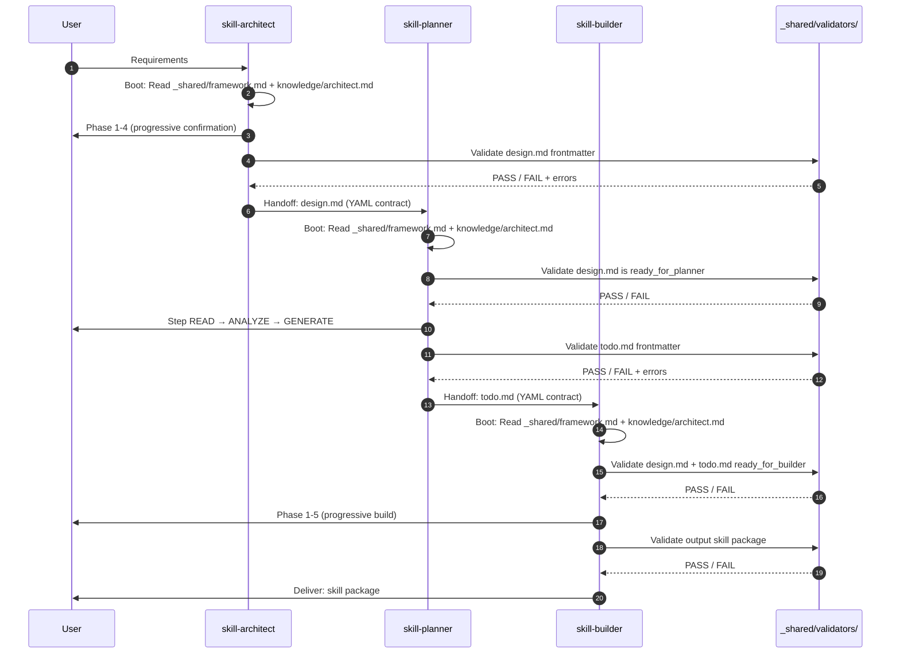
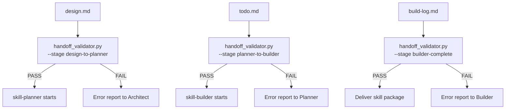

# AI-First Skill Suite Redesign — Design Spec

> **Status**: Draft
> **Date**: 2026-05-03
> **Scope**: Tái cấu trúc hoàn toàn bộ 3 `skill-architect -> skill-planner -> skill-builder`
> **Criteria**: Portable, Dynamic, AI-First, YAML-first contracts

---

## 1. Problem Statement

Bộ 3 skill hiện tại có 15 vấn đề đã xác minh (xem `temp.md`), nhóm lại thành 4 nhóm root cause:

| Root Cause | Issues |
|-----------|--------|
| **Path boot gãy** | P0-01 shared framework path sai, P0-02 hardcode `.claude/skills` |
| **Handoff yếu** | P1-02 validator thiếu, P1-04 trace tag không nhất quán, P1-06/P1-07 section contract mâu thuẫn |
| **AI-parse khó** | Markdown table là source-of-truth song song với free text, validator phải regex parse file path |
| **Dynamic bị khóa** | P2-01 progressive disclosure front-load, P1-09 context path không dynamic, P2-04 output path mismatch |

**Giải quyết bằng**: Chuyển sang AI-First architecture với YAML frontmatter là single source of truth, structured validators, và portable path resolution.

---

## 2. Design Principles

### 2.1 YAML Frontmatter = Machine Contract

```yaml
# MỌI artifact (.skill-context/*.md) PHẢI có YAML frontmatter:
# - YAML frontmatter = nguồn sự thật cho validator/AI parse
# - Markdown body = narrative/diagram/context cho người đọc
# - KHÔNG có 2 nguồn sự thật song song
```

### 2.2 Portable by Default

```yaml
# Không phụ thuộc vào:
# - /home/... (absolute path)
# - .claude/skills (install target cụ thể)
# - Tên repo

# Thay vào đó dùng 2 root động:
roots:
  skills_root: "parent of skill-architect/, skill-planner/, skill-builder/"
  project_root: "cwd hoặc thư mục chứa .skill-context/"
```

### 2.3 Self-Discovering Boot

```yaml
# Skill tự detect skills_root bằng:
# - __file__ resolution (trong Python scripts)
# - Relative path từ SKILL.md location (trong Markdown)
# - Env var SKILL_ROOT (optional override)
# KHÔNG dùng ../../_shared hardcode
```

### 2.4 Structured Enums

```yaml
# Mọi enum được define rõ ràng, không dùng free text
status_enum:
  - "in_progress"
  - "ready_for_planner"
  - "ready_for_builder"
  - "complete"
  - "blocked"

priority_enum:
  - "critical"
  - "high"
  - "medium"
  - "low"

stage_enum:
  - "architect"    # stage 1
  - "planner"      # stage 2
  - "builder"      # stage 3

zone_enum:
  - "core"
  - "knowledge"
  - "scripts"
  - "templates"
  - "data"
  - "loop"
  - "assets"

trace_tag_patterns:
  design: "^\\[TỪ DESIGN §[0-9]+(\\.[0-9]+)?\\]$"
  suggestion: "[GỢI Ý BỔ SUNG]"
  clarification: "[CẦN LÀM RÕ]"
  resource_audit: "[TỪ AUDIT TÀI NGUYÊN]"
```

---

## 3. Target Architecture

### 3.1 Directory Layout

```text
<skills-root>/                           # Portable install root
├── _shared/
│   ├── knowledge/
│   │   └── framework.md                 # Single source of truth: 7 Zones, Pipeline, Naming
│   ├── schemas/
│   │   ├── design.schema.yaml           # JSON Schema cho design.md frontmatter
│   │   ├── todo.schema.yaml             # JSON Schema cho todo.md frontmatter
│   │   └── build-log.schema.yaml        # JSON Schema cho build-log.md frontmatter
│   └── validators/
│       ├── handoff_validator.py          # Validate trước khi chuyển stage
│       ├── schema_validator.py           # Validate YAML compliance
│       └── trace_validator.py            # Validate trace tags & dependencies
├── skill-architect/
│   ├── SKILL.md
│   ├── knowledge/
│   │   └── architect.md                 # Architect workflow only (không lặp shared)
│   ├── templates/
│   │   └── design.md.template
│   ├── scripts/
│   │   └── init_context.py
│   └── loop/
│       └── design-checklist.md
├── skill-planner/
│   ├── SKILL.md
│   ├── knowledge/
│   │   ├── architect.md                 # Planner workflow only
│   │   └── skill-packaging.md
│   ├── loop/
│   │   └── plan-checklist.md
│   └── scripts/
│       └── validate-todo.py
└── skill-builder/
    ├── SKILL.md
    ├── knowledge/
    │   ├── architect.md                 # Builder workflow only
    │   ├── build-guidelines.md
    │   └── anthropic-skill-standards.md
    ├── scripts/
    │   └── validate_skill.py
    └── loop/
        ├── build-checklist.md
        └── build-log.md
```

### 3.2 Data Flow



### 3.3 Handoff Contracts (YAML-First)

**Architect → Planner**:

```yaml
handoff:
  from_stage: "architect"
  to_stage: "planner"
  artifact: "design.md"
  ready_condition:
    required:
      frontmatter_valid: true        # Passes design.schema.yaml
      zone_mapping_complete: true    # All 7 zones explicitly defined (even if empty)
      required_sections_present: true
      no_blockers: true
    optional:
      pd_tiers_defined: true
      risks_documented: true
  validator: "_shared/validators/handoff_validator.py --stage design-to-planner"
```

**Planner → Builder**:

```yaml
handoff:
  from_stage: "planner"
  to_stage: "builder"
  artifact: "todo.md"
  ready_condition:
    required:
      frontmatter_valid: true        # Passes todo.schema.yaml
      design_zone_mapping_covered: true  # Every file in design.md zone_mapping has task
      dependencies_valid: true       # All depends_on IDs exist
      no_clarification_blockers: true    # No [CẦN LÀM RÕ] blockers remain
      phase0_done: true              # All PREPARE tasks done/skipped
      prerequisites_ready: true      # All prerequisites status: ready
    optional:
      build_tasks_valid: true        # PH1+ tasks have valid structure (may be pending)
  validator: "_shared/validators/handoff_validator.py --stage planner-to-builder"
```

**Builder → Deliver**:

```yaml
handoff:
  from_stage: "builder"
  to_stage: "complete"
  artifact: "skill package directory"
  ready_condition:
    required:
      all_required_tasks_done: true
      build_log_valid: true          # Passes build-log.schema.yaml
      validator_pass: true           # validate_skill.py PASS
      placeholder_ratio_below_0.1: true  # < 10% placeholder content
    optional:
      feedback_recorded: true
  validator: "_shared/validators/handoff_validator.py --stage builder-complete"
```

---

## 4. Artifact Contracts — Schema vs Template

> **Quan trọng**: Tách rõ 2 loại file:
>
> | Loại | Path | Purpose | Format |
> |-----|------|---------|--------|
> | **JSON Schema** | `_shared/schemas/*.schema.yaml` | Validator rules (machine-readable) | JSON Schema Draft-07 |
> | **Artifact Template** | `skill-*/templates/*.template` | Frontmatter example (human-readable) | YAML frontmatter + Markdown |
>
> Schema dùng để **validate**. Template dùng để **scaffold**. Hai file này có liên quan nhưng KHÔNG giống nhau.

### 4.1 `design.md` — Frontmatter Template

> **File**: `skill-architect/templates/design.md.template`
> **JSON Schema**: `_shared/schemas/design.schema.yaml` (viết riêng, không lặp ở đây)

```yaml
---
skill_schema_version: "3.0.0"
artifact_type: "design"
skill_name: "example-skill"           # pattern: ^[a-z0-9-]+$
generated_by: "skill-architect"
generated_at: "2026-05-03T10:00:00Z"  # ISO 8601
stage: "architect"                    # Enum: architect | planner | builder
status: "ready_for_planner"           # Enum: in_progress | ready_for_planner | blocked

# Single source of truth cho zone mapping
# KHÔNG dùng Markdown table song song
canonical_source:
  zone_mapping: "frontmatter.zone_mapping"
  progressive_disclosure: "frontmatter.progressive_disclosure"

zone_mapping:
  core:
    zone_required: true
    files:
      - path: "SKILL.md"
        file_required: true
        content_type: "orchestration"
  knowledge:
    zone_required: true
    files:
      - path: "knowledge/domain.md"
        file_required: true
        content_type: "reference"
    notes: "Domain-specific knowledge only. Shared framework in _shared/"
  scripts:
    zone_required: false
    files: []                         # Explicit empty = zone not needed
  templates:
    zone_required: false
    files:
      - path: "templates/output.template"
        file_required: false
        content_type: "format"
  data:
    zone_required: false
    files:
      - path: "data/config.yaml"
        file_required: false
        content_type: "config"
  loop:
    zone_required: true
    files:
      - path: "loop/checklist.md"
        file_required: true
        content_type: "verify"
  assets:
    zone_required: false
    files: []

progressive_disclosure:
  tier1:              # Always load at boot
    - path: "SKILL.md"
      base: "skill_dir"
  tier2:              # Load when context requires
    - path: "knowledge/domain.md"
      base: "skill_dir"
      load_when: "Phase 1: Domain analysis"
    - path: "knowledge/standards.md"
      base: "skill_dir"
      load_when: "Phase 3: Writing output"
  tier3:              # On-demand
    - path: "assets/logo.png"
      base: "skill_dir"
      load_when: "User requests visual"

required_sections:
  - "1_problem_statement"
  - "2_capability_map"
  - "3_zone_mapping"
  - "4_folder_structure"
  - "5_execution_flow"
  - "6_interaction_points"
  - "7_progressive_disclosure"
  - "8_risks"
  - "9_open_questions"
  - "10_metadata"

optional_sections:
  - "10_1_version_dependencies"
  - "11_naming_conventions"
  - "12_rollback"

handoff:
  next_stage: "planner"
  ready_condition:
    required:
      frontmatter_valid: true
      zone_mapping_complete: true
      required_sections_present: true
      no_blockers: true
---
```

> **Note**: Không có `validation` field trong artifact. Validator tự chọn schema dựa trên `artifact_type`. Trace tags được define trong schema files (`_shared/schemas/*.schema.yaml`), không để artifact tự khai báo.

**Markdown body** vẫn giữ narrative sections (§1-§12) nhưng là explanation, KHÔNG phải source-of-truth cho contract data. Tuy nhiên, body vẫn phải có required headings để đảm bảo human-readable completeness:

```yaml
body_validation:
  contract_data_source: "frontmatter"    # Zone mapping, PD, trace → từ YAML
  narrative_requirement: "required"       # Body phải có 10 required section headings
  check_method: "heading_match_only"      # Validator chỉ check heading tồn tại, không parse content
```

### 4.2 `todo.md` — Frontmatter Template

> **File**: `skill-planner/templates/todo.md.template`
> **JSON Schema**: `_shared/schemas/todo.schema.yaml` (viết riêng)

#### 4.2.1 Good Example (validator PASS)

```yaml
---
skill_schema_version: "3.0.0"
artifact_type: "todo"
skill_name: "example-skill"
generated_by: "skill-planner"
generated_at: "2026-05-03T11:00:00Z"
stage: "planner"
status: "ready_for_builder"
trace_to_design: "design.md"

phases:
  - id: "PH0"
    name: "PREPARE"
    tasks:
      - id: "T0.1"
        title: "Audit domain knowledge"
        zone: "knowledge"
        priority: "critical"
        trace: "[TỪ AUDIT TÀI NGUYÊN]"
        depends_on: []
        status: "done"               # Planner đã audit xong
        file_target: "resources/domain.md"
        acceptance_criteria:
          - "File exists and content > 100 lines"
          - "Covers all domain concepts from design.md §2"

  - id: "PH1"
    name: "BUILD_CORE"
    tasks:
      - id: "T1.1"
        title: "Write SKILL.md"
        zone: "core"
        priority: "critical"
        trace: "[TỪ DESIGN §3]"
        depends_on: ["T0.1"]
        status: "pending"            # Builder mới là bên thực thi → pending là hợp lệ
        file_target: "SKILL.md"
        acceptance_criteria:
          - "YAML frontmatter valid per design.schema.yaml"
          - "Contains all 7 zones reference"

blockers: []    # Không có blocker => ready_for_builder

prerequisites:
  - item: "Domain knowledge về X"
    tier: "domain"
    status: "ready"
    resource_file: "resources/domain.md"

handoff:
  next_stage: "builder"
  ready_condition:
    required:
      blockers_empty: true           # Không có unresolved blockers
      phase0_done: true              # Phase PREPARE (audit/resource) đã hoàn thành
      prerequisites_ready: true      # Prerequisites đã ready
      schema_valid: true             # Frontmatter pass schema
      design_zones_covered: true     # Mỗi file trong design zone_mapping có task
---
```

> **Note**: Build tasks (`PH1+`) có thể `status: "pending"` trong handoff Planner → Builder. Builder là bên thực thi chúng. `ready_condition` kiểm tra **preparation** đã xong, không yêu cầu build tasks done.

#### 4.2.2 Bad Example (validator FAIL — blockers unresolved)

```yaml
# ❌ Sẽ FAIL planner-to-builder validator
# Lý do: blockers có resolved: false, phase0 chưa done
---
skill_schema_version: "3.0.0"
artifact_type: "todo"
skill_name: "example-skill"
stage: "planner"
status: "ready_for_builder"    # ← Sai: không nên là ready_for_builder

blockers:
  - id: "B1"
    type: "CLARIFICATION_NEEDED"
    description: "Chưa rõ output path convention"
    resolved: false              # ← Blocker chưa resolved
    blocks_tasks: ["T1.1"]

phases:
  - id: "PH0"
    name: "PREPARE"
    tasks:
      - id: "T0.1"
        priority: "critical"
        status: "pending"        # ← Phase PREPARE chưa done

  - id: "PH1"
    name: "BUILD_CORE"
    tasks:
      - id: "T1.1"
        priority: "critical"
        trace: "[TỪ DESIGN §3]"
        status: "pending"        # ← Hợp lệ cho Builder, nhưng PH0 chưa done

# Validator output:
# FAIL: blockers_empty = false (B1 unresolved)
# FAIL: phase0_done = false (T0.1 still pending)
---
```

### 4.3 `build-log.md` — Frontmatter Template

> **File**: `skill-builder/loop/build-log.md.template`
> **JSON Schema**: `_shared/schemas/build-log.schema.yaml` (viết riêng)

#### 4.3.1 Good Example (validator PASS — complete build)

```yaml
---
skill_schema_version: "3.0.0"
artifact_type: "build-log"
skill_name: "example-skill"
generated_by: "skill-builder"
generated_at: "2026-05-03T12:00:00Z"
stage: "builder"
status: "complete"

execution_trace:
  - timestamp: "2026-05-03T12:05:00Z"
    phase: "PH1"
    task_id: "T1.1"
    action: "CREATE_FILE"
    file: "SKILL.md"
    status: "success"
    notes: "YAML frontmatter validated"

  - timestamp: "2026-05-03T12:10:00Z"
    phase: "PH2"
    task_id: "T2.1"
    action: "CREATE_FILE"
    file: "knowledge/domain.md"
    status: "success"
    notes: "Domain content written"

# Feedback: summary snapshot. Canonical lifecycle file = .skill-context/{name}/feedback.yaml
feedback_to_planner: []
feedback_to_architect: []

quality_metrics:
  placeholder_ratio: 0.05
  critical_tasks_done: true
  validator_pass: true
---
```

> **Note**: build-log không có `handoff` field (Builder là stage cuối). Feedback summary trong build-log là snapshot, canonical lifecycle quản lý trong `feedback.yaml`.

#### 4.3.2 Bad Example (validator FAIL — build incomplete)

```yaml
# ❌ Sẽ FAIL builder-complete validator
# Lý do: có STOP_AND_REPORT, validator_pass = true nhưng có failed trace
---
skill_schema_version: "3.0.0"
artifact_type: "build-log"
stage: "builder"
status: "complete"                # ← Sai: không nên là complete

execution_trace:
  - timestamp: "2026-05-03T12:10:00Z"
    task_id: "T2.3"
    action: "VALIDATE"
    status: "failed"
    decision: "STOP_AND_REPORT"   # ← Có STOP_AND_REPORT

quality_metrics:
  placeholder_ratio: 0.05
  critical_tasks_done: true
  validator_pass: true             # ← Mâu thuẫn: có failed trace nhưng validator_pass = true

# Validator output:
# FAIL: execution_trace có STOP_AND_REPORT nhưng status = complete
# FAIL: execution_trace failed nhưng validator_pass = true (mâu thuẫn)
---
```

### 4.4 `_shared/schemas/` — Real JSON Schema Files

> **Phần 4.1–4.3 là artifact templates** (example frontmatter). Dưới đây là **JSON Schema thật** để validator dùng.

#### `design.schema.yaml` (JSON Schema Draft-07)

```yaml
# _shared/schemas/design.schema.yaml
$schema: "https://json-schema.org/draft-07/schema#"
title: "design.md frontmatter"
type: object
required:
  - skill_schema_version
  - artifact_type
  - skill_name
  - generated_by
  - generated_at
  - stage
  - status
  - canonical_source
  - zone_mapping
  - progressive_disclosure
  - required_sections
  - handoff
properties:
  skill_schema_version:
    type: string
    const: "3.0.0"
  artifact_type:
    type: string
    const: "design"
  skill_name:
    type: string
    pattern: "^[a-z0-9-]+$"
  generated_by:
    type: string
    const: "skill-architect"
  generated_at:
    type: string
    format: "date-time"
  stage:
    type: string
    const: "architect"
  status:
    type: string
    enum: ["in_progress", "ready_for_planner", "blocked"]
  canonical_source:
    type: object
    required: ["zone_mapping", "progressive_disclosure"]
    properties:
      zone_mapping: { type: string, const: "frontmatter.zone_mapping" }
      progressive_disclosure: { type: string, const: "frontmatter.progressive_disclosure" }
  zone_mapping:
    type: object
    required: ["core", "knowledge", "scripts", "templates", "data", "loop", "assets"]
    patternProperties:
      "^[a-z_]+$":
        type: object
        required: ["files", "zone_required"]
        properties:
          files:
            type: array
            items:
              type: object
              required: ["path", "file_required"]
              properties:
                path:
                  type: string
                  not:
                    pattern: "(^|/)\\.\\.(/|$)"  # No .. segments
                  pattern: "^[^/].*[^/]$"         # No absolute paths, no trailing slash
                file_required:
                  type: boolean
                content_type:
                  type: string
          zone_required:
            type: boolean
  progressive_disclosure:
    type: object
    required: ["tier1"]
    properties:
      tier1:
        type: array
        items:
          type: object
          required: ["path", "base"]
          properties:
            path: { type: string }
            base: { type: string, enum: ["skills_root", "skill_dir"] }
      tier2:
        type: array
        items:
          type: object
          required: ["path", "base", "load_when"]
          properties:
            path: { type: string }
            base: { type: string, enum: ["skills_root", "skill_dir"] }
            load_when: { type: string }
      tier3:
        type: array
        items:
          type: object
          required: ["path", "base", "load_when"]
          properties:
            path: { type: string }
            base: { type: string, enum: ["skills_root", "skill_dir"] }
            load_when: { type: string }
  required_sections:
    type: array
    items: { type: string }
    minItems: 10
  optional_sections:
    type: array
    items: { type: string }
  handoff:
    type: object
    required: ["next_stage", "ready_condition"]
    properties:
      next_stage:
        type: string
        enum: ["planner"]
      ready_condition:
        type: object
        required: ["required"]
        properties:
          required:
            type: object
            properties:
              frontmatter_valid: { type: boolean, const: true }
              zone_mapping_complete: { type: boolean, const: true }
              required_sections_present: { type: boolean, const: true }
              no_blockers: { type: boolean, const: true }
additionalProperties: false
```

#### `todo.schema.yaml` (JSON Schema Draft-07)

```yaml
# _shared/schemas/todo.schema.yaml
$schema: "https://json-schema.org/draft-07/schema#"
title: "todo.md frontmatter"
type: object
required:
  - skill_schema_version
  - artifact_type
  - skill_name
  - generated_by
  - generated_at
  - stage
  - status
  - trace_to_design
  - phases
  - blockers
  - prerequisites
  - handoff
properties:
  skill_schema_version:
    type: string
    const: "3.0.0"
  artifact_type:
    type: string
    const: "todo"
  skill_name:
    type: string
    pattern: "^[a-z0-9-]+$"
  generated_by:
    type: string
    const: "skill-planner"
  generated_at:
    type: string
    format: "date-time"
  stage:
    type: string
    const: "planner"
  status:
    type: string
    enum: ["in_progress", "ready_for_builder", "blocked"]
  trace_to_design:
    type: string
  phases:
    type: array
    items:
      type: object
      required: ["id", "name", "tasks"]
      properties:
        id:
          type: string
          pattern: "^PH[0-9]+$"
        name:
          type: string
        tasks:
          type: array
          items:
            type: object
            required: ["id", "title", "zone", "priority", "trace", "status"]
            properties:
              id:
                type: string
                pattern: "^T[0-9]+\\.[0-9]+$"
              title: { type: string }
              zone:
                type: string
                enum: ["core", "knowledge", "scripts", "templates", "data", "loop", "assets"]
              priority:
                type: string
                enum: ["critical", "high", "medium", "low"]
              trace:
                type: string
              depends_on:
                type: array
                items: { type: string }
              status:
                type: string
                enum: ["pending", "in_progress", "done", "skipped"]
              file_target:
                type: string
              acceptance_criteria:
                type: array
                items: { type: string }
  blockers:
    type: array
    items:
      type: object
      required: ["id", "type", "description", "resolved"]
      properties:
        id: { type: string }
        type:
          type: string
          enum: ["CLARIFICATION_NEEDED", "DESIGN_CONFLICT", "RESOURCE_MISSING"]
        description: { type: string }
        raised_by: { type: string }
        trace: { type: string }
        blocks_tasks:
          type: array
          items: { type: string }
        resolved: { type: boolean }
        resolution: { type: ["string", "null"] }
  prerequisites:
    type: array
    items:
      type: object
      required: ["item", "tier", "status"]
      properties:
        item: { type: string }
        tier:
          type: string
          enum: ["domain", "technical", "packaging"]
        status:
          type: string
          enum: ["ready", "missing", "thin"]
        resource_file: { type: string }
        action_if_missing: { type: string }
  handoff:
    type: object
    required: ["next_stage", "ready_condition"]
    properties:
      next_stage:
        type: string
        const: "builder"
      ready_condition:
        type: object
        required: ["required"]
        properties:
          required:
            type: object
            properties:
              blockers_empty: { type: boolean, const: true }
              phase0_done: { type: boolean, const: true }
              prerequisites_ready: { type: boolean, const: true }
              schema_valid: { type: boolean, const: true }
              design_zones_covered: { type: boolean, const: true }
additionalProperties: false
```

#### `build-log.schema.yaml` (JSON Schema Draft-07)

```yaml
# _shared/schemas/build-log.schema.yaml
$schema: "https://json-schema.org/draft-07/schema#"
title: "build-log.md frontmatter"
type: object
required:
  - skill_schema_version
  - artifact_type
  - skill_name
  - generated_by
  - generated_at
  - stage
  - status
  - execution_trace
  - feedback_to_planner
  - feedback_to_architect
  - quality_metrics
properties:
  skill_schema_version:
    type: string
    const: "3.0.0"
  artifact_type:
    type: string
    const: "build-log"
  skill_name:
    type: string
    pattern: "^[a-z0-9-]+$"
  generated_by:
    type: string
    const: "skill-builder"
  generated_at:
    type: string
    format: "date-time"
  stage:
    type: string
    const: "builder"
  status:
    type: string
    enum: ["in_progress", "complete", "blocked"]
  execution_trace:
    type: array
    items:
      type: object
      required: ["timestamp", "task_id", "action", "status"]
      properties:
        timestamp: { type: string, format: "date-time" }
        phase: { type: string }
        task_id: { type: string }
        action:
          type: string
          enum: ["CREATE_FILE", "MODIFY_FILE", "VALIDATE", "RUN_SCRIPT"]
        file: { type: string }
        status:
          type: string
          enum: ["success", "failed", "skipped"]
        notes: { type: string }
        validator: { type: string }
        error: { type: string }
        decision:
          type: string
          enum: ["CONTINUE", "STOP_AND_REPORT", "RETRY"]
  feedback_to_planner:
    type: array
  feedback_to_architect:
    type: array
  quality_metrics:
    type: object
    required: ["placeholder_ratio", "critical_tasks_done", "validator_pass"]
    properties:
      placeholder_ratio: { type: number, minimum: 0, maximum: 1 }
      zone_coverage: { type: number, minimum: 0, maximum: 1 }
      blocker_count: { type: number, minimum: 0 }
      critical_tasks_done: { type: boolean }
      validator_pass: { type: boolean }
additionalProperties: false
```

---

## 5. Path Resolution Rules

### 5.1 Skill Install Root Detection

```yaml
# Từ SKILL.md:
#   __file__ = <skills-root>/skill-architect/SKILL.md
#   skills_root = parent directory of SKILL.md's parent

# Từ knowledge/*.md:
#   __file__ = <skills-root>/skill-architect/knowledge/architect.md
#   skills_root = 2 levels up

# Từ scripts/*.py:
#   skills_root = Path(__file__).parents[2]
```

### 5.2 Shared Framework References

```yaml
# Từ skill-*/SKILL.md:
reference_to_shared: "../_shared/knowledge/framework.md"    # 1 level up

# Từ skill-*/knowledge/*.md:
reference_to_shared: "../../_shared/knowledge/framework.md" # 2 levels up

# Từ skill-*/scripts/*.py:
reference_to_shared: |
  skills_root = Path(__file__).parents[2]
  framework = skills_root / "_shared" / "knowledge" / "framework.md"
```

### 5.3 Project Context Path

```yaml
# .skill-context là artifact của PROJECT, không phải skill install
# Luôn resolve từ project_root (cwd), KHÔNG từ skills_root

context_path: "{project_root}/.skill-context/{skill-name}/"
artifacts:
  - "design.md"
  - "todo.md"
  - "build-log.md"
  - "resources/"
  - "data/"
  - "loop/"

# KHÔNG dùng ../../.skill-context từ skill install path
```

### 5.4 Output Skill Package Path

```yaml
# User-configurable, KHÔNG hardcode .claude hay .agent
# Default: .claude/skills/{skill-name}/
# Override via: SKILL_OUTPUT_ROOT env var

output_resolution:
  default: ".claude/skills/{skill-name}/"
  env_override: "SKILL_OUTPUT_ROOT"
  example_alternatives:
    - ".agent/skills/{skill-name}/"
    - "custom/skills-root/{skill-name}/"
```

---

## 6. Handoff Validators

### 6.1 Validator Architecture



### 6.2 Validation Checks by Stage

```yaml
# design-to-planner checks:
design_to_planner:
  schema_checks:
    - "YAML frontmatter parses without error"
    - "skill_schema_version == 3.0.0"
    - "artifact_type == design"
    - "stage == architect"
    - "status == ready_for_planner"
  content_checks:
    - "zone_mapping: all 7 zones explicitly present (even if files: [])"
    - "zone_mapping files: valid paths (no absolute, no ..)"
    - "progressive_disclosure: tier1 present, paths have 'base' field"
    - "required_sections: all 10 headings present in Markdown body (heading match only, not content parse)"
    - "handoff.next_stage == planner"
  trace_checks:
    - "No unparseable trace tags"

# planner-to-builder checks:
planner_to_builder:
  schema_checks:
    - "YAML frontmatter parses without error"
    - "artifact_type == todo"
    - "stage == planner"
    - "status == ready_for_builder"
  content_checks:
    - "All task IDs are unique"
    - "All depends_on IDs exist in task list"
    - "Every file in design.md zone_mapping has at least one task"
    - "No blockers with resolved: false"
    - "All PH0 (PREPARE) tasks have status: done or skipped"
    - "All prerequisites have status: ready"
    - "priority values are in enum [critical, high, medium, low]"
    - "Build tasks (PH1+) may be pending — Builder is the executor"
  trace_checks:
    - "All trace values match defined patterns"
    - "No [CẦN LÀM RÕ] blockers remain unresolved"

# builder-complete checks:
builder_complete:
  schema_checks:
    - "build-log frontmatter parses without error"
    - "artifact_type == build-log"
  content_checks:
    - "All critical tasks have status: success or skipped"
    - "quality_metrics.placeholder_ratio < 0.10"
    - "quality_metrics.validator_pass == true"
    - "No execution_trace entries with decision: STOP_AND_REPORT"
  output_checks:
    - "Output directory exists"
    - "SKILL.md exists in output"
    - "All zone_mapping files created"
    - "validate_skill.py passes on output"
```

### 6.3 Error Reporting Format

```yaml
# Validator output format (machine-readable):
validation_result:
  stage: "design-to-planner"
  artifact: "design.md"
  timestamp: "2026-05-03T10:30:00Z"
  passed: false
  checks:
    - name: "YAML frontmatter parses"
      status: "pass"
    - name: "zone_mapping all 7 zones present"
      status: "fail"
      error: "Missing zone: scripts"
      severity: "error"
      fix_hint: "Add scripts: {files: [], required: false} to zone_mapping"
    - name: "required_sections headings present"
      status: "fail"
      error: "Heading '§8 Risks' not found in Markdown body (heading match only)"
      severity: "error"
      fix_hint: "Add ## §8 Risks & Blind Spots section heading"
```

---

## 7. Progressive Disclosure — On-Demand Model

### 7.1 Current Problem

```yaml
# Current: 3 SKILL.md directives yêu cầu quét/đọc ALL files trước khi bắt đầu
# Conflict: skill-builder knowledge/anthropic-skill-standards.md anti-pattern "Context Overloading"
```

### 7.2 New Model

```yaml
# Tier 1: Always load (boot)
#   - SKILL.md (this file)
#   - _shared/knowledge/framework.md
#   - knowledge/{skill-name}.md (workflow-specific)
#
# Tier 2: Load per phase
#   - Templates: load khi cần ghi output
#   - Scripts: load khi cần validate/automation
#   - Loop: load khi cần verify
#
# Tier 3: Load on-demand
#   - Assets: load khi cần render
#   - References/examples: load khi cần example
#
# Enforcement:
#   SKILL.md boot sequence CHỈ yêu cầu Tier 1
#   Mỗi Phase reference Tier 2 files theo tên, KHÔNG bắt đọc upfront
```

### 7.3 Progressive Disclosure Metadata

```yaml
# Trong SKILL.md frontmatter:
# Mọi path có 'base' field để xác định relative root
# base: "skill_dir"    = relative từ SKILL.md location (skill-architect/)
# base: "skills_root"  = relative từ <skills-root>/ (parent of skill-*/)

progressive_disclosure:
  tier1:              # Always load at boot
    - path: "../_shared/knowledge/framework.md"
      base: "skill_dir"
    - path: "knowledge/architect.md"
      base: "skill_dir"
  tier2:              # Load when phase requires
    - path: "templates/design.md.template"
      base: "skill_dir"
      load_when: "Phase 3: Writing output"
    - path: "loop/design-checklist.md"
      base: "skill_dir"
      load_when: "Phase 4: Verification"
  tier3:              # On-demand
    - path: "references/examples/"
      base: "skill_dir"
      load_when: "User requests example"
```

---

## 8. Feedback Loop — Structured Mechanism

### 8.1 Canonical Feedback Source

> **Single source of truth**: `.skill-context/{skill-name}/feedback.yaml`
>
> Quy tắc rõ ràng:
> - `feedback.yaml` là **canonical file**. Builder chỉ update file này khi raise/resolve feedback.
> - `build-log.md` frontmatter `feedback_to_planner`/`feedback_to_architect` là **read-only snapshot** do validator hoặc build-log generator tự tạo từ `feedback.yaml`. Builder KHÔNG update build-log feedback fields trực tiếp.
> - Không có sync risk vì chỉ có 1 nguồn ghi (feedback.yaml), 1 nguồn đọc (build-log snapshot).

### 8.2 Feedback Artifact

```yaml
# .skill-context/{skill-name}/feedback.yaml

feedback:
  skill_name: "example-skill"
  last_updated: "2026-05-03T13:00:00Z"
  items:
    - id: "FB1"
      from: "skill-builder"
      to: "skill-planner"
      type: "design_issue"            # Enum: design_issue | plan_issue | resource_gap | suggestion
      severity: "warning"             # Enum: info | warning | error
      description: "design.md zone_mapping missing scripts/validate.py"
      evidence: "Phase 3 encountered file not in zone_mapping"
      suggested_fix: "Add scripts zone entry"
      related_task: "T1.1"
      status: "raised"               # Enum: raised | acknowledged | resolved | wont_fix
      resolution: null               # Filled when status = resolved or wont_fix
```

### 8.2 Feedback Status Machine

```yaml
feedback_status:
  - "raised"      # Builder/Planner phát hiện issue
  - "acknowledged" # Upstream skill xác nhận
  - "resolved"     # Issue đã fix
  - "wont_fix"     # Quyết định không fix (có rationale)
```

### 8.3 Blocking Rules

```yaml
blocking_rules:
  builder_finds_design_conflict:
    action: "STOP_AND_REPORT"
    status: "blocked"
    feedback_to: "skill-planner"
    continue_when: "planner acknowledges and provides resolution"

  builder_finds_resource_missing:
    action: "CONTINUE_WITH_FLAG"
    status: "in_progress"
    flag: "resource_gap"
    note: "Continue build, mark task as degraded"

  planner_finds_design_incomplete:
    action: "STOP_AND_REPORT"
    status: "blocked"
    feedback_to: "skill-architect"
    continue_when: "architect provides updated design.md"
```

---

## 9. Error Handling

### 9.1 Skill Boot Failure

```
SKILL.md boot fails because:
  1. _shared/knowledge/framework.md not found
     -> Fix: Check skills_root detection, verify layout
     -> Fallback: Error message with expected path
  
  2. knowledge/architect.md not found
     -> Fix: Verify skill directory structure
     -> Fallback: Error with skill_root path
  
  3. .skill-context/{name}/design.md not found (Planner/Builder)
     -> Fix: Run skill-architect first to create context
     -> Fallback: Error with expected context path
```

### 9.2 Validator Failure

```
Validator reports FAIL:
  1. Parse error in YAML frontmatter
     -> Report exact line/column
     -> Provide expected schema
  
  2. Missing required field
     -> Report field name and expected type
     -> Provide example value
  
  3. Invalid reference (task ID, zone name)
     -> Report invalid value and available options
```

### 9.3 Typo Protection

```yaml
# Current bug: Builder scans [CẦU LÀM RÕ] instead of [CẦN LÀM RÕ]
# Solution: YAML-based trace_tags with regex patterns, validated by tool

trace_validation:
  method: "regex_match_from_schema"
  source: "_shared/schemas/*.schema.yaml"
  typo_protection: "Validator catches any tag not matching defined patterns"
```

---

## 10. Implementation Milestones

> **Milestone-based** thay vì phase-based. Mỗi milestone deliverable cụ thể, test được, merge được.
> Bắt đầu bằng schema + fixtures trước khi sửa 3 skill để tránh validator lệch template.

### Milestone 1: Foundation + Schema (P0/P1 fix + schemas)

**Deliverable**: `_shared/` với schema files và fixtures, path đã fix

- [ ] Tạo `skills/rebuild/_shared/knowledge/framework.md` (copy từ `skills/raw/`)
- [ ] Tạo `skills/rebuild/_shared/schemas/design.schema.yaml`
- [ ] Tạo `skills/rebuild/_shared/schemas/todo.schema.yaml`
- [ ] Tạo `skills/rebuild/_shared/schemas/build-log.schema.yaml`
- [ ] Tạo fixtures: `_shared/fixtures/good/design.md`, `_shared/fixtures/bad/design.md`
- [ ] Tạo fixtures: `_shared/fixtures/good/todo.md`, `_shared/fixtures/bad/todo.md`
- [ ] Tạo fixtures: `_shared/fixtures/good/build-log.md`, `_shared/fixtures/bad/build-log.md`

**Verify**: Schema files parse được, fixtures good/bad hợp lý

### Milestone 2: Validators (schema + trace + handoff)

**Deliverable**: `_shared/validators/` với 3 Python scripts

- [ ] Tạo `schema_validator.py` — validate YAML frontmatter against schema
- [ ] Tạo `trace_validator.py` — validate trace tags against patterns
- [ ] Tạo `handoff_validator.py` — validate handoff readiness per stage
- [ ] Chạy validator trên good fixtures → PASS
- [ ] Chạy validator trên bad fixtures → FAIL đúng lỗi

**Verify**: `handoff_validator.py --stage design-to-planner _shared/fixtures/good/design.md` → PASS

### Milestone 3: Fix P0 + P1 trong 3 SKILL.md

**Deliverable**: 3 SKILL.md portable, không hardcode

- [ ] Sửa shared framework path: `../../_shared/` → `../_shared/` trong 3 SKILL.md
- [ ] Gỡ hardcode `@.claude/skills/...` khỏi Progressive Disclosure trong 3 SKILL.md
- [ ] Thay bằng relative paths
- [ ] Sửa typo `[CẦU LÀM RÕ]` → `[CẦN LÀM RÕ]` trong skill-builder
- [ ] Chuẩn hóa trace tags: 4 patterns duy nhất
- [ ] Sửa boot sequence: chỉ load Tier 1, bỏ directive "quét tất cả files upfront"
- [ ] Thêm `progressive_disclosure` metadata vào 3 SKILL.md frontmatter
- [ ] Tách shared contract khỏi 3 `knowledge/architect.md` (chỉ giữ workflow riêng)

**Verify**: Copy `skills/rebuild/` sang thư mục tạm → tất cả path resolve đúng

### Milestone 4: Artifact Templates + Context Scripts

**Deliverable**: Templates có YAML frontmatter, `init_context.py` tạo artifact đúng

- [ ] Cập nhật `design.md.template` — thêm YAML frontmatter đúng schema
- [ ] Cập nhật `todo.md.template` — thêm YAML frontmatter đúng schema
- [ ] Cập nhật `build-log.md.template` — thêm YAML frontmatter đúng schema
- [ ] Cập nhật `init_context.py` — tạo files với YAML frontmatter
- [ ] Cập nhật `design-checklist.md` — sync với 10 required + optional sections
- [ ] Cập nhật `plan-checklist.md` — sync với todo schema
- [ ] Cập nhật `build-checklist.md` — sync với build-log schema

**Verify**: Chạy `init_context.py test-skill` → frontmatter pass schema validator

### Milestone 5: Feedback Loop + Cleanup

**Deliverable**: Feedback mechanism, cleaned repo

- [ ] Thêm `feedback_to_planner`/`feedback_to_architect` vào build-log template (summary)
- [ ] Tạo template cho `feedback.yaml` (canonical lifecycle file)
- [ ] Document blocking rules trong `_shared/knowledge/framework.md`
- [ ] Xóa `__pycache__/` và stale artifacts
- [ ] End-to-end verify: copy sang temp dir → validator chạy tất cả fixtures

---

## 11. Success Criteria

```yaml
stop_condition:
  portable:
    - "No hardcoded @.claude/skills references in runtime instructions"
    - "framework.md exists at _shared/knowledge/framework.md"
    - "3 SKILL.md use relative paths from skill root"
    - "Copy entire skills/rebuild/ to temp dir — all paths still resolve"
  
  contracts:
    - "YAML frontmatter is single source of truth for all artifacts"
    - "Markdown body is narrative only, not source-of-truth"
    - "Trace tag taxonomy: 4 patterns only, no variants"
    - "Builder scans [CẦN LÀM RÕ] correctly (not [CẦU LÀM RÕ])"
    - "Section contracts synchronized: SKILL.md, templates, checklists, validators"
  
  validators:
    - "handoff_validator.py runs on good/bad fixtures and fails correctly"
    - "schema_validator.py validates YAML compliance"
    - "trace_validator.py catches invalid tags"
  
  progressive_disclosure:
    - "Boot sequence only loads Tier 1 files"
    - "Tier 2/3 loaded per-phase, not upfront"
  
  feedback:
    - "Builder can report issues to Planner/Architect via structured artifact"
    - "Status machine: raised -> acknowledged -> resolved -> wont_fix"
```
