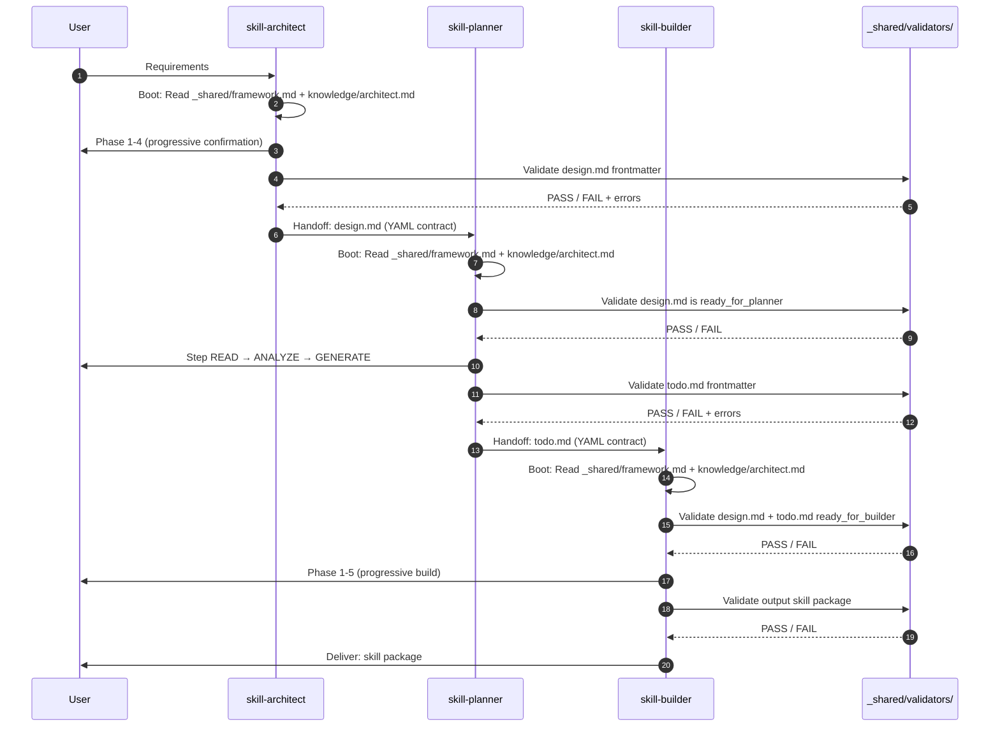
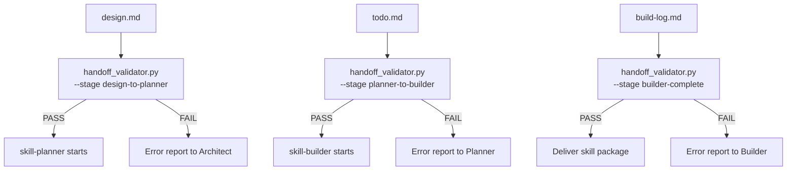

# AI-First Skill Suite Redesign — Design Spec

> **Status**: Draft
> **Date**: 2026-05-03
> **Scope**: Tái cấu trúc hoàn toàn bộ 3 `skill-architect -> skill-planner -> skill-builder`
> **Criteria**: Portable, Dynamic, AI-First, YAML-first contracts

---

## 1. Problem Statement

Bộ 3 skill hiện tại có 15 vấn đề đã xác minh (xem `temp.md`), nhóm lại thành 4 nhóm root cause:

| Root Cause | Issues |
|-----------|--------|
| **Path boot gãy** | P0-01 shared framework path sai, P0-02 hardcode `.claude/skills` |
| **Handoff yếu** | P1-02 validator thiếu, P1-04 trace tag không nhất quán, P1-06/P1-07 section contract mâu thuẫn |
| **AI-parse khó** | Markdown table là source-of-truth song song với free text, validator phải regex parse file path |
| **Dynamic bị khóa** | P2-01 progressive disclosure front-load, P1-09 context path không dynamic, P2-04 output path mismatch |

**Giải quyết bằng**: Chuyển sang AI-First architecture với YAML frontmatter là single source of truth, structured validators, và portable path resolution.

---

## 2. Design Principles

### 2.1 YAML Frontmatter = Machine Contract

```yaml
# MỌI artifact (.skill-context/*.md) PHẢI có YAML frontmatter:
# - YAML frontmatter = nguồn sự thật cho validator/AI parse
# - Markdown body = narrative/diagram/context cho người đọc
# - KHÔNG có 2 nguồn sự thật song song
```

### 2.2 Portable by Default

```yaml
# Không phụ thuộc vào:
# - /home/... (absolute path)
# - .claude/skills (install target cụ thể)
# - Tên repo

# Thay vào đó dùng 2 root động:
roots:
  skills_root: "parent of skill-architect/, skill-planner/, skill-builder/"
  project_root: "cwd hoặc thư mục chứa .skill-context/"
```

### 2.3 Self-Discovering Boot

```yaml
# Skill tự detect skills_root bằng:
# - __file__ resolution (trong Python scripts)
# - Relative path từ SKILL.md location (trong Markdown)
# - Env var SKILL_ROOT (optional override)
# KHÔNG dùng ../../_shared hardcode
```

### 2.4 Structured Enums

```yaml
# Mọi enum được define rõ ràng, không dùng free text
status_enum:
  - "in_progress"
  - "ready_for_planner"
  - "ready_for_builder"
  - "complete"
  - "blocked"

priority_enum:
  - "critical"
  - "high"
  - "medium"
  - "low"

stage_enum:
  - "architect"    # stage 1
  - "planner"      # stage 2
  - "builder"      # stage 3

zone_enum:
  - "core"
  - "knowledge"
  - "scripts"
  - "templates"
  - "data"
  - "loop"
  - "assets"

trace_tag_patterns:
  design: "^\\[TỪ DESIGN §[0-9]+(\\.[0-9]+)?\\]$"
  suggestion: "[GỢI Ý BỔ SUNG]"
  clarification: "[CẦN LÀM RÕ]"
  resource_audit: "[TỪ AUDIT TÀI NGUYÊN]"
```

---

## 3. Target Architecture

### 3.1 Directory Layout

```text
<skills-root>/                           # Portable install root
├── _shared/
│   ├── knowledge/
│   │   └── framework.md                 # Single source of truth: 7 Zones, Pipeline, Naming
│   ├── schemas/
│   │   ├── design.schema.yaml           # JSON Schema cho design.md frontmatter
│   │   ├── todo.schema.yaml             # JSON Schema cho todo.md frontmatter
│   │   └── build-log.schema.yaml        # JSON Schema cho build-log.md frontmatter
│   └── validators/
│       ├── handoff_validator.py          # Validate trước khi chuyển stage
│       ├── schema_validator.py           # Validate YAML compliance
│       └── trace_validator.py            # Validate trace tags & dependencies
├── skill-architect/
│   ├── SKILL.md
│   ├── knowledge/
│   │   └── architect.md                 # Architect workflow only (không lặp shared)
│   ├── templates/
│   │   └── design.md.template
│   ├── scripts/
│   │   └── init_context.py
│   └── loop/
│       └── design-checklist.md
├── skill-planner/
│   ├── SKILL.md
│   ├── knowledge/
│   │   ├── architect.md                 # Planner workflow only
│   │   └── skill-packaging.md
│   ├── loop/
│   │   └── plan-checklist.md
│   └── scripts/
│       └── validate-todo.py
└── skill-builder/
    ├── SKILL.md
    ├── knowledge/
    │   ├── architect.md                 # Builder workflow only
    │   ├── build-guidelines.md
    │   └── anthropic-skill-standards.md
    ├── scripts/
    │   └── validate_skill.py
    └── loop/
        ├── build-checklist.md
        └── build-log.md
```

### 3.2 Data Flow



### 3.3 Handoff Contracts (YAML-First)

**Architect → Planner**:

```yaml
handoff:
  from_stage: "architect"
  to_stage: "planner"
  artifact: "design.md"
  ready_condition:
    required:
      frontmatter_valid: true        # Passes design.schema.yaml
      zone_mapping_complete: true    # All 7 zones explicitly defined (even if empty)
      required_sections_present: true
      no_blockers: true
    optional:
      pd_tiers_defined: true
      risks_documented: true
  validator: "_shared/validators/handoff_validator.py --stage design-to-planner"
```

**Planner → Builder**:

```yaml
handoff:
  from_stage: "planner"
  to_stage: "builder"
  artifact: "todo.md"
  ready_condition:
    required:
      frontmatter_valid: true        # Passes todo.schema.yaml
      design_zone_mapping_covered: true  # Every file in design.md zone_mapping has task
      dependencies_valid: true       # All depends_on IDs exist
      no_clarification_blockers: true    # No [CẦN LÀM RÕ] blockers remain
    optional:
      prerequisites_met: true
  validator: "_shared/validators/handoff_validator.py --stage planner-to-builder"
```

**Builder → Deliver**:

```yaml
handoff:
  from_stage: "builder"
  to_stage: "complete"
  artifact: "skill package directory"
  ready_condition:
    required:
      all_required_tasks_done: true
      build_log_valid: true          # Passes build-log.schema.yaml
      validator_pass: true           # validate_skill.py PASS
      placeholder_ratio_below_0.1: true  # < 10% placeholder content
    optional:
      feedback_recorded: true
  validator: "_shared/validators/handoff_validator.py --stage builder-complete"
```

---

## 4. Artifact Schemas

### 4.1 `design.md` — Full Frontmatter Schema

```yaml
# _shared/schemas/design.schema.yaml
---
skill_schema_version: "3.0.0"
artifact_type: "design"
schema_kind: "json_schema_draft_07"

skill_name: "example-skill"           # Tên skill đang được thiết kế
generated_by: "skill-architect"
generated_at: "2026-05-03T10:00:00Z"  # ISO 8601
stage: "architect"                    # Enum: architect | planner | builder
status: "ready_for_planner"           # Enum: in_progress | ready_for_planner | blocked

# Single source of truth cho zone mapping
# KHÔNG dùng Markdown table song song
canonical_source:
  zone_mapping: "frontmatter.zone_mapping"
  progressive_disclosure: "frontmatter.progressive_disclosure"

zone_mapping:
  core:
    files:
      - path: "SKILL.md"
        required: true
        content_type: "orchestration"
  knowledge:
    files:
      - path: "knowledge/domain.md"
        required: true
        content_type: "reference"
    notes: "Domain-specific knowledge only. Shared framework in _shared/"
  scripts:
    files: []                         # Explicit empty = zone not needed
    required: false
    content_type: "automation"
  templates:
    files:
      - path: "templates/output.template"
        required: false
        content_type: "format"
  data:
    files:
      - path: "data/config.yaml"
        required: false
        content_type: "config"
  loop:
    files:
      - path: "loop/checklist.md"
        required: true
        content_type: "verify"
  assets:
    files: []
    required: false
    content_type: "static"

progressive_disclosure:
  tier1:              # Always load at boot
    - "SKILL.md"
  tier2:              # Load when context requires
    - "knowledge/domain.md"
    - "knowledge/standards.md"
  tier3:              # On-demand
    - "assets/logo.png"

required_sections:
  - "1_problem_statement"
  - "2_capability_map"
  - "3_zone_mapping"
  - "4_folder_structure"
  - "5_execution_flow"
  - "6_interaction_points"
  - "7_progressive_disclosure"
  - "8_risks"
  - "9_open_questions"
  - "10_metadata"

optional_sections:
  - "10_1_version_dependencies"
  - "11_naming_conventions"
  - "12_rollback"

handoff:
  next_stage: "planner"
  ready_condition:
    required:
      frontmatter_valid: true
      zone_mapping_complete: true
      required_sections_present: true
      no_blockers: true

validation:
  schema_path: "_shared/schemas/design.schema.yaml"
  trace_tags:
    design: "^\\[TỪ DESIGN §[0-9]+(\\.[0-9]+)?\\]$"
    suggestion: "[GỢI Ý BỔ SUNG]"
    clarification: "[CẦN LÀM RÕ]"
    resource_audit: "[TỪ AUDIT TÀI NGUYÊN]"
---
```

**Markdown body** vẫn giữ narrative sections (§1-§12) nhưng là explanation, KHÔNG phải source-of-truth. Validator chỉ parse YAML frontmatter.

### 4.2 `todo.md` — Full Frontmatter Schema

```yaml
---
skill_schema_version: "3.0.0"
artifact_type: "todo"
skill_name: "example-skill"
generated_by: "skill-planner"
generated_at: "2026-05-03T11:00:00Z"
stage: "planner"
status: "ready_for_builder"
trace_to_design: "design.md"

# Structured task graph
phases:
  - id: "PH0"
    name: "PREPARE"
    tasks:
      - id: "T0.1"
        title: "Audit domain knowledge"
        zone: "knowledge"
        priority: "critical"                # Enum: critical | high | medium | low
        trace: "[TỪ AUDIT TÀI NGUYÊN]"     # Structured trace tag
        depends_on: []                      # Task IDs this depends on
        status: "pending"
        file_target: "resources/domain.md"
        acceptance_criteria:
          - "File exists and content > 100 lines"
          - "Covers all domain concepts from design.md §2"

  - id: "PH1"
    name: "BUILD_CORE"
    tasks:
      - id: "T1.1"
        title: "Write SKILL.md"
        zone: "core"
        priority: "critical"
        trace: "[TỪ DESIGN §3]"
        depends_on: ["T0.1"]
        status: "pending"
        file_target: "SKILL.md"
        acceptance_criteria:
          - "YAML frontmatter valid per design.schema.yaml"
          - "Contains all 7 zones reference"
          - "Progressive Disclosure defined with tier1/tier2/tier3"

# Blockers - AI stops here
blockers:
  - id: "B1"
    type: "CLARIFICATION_NEEDED"      # Enum: CLARIFICATION_NEEDED | DESIGN_CONFLICT | RESOURCE_MISSING
    description: "Chưa rõ output path convention"
    raised_by: "skill-planner"
    trace: "[CẦN LÀM RÕ]"
    blocks_tasks: ["T1.1", "T2.1"]
    resolved: false
    resolution: null

# Prerequisites table - structured
prerequisites:
  - item: "Domain knowledge về X"
    tier: "domain"                     # Enum: domain | technical | packaging
    status: "missing"                  # Enum: ready | missing | thin
    resource_file: "resources/domain.md"
    action_if_missing: "Generate task T0.1"

# Handoff to Builder
handoff:
  next_stage: "builder"
  ready_condition:
    required:
      blockers_empty: true
      required_priorities_done: ["critical"]
      schema_valid: true
      design_zones_covered: true       # Every zone_mapping file has task

validation:
  schema_path: "_shared/schemas/todo.schema.yaml"
  trace_tags:
    design: "^\\[TỪ DESIGN §[0-9]+(\\.[0-9]+)?\\]$"
    suggestion: "[GỢI Ý BỔ SUNG]"
    clarification: "[CẦN LÀM RÕ]"
    resource_audit: "[TỪ AUDIT TÀI NGUYÊN]"
---
```

### 4.3 `build-log.md` — Full Frontmatter Schema

```yaml
---
skill_schema_version: "3.0.0"
artifact_type: "build-log"
skill_name: "example-skill"
generated_by: "skill-builder"
generated_at: "2026-05-03T12:00:00Z"
stage: "builder"
status: "in_progress"

# Self-reporting execution trace
execution_trace:
  - timestamp: "2026-05-03T12:05:00Z"
    phase: "PH1"
    task_id: "T1.1"
    action: "CREATE_FILE"             # Enum: CREATE_FILE | MODIFY_FILE | VALIDATE | RUN_SCRIPT
    file: "SKILL.md"
    status: "success"                 # Enum: success | failed | skipped
    notes: "YAML frontmatter validated"

  - timestamp: "2026-05-03T12:10:00Z"
    phase: "PH2"
    task_id: "T2.3"
    action: "VALIDATE"
    status: "failed"
    validator: "validate_skill.py"
    error: "Missing ## Persona section"
    decision: "STOP_AND_REPORT"       # Enum: CONTINUE | STOP_AND_REPORT | RETRY

# Feedback loop - structured
feedback_to_planner:
  - design_issue: "design.md zone_mapping missing scripts/validate.py"
    severity: "warning"               # Enum: warning | error | info
    suggested_fix: "Add scripts zone entry"
    related_task: "T1.1"
    resolved: false

feedback_to_architect:
  - design_issue: null                # Empty array allowed

# Quality metrics
quality_metrics:
  placeholder_ratio: 0.05            # 5% placeholder content (target < 0.10)
  zone_coverage: 0.92                # 92% design zones implemented
  blocker_count: 1
  critical_tasks_done: true
  validator_pass: true

handoff:
  next_stage: null                    # Builder is final stage
  deliverable: ".skill-context/{skill-name}/output/"
  ready_condition:
    required:
      all_critical_tasks_done: true
      build_log_valid: true
      validator_pass: true
      placeholder_ratio_below_0.1: true
---
```

---

## 5. Path Resolution Rules

### 5.1 Skill Install Root Detection

```yaml
# Từ SKILL.md:
#   __file__ = <skills-root>/skill-architect/SKILL.md
#   skills_root = parent directory of SKILL.md's parent

# Từ knowledge/*.md:
#   __file__ = <skills-root>/skill-architect/knowledge/architect.md
#   skills_root = 2 levels up

# Từ scripts/*.py:
#   skills_root = Path(__file__).parents[2]
```

### 5.2 Shared Framework References

```yaml
# Từ skill-*/SKILL.md:
reference_to_shared: "../_shared/knowledge/framework.md"    # 1 level up

# Từ skill-*/knowledge/*.md:
reference_to_shared: "../../_shared/knowledge/framework.md" # 2 levels up

# Từ skill-*/scripts/*.py:
reference_to_shared: |
  skills_root = Path(__file__).parents[2]
  framework = skills_root / "_shared" / "knowledge" / "framework.md"
```

### 5.3 Project Context Path

```yaml
# .skill-context là artifact của PROJECT, không phải skill install
# Luôn resolve từ project_root (cwd), KHÔNG từ skills_root

context_path: "{project_root}/.skill-context/{skill-name}/"
artifacts:
  - "design.md"
  - "todo.md"
  - "build-log.md"
  - "resources/"
  - "data/"
  - "loop/"

# KHÔNG dùng ../../.skill-context từ skill install path
```

### 5.4 Output Skill Package Path

```yaml
# User-configurable, KHÔNG hardcode .claude hay .agent
# Default: .claude/skills/{skill-name}/
# Override via: SKILL_OUTPUT_ROOT env var

output_resolution:
  default: ".claude/skills/{skill-name}/"
  env_override: "SKILL_OUTPUT_ROOT"
  example_alternatives:
    - ".agent/skills/{skill-name}/"
    - "custom/skills-root/{skill-name}/"
```

---

## 6. Handoff Validators

### 6.1 Validator Architecture



### 6.2 Validation Checks by Stage

```yaml
# design-to-planner checks:
design_to_planner:
  schema_checks:
    - "YAML frontmatter parses without error"
    - "skill_schema_version == 3.0.0"
    - "artifact_type == design"
    - "stage == architect"
    - "status == ready_for_planner"
  content_checks:
    - "zone_mapping: all 7 zones explicitly present (even if files: [])"
    - "zone_mapping files: valid paths (no absolute, no ..)"
    - "progressive_disclosure: tier1 contains SKILL.md"
    - "required_sections: all 10 present in Markdown body"
    - "handoff.next_stage == planner"
  trace_checks:
    - "No unparseable trace tags"

# planner-to-builder checks:
planner_to_builder:
  schema_checks:
    - "YAML frontmatter parses without error"
    - "artifact_type == todo"
    - "stage == planner"
    - "status == ready_for_builder"
  content_checks:
    - "All task IDs are unique"
    - "All depends_on IDs exist in task list"
    - "Every file in design.md zone_mapping has at least one task"
    - "No blockers with resolved: false"
    - "priority values are in enum [critical, high, medium, low]"
  trace_checks:
    - "All trace values match defined patterns"
    - "No [CẦN LÀM RÕ] blockers remain unresolved"

# builder-complete checks:
builder_complete:
  schema_checks:
    - "build-log frontmatter parses without error"
    - "artifact_type == build-log"
  content_checks:
    - "All critical tasks have status: success or skipped"
    - "quality_metrics.placeholder_ratio < 0.10"
    - "quality_metrics.validator_pass == true"
    - "No execution_trace entries with decision: STOP_AND_REPORT"
  output_checks:
    - "Output directory exists"
    - "SKILL.md exists in output"
    - "All zone_mapping files created"
    - "validate_skill.py passes on output"
```

### 6.3 Error Reporting Format

```yaml
# Validator output format (machine-readable):
validation_result:
  stage: "design-to-planner"
  artifact: "design.md"
  timestamp: "2026-05-03T10:30:00Z"
  passed: false
  checks:
    - name: "YAML frontmatter parses"
      status: "pass"
    - name: "zone_mapping all 7 zones present"
      status: "fail"
      error: "Missing zone: scripts"
      severity: "error"
      fix_hint: "Add scripts: {files: [], required: false} to zone_mapping"
    - name: "required_sections present"
      status: "fail"
      error: "Section 8_risks not found in Markdown body"
      severity: "error"
      fix_hint: "Add ## §8 Risks & Blind Spots section"
```

---

## 7. Progressive Disclosure — On-Demand Model

### 7.1 Current Problem

```yaml
# Current: 3 SKILL.md directives yêu cầu quét/đọc ALL files trước khi bắt đầu
# Conflict: skill-builder knowledge/anthropic-skill-standards.md anti-pattern "Context Overloading"
```

### 7.2 New Model

```yaml
# Tier 1: Always load (boot)
#   - SKILL.md (this file)
#   - _shared/knowledge/framework.md
#   - knowledge/{skill-name}.md (workflow-specific)
#
# Tier 2: Load per phase
#   - Templates: load khi cần ghi output
#   - Scripts: load khi cần validate/automation
#   - Loop: load khi cần verify
#
# Tier 3: Load on-demand
#   - Assets: load khi cần render
#   - References/examples: load khi cần example
#
# Enforcement:
#   SKILL.md boot sequence CHỈ yêu cầu Tier 1
#   Mỗi Phase reference Tier 2 files theo tên, KHÔNG bắt đọc upfront
```

### 7.3 Progressive Disclosure Metadata

```yaml
# Trong SKILL.md frontmatter:
progressive_disclosure:
  tier1:
    - "_shared/knowledge/framework.md"
    - "knowledge/architect.md"
  tier2:
    - name: "templates/design.md.template"
      load_when: "Phase 3: Writing output"
    - name: "loop/design-checklist.md"
      load_when: "Phase 4: Verification"
  tier3:
    - name: "references/examples/"
      load_when: "User requests example"
```

---

## 8. Feedback Loop — Structured Mechanism

### 8.1 Feedback Artifact

```yaml
# feedback/{stage}-to-{stage}.yaml
# Example: feedback/builder-to-planner.yaml

feedback:
  from: "skill-builder"
  to: "skill-planner"
  skill_name: "example-skill"
  timestamp: "2026-05-03T13:00:00Z"
  items:
    - type: "design_issue"            # Enum: design_issue | plan_issue | resource_gap | suggestion
      severity: "warning"             # Enum: info | warning | error
      description: "design.md zone_mapping missing scripts/validate.py"
      evidence: "Phase 3 encountered file not in zone_mapping"
      suggested_fix: "Add scripts zone entry"
      related_task: "T1.1"
      resolved: false
      resolution: null
```

### 8.2 Feedback Status Machine

```yaml
feedback_status:
  - "raised"      # Builder/Planner phát hiện issue
  - "acknowledged" # Upstream skill xác nhận
  - "resolved"     # Issue đã fix
  - "wont_fix"     # Quyết định không fix (có rationale)
```

### 8.3 Blocking Rules

```yaml
blocking_rules:
  builder_finds_design_conflict:
    action: "STOP_AND_REPORT"
    status: "blocked"
    feedback_to: "skill-planner"
    continue_when: "planner acknowledges and provides resolution"

  builder_finds_resource_missing:
    action: "CONTINUE_WITH_FLAG"
    status: "in_progress"
    flag: "resource_gap"
    note: "Continue build, mark task as degraded"

  planner_finds_design_incomplete:
    action: "STOP_AND_REPORT"
    status: "blocked"
    feedback_to: "skill-architect"
    continue_when: "architect provides updated design.md"
```

---

## 9. Error Handling

### 9.1 Skill Boot Failure

```
SKILL.md boot fails because:
  1. _shared/knowledge/framework.md not found
     -> Fix: Check skills_root detection, verify layout
     -> Fallback: Error message with expected path
  
  2. knowledge/architect.md not found
     -> Fix: Verify skill directory structure
     -> Fallback: Error with skill_root path
  
  3. .skill-context/{name}/design.md not found (Planner/Builder)
     -> Fix: Run skill-architect first to create context
     -> Fallback: Error with expected context path
```

### 9.2 Validator Failure

```
Validator reports FAIL:
  1. Parse error in YAML frontmatter
     -> Report exact line/column
     -> Provide expected schema
  
  2. Missing required field
     -> Report field name and expected type
     -> Provide example value
  
  3. Invalid reference (task ID, zone name)
     -> Report invalid value and available options
```

### 9.3 Typo Protection

```yaml
# Current bug: Builder scans [CẦU LÀM RÕ] instead of [CẦN LÀM RÕ]
# Solution: YAML-based trace_tags with regex patterns, validated by tool

trace_validation:
  method: "regex_match_from_schema"
  source: "frontmatter.validation.trace_tags"
  typo_protection: "Validator catches any tag not matching defined patterns"
```

---

## 10. Implementation Checklist

### Phase 0: Foundation
- [ ] Copy `_shared/knowledge/framework.md` từ `skills/raw/_shared/knowledge/framework.md` sang `skills/rebuild/_shared/knowledge/framework.md`
- [ ] Tạo `_shared/schemas/` với 3 schema files
- [ ] Tạo `_shared/validators/` với handoff_validator.py, schema_validator.py, trace_validator.py

### Phase 1: Fix P0 Issues
- [ ] Sửa shared framework path trong 3 SKILL.md: `../../_shared/` -> `../_shared/`
- [ ] Gỡ hardcode `@.claude/skills/...` khỏi runtime instructions trong 3 SKILL.md
- [ ] Thay bằng relative paths: `../_shared/knowledge/framework.md`, `knowledge/architect.md`

### Phase 2: YAML Frontmatter
- [ ] Thêm YAML frontmatter vào `design.md.template`
- [ ] Thêm YAML frontmatter vào `todo.md.template`
- [ ] Thêm YAML frontmatter vào `build-log.md.template`
- [ ] Cập nhật `init_context.py` để tạo files với YAML frontmatter

### Phase 3: Fix P1 Issues
- [ ] Chuẩn hóa trace tags: 4 patterns duy nhất, không biến thể
- [ ] Sửa typo `[CẦU LÀM RÕ]` -> `[CẦN LÀM RÕ]` trong skill-builder
- [ ] Đồng bộ section contracts: 10 required + optional
- [ ] Tách shared contract khỏi skill-specific knowledge trong 3 knowledge/architect.md

### Phase 4: Validators
- [ ] Implement handoff_validator.py cho 3 stages
- [ ] Implement schema_validator.py (YAML compliance)
- [ ] Implement trace_validator.py (tag patterns)
- [ ] Chạy validator trên fixtures tốt/xấu để verify

### Phase 5: Progressive Disclosure
- [ ] Sửa boot sequence trong 3 SKILL.md: chỉ load Tier 1
- [ ] Thêm progressive_disclosure metadata vào SKILL.md frontmatter
- [ ] Xóa directive yêu cầu quét tất cả files upfront

### Phase 6: Feedback Loop
- [ ] Tạo `feedback/` directory structure
- [ ] Thêm feedback fields vào build-log.md
- [ ] Document blocking rules trong framework.md

### Phase 7: Cleanup & Verify
- [ ] Xóa `__pycache__/` và stale artifacts
- [ ] Verify: copy toàn bộ `skills/rebuild/` sang thư mục tạm, tất cả path resolve đúng
- [ ] Verify: validator chạy trên design.md/todo.md/build-log.md mẫu

---

## 11. Success Criteria

```yaml
stop_condition:
  portable:
    - "No hardcoded @.claude/skills references in runtime instructions"
    - "framework.md exists at _shared/knowledge/framework.md"
    - "3 SKILL.md use relative paths from skill root"
    - "Copy entire skills/rebuild/ to temp dir — all paths still resolve"
  
  contracts:
    - "YAML frontmatter is single source of truth for all artifacts"
    - "Markdown body is narrative only, not source-of-truth"
    - "Trace tag taxonomy: 4 patterns only, no variants"
    - "Builder scans [CẦN LÀM RÕ] correctly (not [CẦU LÀM RÕ])"
    - "Section contracts synchronized: SKILL.md, templates, checklists, validators"
  
  validators:
    - "handoff_validator.py runs on good/bad fixtures and fails correctly"
    - "schema_validator.py validates YAML compliance"
    - "trace_validator.py catches invalid tags"
  
  progressive_disclosure:
    - "Boot sequence only loads Tier 1 files"
    - "Tier 2/3 loaded per-phase, not upfront"
  
  feedback:
    - "Builder can report issues to Planner/Architect via structured artifact"
    - "Status machine: raised -> acknowledged -> resolved -> wont_fix"
```
