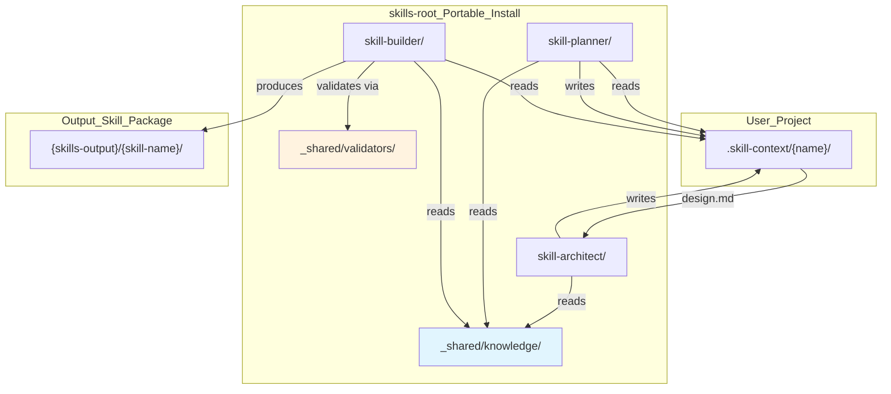

● 🏗️  Design Section 1: Target Architecture Overview                                                                            
                                                                                                                          

  Key Principles:                                                                                                              
                                                                                                                               
  1. Dual Root System:                                                                                                         
    - skills_root = nơi install bộ 3 (resolve tự động, không hardcode)                                                         
    - project_root = cwd hoặc nơi có .skill-context/                                                                           
  2. Shared Foundation as Package:                                                                                             
    - _shared/knowledge/framework.md — single source of truth                                                                  
    - _shared/validators/ — handoff validators dùng chung                          
    - Mỗi skill chỉ chứa workflow-specific knowledge                                                                           
  3. Self-Discovering Boot:                                                                                                    
    - Skill tự detect skills_root bằng __file__ hoặc env var                                                                   
    - Không còn ../../_shared hardcode — dùng relative từ skill root 